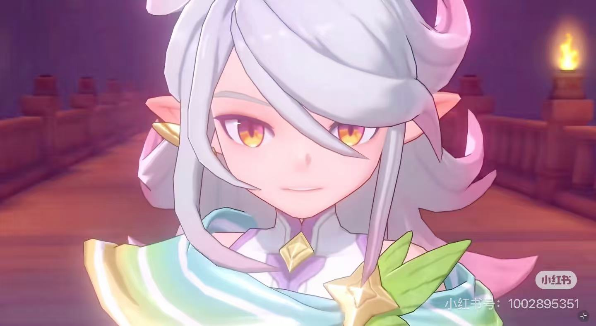

# 《洛克王国》伊里斯 AAA 动漫壁纸生成提示词

## 任务

以《洛克王国》游戏的故事为灵魂，为核心人物 **伊里斯** 生成 **3 张** AAA 级动漫角色壁纸。

## 参考图片

请务必读取并结合以下两张本地参考图片：

### 参考图片一：人物脸型与整体画风主参考

> 这是最高优先级参考。请完全还原图中伊里斯的脸型、五官特征、发型、配色与角色辨识度，并以这张图片的动漫画风作为主要风格依据。

### 参考图片二：人物外观补充参考

> 用于补充确认伊里斯的发型、五官、服饰、色彩和整体角色形象；如与参考图片一存在差异，以参考图片一为准。

## 角色故事

伊里斯本是彩虹独角兽，长久陪伴圣羽翼王里奥驻守风眠山。他化作人形，维系当地人与精灵的平和生活。后来，噩梦黑魔法侵蚀里奥，伊里斯失手打碎星之结，反而让翼王彻底沉沦黑暗。此后，他独自守山并寻找解救之法。

途中，伊里斯结识少女安比，并与她一同建立魔法师之家，度过了一段温暖时光。安比意外离世后，他再度孤身。多年后，他终于等到玩家与他结伴探寻真相。二人联手击退噩梦，却仍无法根除里奥身上的黑暗。最终，伊里斯献祭自身的独角兽本源，修复星之结并净化里奥；自身消散后，又依靠星光的力量得以重生。

## 主视觉与构图

- 所有图片统一采用强叙事感的主视觉构图。
- 每张海报使用“上大下小”的层级结构：
  - 画面上半部分，以伊里斯最具辨识度的头部、面部轮廓、发型或半身外轮廓作为巨大的视觉主体，形成强识别度的剪影式主形。
  - 画面中下部，围绕同一个伊里斯，自然延展出最契合他的完整人物形象、世界观、标志性场景、象征符号、关键建筑、生物、道具与氛围。
- 风格、色彩、场景与材质全部根据伊里斯及其故事主题自动适配。
- 所有元素必须与主题强绑定，做到一眼即可识别。
- 画面应统一、自然、富有电影感和故事感，不要杂乱，不要生硬拼贴，不要模板化背景，不要廉价素材感。

## 必须遵守的角色要求

- 伊里斯是 **男性**，不得女性化。
- 必须高度还原参考图片一中的脸型与五官，保持角色身份一致。
- 伊里斯的本体是彩虹独角兽；角色身上的彩虹视觉应以 **绿色、青绿色** 为主，并自然融入少量协调的彩虹色泽。
- 每张画面中只允许出现 **伊里斯这一个人物**，不得出现安比、里奥、玩家或任何其他人物。
- 如需表现故事中的其他角色或关系，只能通过环境、遗迹、星光、星之结、魔法痕迹、象征物或氛围进行暗示，不得呈现其他人物形象。

## 输出要求

- 数量：**3 张**，每张均为独立完成的壁纸。
- 尺寸：**3:4**。
- 输出格式：**2880 × 3840 像素的 4K 竖版图片**。
- 品质：AAA 级动漫角色海报，细节丰富，光影精致，画面完整。
- 三张图片应保持伊里斯的角色形象与整体画风统一，同时在场景氛围、叙事瞬间或视觉主题上有所区别。

请直接生成三张符合以上全部要求的图片。
