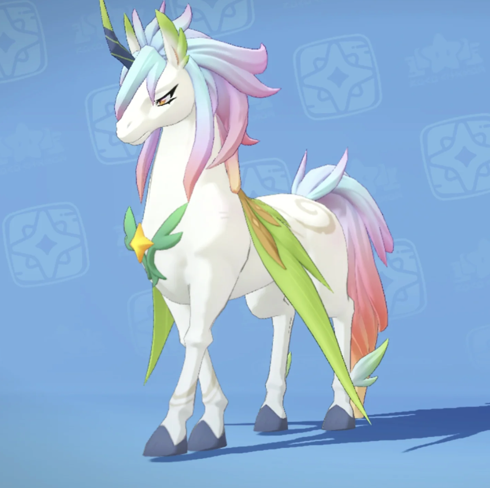

# 《洛克王国》伊里斯动漫角色壁纸生成提示词

以《洛克王国》游戏的故事为灵魂，生成一张核心人物伊里斯动漫角色的 AAA 高清壁纸，统一采用主视觉构图。每张海报都使用上大下小的层级结构：画面上半部分以人物最具辨识度的头部、面部轮廓、面具或半身外轮廓作为巨大的视觉主体，形成强识别的剪影式主形，中下部自动生长出最契合该人物的完整人物、完整世界观、标志性场景、角色关系、象征符号、关键建筑、生物、道具与氛围。风格、色彩、场景、材质全部根据主题自动适配，所有元素必须强绑定主题，一眼识别，不要杂乱，不要硬拼贴，不要模板化背景，不要廉价素材。

伊里斯的故事线如下：

伊里斯本是彩虹独角兽，长久陪伴圣羽翼王里奥驻守风眠山，他化作人形维系当地人与精灵的平和生活，后来噩梦黑魔法侵蚀里奥，伊里斯失手打碎星之结反倒让翼王彻底沉沦黑暗，此后他独自守山寻找解救之法，途中结识少女安比并一同建立魔法师之家，拥有一段温暖时光，安比意外离世后他再度孤身，多年后等到玩家结伴探寻真相，二人联手击退噩梦却无法根除里奥身上的黑暗，最终伊里斯献祭自身独角兽本源修复星之结、净化里奥，自身消散后又依靠星光力量得以重生。

## 角色设定与生成约束

- **角色性别：** 伊里斯为男性角色。
- **形象还原：** 必须精准还原伊里斯的脸型与核心面部特征，以参考图片一为首要依据。
- **物种与配色：** 伊里斯的本体为彩虹独角兽，角色整体色彩应以绿色、青绿色为主，并自然融入彩虹色彩特征。
- **独角兽元素：** 每张画面中必须清晰呈现彩虹独角兽元素，其外形、配色与核心特征以参考图片三为依据。独角兽代表伊里斯的本体形态，可表现为实体、星光灵体、魔法投影或背景主视觉，但不得弱化为难以辨认的抽象光效或纹样。
- **人物限定：** 画面中的人形角色仅允许出现伊里斯，不得出现其他人物；彩虹独角兽是伊里斯本体形态的视觉呈现，不视为额外人物角色。

**输出要求：**

- **数量：** 3 张。
- **尺寸：** 3:4 竖版。
- **输出格式：** 必须严格按照2880 × 3840 像素的 4K 图片，在生成阶段就应该这个尺寸生成，而不是事后修改

伊里斯人物及独角兽形态的参考图片如下，你需要参考第一张图片的画风风格。

**参考图片一（脸型与画风主参考）：**

**参考图片二（人物外观补充参考）：**

**参考图片三（伊里斯的彩虹独角兽形态参考）：**

给我生成三张图片，开始吧。
