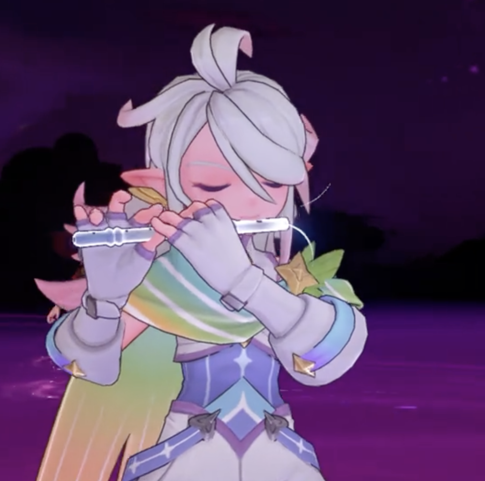
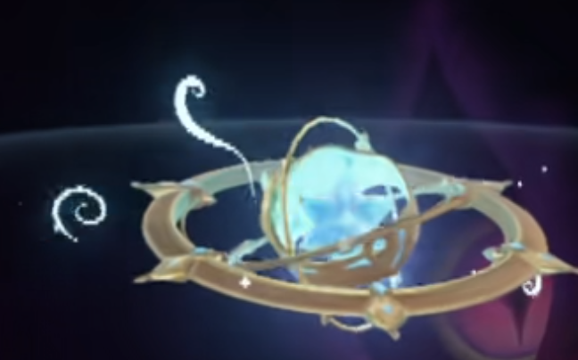
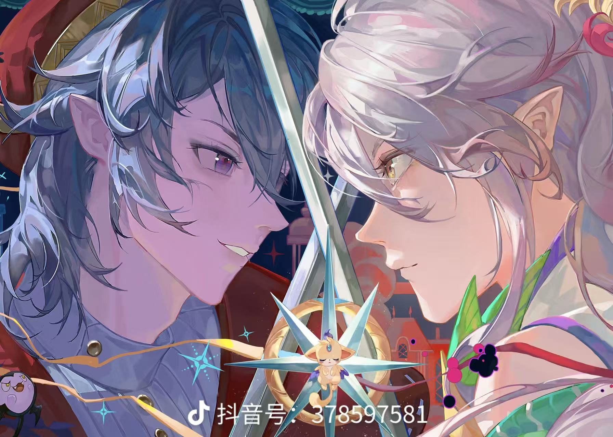

# 《洛克王国》伊里斯献祭主题海报生成提示词

## 任务

以《洛克王国》中伊里斯献祭自身、修复星之结并净化圣羽翼王的故事为核心，生成 3 张具有史诗感、宿命感与情绪张力的 AAA 级动漫电影海报。

## 参考图片

### 参考图片一：常态伊里斯

> 用于还原伊里斯的男性脸型、五官、发型、服饰与整体形象。

### 参考图片二：彩虹独角兽

> 用于还原伊里斯的彩虹独角兽本体造型与配色。

### 参考图片三：吹笛子的伊里斯

> 用于参考右侧伊里斯的横笛、吹奏动作与闭眼神态。

### 参考图片四：星之结魔法阵

> 用于参考画面下方星之结的结构与能量效果。

### 参考图片五：整体构图参考

> 这是最高优先级的构图参考。只参考左右人物面部特写的大小、裁切和画面占比，不参考图中的人物内容。

## 角色故事

三百年前，彩虹独角兽伊里斯追随挚友圣羽翼王里奥定居风眠山，化身人类少年守护当地的洛克与精灵。里奥被噩梦黑魔法侵蚀后，伊里斯失手击碎星之结，反而令他彻底沉沦黑暗。此后，伊里斯独自守山，等待能够净化黑暗的旅人。

多年后，众人击溃噩梦本源，却无法修复仍残留魇力的星之结。伊里斯最终发动独角兽一族的重生献祭魔法，耗尽全部本源，以漫天虹光重塑、净化星之结，自己的人形随之消散，并留下未来在星光中重生的希望。

## 主视觉与构图

- 严格参考图片五，采用左右对称的双人物面部特写构图。
- 左右人物各自占据画面 **100% 的高度** 和约 **50% 的宽度**，人物轮廓从画面顶部一直延伸至底部，完整铺满左右两侧，不得在左右边缘留下大面积背景。
- 左右人物的脸部高度各自占整张画面高度的 **70%—80%**，脸部宽度各自占对应半幅宽度的 **90%—100%**。使用贴近镜头的超大面部特写，让两张脸从画面顶部一直延伸至下方前景区域；额头、外侧头发、后脑和下巴允许被画布边缘明显裁切，不要完整展示头部、肩膀、胸部或大面积服饰。
- 左侧是参考图片一中的常态伊里斯，神情温柔而坚定；右侧是参考图片三中的吹笛伊里斯，闭眼吹奏横笛，身体边缘逐渐化作星光与虹光。左右两侧必须是同一个伊里斯，脸型、发型、服饰和配色保持一致。
- 参考图片四中的星之结魔法阵叠加在画面下方中央，参考图片二中的星光独角兽位于魔法阵上方。它们作为下方前景元素，不得挤压或缩小左右两个贯穿全高的人物主视觉。
- 整体以深邃星空蓝、梦境紫、青绿色、金色与彩虹星光为主，表现神圣、悲壮而充满重生希望的献祭氛围。画面自然融合，不要硬拼贴，不要杂乱。

## 角色要求

- 伊里斯是男性，不得女性化。
- 伊里斯的脸型与五官必须以参考图片一为主要依据，尽可能还原原始脸型、面部轮廓与角色特征；严禁擅自瘦脸、改变五官比例或过度美化，避免生成与原角色不一致的网红脸或通用动漫脸。
- 左右两个人形伊里斯都必须采用侧脸构图，并共同朝向画面中央；不得使用正脸、接近正面的角度或一正一侧的组合。
- 除左右两种状态的伊里斯及其独角兽本体外，不得出现其他人物。
- 必须准确表现横笛和吹奏动作，独角兽与星之结必须清晰可辨。
- 不添加标题、对白、字幕、标志、水印或其他文字。

## 输出要求

- 数量：**3 张**。
- 配色风格：**三张图片必须采用明显不同的主配色**，分别为：①星空蓝、青绿色与金色；②梦境紫、粉色与虹彩色；③银白色、晨曦金与冰蓝色。三张图片保持人物和构图统一，但整体色调、光影氛围必须有清晰区别，不得只做轻微换色。
- 尺寸：**3:4 竖版**。
- 输出格式：**2880 × 3840 像素的 4K 图片**。
- 尺寸约束：**三张图片必须全部严格保持 3:4 竖版，并以 2880 × 3840 像素输出，不得改为其他画幅比例或像素尺寸。**
- 品质：AAA 级动漫电影海报，人物面部精细，光影完整，主体清晰。

请严格按照以上构图比例与参考图片生成 3 张海报，并优先确保每张图片的尺寸完全符合要求。
