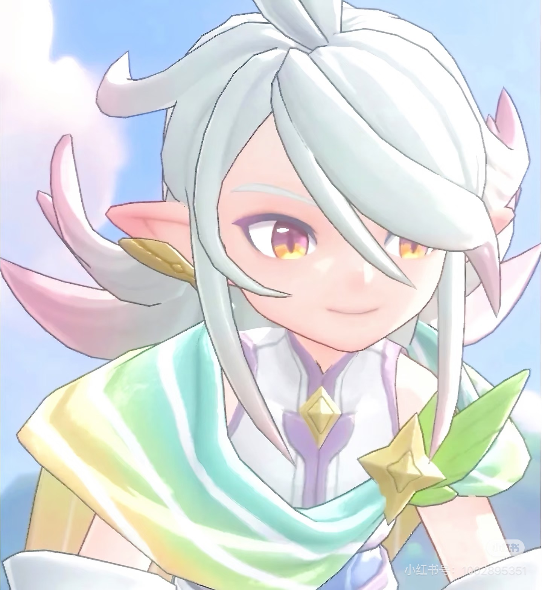
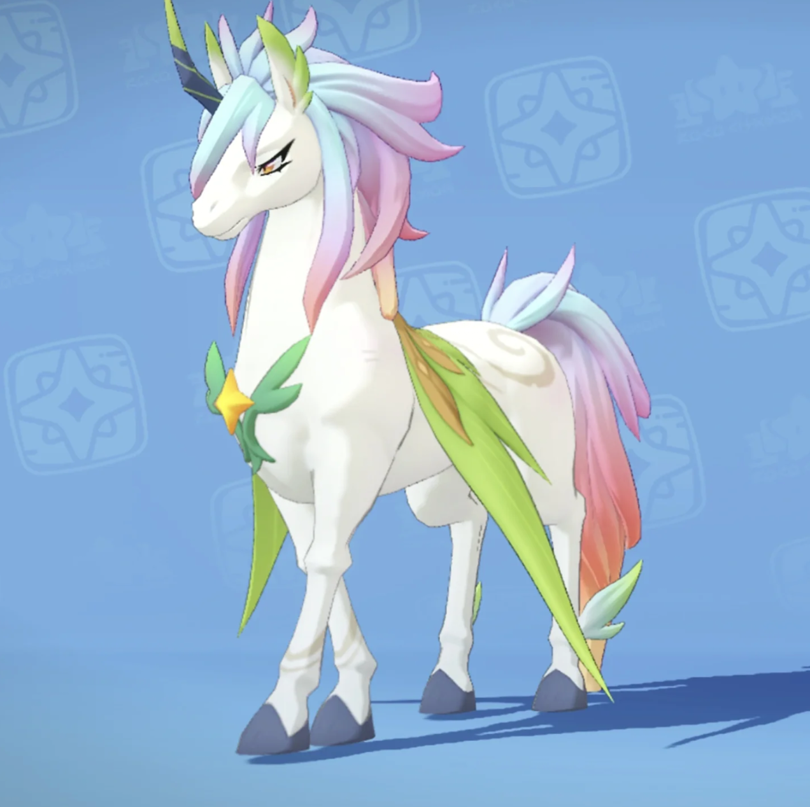
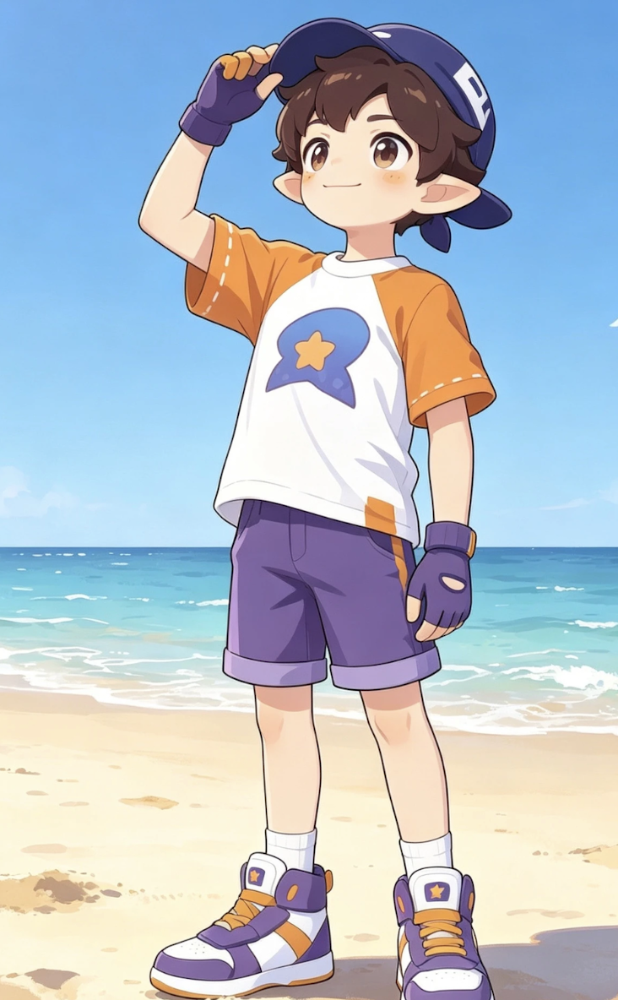
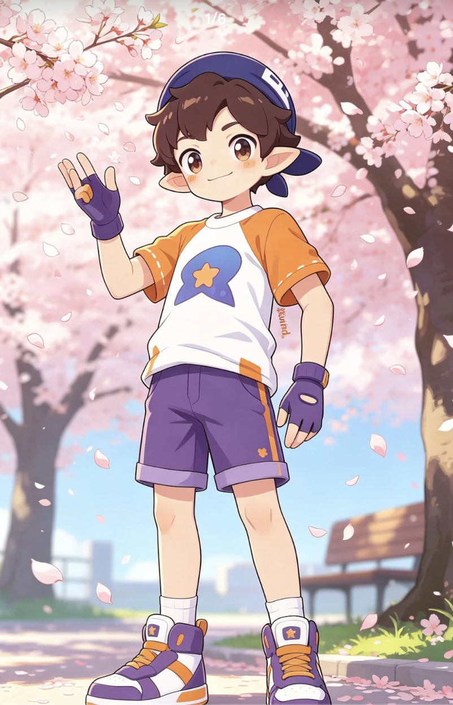
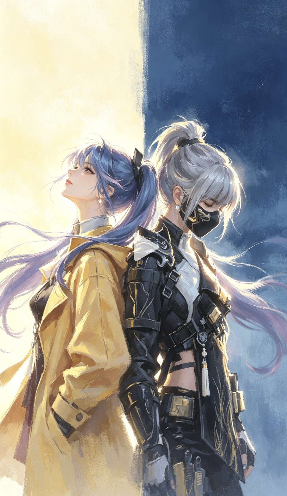
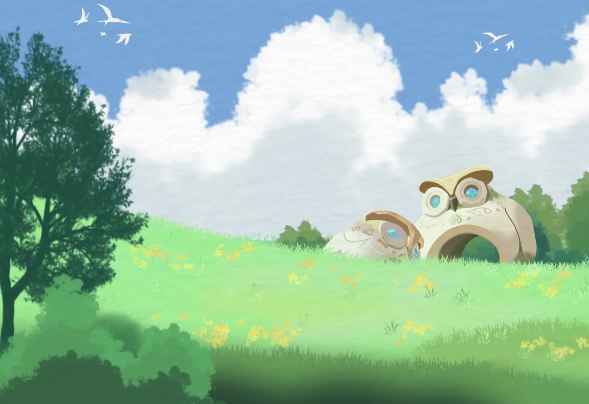
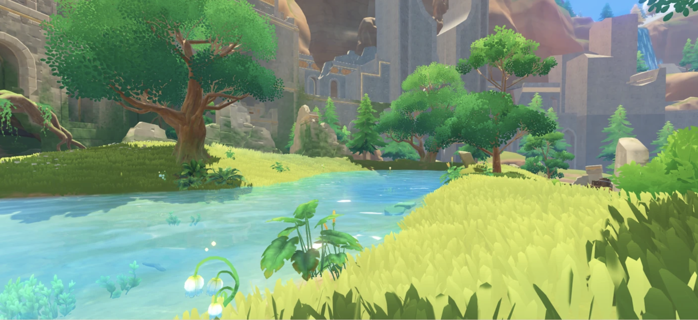

# 《洛克王国》小洛克 × 伊里斯背靠背动漫壁纸生成提示词（v5 第一版）

以《洛克王国》游戏的故事与角色设定为灵魂，生成 3 张“小洛克 × 伊里斯”双人物 AAA 高清动漫壁纸。画面统一采用竖版、左右双人物、中心背靠背的主视觉构图；彻底取消旧版的上大下小结构，不得出现上半部巨大脸部叠加、下半部完整人物或重复头像。

画面左侧固定为小洛克，右侧固定为伊里斯。小洛克是儿童男性，身高明显较矮，背靠伊里斯站在左侧，身体与脸朝向左方，头部自然抬起，以三分之二侧脸望向左上；伊里斯是少年男性，身高明显更高，背靠小洛克站在右侧，身体与脸朝向右方，头部自然低下，以三分之二侧脸望向右下。必须真实保留两人的身高差：小洛克的后背自然靠在伊里斯偏低的背部位置，伊里斯不得缩短，小洛克不得被拉高，两人的头顶不得强行齐平。两人面向相反方向，却通过背部接触形成彼此信任、彼此支撑的关系。

构图只参考图片七的“双人物中心背靠背、左右朝向相反、左侧抬头、右侧低头、左右明暗对照、头发与光线跨越中轴连接画面”的布局逻辑。不得复制图片七中人物的脸型、性别、年龄、发型、面具、服装或半写实五官；图片七不是角色外观参考，也不是本版脸部画风参考。

## 构图与主体层级

- **画幅与景别：** 3:4 竖版双人角色海报，采用膝上或大腿中部以上的双人中近景。两张脸都必须足够大、清晰且无遮挡，人物主体占据画面约 70%—80%，上方保留适度呼吸空间。不得远景化，不得把人物缩成背景中的小人。
- **中心关系：** 两人的背部是全图唯一的中心接触点。小洛克位于左侧稍靠后，伊里斯位于右侧稍靠前；肩线与身体轮廓自然错落，不做镜像复制，不做僵硬的一人一半证件照式排布。除小洛克与伊里斯外，不得出现其他人形角色。
- **左右朝向：** 小洛克的胸口、脸和视线朝左，伊里斯的胸口、脸和视线朝右；二人不得同时朝向镜头，不得面对面，不得拥抱，不得并排正面站立。即使侧身，两人的眼睛、鼻子和嘴部仍要完整清楚，禁止用纯侧面把远侧眼睛完全隐藏。
- **身高差：** 伊里斯必须比小洛克高出明显且自然的一段。伊里斯低头、小洛克抬头共同形成上下错落的双头像关系，但整体仍然是左右构图，不得重新变成上下分层构图。
- **背景分区：** 背景以二人背部接触处为清楚可见的纵向昼夜分界轴。左侧固定为明亮的自然世界，但可根据三张方案分别变化为春日花草坡、阳光森林空地或金色夕阳草原；共同保留草地、植物、明亮天空与自然光，整体参考图片八、图片九的自然环境、色彩和明快气氛，不得复制参考图中的猫头鹰建筑、灰色遗迹或其他标志性建筑。右侧继续保持深蓝、蓝紫色的威廉古堡夜景，必须能辨认出哥特式高塔、尖顶、发光拱窗、巨大满月、枯树与幽蓝夜雾，呼应伊里斯的孤独故事。左右两侧要产生一眼可见的“明亮自然对阴暗古堡、暖光对冷月、鲜活植物对枯树夜雾”强烈对比。
- **分界控制：** 左侧明亮自然场景必须从画面左边缘延伸到小洛克背后，不得再次被星空、银河、蓝紫夜雾或大面积彩虹光海覆盖；即使采用金色夕阳，也必须保持明亮温暖，不得变成夜景。右侧古堡月夜从伊里斯背后延伸到画面右边缘，不得被草地、树林或夕阳侵入。中轴只允许保留一条宽度约占画面 5%—10% 的窄幅星之结和彩虹魔法过渡带，用来连接两个人物；不得用大面积渐变把两侧混成相似的蓝紫星空，也不得做成完全无过渡的生硬拼贴。
- **独角兽元素：** 伊里斯的彩虹独角兽本体以参考图片四为准，只能作为右侧背景中的星光灵体或魔法投影出现。必须保留白色身体、独角、粉紫渐变鬃尾、绿色叶片与金色星形装饰，轮廓清楚可辨，但不得遮挡两张脸，不得成为第三个前景主体。
- **视觉优先级：** 第一优先级是小洛克与伊里斯两张准确、清晰的脸；第二优先级是背靠背关系与自然身高差；第三优先级是服装、星之结、独角兽灵体和威廉古堡背景。任何魔法特效、满月、城堡或独角兽都不得抢占人物脸部主视觉。

## 第一版统一画风：原设高还原日系二次元动画风

本版必须保持人物素材中的二次元角色脸和原设比例，采用精致日系动画电影、赛璐璐上色与高质量游戏宣传插画相结合的画法：线条干净，色块清晰，柔和渐变辅助体积，眼睛通透，头发分束明确，皮肤平滑干净，光影精致但不过度写实。

禁止把人物改成真人、真人 Cosplay、欧美写实概念设计、半写实成年脸、3D 写实人偶或照片质感。禁止增加皮肤毛孔、真实皱纹、浓重鼻唇沟、厚重嘴唇、明显颧骨、深眼窝、长鼻梁、尖下巴或成熟妆容。画面可以具有电影级光线与精细背景，但两张脸必须继续是原设高还原二次元脸。

## 小洛克形象与脸部强约束

- **参考优先级：** 小洛克的身份、脸型、五官、年龄、发型、尖耳、帽子与服装以参考图片五为最高优先级，参考图片六为补充。两张图描绘的是同一个儿童男性角色。
- **脸型与年龄：** 必须保持偏圆、偏短、柔软饱满的儿童脸型，脸颊圆润，下颌短而柔和。不得拉成长脸，不得削尖下巴，不得生成成年男性、青年、少女或女性脸。
- **眼睛：** 严格保持大而圆润的棕色眼睛、眼睛大小、间距、眼尾方向、深棕虹膜、高光位置与清澈儿童感。两眼必须对称且注视方向一致，不得缩小成写实眼睛，不得变成蓝眼、紫眼或异色瞳。
- **鼻子与嘴部：** 鼻部必须小巧、简化，嘴巴小而自然，以素材图中的二次元比例为准；不得生成高鼻梁、大鼻翼、厚嘴唇、口红或成熟五官。
- **头发、尖耳与帽子：** 保持深棕色蓬松短发、原始刘海分束与两侧发束；保留左右清晰、对称、横向伸出的精灵尖耳；保留深紫蓝色反戴棒球帽及白色装饰。耳朵不得被头发或帽子完全遮挡，帽子不得变成头盔、礼帽或兜帽。
- **服装：** 保留白色主体、橙色短袖的运动 T 恤，胸前蓝紫色图形与黄色星形标记，紫色短裤、紫色无指手套，以及紫白橙配色运动鞋的核心设计。景别裁切处之外的服装仍须保持正确，不得擅自改成铠甲、长袍或女性服装。
- **表情原则：** 小洛克抬头时必须仍能清晰看到眉毛、双眼、鼻子与嘴巴，呈现勇敢、温暖、信任或坚定的儿童情绪，不做夸张大笑、咆哮、哭泣或空洞呆滞表情。

## 伊里斯形象与脸部强约束

- **参考优先级：** 伊里斯的身份、脸型、五官、发型与配色以参考图片一为最高优先级，参考图片二为补充。伊里斯为少年感男性角色。
- **脸型：** 严格保持参考图中偏圆、偏短的少年脸型与柔和下颌，不得拉长脸型、削尖下巴、强化颧骨或改成通用成年美型脸；不得女性化，不得照搬图片七中成年女性的脸。
- **眼睛：** 严格保持双眼的大小、间距、眼尾角度、瞳孔方向与黄—金—粉紫渐变虹膜，保留通透高光。低头时眼睛仍必须清楚可见，不得完全闭眼，不得被刘海、阴影或高光遮住。
- **鼻子与嘴部：** 保留小巧鼻部、自然嘴部位置与二次元简化比例，不得增加写实高鼻梁、厚嘴唇、胡须、浓妆或成熟面部结构。
- **头发、耳朵与饰物：** 银白头发的分束、弯曲方向、大片侧扫刘海与粉紫色发梢必须对应参考图；保留清楚的精灵尖耳、金色耳饰和原始刘海遮挡关系。不得改成长马尾、短寸、女性发髻或图片七的人物发型。
- **服装与配色：** 保留白色与浅灰主体、绿色与青绿色彩虹披肩、金色星形饰物、绿色叶片装饰及柔和粉紫点缀，体现彩虹独角兽本体特征。不得生成黑色忍者服、口罩、现代战术装备或图片七人物的服装。
- **表情原则：** 伊里斯自然低头，以克制、安静、守护或决然的少年情绪回应小洛克；脸部必须露出并保持身份清楚，禁止阴沉反派脸、愤怒咆哮、夸张哭泣或闭眼遮脸。

## 两张脸的共同质量底线

两张脸都必须清晰呈现眉毛、上下眼睑、眼线、虹膜、瞳孔、高光、鼻部、嘴角、耳部和刘海结构。不得出现模糊五官、双脸融合、五官串位、左右眼大小失衡、瞳孔方向不一致、斗鸡眼、虹膜破碎、眉毛缺失、鼻嘴错位、牙齿畸形、脸部被魔法粒子遮挡、过度曝光、过度磨皮或角色身份互换。小洛克不得获得伊里斯的银发与金粉眼睛，伊里斯不得获得小洛克的棕发、棒球帽与圆棕眼睛。

## 三张图片的独立变化

三张图片必须共享“小洛克左低抬头、伊里斯右高低头、中心背靠背”的固定构图，但要分别改变表情、手部动作、左侧自然环境、风向、光线与独角兽姿态。右侧继续统一保留深蓝古堡月夜，以稳定角色主题；左侧使用三种明显不同但始终明亮的自然场景，与右侧形成持续、强烈的昼夜与冷暖对比。

1. **晴野招手：** 小洛克位于左侧明亮的春日花草坡，背景有鲜绿草地、黄色小花、清澈浅溪、蓝天和大片白云。他抬头望向左上，一只手张开手掌自然挥手，手指清楚，另一只手自然垂下，露出温暖而克制的笑容；不得再次使用扶帽檐动作。伊里斯右侧低头望向古堡方向，一只手在胸前托住稳定发光的星之结，另一只手自然放松。独角兽灵体在右后方昂首守望。
2. **林间听风：** 小洛克左侧背景改为阳光穿过树冠的明亮森林空地，包含翠绿树叶、柔和光斑、草地与少量随风飘落的绿叶，整体仍为清楚的白昼。他双臂自然放松，一只手轻握成松弛的小拳垂在身侧，头部略微侧倾，安静听风，不扶帽、不按胸。伊里斯右侧低头，一只手轻轻收拢彩虹披肩，另一只手垂落，眉眼带有克制的忧郁。独角兽灵体在右侧月夜中轻轻低头。
3. **暮野施法：** 小洛克左侧背景改为明亮的金色夕阳草原，包含金绿草坡、暖橙天空、被夕阳照亮的云层和远处柔和山影；左侧必须保持温暖、明亮，不得变成黑夜。小洛克抬头望向左方，一只手臂向左前方自然伸出，手掌打开，另一只手垂下，神情坚定但不愤怒。伊里斯右侧维持冷蓝古堡月夜，一只手向右下展开完整的星之结魔法阵，另一只手控制只在中轴附近穿过的彩虹光流。独角兽灵体在右后方向前踏步。金色夕阳与冷蓝月夜形成全组三张中最强烈的冷暖对照。

## 输出要求

- **数量：** 3 张。
- **固定构图：** 小洛克左侧、较矮、抬头；伊里斯右侧、较高、低头；中心真实背靠背；两人朝相反方向。
- **差异要求：** 严格对应“晴野招手”“林间听风”“暮野施法”，人物动作、左侧自然场景、光线与独角兽姿态必须不同，同时三张右侧都保留清晰可辨的威廉古堡月夜。
- **画风：** 原设高还原日系二次元动画风，不使用半写实真人脸。
- **尺寸：** 3:4 竖版，目标 2880 × 3840 像素 4K。
- **画面洁净：** 不得出现文字、数字、标题、边框、签名、水印、平台 UI、播放按钮、商标或额外人物。

## 参考图片及职责

**参考图片一：伊里斯脸型、五官与画风最高优先级参考**

**参考图片二：伊里斯人物外观补充参考**

**参考图片三：威廉古堡背景参考**

**参考图片四：伊里斯彩虹独角兽本体参考**

**参考图片五：小洛克脸型、五官、年龄、发型、尖耳、帽子与服装最高优先级参考**

**参考图片六：小洛克人物外观补充参考**

**参考图片七：仅用于背靠背构图、身位、朝向与左右光色关系参考，禁止复制其中人物外观和半写实脸部**

**参考图片八：左侧白昼草地、蓝天、白云、绿树与黄色小花的主要背景参考；禁止复制其中的猫头鹰建筑**

**参考图片九：左侧草地、树木与少量清澈溪流的补充背景参考；禁止复制其中的灰色遗迹和建筑**

请严格按照以上要求分别生成 3 张图片。
