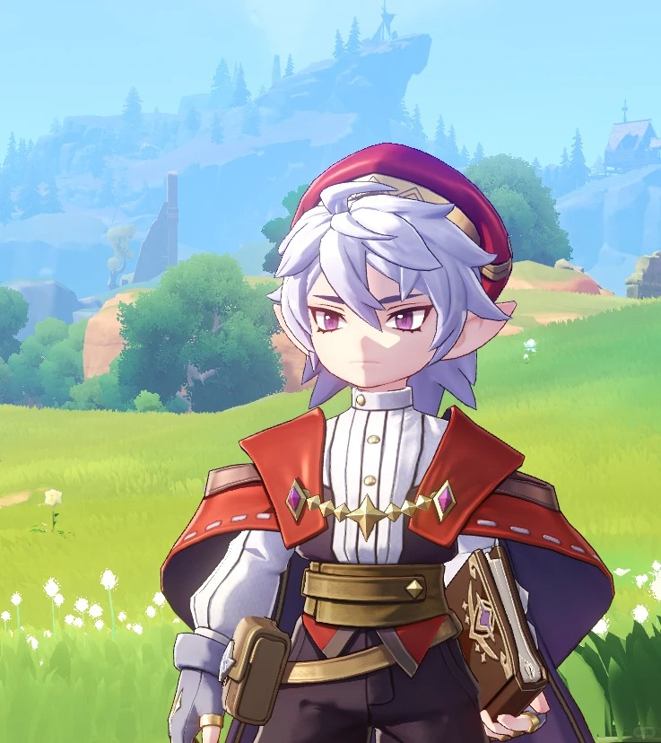

# 《洛克王国》恩佐 AAA 动漫壁纸生成提示词

## 任务

以《洛克王国》游戏的故事为灵魂，为核心人物 **恩佐** 生成 **3 张** AAA 级动漫角色壁纸。

## 参考图片

请务必读取并结合以下两张本地参考图片：

### 参考图片一：人物外观主参考

> 这是最高优先级参考。恩佐的脸型、五官、血色瞳眸与所有脸部细节必须以参考图片一为准，同时高度还原其尖耳、银白色短发、帽子、服饰配色与角色辨识度。

### 参考图片二：动漫画风与细节补充参考

> 用于补充恩佐的动漫画风、发型、服饰与魔法书细节；如与参考图片一存在差异，以参考图片一为准。

## 角色故事

恩佐天生血色瞳眸，自幼被父母视作怪物抛弃，幸得格里芬院长收养并带回魔法学院。他拥有千年难遇的魔法天赋，年少时便改良咕噜球、创造实用魔法，十七岁成为王国第十三任首席魔法师。孤僻的他长期受人排挤，只有雪莉老师给予他温柔与理解，两人一同钻研治愈魔法、守护洛克民众，雪莉也成为他灰暗人生中唯一的光。

雪莉在边境调查灾厄时不幸离世，恩佐从此被悲痛与执念吞没。为了复活她，他触碰永生禁术，提出以精灵生命换取复活之力，遭到王国否决并被逐出学院。他摔碎首席徽章，在暗黑岭建立暗黑魔法学院，穷尽半生搜集各种黑暗力量，只为再次见到雪莉。哪怕计划一次次失败，他也从未放下执念；内心深处仍敬重格里芬院长。恩佐并非单纯追逐力量的恶人，而是一位被失去困住、困在无尽思念中的悲情天才反派。

## 主视觉与构图

- 所有图片统一采用强叙事感的主视觉构图。
- 每张海报使用“上大下小”的层级结构：
  - 画面上半部分，以恩佐最具辨识度的头部、面部轮廓、发型或半身外轮廓作为巨大的视觉主体，形成强识别度的剪影式主形。
  - 画面中下部，围绕同一个恩佐，自然延展出最契合他的完整人物形象、世界观、标志性场景、象征符号、关键建筑、生物、道具与氛围。
- 风格、色彩、场景与材质全部根据恩佐及其故事主题自动适配。
- 所有元素必须与主题强绑定，做到一眼即可识别。
- 画面应统一、自然、富有电影感和故事感，不要杂乱，不要生硬拼贴，不要模板化背景，不要廉价素材感。

## 必须遵守的角色要求

- 恩佐是 **男性**，外貌清秀冷峻，不得女性化。
- 必须以参考图片一为最高优先级，所有脸部细节均以参考图片一为准，并高度还原恩佐的脸型、五官、血色瞳眸、尖耳、银白色短发与红黑白金服饰体系。
- 恩佐应同时具有天才、孤僻、强大、悲伤与偏执的气质，不得表现成单纯脸谱化的邪恶反派。
- 每张画面中只允许出现 **恩佐这一个人物**，不得出现雪莉、格里芬、小洛克或任何其他人物。
- 如需表现故事中的其他角色或关系，只能通过环境、遗迹、魔法痕迹、象征物或氛围进行暗示，不得呈现其他人物形象。

## 输出要求

- 数量：**3 张**，每张均为独立完成的壁纸。
- 尺寸：**3:4**。
- 输出格式：**2880 × 3840 像素的 4K 竖版图片**。
- 品质：AAA 级动漫角色海报，细节丰富，光影精致，画面完整。
- 三张图片应保持恩佐的角色形象与整体画风统一，同时在场景氛围、叙事瞬间或视觉主题上有所区别。

请直接生成三张符合以上全部要求的图片。
