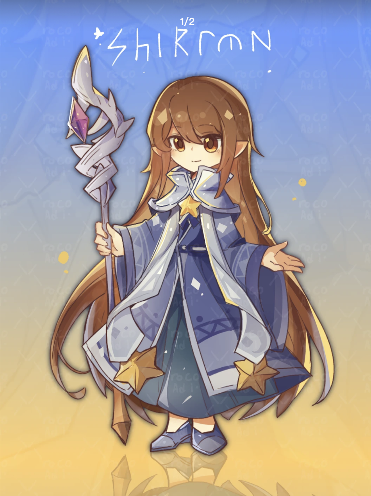
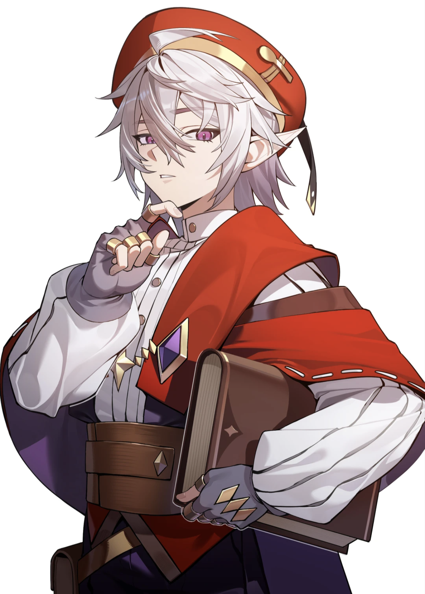
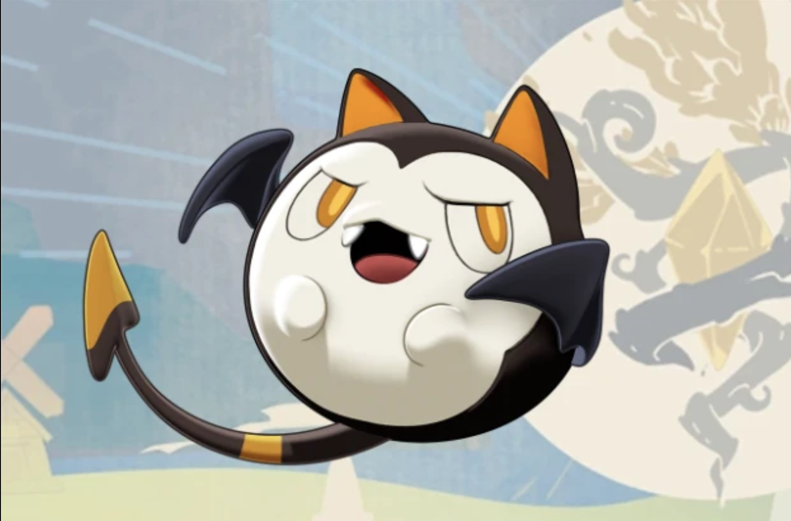

# 《洛克王国》恩佐与雪莉主题海报生成提示词

## 任务

以《洛克王国》中恩佐与雪莉的故事为核心，生成 3 张具有史诗感、宿命感与情绪张力的 AAA 级动漫电影海报。

## 参考图片

### 参考图片一：雪莉

> 用于还原雪莉的脸型、五官、发型、服饰与整体形象。

### 参考图片二：恩佐

> 这是恩佐的人物外观主参考，用于还原恩佐的脸型、五官、血色瞳眸、发型、服饰与整体形象。

### 参考图片三：恩佐细节补充参考

> 用于补充恩佐的动漫画风、发型、服饰与魔法书细节；如与参考图片二存在差异，以参考图片二为准。

### 参考图片四：恶魔叮

> 用于还原画面下方恶魔叮的造型与配色。

### 参考图片五：星之结魔法阵

> 用于参考画面下方星之结的结构与能量效果。

## 角色故事

自幼拥有血色瞳眸、只能与恶系精灵缔结契约的恩佐，从小被其他洛克排挤、视作怪物，直到温柔通透的雪莉向他伸出援手，将孤苦无依的他带入魔法学院，悉心教导他魔法，成为他灰暗人生里唯一的光。二人朝夕相伴，一同钻研治愈魔法、打理精灵、加入怪谈协会探查黑暗异象，雪莉十分欣赏恩佐千年难遇的魔法天赋，而恩佐拼命钻研所有魔法，只为拥有足够力量守护她，后来恩佐改良咕噜球、创下诸多新式魔法，成为王国史上最年轻的首席魔法师，那时的他满心憧憬，只想和雪莉长久相伴。雪莉早已预见自己早逝、恩佐会因她坠入黑暗的命运，为不拖累恩佐，主动请缨前往危险的边境遗迹调查能量异动，临行前她将装满二人回忆的水晶球、承载自身本源的记忆礼盒留给恩佐，在任务途中遭遇雪崩不幸离世，只留下满盒对恩佐的期许，劝他放下悲伤好好生活。雪莉的死彻底击碎了恩佐的精神支柱，他疯魔般四处翻阅古籍寻找复活之法，甚至向格里芬院长请求研究禁忌永生魔法，却被全体魔法师斥责、驱逐出学院，绝望的恩佐摔碎首席徽章，彻底与正统魔法决裂，隐居暗黑岭收拢黑巫师，穷尽半生谋划复活仪式。他寻得草系精灵王的复活卷轴，不惜献祭整片草系精灵的性命，终于短暂唤回雪莉，可善良的雪莉不愿以万千生灵的生命换取重生，恳求草王收回力量，以自身二次消亡换回所有草系精灵的性命，临别前仍叮嘱恩佐放下执念、变回从前温柔的少年。亲眼看着唯一的光再度消散，恩佐彻底被困在无尽思念里，此后数十年不断策划各种计划，抓捕精灵、借用黑暗力量、制造雪莉再生机，哪怕次次失败，也从未放弃复活雪莉的执念，在外人眼中他是妄图颠覆王国的邪恶反派，可他穷极一生所求，从来都只是再见雪莉一面。

## 主视觉与构图

- 采用左右对称的双人物面部特写构图。
- 左右人物各自占据画面 **100% 的高度** 和约 **50% 的宽度**，人物轮廓从画面顶部一直延伸至底部，完整铺满左右两侧，不得在左右边缘留下大面积背景。
- 左右人物的脸部高度各自占整张画面高度的 **70%—80%**，脸部宽度各自占对应半幅宽度的 **90%—100%**。使用贴近镜头的超大面部特写，让两张脸从画面顶部一直延伸至下方前景区域；额头、外侧头发、后脑和下巴允许被画布边缘明显裁切，不要完整展示头部、肩膀、胸部或大面积服饰。
- 左侧是参考图片二中的恩佐，右侧是参考图片一中的雪莉。
- 参考图片五中的星之结魔法阵位于画面下方中央，参考图片四中的恶魔叮位于星之结上方。它们作为下方前景元素，不得挤压或缩小左右两个贯穿全高的人物主视觉。
- 整体以深邃星空蓝、梦境紫、青绿色、金色与彩虹星光为主，表现神圣、悲壮而充满重生希望的献祭氛围。画面自然融合，不要硬拼贴，不要杂乱。

## 角色要求

- 恩佐是男性，雪莉是女性。
- 恩佐的脸型与五官必须以参考图片二为主要依据，尽可能还原原始脸型、面部轮廓与角色特征；雪莉的脸型与五官必须以参考图片一为主要依据，尽可能还原原始脸型、面部轮廓与角色特征；严禁擅自瘦脸、改变五官比例或过度美化，避免生成与原角色不一致的网红脸或通用动漫脸。
- 左侧恩佐与右侧雪莉都必须采用侧脸构图，并共同朝向画面中央；不得使用正脸、接近正面的角度或一正一侧的组合。
- 除左侧恩佐、右侧雪莉及恶魔叮外，不得出现其他人物。
- 恶魔叮与星之结必须清晰可辨。
- 不添加标题、对白、字幕、标志、水印或其他文字。

## 输出要求

- 数量：**3 张**。
- 配色风格：**三张图片必须采用明显不同的主配色**，分别为：①星空蓝、青绿色与金色；②梦境紫、粉色与虹彩色；③银白色、晨曦金与冰蓝色。三张图片保持人物和构图统一，但整体色调、光影氛围必须有清晰区别，不得只做轻微换色。
- 尺寸：**3:4 竖版**。
- 输出格式：**2880 × 3840 像素的 4K 图片**。
- 尺寸约束：**三张图片必须全部严格保持 3:4 竖版，并以 2880 × 3840 像素输出，不得改为其他画幅比例或像素尺寸。**
- 品质：AAA 级动漫电影海报，人物面部精细，光影完整，主体清晰。

请严格按照以上构图比例与参考图片生成 3 张海报，并优先确保每张图片的尺寸完全符合要求。
