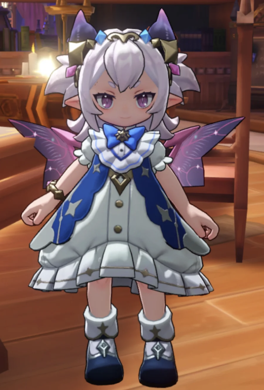
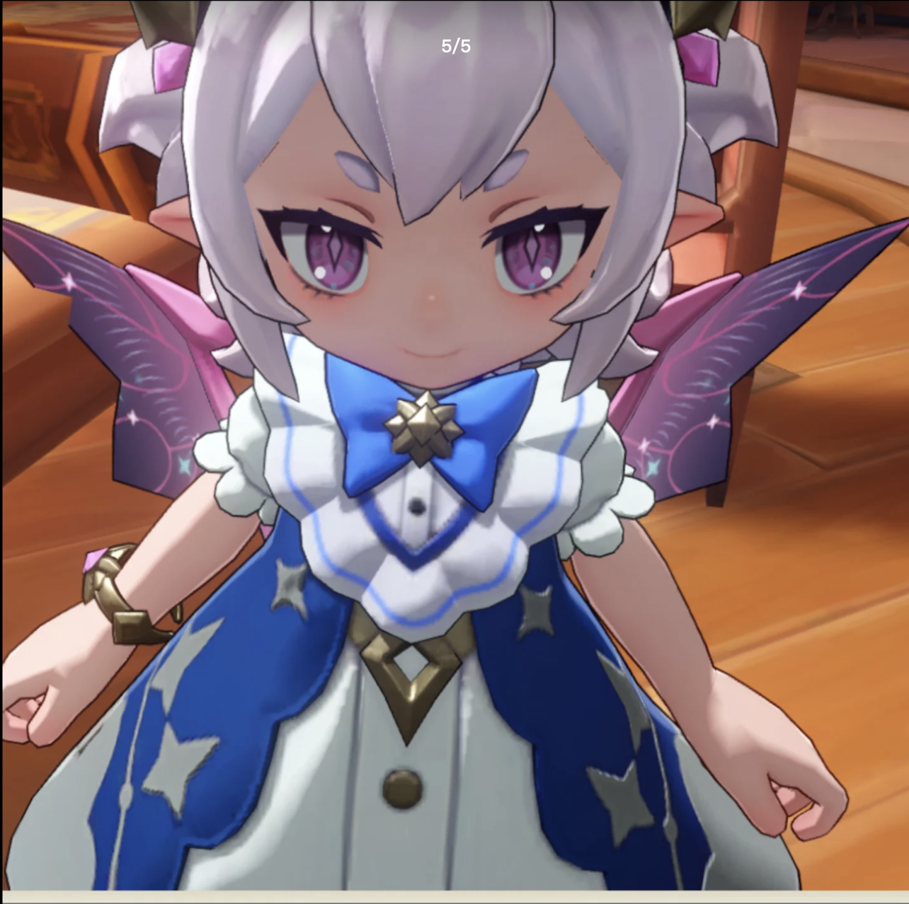
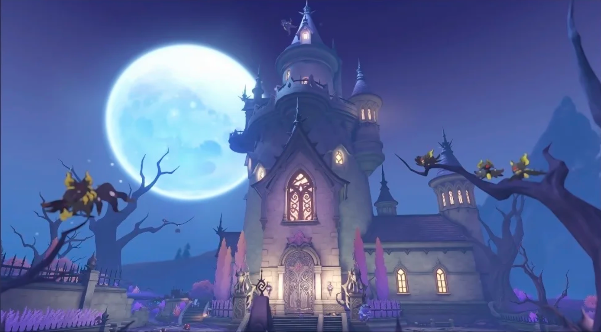

# 《洛克王国》芙蕾雅 AAA 动漫壁纸生成提示词

## 任务

以《洛克王国》游戏的故事为灵魂，为核心人物 **芙蕾雅** 生成 **3 张** AAA 级动漫角色壁纸。

## 参考图片

请务必读取并结合以下五张本地参考图片。人物、场景与道具应分别遵循对应参考图，不得相互混淆。

### 参考图片一：人物全身外观主参考

> 这是芙蕾雅人物外观的最高优先级参考。必须高度还原她的身材比例、脸型、五官、紫粉色瞳眸、银白色短发、精灵尖耳、头部装饰、蓝白礼裙、金色饰件、鞋靴与紫粉色幻彩翅翼，保持鲜明的角色辨识度。

### 参考图片二：脸部、服饰与翅翼细节参考

> 用于补充芙蕾雅的脸部近景、眼睛、发丝、领口、蓝色蝴蝶结、星形金属饰件、衣料层次与翅翼纹理。只参考角色外观，不得生成参考图中的“5/5”等界面文字或任何水印。

### 参考图片三：侧面造型与动态参考

> 用于补充芙蕾雅的侧面轮廓、发型结构、头饰位置、尖耳、手臂动作、翅翼厚度与立体结构。如人物细节与参考图片一存在差异，以参考图片一为准。

### 参考图片四：威廉古堡场景参考

> 这是背景建筑的最高优先级参考。每张画面的背景中都必须清晰体现威廉古堡：月夜下的哥特式尖塔、主楼、亮灯长窗、古堡大门、枯树与紫蓝色幽幻环境。可以根据镜头进行景深与透视调整，但必须保留古堡的关键建筑特征和辨识度。

### 参考图片五：童话球道具参考

> 这是童话球外观的最高优先级参考。童话球的主体必须是一个完整、独立、可投掷的圆形捕捉球，握持逻辑与投掷用精灵球一致。准确还原其紫色透明球体、蓝紫渐变与球体内部的发光花朵纹样；参考图下方的装饰细节属于球体设计的一部分，**绝不能延伸或误画成手柄、短柄、棍子、棒棒糖杆、权杖杆或手持镜握柄**。芙蕾雅只能直接握住球体本身，或将球体托在摊开的手掌上，画面中不得出现任何供手抓握的杆状结构。

## 角色故事

芙蕾雅以天真活泼、略带傲娇的少女姿态出现在魔法学院，喜欢收集绩点，明亮可爱的外表下却藏着漫长沉睡造成的记忆空缺。她只隐约记得“校长”“精灵王”与守护王国的使命，却不知道这些零碎印象都指向自己的真正身份——古老而强大的幻系精灵王 **巡天幻星**。她的银白发丝、星光般的瞳眸与幻彩翅翼，既属于眼前这个灵动少女，也承载着跨越漫长岁月的王者力量。

随着古老封印松动、黑暗力量逼近，芙蕾雅遗失的记忆逐渐回归。此次画面将她的觉醒与守护之旅凝聚在月夜下的威廉古堡：她手持童话球走入紫蓝色古堡夜色，球内花形幻光与月光、窗灯和星轨彼此呼应；少女的天真、精灵王的威严与守护者的决心在同一瞬间重叠。她不是被黑暗吞没的角色，而是在幽暗古堡中点亮童话与幻境、重新回应守护使命的星光引路者。

## 主视觉与构图

- 所有图片统一采用强叙事感的主视觉构图。
- 每张海报使用“上大下小”的层级结构：
  - 画面上半部分，以芙蕾雅最具辨识度的头部、面部轮廓、发型或半身外轮廓作为巨大的视觉主体，形成强识别度的剪影式主形。
  - 画面中下部，围绕同一个芙蕾雅，自然延展出最契合她的完整人物形象、世界观、标志性场景、象征符号、关键建筑、生物、道具与氛围。
- **上下两个层级必须采用明显不同的动作、手势、视线方向、表情变化与人物外轮廓**。上方巨幅人物不是下方全身人物的等比放大、镜像或重复姿势，而应表现同一故事中的另一个叙事瞬间。
- **童话球原则上每张画面只在上下其中一个层级清晰出现一次**。如果上方人物正在托球、握球或准备投球，下方人物就不得重复同一持球动作，必须改用行走、展开手臂、触碰魔法轨迹或其他不持球的姿势；反之亦然。严禁上下两处同时以相同方式托举、握持或展示童话球。
- 风格、色彩、场景与材质全部根据芙蕾雅及其故事主题自动适配。
- 所有元素必须与主题强绑定，做到一眼即可识别。
- 画面应统一、自然、富有电影感和故事感，不要杂乱，不要生硬拼贴，不要模板化背景，不要廉价素材感。

## 必须遵守的角色、场景与道具要求

- 芙蕾雅是 **女性少女形态**，娇小灵动、天真可爱并带有精灵王的神秘感，不得男性化、成人化或过度幼儿化。
- 必须以参考图片一为人物外观最高优先级，并结合参考图片二、三，高度还原芙蕾雅的脸型、五官、紫粉色瞳眸、银白色短发、精灵尖耳、头饰、蓝白礼裙、金色饰件与紫粉色幻彩翅翼。
- 芙蕾雅应同时具有活泼、傲娇、纯真、神秘与守护者觉醒后的坚定气质，不得表现成邪恶、阴沉或惊悚角色。
- **每张画面的背景都必须出现清晰可辨的威廉古堡**，并以参考图片四为场景依据。古堡不得被抽象光效完全遮挡，不得替换成普通城堡、魔法学院或其他建筑。
- **每张画面中的芙蕾雅都必须手拿童话球**，并以参考图片五为道具依据。童话球必须保持纯球体、可投掷的捕捉球结构，允许且只允许以下两种持球方式：① 手指直接环握球体，像即将投掷精灵球；② 摊开手掌，让球体稳稳停在掌心或悬浮于掌心正上方。手部与球体接触必须自然，手指完整，球体不得被手掌、衣袖或光效严重遮挡。
- **严禁将童话球画成棒棒糖、魔法杖、权杖、手持镜、花形法杖或任何带握柄的道具**。芙蕾雅的手不得抓握球体下方的装饰、突出物或任何杆状结构；球体下方不得延伸出棍子或手柄。
- 每张画面中只允许出现 **芙蕾雅这一个人物**，不得出现恩佐、雪莉、格里芬、小洛克或任何其他人物。
- 如需表现故事中的其他角色、危机或关系，只能通过威廉古堡环境、遗迹、封印裂痕、幻系魔法、星轨、光影或象征物进行暗示，不得呈现其他人物形象。
- 禁止生成任何文字、数字、Logo、水印、游戏 UI 或边框。

## 输出要求

- 数量：**3 张**，每张均为独立完成的壁纸。
- 尺寸：**3:4**。
- 输出格式：**2880 × 3840 像素的 4K 竖版图片**。
- 品质：AAA 级动漫角色海报，细节丰富，光影精致，画面完整。
- 三张图片应保持芙蕾雅的角色形象、威廉古堡背景、童话球道具与整体画风统一，同时在场景氛围、叙事瞬间或视觉主题上有所区别。

请直接生成三张符合以上全部要求的图片。
