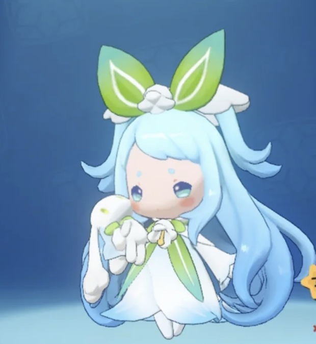
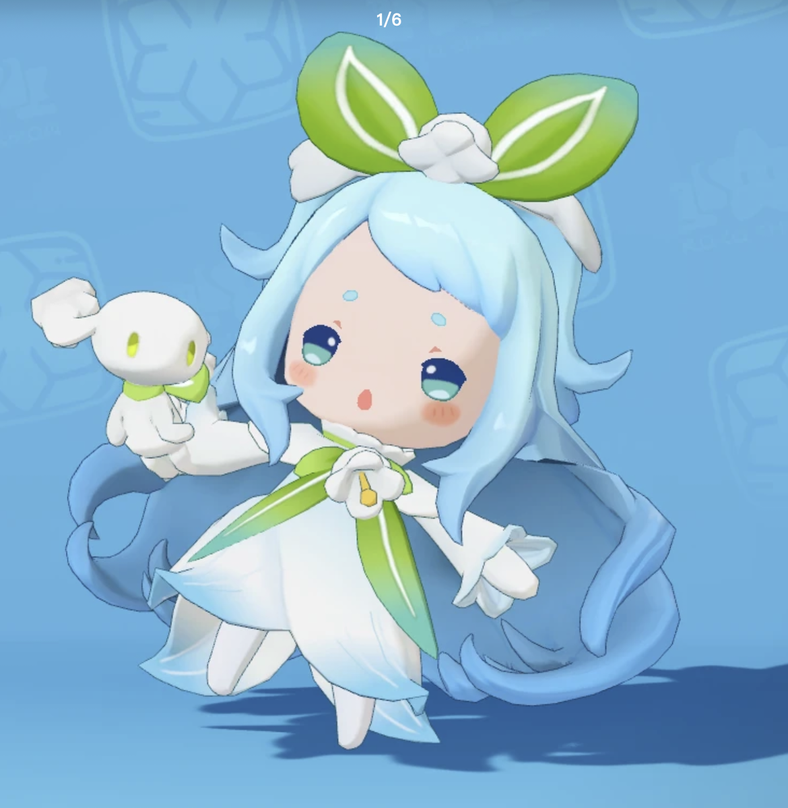
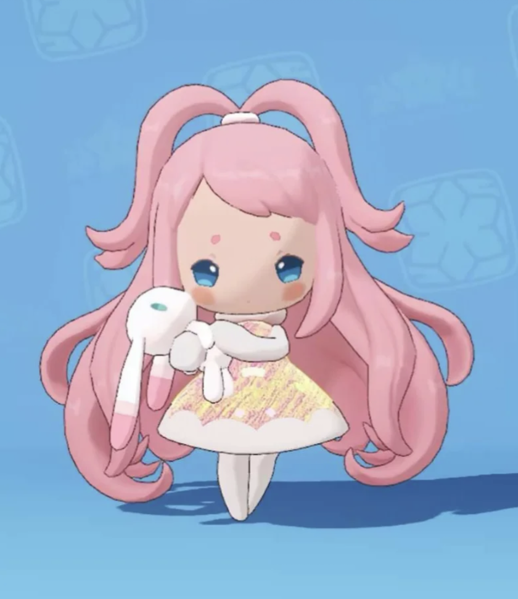

# 《洛克王国》雪影娃娃 × 睡铃雪影娃娃 AAA 动漫壁纸提示词

## 任务

以《洛克王国》的角色设定与故事为灵魂，为 **雪影娃娃** 和 **睡铃雪影娃娃** 生成 AAA 级动漫角色壁纸。每张画面必须同时呈现两种形态，并固定采用 **睡铃雪影娃娃在上且比例巨大、雪影娃娃在下且比例明显更小** 的“上大下小”纵向叙事关系。上方是巨幅角色主视觉，下方是完整人物与故事场景，两者不得画成同等大小。

画面的核心不是战斗或对立，而是表现同一个灵魂从极北雪原走向睡铃花海的生命旅程：下方的雪影娃娃清冷、温柔而孤独，上方的睡铃雪影娃娃宁静、柔软而治愈。两种形态应自然地属于同一幅完整画面，形成从风雪到花香、从孤寂到安眠的情绪递进，不得做成生硬的上下拼贴或两个互不相关的画面。

## 参考图片

请务必读取并结合以下三张本地参考图片。角色外观、服饰、发型、布偶与色彩必须遵循对应参考图，不得将两种形态的特征相互混淆。

### 参考图片一：睡铃雪影娃娃全身外观主参考

> 这是睡铃雪影娃娃整体造型的主要参考。重点还原她娇小圆润的精灵体态、浅冰蓝色长发、头顶绿色双叶装饰与白色花饰、蓝绿色眼睛、白色花瓣裙、绿色领结和飘带、白色手套与鞋袜，以及怀中的白色布偶。

### 参考图片二：睡铃雪影娃娃脸部、服装与布偶细节参考

> 用于补充睡铃雪影娃娃的脸型、五官、发丝结构、双叶头饰、白色花饰、衣裙层次、绿色装饰和布偶细节。只参考角色本身，不得生成参考图中的“1/6”、界面元素、文字或水印。

### 参考图片三：雪影娃娃全身外观主参考

> 这是雪影娃娃造型的最高优先级参考。重点还原她娇小的精灵体态、粉色长发、头顶成环的双束发型、蓝色眼睛、带淡黄与粉色纹理的冬日小裙、白色绒边与鞋袜，以及怀中带长耳和粉色条纹细节的白色布偶。

## 角色故事

古老的极北雪山孕育了冰系精灵大耳帽兜。她历经漫长寒冬进化，成为雪影娃娃艾莉亚。她性情温柔，擅长冰雪魔法，怀里的布偶由自己幼年褪下的绒毛所化，承载着过往的记忆。长久以来，她独自驻守雪原，时常拿出玩偶戏法，想向路过的旅人传递善意，却总被行人畏惧和疏远。她常年与风雪相伴，心底藏着挥之不去的孤单。

某日，雪影循着微风来到南部的睡铃花海。漫山盛放的睡铃花散发着安神香气，冰雪与花香在此相融。她在花海中沉睡许久，绒毛浸染花香，心境逐渐变得平和。这片花海孕育出属于她的另一种形态——**睡铃雪影娃娃**。

不同于雪原中清冷孤寂的雪影娃娃，睡铃雪影娃娃周身萦绕着安眠花香，不愿再制造凛冽寒冰。她喜欢在花丛中小憩，善待周围所有生灵，与好友鳗尾兽约定共同种下一棵大树，打造一片可以安心休憩的花园。她会细心为伙伴准备润喉糖，将睡铃花赠予知己，希望所有人都能卸下疲惫，安然入梦。

雪原中的雪影守着漫天风雪，带着一身清冷；花海中的睡铃雪影拥着馥郁花香，怀揣柔软暖意。二者本是同源一体：一个直面寒冬，独自抵御孤寂；一个栖于花海，寻觅世间温柔。**风雪是她的底色，铃花是她的归处。**

## 人物外观与身份还原

- **睡铃雪影娃娃位于画面上方。** 她是娇小、圆润、可爱的女性精灵形态，以参考图片一和二为准。保留浅冰蓝色长发、两侧粗长而柔软的卷曲发束、绿色双叶头饰、白色花饰、蓝绿色眼睛、白色花瓣裙、绿色领结和飘带，以及白色布偶。整体色彩以冰蓝、白色、嫩绿色为主，气质安静、柔和、带有花香般的治愈感。
- **雪影娃娃位于画面下方。** 她是娇小、圆润、可爱的女性精灵形态，以参考图片三为准。保留粉色长发、头顶成环的双束发型、蓝色眼睛、淡黄粉色纹理的冬日小裙、白色绒边和长耳白色布偶。整体色彩以粉色、白色、浅冰蓝为主，气质清冷、温柔、羞怯，眼神中带有长期独守雪原的淡淡孤独。
- 两种形态的脸部都必须清晰呈现眼睛、瞳孔、高光、眉部、鼻部、嘴角、脸颊和发际结构。保持参考图中偏圆、偏短、幼态但不婴儿化的脸型，不得改成长脸、尖下巴、成年女性比例或真人五官。
- 两种形态必须一眼可区分。严禁互换发色、头饰、服装、布偶和位置；不得把雪影娃娃画成蓝发绿叶造型，也不得把睡铃雪影娃娃画成粉发冬装造型。
- 两个布偶都是承载记忆与情感的随身物，不是第三个真实生物。布偶必须保持柔软的布艺质感、简洁的玩偶结构和正确的归属，不得巨大化、拟人化、武器化或交换主人。

## 情绪与表演

- **上方睡铃雪影娃娃：** 神情宁静、温柔、安心，可以轻闭双眼小憩、低头闻花、抱着布偶露出浅笑、伸手接住花瓣，或在花香中轻盈漂浮。动作应舒展、柔软、带有呼吸感，不得表现为昏迷、受伤或失去意识。
- **下方雪影娃娃：** 神情温柔而略带孤独，可以在风雪中抱紧布偶、抬头望向上方的花海、用冰雪魔法保护一株初生睡铃花，或向旅人离去的方向轻轻伸手。动作应克制而有情绪，不得摆出凶狠攻击、冷酷战斗或邪恶施法姿态。
- 两者应通过视线、风的轨迹、冰晶、花瓣、发丝流向或柔和光线产生情感联系，让观众感受到她们是同源一体的两种生命状态，而不是互相敌对的两个角色。
- 两种形态的动作、视线、手势与身体轮廓必须明显不同。不得使用完全相同的站姿、表情或抱玩偶动作进行上下复制。

## 背景与世界观

- 背景必须围绕角色故事重新设计，使用一个 **由极北雪原自然过渡到南部睡铃花海的完整明亮场景**，不再使用威廉古堡。
- 画面下部对应雪影娃娃：古老雪山、柔和风雪、冰晶、覆雪坡地与远处的冷色山脊共同构成清冷雪原。环境可以寂静辽阔，但不得阴森、恐怖或漆黑。
- 画面上部对应睡铃雪影娃娃：晨光或柔和日光照亮的睡铃花海、轻盈花瓣、嫩绿草叶、澄澈天空与可供伙伴休憩的树木共同构成温暖花园。可以用一棵正在生长的树暗示她与鳗尾兽的约定，但不得直接出现鳗尾兽或其他角色。
- 雪原与花海之间必须自然融合：冰雪可沿着风的轨迹化为露珠，雪花可逐渐转化为白色花瓣，冰蓝光线可过渡为嫩绿与暖金色。不得使用笔直分割线、画框、上下两张图硬拼、撕纸边缘或明显的拼贴接缝。
- 整体环境应明亮、纯净、梦幻而富有空气感。主色从下方的冰蓝、雪白、淡粉，逐渐过渡到上方的嫩绿、花白、浅金与晴空蓝。
- 严禁出现威廉古堡、哥特尖塔、幽暗长廊、黑紫夜色、恐怖遗迹、战场、城市街道或与故事无关的模板化背景。

## 主视觉与构图

- **最高构图优先级：必须使用与“伊里斯 v2”成片相同类型的“上大下小”电影海报层级。** 这是一种非写实比例的海报蒙太奇，不是两个角色在同一现实空间中并排或上下站立。
- **上方巨幅主视觉——睡铃雪影娃娃：** 只使用头部特写、胸像或大半身近景，脸部和头发形成覆盖画面上半部的巨大剪影式主形。她的头部宽度应约占画布宽度的 **65%–85%**，整体视觉面积约占画面的 **60%–70%**；头饰、发丝或肩部可以自然延伸到画面边缘，形成具有压倒性识别度的第一视觉焦点。不得把上方角色画成完整小全身。
- **下方叙事人物——雪影娃娃：** 使用清晰完整的全身形象，位于画面中下部或下部前景。她的全身高度约占画面高度的 **28%–38%**，整体视觉面积约占画面的 **20%–30%**，明显小于上方睡铃雪影娃娃，但脸部、服饰与布偶仍须清晰可辨。
- **上下尺度差必须一眼可见：** 上方睡铃雪影娃娃的头部或半身视觉体量至少是下方雪影娃娃全身的 **2.5 倍**。观看缩略图时也应先看到上方巨幅睡铃雪影娃娃，再看到下方小比例雪影娃娃。严禁上下两个角色等高、等宽、同为全身、同为半身或各占一半画面。
- 上方巨幅睡铃雪影娃娃是象征性的精神主形，不是现实场景中的“巨人”；下方雪影娃娃才承担完整身体动作与环境叙事。两种尺度通过光影、云雾、风雪、花瓣和发丝自然叠合，不得用硬边框或分割线解释大小关系。
- 上方睡铃雪影娃娃与下方雪影娃娃必须采用明显不同的表情、视线、手势和外轮廓。上方重点表现脸部情绪与绿叶头饰，下方重点表现完整粉发造型、冬日裙装、布偶和雪原动作。
- 上方巨幅形象可向中部自然延展，成为下方人物的背景主形；下方全身人物可以与上方的发丝、花瓣光带或衣裙边缘产生少量视觉重叠，从而形成一个整体，而不是上下两张独立图片。
- 两张脸都必须完整、清晰。头发、花朵、冰晶、光效和布偶不得遮挡眼睛、鼻嘴与关键服装特征。
- 上下区域应通过风雪、花瓣、发丝、裙摆和光线形成连续的 S 形或弧形动线，使画面像同一个故事空间，而不是角色立绘堆叠。
- 每种形态只出现一次，不得添加第三层人物、镜像人物、回忆剪影、分身，或再生成一个重复头像。
- 背景必须服务于人物层级：上方巨幅主视觉优先于花海和树木，下方完整人物优先于雪山和冰晶。不得让环境占据主要视觉面积。

## 画风与品质

- AAA 级动漫角色壁纸，兼具精致二次元电影海报感与高品质游戏宣传图质感。
- 在忠实保留参考图角色轮廓和可爱比例的基础上，提升发丝、绒毛、布偶、花瓣衣裙、冰晶、雪雾、环境光与材质细节；不得照搬低清游戏截图质感。
- 光影应柔和而有层次：下方使用清透的冰蓝冷光，上方使用柔和的晨光、花瓣反光和浅金轮廓光，并在中部完成自然色温过渡。
- 画面应细腻、梦幻、干净、富有故事感，不得过度写实、油腻塑料感、廉价 3D 感、杂乱堆叠或高饱和霓虹污染。

## 必须遵守

- 每张画面只允许出现 **一位雪影娃娃和一位睡铃雪影娃娃**，共两种形态；除各自怀中的布偶外，不得出现鳗尾兽、旅人、小洛克或其他人物与生物。
- 必须严格保持 **睡铃雪影娃娃在上、雪影娃娃在下**，不得上下颠倒、身份互换、融合成一个角色或画成同一种形态。
- 必须严格保持 **上方巨幅半身、下方小比例全身** 的悬殊层级。不得生成上下两个同等大小的全身角色，不得采用平均分配画面的“双角色上下排版”，也不得让下方雪影娃娃接近上方睡铃雪影娃娃的视觉体量。
- 必须保留两种形态各自的布偶，并确保手指、手臂、布偶与身体之间的接触自然，不得出现多手、多指、断肢、悬空抓握或肢体融合。
- 不得将温柔主题误解为恋爱、母女或姐妹合照；重点是同一个灵魂的两种形态与生命阶段。
- 不得出现战斗、武器、伤口、哭喊、邪恶笑容、惊悚表情、黑暗魔法、囚禁或灾难氛围。
- 禁止生成任何文字、数字、标题、Logo、水印、游戏 UI、边框、签名或参考图中的界面内容。

## 输出要求

- **图片比例：** 3:4
- **目标尺寸：** 2880 × 3840，4K
- 生成数量与动作、背景方案由当次提问指定。
- 不得出现第三个人形角色、上下角色等大、上下位置颠倒、形态融合、身份互换、重复头像、真人脸、复杂遮脸特效、文字、数字、标题、边框、签名、Logo、水印或平台 UI。
