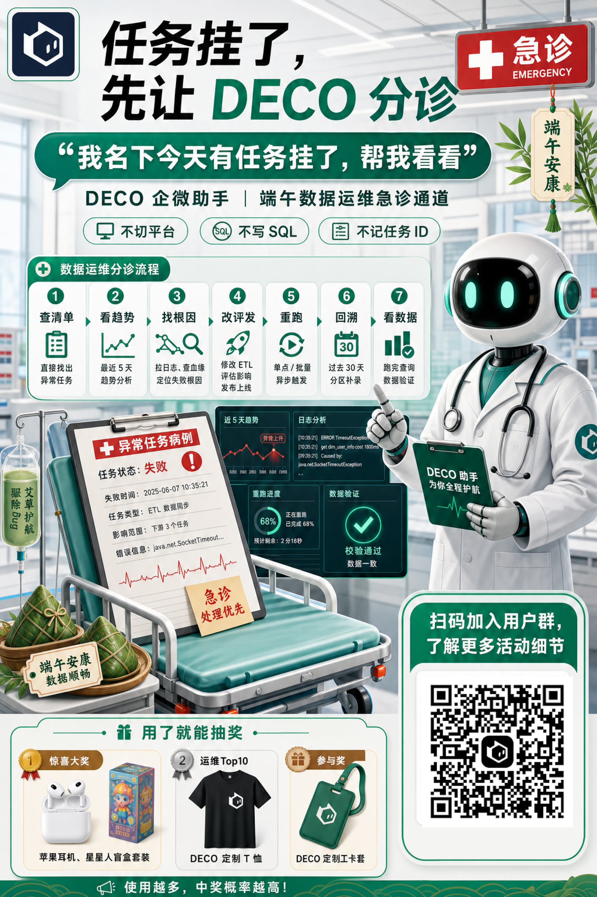
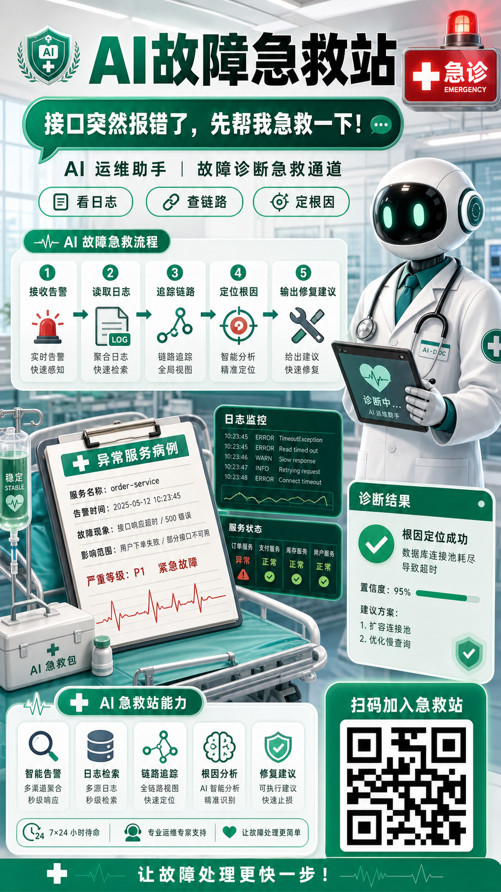
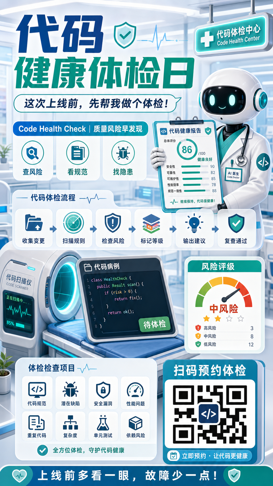

# 医疗急诊分诊式企业活动海报


## 核心要点
- **用强隐喻包装功能**：把“任务故障排查”转成“急诊分诊”，用户一眼能懂优先级和处理流程。
- **把流程做成诊疗卡片**：每一步用编号、图标、短标题呈现，比长段说明更适合海报。
- **主视觉要承担角色感**：机器人医生、病历板、急诊灯牌能快速建立记忆点。
- **二维码和奖品区要独立成块**：活动转化信息不要混在主画面里，单独做成清晰入口。
- **中文仍然控制长度**：标题可以大，步骤说明要短，复杂字段留给后期排版。
## Prompt
```plain text
生成一张 9:16 竖版中文活动海报，用“医疗急诊分诊”的隐喻来包装企业运维助手活动。

主题：
- 任务挂了，先让 DECO 分诊

风格：
- 干净明亮的商业活动海报。
- 未来感医院急诊室场景。
- 白色和翡翠绿为主色。
- 半写实 3D 插画结合清晰的信息图 UI 卡片。
- 整体要专业、明亮、易读。
- 要有企业营销视觉完成度。

画面结构：
- 顶部区域：大号加粗中文标题，左上角放产品 Logo 占位，右上角放红色急诊灯牌。
- 中部区域：绿色大对话气泡、活动副标题、三个功能标签，以及横向 7 步分诊流程卡片。
- 右侧：友好的机器人医生，穿白大褂，拿着诊疗夹板。
- 中下部：病床上放异常任务病例板，旁边有监控数据面板和诊断结果卡片。
- 底部左侧：奖品区，包含三个奖品卡片。
- 底部右侧：大二维码占位区，并有清晰行动召唤。

场景：
- 干净的未来感医院急诊室。
- 玻璃墙。
- 柔和日光。
- 病床。
- 输液袋。
- 夹板。
- 健康监测面板。
- 端午装饰元素，例如竹叶、粽子、端午挂饰。

主要视觉元素：
- 机器人医生。
- 急诊灯牌。
- 诊断卡片。
- 流程卡片。
- 任务失败病例单。
- 监控仪表盘。
- 绿色医疗 UI 面板。
- 奖品。
- 二维码占位。

文字内容，保持清晰可读：
- 主标题：任务挂了，先让 DECO 分诊
- 对话气泡：我名下今天有任务挂了，帮我看看
- 副标题：DECO 企微助手 | 端午数据运维急诊通道
- 标签：不切平台 | 不写 SQL | 不记任务 ID
- 流程标题：数据运维分诊流程
- 步骤：1 查清单，2 看趋势，3 找根因，4 改评发，5 重跑，6 回溯，7 看数据
- 病例板：异常任务病例
- 行动召唤：扫码加入用户群，了解更多活动细节
- 奖品标题：用了就能抽奖
- 底部文案：使用越多，中奖概率越高！

约束：
- 使用清晰的方形二维码占位，不要生成真实可扫码二维码。
- 主要文字要足够大、足够清晰。
- 医疗隐喻要友好、干净、专业，不要恐怖。
- 尽量用短中文标签，不要大段说明文字。

严格禁止：
- 禁止把医疗隐喻画成血腥、恐怖、手术创口、真实病患抢救等惊悚医疗场景。
- 禁止出现真实医院名称、院徽、医疗机构标识或未经提供的品牌 Logo。
- 禁止生成真实可扫码二维码；二维码只能是不可扫码的占位图案。
- 禁止机器人医生、急诊灯牌、病例板、流程卡片之间互相遮挡或比例失衡。
- 禁止小字密集到无法阅读；流程、标签、病例信息必须保持短句和清晰分区。
- 禁止低清截图风、脏乱病房风或与“干净明亮急诊分诊”不符的暗色风格。
```
## 类似图片：
### AI故障急救站

#### 提示词
```plain text
生成一张 9:16 竖版中文活动海报，用“医疗急诊分诊”的隐喻包装企业 AI 故障处理活动。

主题：
- AI故障急救站

风格：
- 干净明亮的商业活动海报。
- 未来感医院急诊室场景。
- 白色和翡翠绿为主色。
- 半写实 3D 插画结合信息图 UI 卡片。

画面结构：
- 顶部放大号中文标题和急诊灯牌。
- 中部放绿色对话气泡和 5 步急救流程卡片。
- 右侧放机器人急救医生。
- 底部放能力卡片和二维码占位区。

文字内容：
- 主标题：AI故障急救站
- 对话气泡：接口突然报错了，先帮我急救一下！
- 流程：1 接收告警，2 读取日志，3 追踪链路，4 定位根因，5 输出修复建议

严格禁止：
- 禁止血腥、恐怖、手术创口、真实病患抢救等惊悚医疗场景。
- 禁止出现真实医院名称、院徽、医疗机构标识或未经提供的品牌 Logo。
- 禁止生成真实可扫码二维码；二维码只能是不可扫码的占位图案。
- 禁止流程卡片、病例板、监控面板、二维码区互相遮挡或文字溢出。
- 禁止低清截图风、脏乱病房风或暗黑恐怖风格。
```
### 代码健康体检日

#### 提示词
```plain text
生成一张 9:16 竖版中文活动海报，用“健康体检中心”的隐喻包装代码质量检查活动。

主题：
- 代码健康体检日

风格：
- 明亮体检中心场景。
- 白色、浅蓝和翡翠绿为主色。
- 半写实 3D 插画结合清晰信息图卡片。
- 专业、明亮、易读。

画面结构：
- 顶部放大号中文标题和体检中心灯牌。
- 中部放对话气泡和 6 步体检流程卡片。
- 右侧放机器人医生和代码体检报告。
- 底部放检查项目卡片和二维码占位区。

文字内容：
- 主标题：代码健康体检日
- 对话气泡：这次上线前，先帮我做个体检！
- 流程：1 收集变更，2 扫描规则，3 检查风险，4 标记等级，5 输出建议，6 复查通过

严格禁止：
- 禁止血腥、恐怖、手术创口、真实病患抢救等惊悚医疗场景。
- 禁止出现真实医院名称、院徽、医疗机构标识或未经提供的品牌 Logo。
- 禁止生成真实可扫码二维码；二维码只能是不可扫码的占位图案。
- 禁止体检流程卡片、报告面板、检查项目、二维码区互相遮挡或文字溢出。
- 禁止小字密集到无法阅读，禁止低清截图风或脏乱病房风。
```

