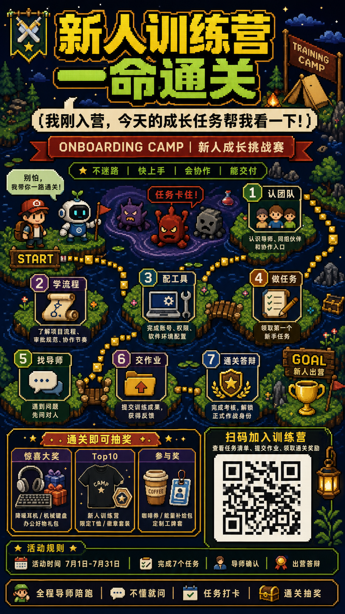
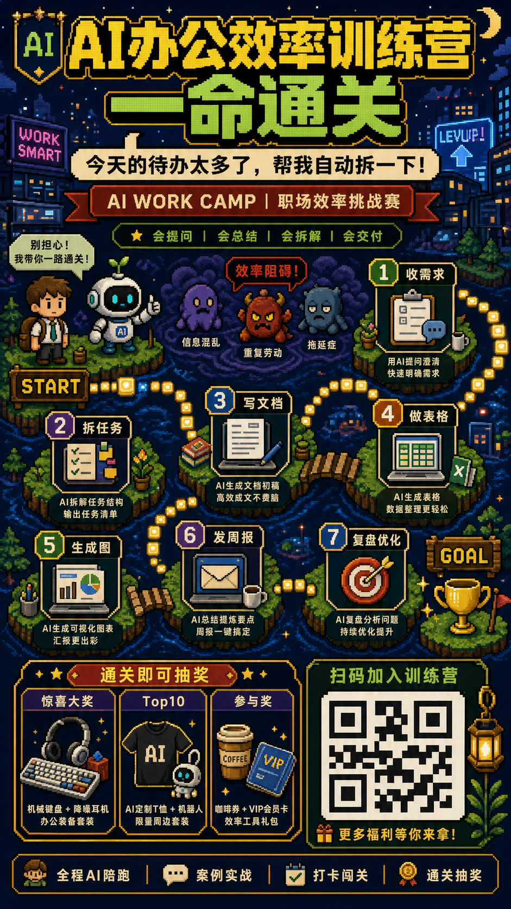
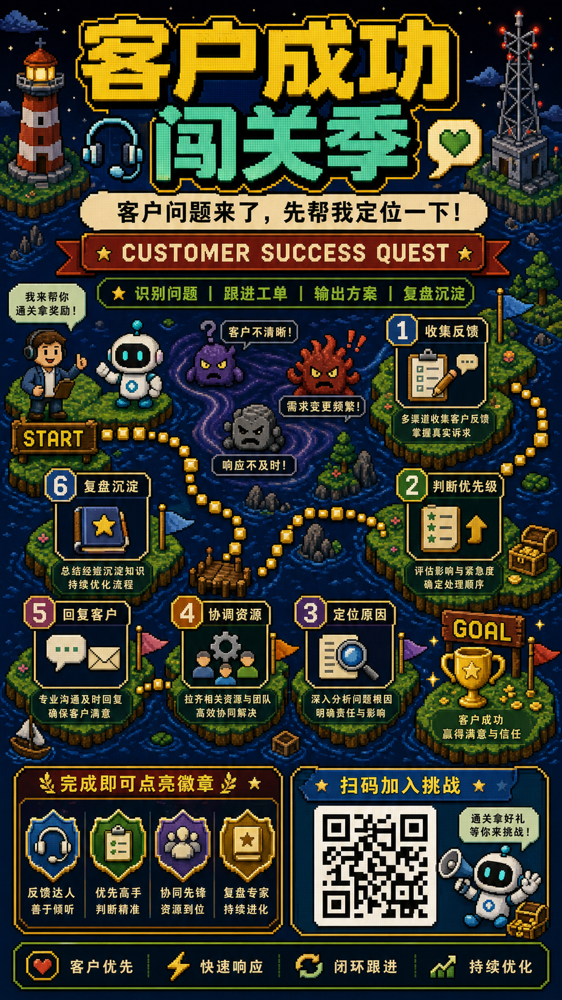

# 复古像素闯关地图式活动海报

## 核心要点
- **中文文字分两步做**：先生成少字版高清画面，再用排版工具叠加中文，成品会更稳。
- **先定结构再写细节**：明确顶部标题、中部闯关路线、底部奖品和二维码区，模型更容易生成完整画面。
- **文案越短越好**：主标题、节点名、标签尽量短，避免大段中文造成错字和重叠。
- **二维码只做占位**：生成图里不要做真实二维码，最终发布前再替换成可扫码版本。
- **用负面约束控风格**：明确写“不要真实照片、不要扁平插画、不要文字重叠”，能减少跑偏。


## Prompt
```plain text
生成一张 9:16 竖版中文活动海报，主题是“新人训练营”，整体做成复古像素游戏闯关地图风。

主题：
- 新人训练营

风格：
- 高质量 16-bit 复古像素风。
- 街机 RPG 活动海报质感。
- 深蓝夜景训练营世界。
- 清晰方块像素。
- 大标题强冲击。
- 游戏 UI 面板。
- 从 START 到 GOAL 的闯关路线。
- 画面信息丰富但要有秩序。

画面结构：
- 顶部 25%：超大中文像素标题，黄色和绿色为主。
- 标题下方：奶油色对话气泡，放一句中文口号。
- 中部 45%：一条弯曲的游戏地图路线，串起 7 个编号任务小岛，从 START 走到 GOAL。
- 底部 30%：左侧是奖品区，右侧是二维码占位区，最底部是一条状态栏。

场景：
- 深蓝色像素夜景河流。
- 漂浮草地小岛。
- 小桥。
- 发光黄色路径块。
- 星星。
- 训练营旗帜。
- 帐篷。
- 篝火。
- 徽章。
- 宝箱。
- 像素云。

角色：
- START 旁边放一个可爱的像素新人角色，背着小背包。
- 新人旁边放一个友好的机器人导师 NPC。
- 中间放几个代表工作阻碍的小怪物。
- GOAL 处放奖杯。

文字内容，尽量保持清晰可读：
- 顶部标题：新人训练营 一命通关
- 对话气泡：我刚入营，今天的成长任务帮我看一下！
- 红色横幅：ONBOARDING CAMP | 新人成长挑战赛
- 绿色标签：不迷路 | 快上手 | 会协作 | 能交付
- 导师气泡：别怕，我带你一路通关！
- 障碍提示：任务卡住！
- 节点：1 认团队，2 学流程，3 配工具，4 做任务，5 找导师，6 交作业，7 通关答辩
- 奖品标题：通关即可抽奖
- 奖品卡片：惊喜大奖，Top10，参与奖
- 二维码标题：扫码加入训练营
- 规则：活动时间 7月1日-7月31日 | 完成7个任务 | 导师确认 | 出营答辩
- 底部状态栏：全程导师陪跑 | 不懂就问 | 任务打卡 | 通关抽奖

约束：
- 右下角要有清晰的方形二维码占位，但不要生成真实可扫码二维码。
- 奖品区包含三个奖品卡片：办公耳机或键盘礼盒、限定 T 恤或徽章、咖啡券或工牌套。
- 整体要像完成度高的商业海报，不要像草稿。
- 所有 UI 元素要对齐。
- 文字要放在容器内，不要重叠。

严格禁止：
- 禁止出现真实品牌 Logo、商标、水印，除非用户提供并明确要求。
- 禁止生成真实可扫码二维码；二维码只能是不可扫码的占位图案。
- 禁止从复古像素游戏风跑偏成写实照片、现代扁平矢量或低清截图风。
- 禁止 START、GOAL、编号关卡、金币路径之间断裂、顺序混乱或无法看出闯关路线。
- 禁止标题、节点标签、奖品区、二维码区互相遮挡或溢出容器。
- 禁止出现大段糊成一团的小字；长文案必须压缩成短标签。
```
## 类似图片：
### AI办公效率训练营

#### 提示词
```plain text
生成一张 9:16 竖版中文活动海报，主题是“AI办公效率训练营”，整体做成复古像素游戏闯关地图风。

主题：
- AI办公效率训练营

风格：
- 高质量 16-bit 复古像素风。
- 街机 RPG 活动海报质感。
- 深蓝夜景办公室奇幻世界。
- 清晰方块像素。
- 大标题强冲击。
- 游戏 UI 面板。
- 从 START 到 GOAL 的闯关路线。

画面结构：
- 顶部放超大中文像素标题。
- 中部放 7 个任务小岛和弯曲闯关路线。
- 底部左侧放奖品区。
- 底部右侧放二维码占位区。

文字内容：
- 顶部标题：AI办公效率训练营 一命通关
- 对话气泡：今天的待办太多了，帮我自动拆一下！
- 节点：1 收需求，2 拆任务，3 写文档，4 做表格，5 生成图，6 发周报，7 复盘优化

严格禁止：
- 禁止生成真实可扫码二维码；二维码只能作为不可扫码的占位图案。
- 禁止从复古像素游戏风跑偏成写实照片、现代扁平矢量或普通插画风。
- 禁止 START、GOAL、任务节点、路径关系断裂或顺序混乱。
- 禁止标题、节点、奖品区、二维码区互相遮挡或溢出容器。
```
### 客户成功闯关季

#### 提示词
```plain text
生成一张 9:16 竖版中文活动海报，主题是“客户成功闯关季”，整体做成复古像素游戏闯关地图风。

主题：
- 客户成功闯关季

风格：
- 高质量 16-bit 复古像素风。
- 深蓝夜景海岛地图。
- 游戏 UI 面板。
- 从 START 到 GOAL 的客户服务闯关路线。

画面结构：
- 顶部放超大中文像素标题。
- 中部放客户服务任务路线。
- 底部左侧放荣誉徽章区。
- 底部右侧放二维码占位区。

文字内容：
- 顶部标题：客户成功闯关季
- 副标题：客户问题来了，先帮我定位一下！
- 节点：1 收集反馈，2 判断优先级，3 定位原因，4 协调资源，5 回复客户，6 复盘沉淀

严格禁止：
- 禁止生成真实可扫码二维码；二维码只能作为不可扫码的占位图案。
- 禁止从复古像素游戏风跑偏成写实照片、现代扁平矢量或普通插画风。
- 禁止 START、GOAL、任务节点、路径关系断裂或顺序混乱。
- 禁止标题、节点、奖品区、二维码区互相遮挡或溢出容器。
```


