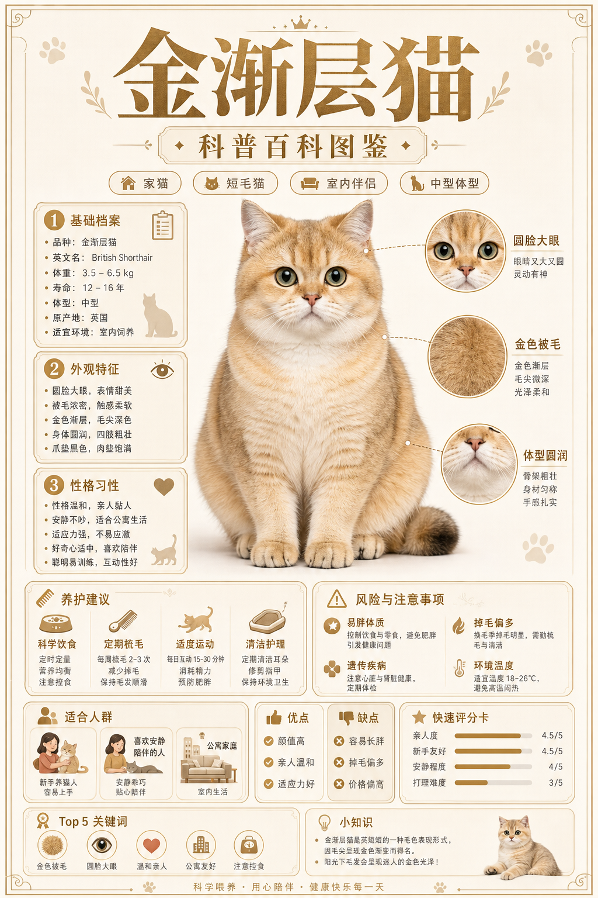
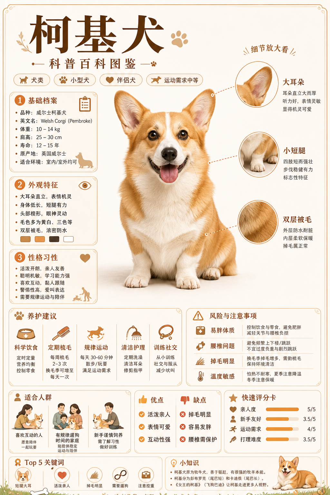

# 宠物百科图鉴式信息海报


## 核心要点
- **中心主视觉要足够干净**：用一只清晰、正面的主体承载第一眼记忆点，周围信息才不会显乱。
- **百科信息要模块化**：基础档案、外观特征、性格习性、养护建议、风险事项分别成卡片，方便扫读。
- **细节特征用局部放大标注**：把脸、毛发、骨量等关键特征做圆形放大镜，比文字描述更直观。
- **评分卡能快速建立判断**：用条形评分表达亲人度、新手友好、打理难度等维度，适合做品种对比。
- **配色要贴合品种气质**：英短蓝白适合低饱和蓝灰、米白、细线框，形成温和、干净、可信的图鉴感。
## Prompt
```plain text
生成一张 3:4 竖版宠物百科信息图海报，版式干净，有编辑杂志感，柔和米白背景，低饱和蓝灰配色，细线边框，中间放一只清晰写实的猫作为主视觉。

主题：
- 英短蓝白猫 科普百科图鉴

风格：
- 宠物百科图鉴海报。
- 高级杂志信息图。
- 写实动物摄影结合干净的插画 UI 卡片。
- 柔和蓝灰与象牙白配色。
- 优雅中文标题。
- 信息丰富但清晰易读。
- 整体温和、可信、精致。

画面结构：
- 顶部：大号中文标题和副标题，下方放几个小分类标签。
- 中心：一只全身英短蓝白猫端坐，戴精致蕾丝领和蝴蝶结，干净棚拍光线。
- 左侧栏：编号信息卡片，分别展示基础档案、外观特征、性格习性。
- 右侧：三个圆形局部放大标注，用连线连接到猫身上，分别展示脸、短密被毛、强壮体型。
- 中下部：养护建议卡片和风险注意事项卡片。
- 底部：适合人群、优缺点对比、快速评分卡、Top 关键词、小知识。
- 使用整齐的圆角矩形、细蓝灰边框、小图标和清晰留白。

视觉元素：
- 英短蓝白猫。
- 剪贴板图标。
- 眼睛图标。
- 爱心图标。
- 梳毛梳。
- 食盆。
- 温度计。
- 主人画像。
- 优缺点清单。
- 评分条。
- 关键词图标。
- 底部可加淡淡的伦敦天际线剪影。

文字内容，保持可读：
- 主标题：英短蓝白猫
- 副标题：科普百科图鉴
- 标签：家猫 | 短毛猫 | 室内伴侣 | 中型体型
- 卡片 1 标题：基础档案
- 卡片 1 内容：品种：英国短毛猫（蓝白）；学名：Felis catus；常见体重：3.5-7 kg；寿命：12-16 年；体型：中等偏壮实；饲养环境：室内更适合
- 卡片 2 标题：外观特征
- 卡片 2 内容：圆脸厚腮，眼睛圆大；被毛短而密，手感像绒毯；骨量足，四肢粗壮；蓝灰+白色拼色，白胸白爪常见
- 卡片 3 标题：性格习性
- 卡片 3 内容：温和稳重，亲人但不过分黏人；安静少叫，适合公寓生活；能适应规律作息，也可短时独处；幼猫活泼，成猫更沉稳
- 右侧标注：圆脸厚腮；绒感短毛；骨量充足
- 养护标题：养护建议
- 养护内容：控制饮食，预防发胖；每周梳毛 2-3 次；每天互动玩耍 10-15 分钟；定期刷牙、剪甲、清耳；备好猫抓板、饮水碗和猫砂盆
- 风险标题：风险与注意事项
- 风险内容：易胖：零食和主食要定量；掉毛：季节性掉毛较明显；健康：建议关注心脏、肾脏与口腔检查；夏天注意散热，避免闷热环境
- 适合人群：新手养猫人；上班族/公寓家庭；喜欢安静陪伴感强宠物的人
- 优点：颜值高；脾气稳；适应力好；陪伴感舒适
- 缺点：容易长胖；掉毛偏多；运动量偏低
- 快速评分卡：亲人度 4.5/5；新手友好 5/5；安静程度 4.5/5；运动需求 2/5；掉毛指数 4/5；打理难度 2.5/5
- Top 5 关键词：圆脸厚腮；绒感短毛；温和稳重；公寓友好；易胖需控食
- 小知识：英国短毛猫历史悠久，体型结实、性格稳定，蓝白配色优雅大方，是英短家族中非常受欢迎的经典花色之一。
- 底部提示：科学饲养，定期体检，给予陪伴与关爱，让猫咪健康快乐每一天。

约束：
- 所有信息都要放在清晰可读的信息卡片里。
- 中心猫咪必须是第一视觉焦点。
- 整体要优雅、柔和、可信。
- 用短条目表达，不要大段文字。
- 不要真实品牌 Logo。

严格禁止：
- 禁止纯卡通风、玩具手办感或杂乱拼贴风；主体必须是清晰写实宠物图鉴质感。
- 禁止毛色、体态、耳朵、四肢、尾巴等关键品种特征与主题品种不符。
- 禁止多出或缺少眼睛、耳朵、四肢、尾巴，禁止关节方向错误、爪子融合、五官错位。
- 禁止把主体画成其他品种，或混入无关动物抢占主视觉。
- 禁止深色背景、刺眼高饱和配色或复杂背景抢走宠物主体。
- 禁止信息卡遮挡宠物脸部、身体轮廓和局部放大标注；禁止小字糊成一团。
```
## 类似图片：
### 金渐层猫科普百科图鉴

#### 提示词
```plain text
生成一张 3:4 竖版宠物百科信息图海报，版式干净，有编辑杂志感，柔和米白背景，低饱和金色和奶白配色，细线边框，中间放一只清晰写实的猫作为主视觉。

主题：
- 金渐层猫 科普百科图鉴

风格：
- 宠物百科图鉴海报。
- 高级杂志信息图。
- 写实动物摄影结合干净插画 UI 卡片。
- 柔和金色、奶白与浅棕配色。

画面结构：
- 顶部放大号中文标题和分类标签。
- 中心放全身金渐层猫。
- 左侧放基础档案、外观特征、性格习性卡片。
- 右侧放眼睛、毛色、圆脸的局部放大标注。
- 底部放适合人群、优缺点和评分卡。

文字内容：
- 主标题：金渐层猫
- 副标题：科普百科图鉴
- 标注：圆脸大眼；金色被毛；体型圆润
- 关键词：金色被毛；圆脸大眼；温和亲人；公寓友好；注意控食

严格禁止：
- 禁止纯卡通风、玩具手办感或杂乱拼贴风；主体必须是清晰写实宠物图鉴质感。
- 禁止毛色、体态、耳朵、四肢、尾巴等关键品种特征与主题品种不符。
- 禁止多出或缺少眼睛、耳朵、四肢、尾巴，禁止关节方向错误、爪子融合、五官错位。
- 禁止把主体画成其他品种，或混入无关动物抢占主视觉。
- 禁止信息卡遮挡宠物脸部、身体轮廓和局部放大标注；禁止小字糊成一团。
```
### 柯基犬科普百科图鉴

#### 提示词
```plain text
生成一张 3:4 竖版宠物百科信息图海报，版式干净，有编辑杂志感，柔和米白背景，低饱和橙白和浅棕配色，细线边框，中间放一只清晰写实的狗作为主视觉。

主题：
- 柯基犬 科普百科图鉴

风格：
- 宠物百科图鉴海报。
- 高级杂志信息图。
- 写实动物摄影结合干净插画 UI 卡片。
- 柔和橙白、奶油色与浅棕配色。

画面结构：
- 顶部放大号中文标题和分类标签。
- 中心放全身柯基犬。
- 左侧放基础档案、外观特征、性格习性卡片。
- 右侧放大耳朵、短腿、双层被毛的局部放大标注。
- 底部放适合人群、优缺点和评分卡。

文字内容：
- 主标题：柯基犬
- 副标题：科普百科图鉴
- 标注：大耳朵；小短腿；双层被毛
- 关键词：短腿大耳；活泼亲人；掉毛明显；需要遛狗；注意控重

严格禁止：
- 禁止纯卡通风、玩具手办感或杂乱拼贴风；主体必须是清晰写实宠物图鉴质感。
- 禁止毛色、体态、耳朵、四肢、尾巴等关键品种特征与主题品种不符。
- 禁止多出或缺少眼睛、耳朵、四肢、尾巴，禁止关节方向错误、爪子融合、五官错位。
- 禁止把主体画成其他品种，或混入无关动物抢占主视觉。
- 禁止信息卡遮挡宠物脸部、身体轮廓和局部放大标注；禁止小字糊成一团。
```
### 秦腔旦角舞蹈创作与实践研究图鉴
图片文件：`/Users/liuxinyu/.codex/generated_images/2026-06-30/aca83f85-40e9-4e2d-b031-17639cb397e6.png`
#### 提示词
```plain text
生成一张 3:4 竖版中国戏曲百科信息图海报，版式干净，有编辑杂志感，柔和象牙白宣纸背景，低饱和靛蓝与蓝灰配色，细线边框，中间放一位清晰写实的秦腔旦角舞者作为主视觉。

主题：
- 秦腔旦角舞蹈 科普百科图鉴

风格：
- 中国戏曲百科图鉴海报。
- 高级杂志信息图。
- 写实舞台人物摄影结合干净的插画 UI 卡片。
- 柔和靛蓝、蓝灰与象牙白配色。
- 优雅中文标题，带传统书法气质但清晰可读。
- 信息丰富但清晰易读。
- 整体典雅、可信、精致，有西北秦腔文化气质。

画面结构：
- 顶部：大号中文标题和副标题，下方放几个小分类标签。
- 中心：一位全身秦腔旦角舞者端庄起舞，穿粉白与靛蓝相间的传统戏服，水袖飘展，头戴精致旦角头饰，妆容清晰，干净棚拍光线，姿态优雅，人物是第一视觉焦点。
- 左侧栏：编号信息卡片，分别展示基础概念、角色类型、动作特征、审美风格。
- 右侧：三个圆形局部放大标注，用蓝灰虚线连接到舞者身上，分别展示水袖手势、台步圆场、眼神身法。
- 中下部：创作转化卡片、实践训练卡片、研究视角卡片。
- 底部：快速认知卡、Top 5 关键词、小知识、温馨提示。
- 使用整齐的圆角矩形、细蓝灰边框、小图标和清晰留白。
- 底部可加淡淡的秦地戏台、乐师、古城楼与云纹剪影。

视觉元素：
- 秦腔旦角舞者。
- 水袖。
- 戏曲脸谱小图标。
- 书本图标。
- 眼睛图标。
- 手势图标。
- 舞台图标。
- 莲花纹样。
- 评分条。
- 关键词圆形图标。
- 古典细线边框与角花。

文字内容，保持可读：
- 主标题：秦腔旦角舞蹈
- 副标题：舞蹈创作与实践研究图鉴
- 标签：戏曲舞蹈 | 旦角身段 | 舞台创作 | 非遗研究
- 卡片 1 标题：基础概念
- 卡片 1 内容：秦腔旦角身段是戏曲女性角色的重要身体语言；以手、眼、身、步、水袖程式为核心；兼具叙事、抒情与人物塑造功能；服务唱腔情绪、剧情推进与舞台调度；审美特征：柔中有骨，婉中有劲
- 卡片 2 标题：角色类型
- 卡片 2 内容：正旦：端庄稳重，重沉静与分量；花旦：灵巧活泼，重俏丽与机敏；闺门旦：含蓄柔婉，重羞怯与细腻；武旦：利落劲健，重功架与爆发；老旦：厚重沉稳，重阅历与气息
- 卡片 3 标题：动作特征
- 卡片 3 内容：手部讲究兰花指、腕法与指尖领势；眼神先行，回眸、低眉、远望富有情绪性；身段含拧、转、倾、展，形成曲线美；步法包括台步、碎步、退步、跑圆场；水袖强化空间延展与节奏可视化
- 卡片 4 标题：审美风格
- 卡片 4 内容：唱中有舞，舞中见戏；程式中见人物，动作不离角色性格；小动作承载大情绪，强调内心身体化；兼具西北戏曲的苍劲与旦角的柔婉；情感表达多见哀、盼、羞、叹、决
- 右侧标注 1：水袖技法
- 右侧标注 1 内容：水袖通过甩、收、绕、抖、抛等动作延伸身体线条，强化抒情性与人物情绪。
- 右侧标注 2：台步圆场
- 右侧标注 2 内容：台步、碎步、圆场讲究稳、轻、圆、顺，是舞台移动与气质塑造的基础。
- 右侧标注 3：手眼身法
- 右侧标注 3 内容：眼为心苗，手随心动，身随步转，形成细腻含蓄的戏曲神韵。
- 卡片 5 标题：创作转化
- 卡片 5 内容：从传统程式中提炼动作母题：袖、步、身、眼；通过重复、变形、放大、压缩进行舞蹈发展；结合秦腔音乐、板式与锣鼓经建立节奏；让人物命运与身体记忆成为作品核心
- 卡片 6 标题：实践训练
- 卡片 6 内容：基础体态：立腰、沉肩、含胸、提气入手；手眼训练：眼随手走，情从眼出；步法训练：台步、碎步、圆场与转身；水袖训练：收放有度，劲在袖端；综合训练：唱念情绪与身段同步
- 卡片 7 标题：研究视角
- 卡片 7 内容：动作分析：时间、空间、力度、部位；田野调查：剧团、戏校、演员口述与排练现场；影像记录：水袖轨迹、重心变化、亮相停顿；教学应用：服务戏曲身段课与舞蹈创作实践
- 快速认知卡：程式规范性 5/5；抒情表现力 5/5；技巧协调性 4.5/5；人物塑造力 5/5；群众熟悉度 3.5/5；舞蹈转化力 4.5/5
- Top 5 关键词：水袖身法；手眼身步；台步圆场；程式人物；秦声秦韵
- 小知识：秦腔旦角舞蹈不只是戏曲表演技巧，更是一种浓缩人物性格、情绪气息与舞台节奏的综合身体美学。它以程式为骨，以情感为魂，在一招一式之间传递秦腔独有的韵味与生命力。
- 底部提示：学习旦角身段，不仅要会做动作，更要理解角色气质、唱腔节奏与戏曲审美。

约束：
- 所有信息都要放在清晰可读的信息卡片里。
- 中心秦腔旦角舞者必须是第一视觉焦点。
- 整体要典雅、柔和、可信。
- 用短条目表达，不要大段文字。
- 不要真实品牌 Logo。
- 避免照搬参考图具体文字与构图细节，但保持相似的竖版百科图鉴比例、蓝白信息图气质和传统戏曲装饰感。

严格禁止：
- 禁止纯卡通风、杂乱拼贴风或与“典雅戏曲百科图鉴”不符的现代广告风。
- 禁止人物五官、手指、手腕、肩颈、躯干比例错误，禁止水袖与手臂连接错位。
- 禁止戏服、头饰、水袖、妆容与秦腔旦角气质不符，禁止把旦角画成其他戏种或现代舞台造型。
- 禁止信息卡遮挡人物脸部、手势、水袖和身体姿态；禁止小字糊成一团。
- 禁止深色背景、刺眼高饱和配色、真实品牌 Logo 或水印。
```
### 西高地白梗科普百科图鉴
图片文件：`/Users/liuxinyu/.codex/generated_images/2026-06-30/6c736fdc-1f76-40cb-9251-42d58a7c0efc.png`
#### 提示词
```plain text
生成一张 3:4 竖版宠物百科信息图海报，版式干净，有编辑杂志感，柔和象牙白纸质背景，低饱和蓝灰配色，细线边框，中间放一只清晰写实的西高地白梗作为主视觉。

主题：
- 西高地白梗 科普百科图鉴

风格：
- 宠物犬百科图鉴海报。
- 高级杂志信息图。
- 写实动物摄影结合干净的插画 UI 卡片。
- 柔和蓝灰、浅灰与象牙白配色。
- 优雅中文标题，清晰可读。
- 信息丰富但清晰易读。
- 整体温和、可信、精致，带一点英伦田园气质。

画面结构：
- 顶部：大号中文标题和副标题，下方放几个小分类标签。
- 中心：一只全身西高地白梗端坐或站立，白色硬质被毛蓬松洁净，圆圆脑袋，黑鼻子，明亮眼睛，三角立耳，表情机灵自信，干净棚拍光线，狗狗是第一视觉焦点。
- 左侧栏：编号信息卡片，分别展示基础档案、外观特征、性格习性、训练要点。
- 右侧：三个圆形局部放大标注，用蓝灰虚线连接到狗狗身上，分别展示立耳黑鼻、双层白毛、短腿结实体型。
- 中下部：养护建议卡片和风险注意事项卡片。
- 底部：适合人群、优缺点对比、快速评分卡、Top 5 关键词、小知识。
- 使用整齐的圆角矩形、细蓝灰边框、小图标和清晰留白。
- 底部可加淡淡的苏格兰高地、草坡、石屋与云纹剪影。

视觉元素：
- 西高地白梗。
- 剪贴板图标。
- 眼睛图标。
- 爱心图标。
- 梳毛梳。
- 食盆。
- 牵引绳。
- 主人画像。
- 优缺点清单。
- 评分条。
- 关键词圆形图标。
- 细线装饰边框与角花。

文字内容，保持可读：
- 主标题：西高地白梗
- 副标题：科普百科图鉴
- 标签：小型犬 | 梗犬 | 家庭伴侣 | 精力充沛
- 卡片 1 标题：基础档案
- 卡片 1 内容：品种：西高地白梗；英文名：West Highland White Terrier；原产地：苏格兰；常见体重：6-10 kg；寿命：12-16 年；体型：小型但结实；饲养环境：公寓与家庭均适合
- 卡片 2 标题：外观特征
- 卡片 2 内容：白色被毛醒目，质地偏硬；头部圆润，表情机灵；耳朵小而直立，鼻子乌黑；四肢短而有力，身躯紧凑；尾巴自然上扬，精神感强
- 卡片 3 标题：性格习性
- 卡片 3 内容：自信活泼，好奇心强；亲人友善，喜欢参与家庭生活；警觉性高，容易对声音有反应；有梗犬独立性，需要规则引导；爱玩爱探索，适合互动陪伴
- 卡片 4 标题：训练要点
- 卡片 4 内容：从小建立边界与口令；用奖励引导，避免粗暴纠正；练习召回、等待与安静；每天安排嗅闻和小游戏；社交训练可减少过度兴奋
- 右侧标注 1：立耳黑鼻
- 右侧标注 1 内容：小立耳与黑鼻形成鲜明对比，表情机警可爱。
- 右侧标注 2：双层白毛
- 右侧标注 2 内容：外层毛较硬，内层绒毛柔软，需要定期梳理和清洁。
- 右侧标注 3：结实体型
- 右侧标注 3 内容：体型虽小但骨量扎实，步伐轻快有力。
- 养护标题：养护建议
- 养护内容：科学饮食，控制零食；每周梳毛 2-3 次；定期洗护，保持白毛洁净；每天散步与互动 30-60 分钟；做好牙齿、耳朵和指甲护理
- 风险标题：风险与注意事项
- 风险内容：皮肤敏感：注意洗护频率与过敏源；易兴奋吠叫：需要安静训练；白毛易脏：外出后及时擦拭；体重管理：避免过胖影响关节；独立性强：训练要耐心一致
- 适合人群：喜欢活泼小型犬的人；愿意日常互动的家庭；能坚持梳毛与训练的新手；公寓或城市养犬家庭
- 优点：颜值清爽；性格开朗；体型小巧；陪伴感强；适应力好
- 缺点：白毛易脏；可能爱叫；需要规律训练；皮肤护理要细心
- 快速评分卡：亲人度 4.5/5；新手友好 4/5；运动需求 3.5/5；打理难度 3.5/5；安静程度 3/5；城市适应 4.5/5
- Top 5 关键词：白色小梗；自信活泼；亲人友善；需要训练；毛发护理
- 小知识：西高地白梗最初来自苏格兰高地，曾被培育用于小型猎物搜寻。如今它凭借明亮外形、活泼性格和较强适应力，成为很受欢迎的家庭伴侣犬。
- 底部提示：科学饲养，规律训练，保持清洁与运动，让西高地白梗健康快乐每一天。

约束：
- 所有信息都要放在清晰可读的信息卡片里。
- 中心西高地白梗必须是第一视觉焦点。
- 整体要优雅、柔和、可信。
- 用短条目表达，不要大段文字。
- 不要真实品牌 Logo。
- 避免照搬参考图具体文字与构图细节，但保持相似的竖版百科图鉴比例、蓝白信息图气质和精致装饰感。

严格禁止：
- 禁止纯卡通风、玩具手办感或杂乱拼贴风；主体必须是清晰写实宠物图鉴质感。
- 禁止毛色、体态、耳朵、四肢、尾巴等关键犬种特征与西高地白梗不符。
- 禁止多出或缺少眼睛、耳朵、四肢、尾巴，禁止关节方向错误、爪子融合、五官错位。
- 禁止把主体画成其他犬种，或混入无关动物抢占主视觉。
- 禁止信息卡遮挡狗狗脸部、身体轮廓和局部放大标注；禁止小字糊成一团。
- 禁止真实品牌 Logo、水印。
```
