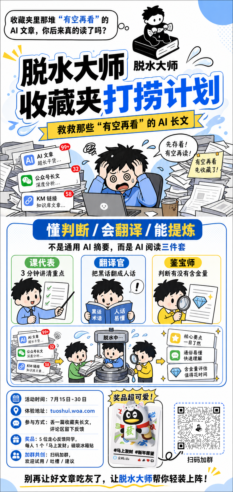
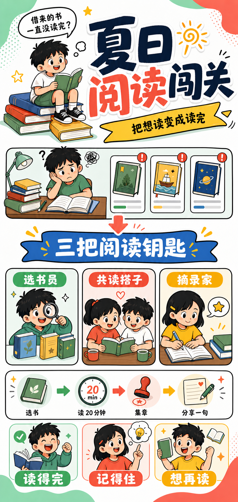
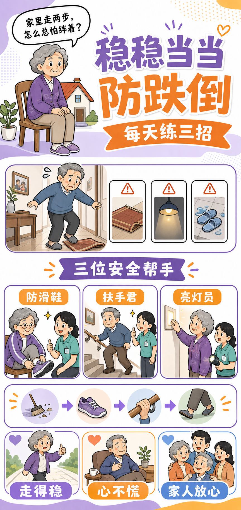
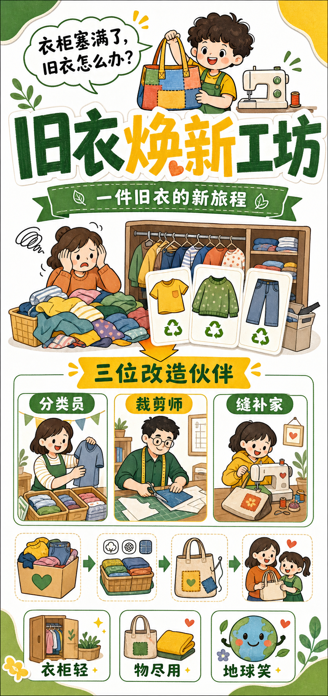

# 手绘卡通三件套式活动长图



## 核心要点

- **用一问一答拉住开场注意力**：顶部气泡先抛出“收藏了却没读”的日常痛点，再用超大标题和横幅给出活动承诺。
- **纵向分段承接阅读节奏**：从困扰现场、三项核心能力到操作流程与参与信息，自上而下形成完整的营销叙事。
- **把功能变成角色化的三件套**：课代表、翻译官、鉴定师各占一张颜色明确的卡片，抽象能力因此更容易辨认和记忆。
- **白底粗描边保证高信息密度可读**：黑色手绘轮廓、蓝黄主色和圆角容器把标题、插画、图标、徽章稳定地分开。
- **用流程和结果完成行动闭环**：输入堆积的信息经由“脱水”装置处理，输出重点、翻译与价值判断，最后再用活动时间和入口收束。

## Prompt

```plain text
生成一张 9:19 竖向中文活动长图，主题是帮助职场人处理收藏夹中“有空再看”的长文章。整张图是白底、粗黑描边的手绘卡通信息海报，信息密度高但阅读顺序清晰。

主题：
- 脱水大师收藏夹打捞计划
- 核心承诺：救救那些“有空再看”的 AI 长文

风格：
- 明亮的日系手绘条漫与活动海报结合。
- 白色背景，黑色粗描边，浅蓝色波点、飞溅线条和圆角气泡做装饰。
- 主色是宝蓝、黑色、白色和亮黄色，红色只用于消息数量与关键词提醒。
- 所有长文字放入独立的卡片、横幅或对话框中；中文标题要清晰有力。

画面结构：
- 顶部用气泡提问“收藏夹里那些‘有空再看’的 AI 文章，你后来真的读了吗？”，旁边是坐在书本上的黑发小人图标。
- 顶部中间用超大黑蓝标题“脱水大师 收藏夹打捞计划”，下方放黄色横幅“救救那些‘有空再看’的 AI 长文”。
- 标题下方画一位黑发、蓝色上衣的年轻职场人抱头坐在电脑前，四周堆满文件；左侧三个消息卡代表 AI 文章、公众号长文、知识库链接，并显示 99+、32、58 等红色数量角标。
- 中部用醒目的蓝色标题条说明“懂判断 / 会翻译 / 能提炼”，并用三个并列圆角卡展示“课代表”“翻译官”“鉴定师”：一位拿清单、一位拿书、一位拿放大镜与钻石文档。
- 下部画一个“脱水中……”装置，把堆叠文章输入后经由箭头变成三张结果卡：核心要点、通俗易懂、含金量评估。
- 最下方是活动信息卡、奖品插画和不可扫码的二维码占位图，页脚用一句鼓励性口号收束。

文字内容，保持清晰可读：
- 主标题：脱水大师 收藏夹打捞计划
- 横幅：救救那些“有空再看”的 AI 长文
- 能力标题：懂判断 / 会翻译 / 能提炼
- 三个能力卡：课代表｜3 分钟讲清重点；翻译官｜把黑话翻成人话；鉴定师｜判断有没有含金量
- 流程结果：核心要点一目了然；通俗易懂快速理解；含金量评估值得花时间

约束：
- 竖向阅读路径从痛点、能力三件套、处理流程到活动入口必须清楚。
- 同一黑发职场角色在不同区块保持统一画风和比例。
- 标题、横幅、三张能力卡和底部结果卡之间不得互相遮挡。
- 二维码只能是装饰性不可扫码占位，不出现真实品牌、真实网址或水印。

严格禁止：
- 禁止写实照片、3D 渲染、深色背景和通用企业图库插画风。
- 禁止文字糊成小段、卡片溢出、阅读顺序混乱或出现大面积空白。
- 禁止人物手指、肢体和五官失真，禁止三张能力卡中的角色互相复制错位。
```

## 类似图片：

### 夏日阅读闯关



#### 提示词

```plain text
Use case: ads-marketing
Asset type: a polished Chinese vertical long-form activity poster
Input image role: reference only for the neutral visual grammar—very tall vertical poster, bold title hierarchy, comic problem-to-solution storytelling, three capability cards, a final action strip. Do not reuse its topic, brand, characters, copy, logo, QR code, or specific layout drawings.
Primary request: Create an original 9:19 vertical Chinese poster for a public library's summer reading challenge called “夏日阅读闯关”.
Scene/backdrop: bright clean white poster with pale mint and coral corner shapes, subtle halftone dots.
Style/medium: cheerful hand-drawn cartoon infographic, thick black outlines, simple flat colors, clear rounded speech bubbles, kid-friendly but polished public-service campaign design.
Composition/framing:
- Top 28%: a short speech bubble about borrowed books sitting unread; a small black-haired school-age reader perched on a stack of books; an oversized energetic headline “夏日阅读闯关” with dark navy and coral emphasis, plus a yellow ribbon reading “把想读变成读完”.
- Middle 32%: a puzzled child at a desk surrounded by unfinished books, with three simple notification-like book cards; a narrative arrow leads to a large blue banner “三把阅读钥匙”.
- Next 24%: exactly three evenly aligned rounded feature cards with simple expressive cartoon children: “选书员” (choose a right-sized book), “共读搭子” (read together), “摘录家” (save one good sentence). Use short labels only.
- Lower 16%: a clear left-to-right mini flow: choose book → read 20 minutes → collect a stamp → share one line, ending in three result cards “读得完 / 记得住 / 想再读”.
Color palette: mint green, coral red, sunny yellow, sky blue, white, black outline; intentionally different from the blue-dominant reference.
Text (verbatim, only these short labels): “夏日阅读闯关”, “把想读变成读完”, “三把阅读钥匙”, “选书员”, “共读搭子”, “摘录家”, “读得完”, “记得住”, “想再读”.
Constraints: readable Chinese headings in separate containers; clear top-to-bottom reading order; original public-library theme; consistent child character anatomy; no crowded tiny paragraphs; no real brands, URLs, QR codes, watermarks, product UI, or copied source content.
Avoid: photorealism, 3D rendering, dark background, generic corporate vector art, messy text, distorted hands, repeated characters, and copied proprietary content.
```

### 稳稳当当防跌倒



#### 提示词

```plain text
Use case: infographic-diagram
Asset type: a polished Chinese vertical public-service campaign poster
Input image role: reference only for neutral visual grammar—tall top-to-bottom comic infographic with strong headline, a problem scene, exactly three solution cards, and a concluding action flow. Do not reuse its topic, product, branded elements, characters, wording, or specific artwork.
Primary request: Create an original 9:19 vertical poster for a neighborhood health center called “稳稳当当防跌倒”, teaching older residents a simple fall-prevention routine.
Scene/backdrop: white clean poster with pale lavender and warm orange accents, light blue halftone dots.
Style/medium: friendly hand-drawn cartoon health infographic, confident black outlines, rounded panels, simple flat color, highly legible Chinese headings, warm and respectful—not childish.
Composition/framing:
- Top 28%: a speech bubble “家里走两步，怎么总怕绊着？”; an elderly grandmother in a purple cardigan sits calmly on a chair beside a small house icon; a huge main headline “稳稳当当 防跌倒”; one orange ribbon “每天练三招”.
- Middle 30%: a gentle worried scene of an older resident navigating a cluttered hallway with small hazard cards showing a loose rug, dim light, and slippery slippers; a bold purple connector banner “三位安全帮手”.
- Next 26%: exactly three aligned rounded cards, each with an expressive respectful older cartoon character and a caregiver: “防滑鞋” (wear stable shoes), “扶手君” (hold rails), “亮灯员” (keep pathways lit).
- Lower 16%: an easy visual routine with arrows: check floor → wear shoes → hold rail → take steady steps, ending in three result cards “走得稳 / 心不慌 / 家人放心”.
Color palette: lavender purple, warm orange, soft turquoise, cream, black outline; intentionally distinct from both the reference and a library poster.
Text (verbatim, only these short labels): “稳稳当当 防跌倒”, “每天练三招”, “三位安全帮手”, “防滑鞋”, “扶手君”, “亮灯员”, “走得稳”, “心不慌”, “家人放心”.
Constraints: original community-health setting, strictly clear top-to-bottom reading sequence, concise labels in their own containers, consistent anatomy and hands, no tiny paragraphs; no real organizations, URLs, QR codes, product logos, or copied content.
Avoid: photorealism, 3D render, dark background, sterile hospital photo style, dense unreadable microtext, distorted hands, frightening injuries, or source-topic references.
```

### 旧衣焕新工坊



#### 提示词

```plain text
Use case: ads-marketing
Asset type: a polished Chinese vertical community environmental-workshop poster
Input image role: image-01 is a visual reference only for neutral composition principles: a very tall, top-to-bottom comic infographic with one oversized headline, an initial pain point, three solution cards, and a simple outcome flow. Do not reproduce its subject matter, specific organization, characters, wording, logos, QR code, or any recognizable artwork.
Primary request: Create an original 9:19 long vertical poster for a neighborhood “旧衣焕新工坊”, inviting families to turn unused clothing into useful new items.
Scene/backdrop: clean white background, leaf-green and lemon-yellow paper-cut corner shapes, recycled-paper texture only in small accents.
Style/medium: lively hand-drawn cartoon infographic with thick charcoal outlines, rounded speech bubbles, flat colors, clear stacked Chinese typography, warm community workshop atmosphere.
Composition/framing:
- Top 26%: a speech bubble “衣柜塞满了，旧衣怎么办？”; a cheerful curly-haired child holding a colorful fabric tote, beside a small sewing-machine icon; a huge main headline “旧衣焕新工坊” in forest green and sunny yellow; a green ribbon “一件旧衣的新旅程”.
- Middle 31%: a playful cluttered closet scene with a parent looking overwhelmed, surrounded by three garment cards (T-shirt, sweater, jeans) marked with simple recycle icons; an arrow leads to a large yellow connector banner “三位改造伙伴”.
- Next 27%: exactly three equal rounded cards showing diverse family workshop characters: “分类员” (sort fabrics), “裁剪师” (cut patterns safely), “缝补家” (stitch a new item). Keep labels short and clearly readable.
- Bottom 16%: a left-to-right visual flow: bring old clothes → sort by material → make a tote or patch → take home and use, ending in three outcome cards “衣柜轻 / 物尽用 / 地球笑”.
Color palette: forest green, lemon yellow, terracotta orange, warm cream, charcoal outline; deliberately different from the source and two other derivatives.
Text (verbatim, only these short labels): “旧衣焕新工坊”, “一件旧衣的新旅程”, “三位改造伙伴”, “分类员”, “裁剪师”, “缝补家”, “衣柜轻”, “物尽用”, “地球笑”.
Constraints: unmistakably different environmental recycling theme; balanced tall-poster hierarchy; text in separate container shapes; consistent friendly family character anatomy; no dense paragraphs; no real brands, URLs, QR codes, watermarks, product UI, or copyrighted source content.
Avoid: photorealism, 3D render, dark background, overly technical recycling diagram, messy microtext, distorted hands or scissors, and any copied source theme or branding.
```
