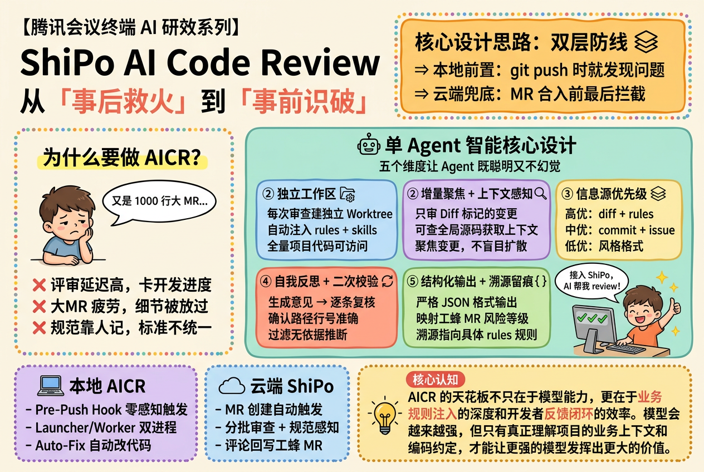
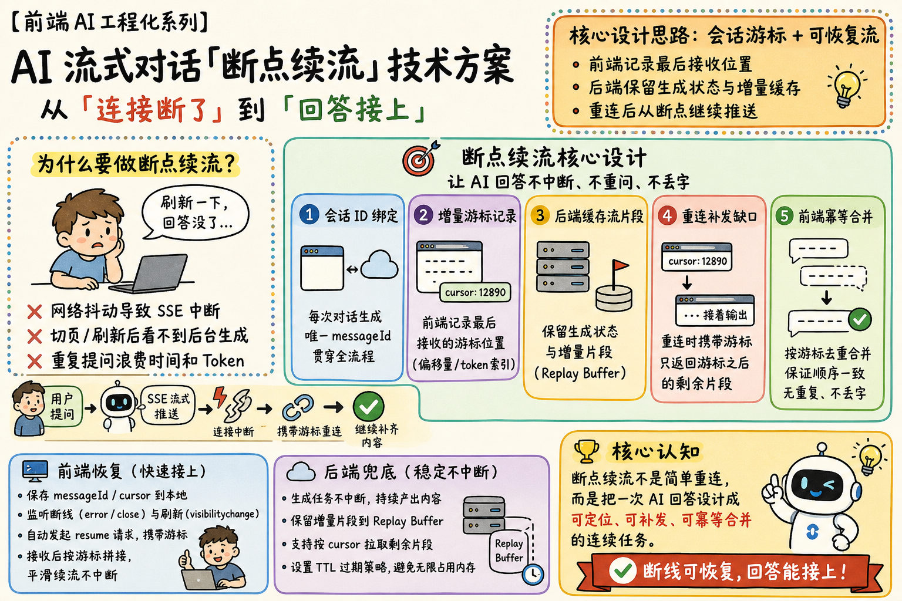
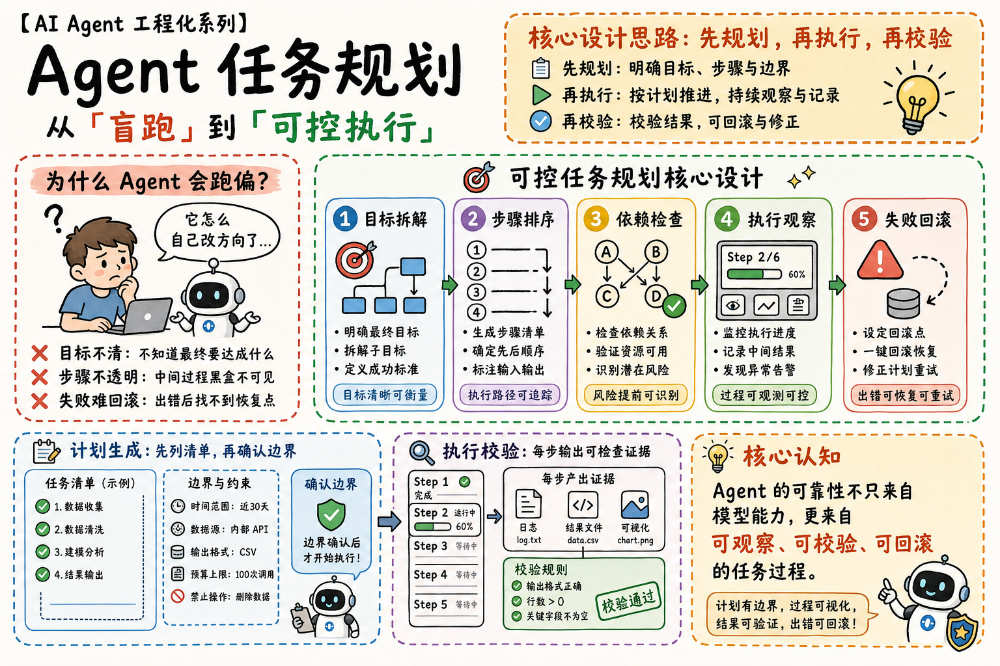
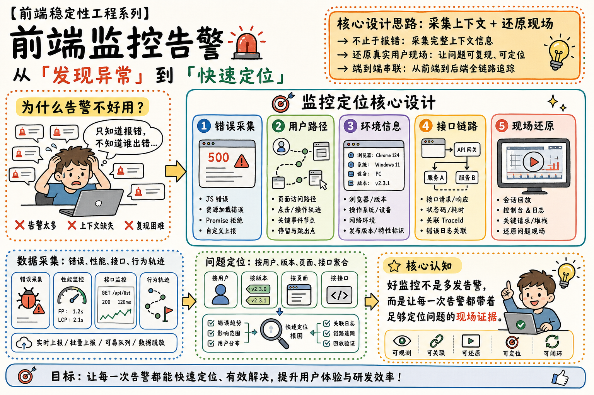

# 手绘技术方案信息图


## 核心要点
- **用一句话先定义转变**：从“事后救火”到“事前识破”，把方案价值说清楚。
- **先讲痛点再讲设计**：左侧放问题，右侧放核心设计，读者能自然理解为什么需要这个方案。
- **复杂 Agent 拆成维度卡片**：把工作区、上下文、信息源、自检、结构化输出拆成 5 个模块，比长段架构说明更容易读。
- **本地 + 云端做双层防线**：用“前置发现 + 合入前兜底”表达系统完整性，适合讲工程治理方案。
- **最后补核心认知**：用一句总结把技术方案提升到方法论层面，强化记忆点。
## Prompt
```plain text
生成一张横向手绘技术信息图，比例 3:2，白色或暖米色背景，黑色马克笔线条，彩色虚线边框，中文排版清晰可读。

主题：
- ShiPo AI Code Review 从事后救火到事前识破

风格：
- 手绘技术方案信息图。
- 白板插画。
- 轻松但专业的工程图解。
- 粗黑马克笔线条。
- 柔和彩色模块。
- 简单卡通人物。
- 布局干净。
- 中文文字清晰。
- 适合内部技术分享。

画面结构：
- 左上：系列名称和大号标题。
- 右上：橙色高亮说明框，解释核心设计思路。
- 左侧栏：痛点面板，标题是“为什么要做 AICR？”，配一个疲惫开发者和三个红叉痛点。
- 中右：大主面板，标题是“单 Agent 智能核心设计”，里面放五个编号彩色卡片。
- 底部一排：两个小对比面板，分别讲本地 AICR 和云端 ShiPo，再加一个较大的核心认知卡片。
- 主要区域使用彩色虚线边框。

视觉元素：
- 疲惫开发者。
- 对话气泡。
- 机器人图标。
- 笔记本电脑。
- 云朵图标。
- 灯泡图标。
- 开心开发者。
- 检查清单显示器。
- 层叠图标。
- 放大镜。
- 文件夹 / 工作区图标。
- 刷新 / 自检图标。

文字内容，保持可读：
- 系列名：【腾讯会议终端 AI 研效系列】
- 主标题：ShiPo AI Code Review
- 副标题：从「事后救火」到「事前识破」
- 顶部说明框：核心设计思路：双层防线
- 说明框要点：本地前置：git push 时就发现问题；云端兜底：MR 合入前最后拦截
- 左侧标题：为什么要做 AICR？
- 气泡：又是 1000 行大 MR...
- 痛点：评审延迟高，卡开发进度；大 MR 疲劳，细节被放过；规范靠人记，标准不统一
- 主面板标题：单 Agent 智能核心设计
- 主面板副标题：五个维度让 Agent 既聪明又不幻觉
- 卡片：独立工作区；增量聚焦 + 上下文感知；信息源优先级；自我反思 + 二次校验；结构化输出 + 溯源留痕
- 底部左侧：本地 AICR：Pre-Push Hook 零感知触发；Launcher/Worker 双进程；Auto-Fix 自动改代码
- 底部中间：云端 ShiPo：MR 创建自动触发；分批审查 + 规范感知；评论回写工蜂 MR
- 底部右侧标题：核心认知
- 底部右侧文字：AICR 的天花板不只在于模型能力，更在于业务规则注入的深度和开发者反馈闭环的效率。

约束：
- 画面要像完成度高的技术分享总结图，不要像密集 PPT。
- 所有文字都要放进独立可读的区块里。
- 用箭头和颜色分组引导阅读顺序。
- 整体语气友好。
- 内容表达要实用。
- 画面要有工程感。

严格禁止：
- 禁止写实照片、3D 渲染、通用企业图库插画等非手绘信息图风格。
- 禁止深色背景、复杂纹理背景或高饱和大色块破坏白板感。
- 禁止细小难读段落、密集表格、代码截图式内容。
- 禁止箭头方向互相矛盾、模块关系断裂、流程顺序画反。
- 禁止同一模块重复出现多个版本，或模块名称与箭头关系不一致。
- 禁止文字压住人物、图标、箭头、卡片边框或被裁切。
```
## 基于本图衍生的其他图片
### 前端 AI 断点续连流式推送方案

#### 核心要点
- **用“连接断了 → 回答接上”定义价值**：先把用户感知问题讲清楚，再进入技术方案。
- **断点续流不是简单重连**：重点是会话可定位、片段可补发、前端可幂等合并。
- **前后端要分工表达**：前端负责记录游标和自动恢复，后端负责保留生成状态和 Replay Buffer。
- **流程图要强调断点链路**：用户提问、SSE 推送、连接中断、携带游标重连、补齐内容，是这张图的主阅读路径。
- **把技术细节做成模块卡片**：会话 ID、游标、缓存、补发、合并分别成块，读者更容易记住。
## 类似图片：
### AI Agent 任务规划从盲跑到可控

#### 提示词
```plain text
生成一张横向手绘技术信息图，比例 3:2，白色或暖米色背景，黑色马克笔线条，彩色虚线边框，中文排版清晰可读。

主题：
- AI Agent 任务规划从盲跑到可控

风格：
- 手绘技术方案信息图。
- 白板插画。
- 轻松但专业的工程图解。
- 粗黑马克笔线条。
- 柔和彩色模块。

画面结构：
- 左侧放“为什么 Agent 会跑偏？”痛点面板。
- 中右放“可控任务规划核心设计”主面板。
- 底部放计划生成、执行校验和核心认知卡片。

文字内容：
- 主标题：Agent 任务规划
- 副标题：从「盲跑」到「可控执行」
- 卡片：目标拆解；步骤排序；依赖检查；执行观察；失败回滚
- 核心认知：Agent 的可靠性来自可观察、可校验、可回滚的任务过程。

严格禁止：
- 禁止写实照片、3D 渲染、通用企业图库插画等非手绘信息图风格。
- 禁止深色背景、复杂纹理背景或高饱和大色块破坏白板感。
- 禁止细小难读段落、密集表格、代码截图式内容。
- 禁止箭头方向互相矛盾、模块关系断裂、流程顺序画反。
- 禁止文字压住人物、图标、箭头或卡片边框。
```
### 前端监控告警从发现到定位

#### 提示词
```plain text
生成一张横向手绘技术信息图，比例 3:2，白色或暖米色背景，黑色马克笔线条，彩色虚线边框，中文排版清晰可读。

主题：
- 前端监控告警从发现到定位

风格：
- 手绘技术方案信息图。
- 白板插画。
- 轻松但专业的工程图解。
- 粗黑马克笔线条。
- 柔和彩色模块。

画面结构：
- 左侧放“为什么告警不好用？”痛点面板。
- 中右放“监控定位核心设计”主面板。
- 底部放数据采集、问题定位和核心认知卡片。

文字内容：
- 主标题：前端监控告警
- 副标题：从「发现异常」到「快速定位」
- 卡片：错误采集；用户路径；环境信息；接口链路；现场还原
- 核心认知：好监控不是多发告警，而是让每一次告警都带着足够定位问题的现场证据。

严格禁止：
- 禁止写实照片、3D 渲染、通用企业图库插画等非手绘信息图风格。
- 禁止深色背景、复杂纹理背景或高饱和大色块破坏白板感。
- 禁止细小难读段落、密集表格、代码截图式内容。
- 禁止箭头方向互相矛盾、模块关系断裂、流程顺序画反。
- 禁止文字压住人物、图标、箭头或卡片边框。
```

