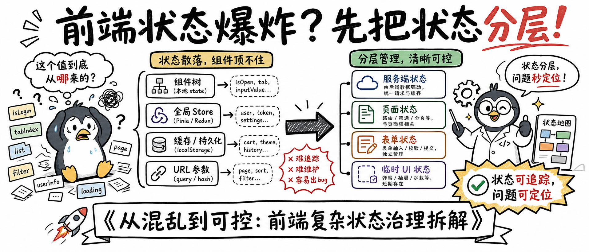
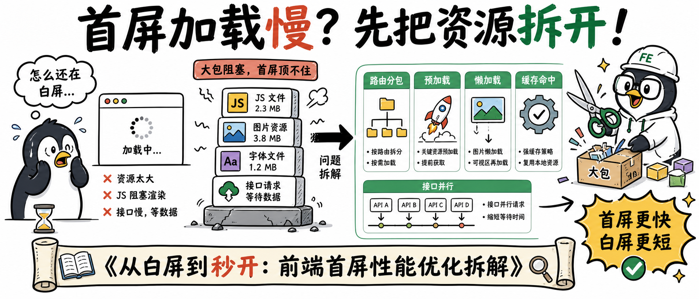

# 手绘技术解法长图


## 核心要点
- **技术问题要画成因果链**：从“卡顿”到“主线程顶不住”再到“Worker 分担”，让读者顺着箭头理解。
- **手绘风适合解释复杂方案**：比写实图更能容纳代码、表格、流程和夸张表情。
- **每屏只讲一个核心矛盾**：这里的矛盾是“大模型流式 Markdown 渲染越更新越卡”。
- **结果要用强数字收尾**：例如“渲染开销压了 25\~57 倍”，比泛泛写“性能提升”更有记忆点。
- **标题要像文章封面**：直接抛问题 + 给解法，适合技术文章头图。
## Prompt
```plain text
生成一张横向手绘技术解释封面图，比例 21:9，白色背景，黑色马克笔线条为主，搭配少量强调色。

主题：
- AI 长文渲染卡顿的硬核解法

风格：
- 手绘白板插画。
- 技术博客封面。
- 干净的涂鸦风。
- 粗黑描边。
- 简单扁平配色。
- 表情夸张的卡通角色。
- 中文文字清晰可读。
- 有工程技术解释感。

画面结构：
- 顶部：横跨画面的大号手写中文标题。
- 左侧：一只焦虑的卡通企鹅，旁边是显示卡顿加载条的显示器。
- 中左：堆叠的 Markdown 文档、代码窗口、表格和 UI 区块，表现渲染压力很大。
- 中部：用箭头表示问题从“主线程压力”流向“优化架构”。
- 右侧：一只自信的企鹅工程师，披着小披风使用笔记本电脑，旁边用齿轮表现 Worker 计算和补丁更新。
- 底部：一条长卷轴或横幅，放文章标题。

视觉叙事：
- 左侧表现痛点：大模型流式输出叠加 Markdown 渲染，导致频繁更新和界面卡顿。
- 右侧表现解法：把昂贵的 diff / patch 计算移到 Worker。
- 右侧继续表现解法：计算最小补丁，只局部挂载 React 组件。
- 最后用醒目的结果徽章强调：渲染开销降低 25-57 倍。

文字内容，保持可读：
- 主标题：AI长文渲染卡顿？Dola团队的硬核解法！
- 思考气泡：大模型流式 + Markdown 渲染 = 越更新越卡
- 显示器：渲染中...卡了！
- 中部标签：主线程顶不住
- 右侧标签：Worker算最小patch，贴最小补丁，局部挂载React
- 结果徽章：渲染开销压了25~57倍
- 底部标题：《弃用第三方库后：我是如何用 AI 低成本搞定高性能 Markdown 增量更新的》

约束：
- 布局要干净。
- 横向阅读要顺畅。
- 用箭头清楚展示原因和解决方案的流向。
- 标签要短。
- 字号要大。
- 留白要足。
- 整体像一张完成度高的技术文章头图，不要像普通 PPT。

严格禁止：
- 禁止写实照片、3D 渲染、企业图库插画等非手绘白板风格。
- 禁止深色背景、复杂纹理背景或高饱和大色块破坏白板感。
- 禁止大段说明文字、细小代码块、密集表格导致内容不可读。
- 禁止箭头方向互相矛盾、因果链断裂或流程顺序画反。
- 禁止文字压住人物、箭头、图标、显示器或底部标题条。
- 禁止把企鹅角色画成真实动物照片、其他动物或无关吉祥物。
```
## 类似图片：
### 前端状态爆炸的硬核拆解

#### 提示词
```plain text
生成一张横向手绘技术解释封面图，比例 21:9，白色背景，黑色马克笔线条为主，搭配少量强调色。

主题：
- 前端状态爆炸的硬核拆解

风格：
- 手绘白板插画。
- 技术博客封面。
- 干净涂鸦风。
- 粗黑描边。
- 简单扁平配色。
- 中文文字清晰可读。

画面结构：
- 左侧放焦虑企鹅，被状态变量包围。
- 中间放组件树、props、store、缓存和 URL 参数。
- 右侧放自信企鹅工程师整理状态地图。
- 用箭头表示“状态分散”到“状态分层”。

文字内容：
- 主标题：前端状态爆炸？先把状态分层！
- 气泡：这个值到底从哪来的？
- 标签：服务端状态，页面状态，表单状态，临时状态
- 结果徽章：状态可追踪，问题可定位

严格禁止：
- 禁止写实照片、3D 渲染、企业图库插画等非手绘白板风格。
- 禁止深色背景、复杂纹理背景或高饱和大色块破坏白板感。
- 禁止大段说明文字、细小代码块、密集表格导致内容不可读。
- 禁止箭头方向互相矛盾、问题到解法的因果链断裂或流程顺序画反。
- 禁止文字压住人物、箭头、图标或标题条。
```
### 首屏加载慢的硬核解法

#### 提示词
```plain text
生成一张横向手绘技术解释封面图，比例 21:9，白色背景，黑色马克笔线条为主，搭配少量强调色。

主题：
- 首屏加载慢的硬核解法

风格：
- 手绘白板插画。
- 技术博客封面。
- 干净涂鸦风。
- 粗黑描边。
- 简单扁平配色。
- 中文文字清晰可读。

画面结构：
- 左侧放焦虑企鹅看着白屏网页。
- 中间放大包 JS、图片、字体和接口请求。
- 右侧放企鹅工程师拆分 bundle，旁边有预加载火箭和缓存齿轮。
- 用箭头表示“大包阻塞”到“分层加载”。

文字内容：
- 主标题：首屏加载慢？先把资源拆开！
- 气泡：怎么还在白屏...
- 标签：路由分包，预加载，懒加载，缓存命中
- 结果徽章：首屏更快，白屏更短

严格禁止：
- 禁止写实照片、3D 渲染、企业图库插画等非手绘白板风格。
- 禁止深色背景、复杂纹理背景或高饱和大色块破坏白板感。
- 禁止大段说明文字、细小代码块、密集表格导致内容不可读。
- 禁止箭头方向互相矛盾、问题到解法的因果链断裂或流程顺序画反。
- 禁止文字压住人物、箭头、图标或标题条。
```
