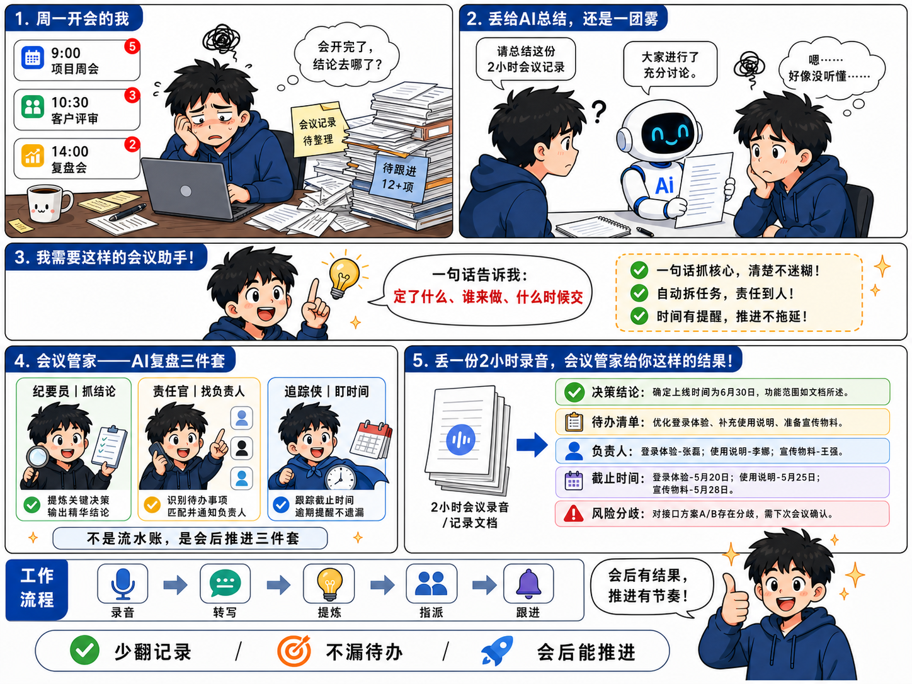
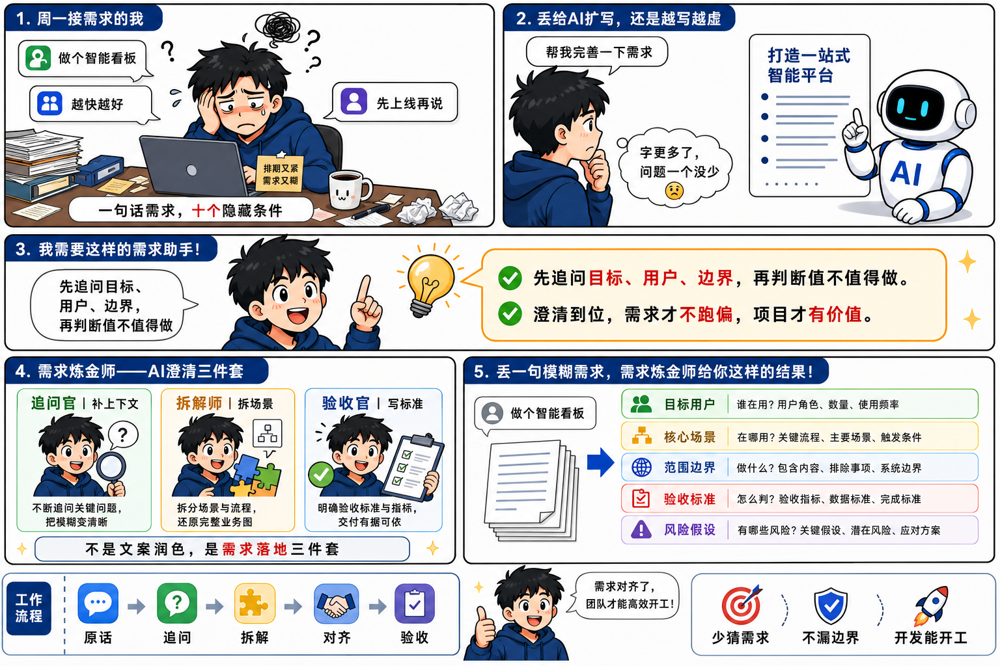
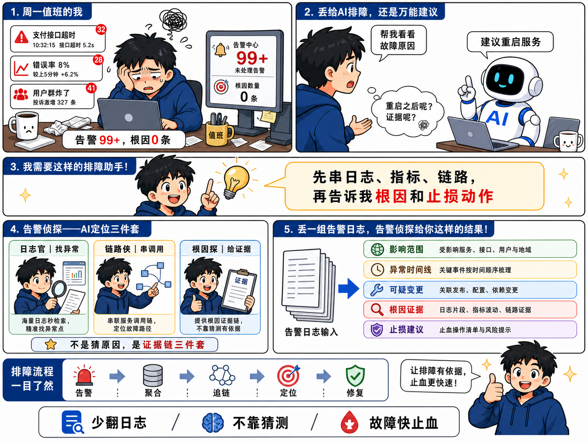

# 痛点转折分镜漫画式产品功能介绍图


## 核心要点
- **先用真实痛点建立代入感**：从周一工位、消息轰炸和待阅长文开场，让用户先认出自己的处境，再接受产品方案。
- **用“错误答案”制造转折**：先展示普通 AI 的敷衍总结，再提出用户真正需要的判断标准，产品价值会更具体。
- **固定角色串起整张图**：同一位职场主角在焦虑、疑惑、顿悟和满意之间变化，能把多个信息区块连成完整故事。
- **把抽象能力人格化**：用“课代表、翻译官、鉴定师”三种角色承载提炼、翻译和判断，比直接罗列功能更容易记住。
- **结果和流程都要可视化**：五条彩色结果卡负责证明产出，底部操作流程与利益点负责完成从功能到日常使用的闭环。

## Prompt
```plain text
生成一张 4:3 横向中文产品功能介绍图，用分镜漫画讲清楚一款 AI 阅读助手如何把万字长文变成可执行结论。

主题：
- 脱水大师——会判断、会翻译、会提炼的 AI 阅读助手

风格：
- 日系动漫与职场条漫结合的信息图。
- 白色背景，粗黑描边，清晰分镜边框。
- 深蓝色编号标题条。
- 黄色灯泡和橙色描边作为顿悟提示。
- 红色用于强调关键词。
- 绿色、黄色、蓝色、红色、浅紫色结果卡片。
- 画面轻松、幽默、易读，但要有完整的产品介绍质感。

画面结构：
- 顶部左侧是第 1 格“周一工位的我”，表现职场人被长文链接、群消息、热榜文章和待办包围。
- 顶部右侧是第 2 格“丢给 AI 总结，还是噎得慌”，表现机器人给出字少但空洞的压缩总结。
- 中间横条是第 3 格“我需要这样的阅读助手”，主角从焦虑转为顿悟，用一句话说明理想结果。
- 中下部左侧是第 4 格“脱水大师——AI 阅读三件套”，用三个角色卡片讲产品能力。
- 中下部右侧是第 5 格“丢一篇 1W 字文章，脱水大师给你这样的结果”，用文档输入、箭头和五条彩色结果卡展示产出。
- 底部放日常操作流程、产品名称和三个利益点。

角色：
- 黑色短发、蓝色连帽衫的年轻职场人，表情从疲惫、疑惑、顿悟到满意。
- 白色圆润 AI 机器人，黑色屏幕脸和蓝色发光表情。
- 三个能力角色都使用同一主角的不同装扮，保证风格统一。

文字内容，保持清晰可读：
- 第 1 格标题：1. 周一工位的我
- 消息示例：公众号推了篇 1.2 万字《大模型全解析》；群里 @全员《Agent 避坑指南》配文“建议学习”；老板甩来 KM 链接：“看一下”
- 第 1 格底部：一天下来收藏夹 +7，脑子进度条还是 0%
- 第 2 格标题：2. 丢给 AI 总结，还是噎得慌
- 用户气泡：帮我总结一下这篇 1W 字的文章！
- 心声：字是少了，每句都干巴巴的，照样噎得慌
- 第 3 格标题：3. 我需要这样的阅读助手！
- 需求要点：这篇就看第 2、3 节，第 1 节废话，结尾吹牛别信；核心就一句话，你手头那事儿直接抄第 4 步就行
- 第 4 格标题：4. 脱水大师——AI 阅读三件套
- 产品说明：会判断、会翻译、会提炼的 AI 阅读助手
- 能力卡 1：课代表｜3 分钟讲清重点
- 能力卡 2：翻译官｜把黑话翻成人话
- 能力卡 3：鉴定师｜判断是真干货还是换皮重读
- 卡片总结：不是无脑缩句器，是 AI 阅读三件套
- 第 5 格标题：5. 丢一篇 1W 字文章，脱水大师给你这样的结果！
- 结果卡：一句话导读；值不值得读；黑话翻译；避雷 3 处；对你有用的 2.5 条
- 底部流程：看到长文先不点开 → 脱水大师验货 → 值得读再回去精读 → 水货看脱水版就行 → 金句直接存成大脑外挂
- 底部利益点：省时间｜真看懂｜防忽悠｜不焦虑

约束：
- 1 到 5 的阅读顺序必须一眼看懂。
- 每一格只承担一个叙事任务。
- 长文字段放进独立卡片，字号要能阅读。
- 同一主角的发型、服装和画风保持一致。
- 产品能力、结果卡和底部流程之间不能互相遮挡。

严格禁止：
- 禁止写实照片风、3D 渲染风或通用企业图库插画风。
- 禁止深色背景、复杂纹理和大面积高饱和色块。
- 禁止分镜编号跳跃、叙事顺序混乱或上下区块关系不清。
- 禁止把产品能力画成普通功能清单，必须保留角色化的“三件套”。
- 禁止小字糊成一团、文字溢出卡片、人物遮挡结果信息。
- 禁止人物五官、手指和肢体比例错误，禁止同一角色外观漂移。
```

## 类似图片：

### 会议管家——AI 复盘三件套



#### 提示词
```plain text
生成一张 4:3 横向中文产品功能介绍图，用日系职场分镜漫画讲清楚 AI 会议复盘助手的价值。

风格：
- 白色信息图背景，粗黑漫画描边。
- 深蓝色编号标题条。
- 黑发蓝色连帽衫职场主角与白蓝 AI 机器人贯穿全图。
- 黄色灯泡、红色重点词和彩色结果卡片。

画面结构与文字：
- 第 1 格“周一开会的我”：9:00 项目周会、10:30 客户评审、14:00 复盘会；底部写“会开完了，结论去哪了？”
- 第 2 格“丢给 AI 总结，还是一团雾”：用户说“请总结这份 2 小时会议记录”，机器人回答“大家进行了充分讨论”。
- 第 3 格“我需要这样的会议助手！”：一句话告诉我“定了什么、谁来做、什么时候交”。
- 第 4 格“会议管家——AI 复盘三件套”：纪要员｜抓结论；责任官｜找负责人；追踪侠｜盯时间；总结“不是流水账，是会后推进三件套”。
- 第 5 格“丢一份 2 小时录音，会议管家给你这样的结果！”：决策结论、待办清单、负责人、截止时间、风险分歧。
- 底部流程：录音 → 转写 → 提炼 → 指派 → 跟进。
- 底部利益点：少翻记录｜不漏待办｜会后能推进。

严格禁止：
- 禁止写实照片、3D 渲染、深色背景和通用企业图库风。
- 禁止分镜顺序混乱、卡片互相遮挡或出现密集难读小字。
- 禁止真实品牌 Logo、二维码和水印。
```

### 需求炼金师——AI 澄清三件套



#### 提示词
```plain text
生成一张横向中文产品功能介绍图，用日系职场分镜漫画讲清楚 AI 需求澄清助手的价值，画面比例接近 4:3 或 3:2。

风格：
- 白色信息图背景，粗黑漫画描边。
- 深蓝色编号标题条。
- 黑发蓝色连帽衫职场主角与白蓝 AI 机器人贯穿全图。
- 黄色灯泡、红色重点词和彩色结果卡片。

画面结构与文字：
- 第 1 格“周一接需求的我”：消息气泡“做个智能看板”“越快越好”“先上线再说”；底部写“一句话需求，十个隐藏条件”。
- 第 2 格“丢给 AI 扩写，还是越写越虚”：用户说“帮我完善一下需求”，机器人回答“打造一站式智能平台”，主角心声“字更多了，问题一个没少”。
- 第 3 格“我需要这样的需求助手！”：先追问目标、用户、边界，再判断值不值得做。
- 第 4 格“需求炼金师——AI 澄清三件套”：追问官｜补上下文；拆解师｜拆场景；验收官｜写标准；总结“不是文案润色，是需求落地三件套”。
- 第 5 格“丢一句模糊需求，需求炼金师给你这样的结果！”：目标用户、核心场景、范围边界、验收标准、风险假设。
- 底部流程：原话 → 追问 → 拆解 → 对齐 → 验收。
- 底部利益点：少猜需求｜不漏边界｜开发能开工。

严格禁止：
- 禁止写实照片、3D 渲染、深色背景和通用企业图库风。
- 禁止分镜顺序混乱、卡片互相遮挡或出现密集难读小字。
- 禁止真实品牌 Logo、二维码和水印。
```

### 告警侦探——AI 定位三件套



#### 提示词
```plain text
生成一张 4:3 横向中文产品功能介绍图，用日系工程师分镜漫画讲清楚 AI 故障定位助手的价值。

风格：
- 白色信息图背景，粗黑漫画描边。
- 深蓝色编号标题条。
- 黑发蓝色连帽衫工程师与白蓝 AI 机器人贯穿全图。
- 黄色灯泡、红色重点词和彩色结果卡片。

画面结构与文字：
- 第 1 格“周一值班的我”：告警卡“支付接口超时”“错误率 8%”“用户群炸了”；底部写“告警 99+，根因 0 条”。
- 第 2 格“丢给 AI 排障，还是万能建议”：用户说“帮我看看故障原因”，机器人回答“建议重启服务”，主角心声“重启之后呢？证据呢？”
- 第 3 格“我需要这样的排障助手！”：先串日志、指标、链路，再告诉我根因和止损动作。
- 第 4 格“告警侦探——AI 定位三件套”：日志官｜找异常；链路侠｜串调用；根因探｜给证据；总结“不是猜原因，是证据链三件套”。
- 第 5 格“丢一组告警日志，告警侦探给你这样的结果！”：影响范围、异常时间线、可疑变更、根因证据、止损建议。
- 底部流程：告警 → 聚合 → 追链 → 定位 → 修复。
- 底部利益点：少翻日志｜不靠猜测｜故障快止血。

严格禁止：
- 禁止写实照片、3D 渲染、深色背景和通用企业图库风。
- 禁止分镜顺序混乱、卡片互相遮挡或出现密集难读小字。
- 禁止真实品牌 Logo、二维码和水印。
```
