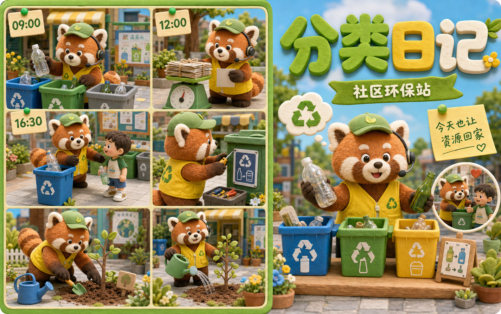
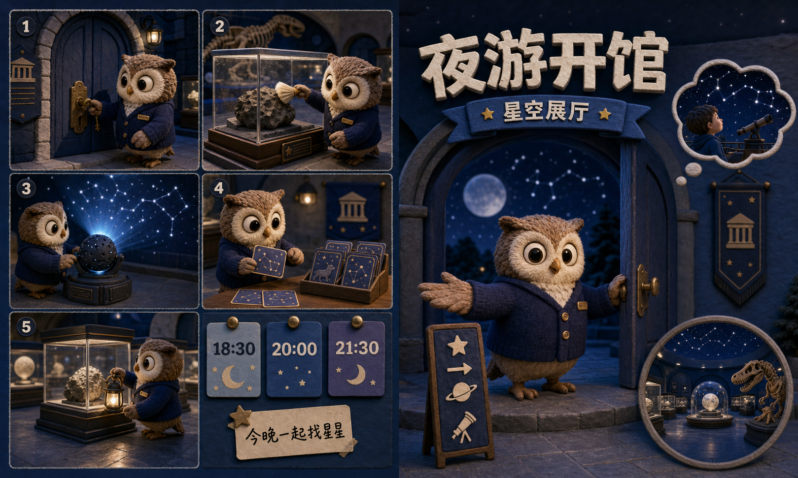
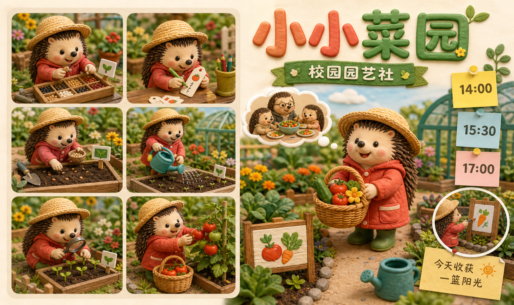

# 黏土玩偶日常分镜式叙事海报


## 核心要点
- **左侧分镜、右侧封面主角**：约六成画幅用 2×3 的时间切片交代过程，右侧用单个大场景收束主题与角色记忆点。
- **同一角色串联叙事**：角色在每格里更换动作和道具，让“从开始到完成”的日常节奏一眼可读。
- **便签承担时间与行动信息**：把时刻、清单、短口号分散放入别针便签和横幅，避免挤占主标题的视觉权重。
- **黏土微缩材质增强亲和力**：柔软绒感、磨砂泥塑、木质小道具和暖光共同形成可触摸的定格动画质感。
- **文字保持短而分区明确**：标题只承载一个情绪或事件，说明文字收缩为时间、标签和一句话，减少中文生成错漏与遮挡。

## Prompt
```plain text
生成一张约 1.88:1 的横向中文日常叙事海报，主题是“打工人上班 vlog”。

风格：高完成度手工黏土微缩场景，柔软毛绒与聚合物泥塑质感，定格动画风，暖棕、奶油白、雾蓝、珊瑚粉配色，柔和室内暖光，中文立体字清晰可读。

画面结构：左侧约 58% 做成整齐的 2×3 小分镜，展现同一只戴耳机、系粉色蝴蝶结的蓝色企鹅从早到晚的上班片段；右侧约 42% 是大幅主视觉，企鹅坐在餐桌前记录日常。用便签、日历、时间卡、清单、圆形回忆气泡和小图标组成信息层。阅读顺序从左上到左下，再到右侧主场景。

文字只使用短标签并置于独立容器：大标题“打工人上班 vlog”，系列标签“鹅妹上班记”，时间卡“07:00”“08:30”“12:00”“18:30”，便签“记录平凡日常 也记录努力发光的自己”。

约束：每一格都是清晰独立的小场景；角色五官和肢体正确；不放二维码、品牌 Logo、水印或拥挤长段文字；标题与角色不互相遮挡。
```

## 类似图片：

### 社区环保站分类日记



#### 提示词
```plain text
Use case: illustration-story
Asset type: reusable visual-grammar reference for an image knowledge base
Primary request: Create one finished horizontal Chinese narrative poster, aspect ratio about 1.88:1, about a community recycling volunteer’s day. This is NOT an office vlog and must not reuse any character, brand, title, or scene from the reference.
Scene/backdrop: friendly neighborhood recycling station, small public square, recycling bins, potted plants, apartment bulletin board.
Subject: an original cute red-panda volunteer in a lemon-yellow vest, wearing a small green cap and round headset; no penguins, no workplace desk.
Style/medium: high-end handmade clay diorama, soft plush-polymer texture, miniature stop-motion animation aesthetic, warm studio light, crisp large 3D Chinese typography.
Composition/framing: a 2×3 grid of small episodic miniature panels occupying the left 58% (sorting bottles, weighing paper, guiding a child, repairing a bin sign, planting a sapling); on the right 42%, one large hero scene of the red panda at a colorful recycling table. Add pinned-note cards, simple icon labels, one rounded thought bubble, and an inset circular memory bubble. Strong left-to-right reading order and clear margins.
Lighting/mood: sunny, joyful, civic and playful.
Color palette: vivid leaf green, lemon yellow, sky blue, warm cream.
Text (verbatim): Use only these short, clearly separated Chinese labels: “分类日记”; “社区环保站”; “09:00” “12:00” “16:30”; “今天也让资源回家”. Keep text sparse and legible.
Constraints: no office, no computer desk, no workplace Vlog, no penguin, no copied characters, no logos, no QR code, no watermark; every panel must be complete and uncluttered; preserve correct limbs and clean facial features.
```

### 博物馆夜游开馆



#### 提示词
```plain text
Use case: illustration-story
Asset type: reusable visual-grammar reference for an image knowledge base
Primary request: Create one finished horizontal Chinese narrative poster, aspect ratio about 1.88:1, about a museum night-program curator preparing an after-hours astronomy exhibition. This is NOT a workplace vlog and must not reuse any character, brand, title, or scene from the reference.
Scene/backdrop: a small natural-history museum at night, star projector, display cases, constellation map, visitor route signs.
Subject: an original gentle little owl curator wearing a navy cardigan and a tiny brass name badge; no penguins, no headset, no office computer.
Style/medium: high-end handmade clay diorama, miniature stop-motion animation aesthetic, sculpted felt-clay texture, cinematic but friendly light, clear large 3D Chinese typography.
Composition/framing: a 2×3 mosaic of chronological diorama panels on the left 58% (unlocking the gallery, dusting a meteorite case, testing a star projector, arranging child visitor cards, illuminating the exhibit); right 42% has a large hero scene of the owl opening the moon-and-stars exhibit. Include short pinned schedule cards, museum icons, a rounded thought bubble, and a small circular inset scene.
Lighting/mood: magical quiet night, welcoming cultural exploration.
Color palette: deep indigo, moonlit teal, silver, small gold accents.
Text (verbatim): Use only these short separate labels: “夜游开馆”; “星空展厅”; “18:30” “20:00” “21:30”; “今晚一起找星星”. Keep Chinese text sparse and legible.
Constraints: no office, no workplace Vlog, no penguin, no computer desk, no copied characters, no logos, no QR code, no watermark; complete uncluttered mini scenes; correct animal anatomy and no text collisions.
```

### 校园园艺社小小菜园



#### 提示词
```plain text
Use case: illustration-story
Asset type: reusable visual-grammar reference for an image knowledge base
Primary request: Create one finished horizontal Chinese narrative poster, aspect ratio about 1.88:1, about a primary-school garden club planting and harvesting vegetables across one afternoon. This must be a distant cross-domain theme and must not reuse any character, brand, title, or scene from the reference.
Scene/backdrop: colorful school garden beds, greenhouse, seed tray, watering can, harvest basket, hand-painted garden sign.
Subject: an original cheerful hedgehog child gardener in a coral-red raincoat and straw hat; no penguins, no office worker, no headset.
Style/medium: polished handmade clay diorama, miniature stop-motion animation style, tactile polymer-clay and felt textures, softly sunlit, clear large 3D Chinese typography.
Composition/framing: left 58% contains a neat 2×3 set of small chronological clay scenes (choosing seeds, writing a plant tag, sowing, watering, observing sprouts, gathering tomatoes). The right 42% is a single large warm hero scene of the hedgehog holding a harvest basket beside the garden. Add small schedule sticky cards, vegetable icons, a cloud-shaped thought bubble, and one circular inset scene. Strong hierarchy and clear story flow.
Lighting/mood: fresh, lively, educational, summery.
Color palette: coral red, tomato orange, lush green, soft turquoise, cream.
Text (verbatim): Use only these short separate labels: “小小菜园”; “校园园艺社”; “14:00” “15:30” “17:00”; “今天收获一篮阳光”. Keep text sparse and legible.
Constraints: no office, no workplace Vlog, no penguin, no computer desk, no copied character design, no logos, no QR code, no watermark; each mini scene clear and uncluttered, correct anatomy, clean hands and faces, no text overlap.
```
