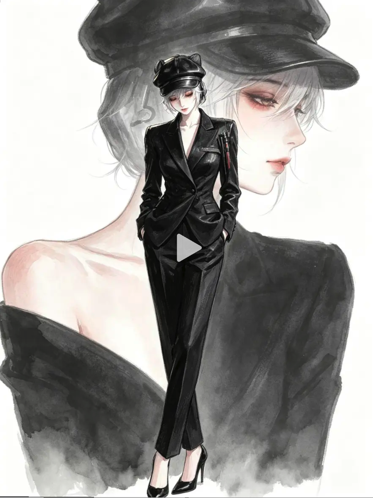
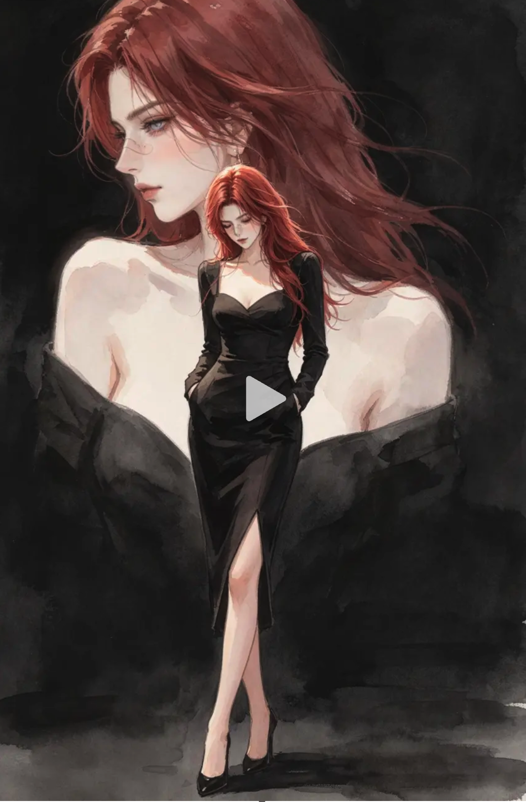

# 水墨前后构图图片生成提示词（v3，沿用 v1 规则）

## 目标

以目标角色素材图为人物身份与外观依据，制作一张“水墨前后”层叠构图的竖版动漫插画。

## 参考图片

### 参考图片一：构图与画风参考

只参考图片一的画面比例、前后景层级、人物大小关系、留白方式、水墨笔触与黑白低饱和色彩；不得复制参考图人物的脸、发型、帽子、服装、配饰或身份。忽略参考图中央的播放按钮等界面元素，成图中不得出现按钮、文字、Logo 或水印。

### 参考图片二：前后景服装与头部朝向参考

参考图片二的前景黑色修身长裙、后景露肩黑色服装，以及前后两个人物头部朝向相反的视觉关系。只参考服装类型、穿着方式和朝向关系，不复制参考图人物的脸、红发或身份。忽略参考图中央的播放按钮等界面元素。

## 固定构图

- 后景使用同一目标角色的巨大头肩或半身肖像，占据画面大部分区域，突出清晰的侧脸或四分之三侧脸。
- 前景在画面中下部放置同一角色的小比例全身像，人物完整露出头顶、双手、双腿与鞋子。
- **前景与后景人物的头部必须朝向相反。** 默认后景巨大肖像转头朝画面左侧，前景全身人物转头朝画面右侧；也可以整体镜像，但两者绝不能同时看向同一侧。两张脸的鼻尖方向、视线方向和头部轮廓都要清楚体现这种反向关系。
- 前后景必须是同一角色、同一种气质，五官、发型、发色与核心身份特征保持一致；两者服装按下方“服装要求”分别执行，不要求完全相同。
- 前景全身像与后景肖像自然重叠，层次清楚；不要生硬拼贴，不要把角色误画成两个不同人物。
- 背景以暖白留白为主，使用黑灰水墨晕染、干湿笔触和少量淡彩过渡，不添加抢眼的复杂场景。

## 服装要求

### 前景全身人物

- 穿参考图片二风格的黑色修身长裙：女性化剪裁、收腰包身轮廓、长袖、低领或心形领口、裙摆开衩，整体简洁优雅。
- 裙长至少到小腿中下部，开衩露出一侧腿部但不过度暴露；搭配简洁的黑色尖头高跟鞋。
- 衣料使用哑光黑色或微弱缎面反光，保留褶皱、腰线与裙摆结构，不得改成西装、西裤、短裙、蓬蓬裙、婚纱或铠甲。

### 后景巨大肖像

- 穿参考图片二风格的宽领露肩黑色上衣或黑裙上身，清晰露出肩颈与锁骨线条，黑色衣料从肩部向画面下方自然铺开并融入水墨背景。
- 服装保持松弛、克制、优雅，不增加制服翻领、领带、帽子、铠甲或复杂金属装饰。
- 后景只需呈现头肩或上半身服装结构，不得误生成完整的第二个全身人物。

## 画风

- 精致日系动漫人物插画与水墨、水彩质感结合。
- 线条轻盈细腻，五官清晰，皮肤通透，保留少量自然红润与柔和眼妆。
- 主色为墨黑、炭灰、银白和暖白，可根据目标角色保留少量低饱和特征色。
- 深色区域保留布料、发丝与配饰结构，避免大面积死黑；边缘允许自然水墨化散开。

## 目标角色素材

本批次为《三角洲行动》素材库中现有的五位女性角色。所有角色图只用于锁定对应人物的脸型、五官、肤色、发型、发色与标志性面部特征；服装统一替换为本提示词规定的前景黑裙和后景露肩黑衣。

- **佐娅：** `参考图/3.jpg`、`参考图/4.jpg`。保留短金发、侧分刘海、蓝灰眼睛、成熟冷峻的脸部特征；护目镜可作为头顶的小型身份配饰。
- **疾风：** `参考图/5.jpg`—`参考图/9.jpg`。保留鲜明红色长发、蓝色眼睛、鼻梁创可贴和面颊小标记。
- **蝶：** `参考图/10.jpg`、`参考图/11.png`、`参考图/12.png`。保留浅棕发、侧辫、绿色眼睛和黑色软帽；服装不得沿用战术马甲。
- **露娜：** `参考图/13.jpg`。保留深棕高马尾、深色眼睛、自然雀斑和推至额头的护目镜。
- **骇爪：** `参考图/14.jpg`、`参考图/15.jpg`。保留银灰短波波头、齐刘海、侧边细辫、浅色眼睛和手臂深色条纹；黑色面罩作为身份配饰保留，但不得遮挡双眼与发型。

每位角色单独生成一张，不得混合不同角色的发型、脸部或配饰。

## 输出要求

- **图片比例：** 2:3 竖版。
- **本批输出尺寸：** 1024 × 1536。
- 前后景人物身份一致，面部稳定；前景与后景头部朝向相反，服装分别严格遵循对应要求且结构完整。
- 不得出现第三个人物、身份漂移、重复肢体、错误手指、缺失鞋子、乱码、文字、Logo、水印、边框或播放器界面。

## V3 生成结果

- `佐娅_1.png`
- `疾风_1.png`
- `蝶_1.png`
- `露娜_1.png`
- `骇爪_1.png`
