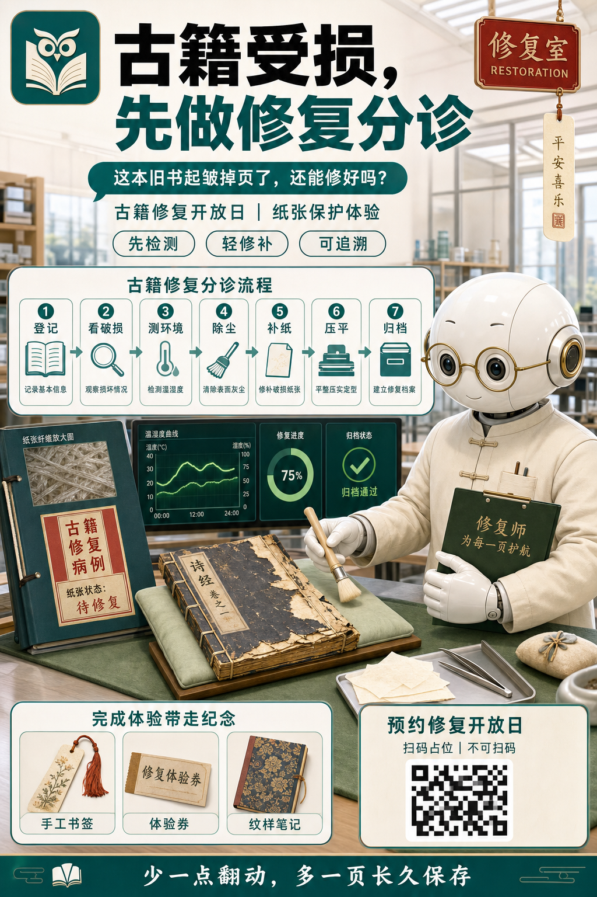
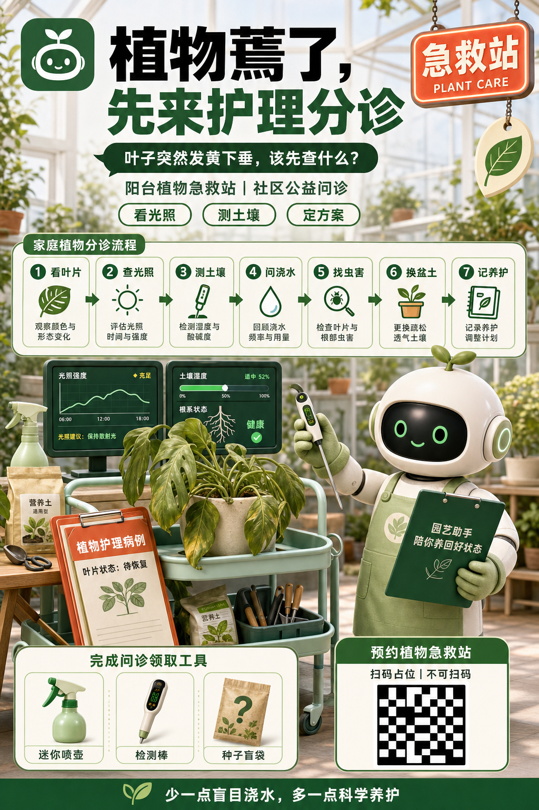

# 医疗急诊分诊式企业活动海报


## 核心要点

- **强隐喻快速解释复杂功能**：把任务排障包装为急诊分诊，让“先判断、再定位、后修复”的优先级天然成立。
- **流程卡与主场景分工明确**：七张卡负责讲步骤，机器人、病例夹和仪表盘负责建立情境与记忆点。
- **高调白色空间建立信任**：明亮医院环境、翡翠绿 UI 和少量急诊红形成干净专业的科技医疗气质。
- **角色与数据构成稳定三角**：机器人医生、倾斜病例夹和监测屏分占右、左前、左后，视觉重心稳定且信息互不遮挡。
- **转化信息独立收口**：奖励区与报名区在底部并排，既不打断诊疗叙事，又能清晰承接行动。

## Prompt

```plain text
目标：
生成一张竖向中文企业活动海报，画布比例严格为 2:3，用于数据运维助手活动宣传。采用明亮未来医院急诊室与半写实 3D 信息图结合的表现方式，达到商业成品级完成度、主次清楚、流程易读、主要中文清晰可读。

主题：
画面表现“任务故障进入智能急诊分诊”，用友好医疗分诊隐喻解释从发现异常到验证恢复的完整运维流程。
核心场景是白色未来感急诊室，主要角色和物件包括白色圆头机器人医生、病床、异常任务病例夹、深绿色监测仪表盘、七步分诊流程卡、红色急诊灯牌、输液袋、端午粽子与竹叶、奖品卡片和不可扫码二维码占位。
整体采用明亮白色空间、翡翠绿医疗 UI、少量急诊红与暖金点缀，半写实 3D 渲染结合清晰扁平信息卡，呈现干净、可信、友好而高效的企业科技气质。

画面：
- 整体布局：固定 2:3 竖版，自上而下分为标题与口号区约 27%、七步流程区约 24%、机器人诊疗主场景约 31%、奖励与报名区约 18%；阅读路径从顶部标题向下经过绿色对话气泡和流程卡，再进入机器人与病例诊断，最后到奖励和报名。
- 背景：明亮未来急诊室，白色玻璃墙、柔和天窗日光、浅灰金属吊顶和轻微景深；背景保持低对比，不能抢占文字。
- 顶部左侧：约占宽度 13% 的圆角深蓝图标框，内部只放原创白色机器人头像，不使用任何真实品牌 Logo。
- 顶部中央：两行超大中文标题，黑色与翡翠绿组合，粗体无衬线字，第二行“智能分诊”明显放大，是第一视觉焦点；顶部右侧悬挂红色“急诊 / EMERGENCY”灯牌，白色十字仅作通用医疗符号。
- 标题下方：横跨 82% 宽度的深绿色圆角对话气泡，内部放大号白色口号；右侧垂挂奶油色端午平安牌，配竹叶和绿色流苏，与气泡保持分离。
- 副标题与功能标签：对话气泡下方放一行深绿色副标题；再下方并排三个白底绿边胶囊标签，每个包含简洁线性图标和短词，标签等宽、对齐、留白一致。
- 七步流程区：左侧 72% 宽度放一个白底浅绿边圆角大面板，顶部有深绿色标题条；内部横排七张窄卡，编号 1 至 7 置于绿色圆形徽章中，每张卡依次包含短标题、单色线性图标和一行极短说明；卡片间用向右小三角连接，不能断裂或倒序。
- 机器人区域：画面右侧从中部延伸到中下部，放一位约占画布高度 38% 的白色圆头机器人医生，黑色玻璃面罩、青绿色发光双眼、白大褂、听诊器；一手举诊断笔指向监测面板，另一手拿深绿色夹板，姿态友好，手指与关节完整。
- 病例与监测区：中下左侧是青绿色病床，床上斜放大型病例夹，顶部红色标签“异常任务病例”，病例中用短行表示失败状态、时间、类型与范围；病例夹后方并排深绿色监测屏，显示红色趋势折线、日志行、圆环进度和绿色校验通过标记；输液架放在最左侧，输液袋中是浅绿色液体，下方小桌放粽子篮和竹叶。
- 底部左侧：约占宽度 66% 的白底圆角奖励面板，绿色细边框，标题居中；内部并排三张等宽奖品卡，分别放耳机礼盒、黑色纪念 T 恤、绿色工牌套，奖品图像大于说明。
- 底部右侧：约占宽度 29% 的独立白底绿边报名面板，顶部放绿色行动召唤，下方放白底黑色随机马赛克二维码占位，只作装饰，不可扫码，不含 Logo。
- 最底部：横跨画布的翡翠绿细状态栏，放一个扩音器图标和一句白色短文案。
- 叙事流向：标题提出任务故障，口号发起求助，七步卡给出分诊路径，机器人在病例与仪表盘上完成诊断，底部引导参与活动。
- 连接关系：七张流程卡只用从左向右的箭头连接；机器人诊断笔朝向监测屏；病床、病例夹、仪表盘和机器人形成稳定三角构图。
- 视觉表现：高调白色空间，翡翠绿承担功能与科技感，急诊红只用于灯牌、失败状态和趋势线，暖金只用于奖品徽章；3D 机器人和真实材质病床保持柔和工作室光，UI 卡片保持清晰硬边与轻阴影。
- 遮挡关系：机器人可部分遮住背景但不得覆盖流程卡、病例主要字段或报名面板；病例夹可压在病床前景，监测屏位于其后；所有标题、标签、奖品与二维码容器彼此独立。

文字：
- 主标题：“任务挂了，先让智能助手分诊”
- 对话气泡：“我名下今天有任务挂了，帮我看看”
- 副标题：“智能助手｜端午数据运维急诊通道”
- 功能标签：“不切平台”“不写 SQL”“不记任务 ID”
- 流程标题：“数据运维分诊流程”
- 流程节点：“1 查清单”“2 看趋势”“3 找根因”“4 改评发”“5 重跑”“6 回溯”“7 看数据”
- 病例标题：“异常任务病例”
- 病例状态：“任务状态：失败”
- 夹板文字：“智能助手 为你全程护航”
- 奖励标题：“用了就能抽奖”
- 奖品标签：“惊喜大奖”“运维 Top10”“参与奖”
- 报名标题：“扫码加入用户群，了解更多活动细节”
- 底部文案：“使用越多，中奖概率越高！”

所有文字必须逐字准确、清晰可读，并放在对应区域的独立容器中。没有指定的文字不要自行添加。

要求：
- 必须：严格保持 2:3 竖版；标题、对话气泡、七步流程、机器人诊疗场景、奖励报名的顺序完整；流程卡编号 1 至 7 且从左向右；机器人医生是主要角色但不能压住信息；文字字号层级明确；二维码必须不可扫码；端午装饰克制且可见。
- 禁止：禁止血腥、手术创口、真实病患抢救、阴暗脏乱病房；禁止真实医院名称、院徽、品牌 Logo、网址、联系人和真实二维码；禁止流程卡缺失、倒序、遮挡或比例失衡；禁止机器人肢体异常；禁止过度小字、低清截图感、深色恐怖风和大面积高饱和红色。
```

## Prompt 自检

- 状态：通过
- 轮次：1/3
- 复现充分度：96/100
- 构图得分：97/100
- 有意排除：真实品牌 Logo、真实机构名称、联系人、网址和可扫码二维码


## 类似图片：

### 古籍修复门诊日



#### Prompt

```plain text
目标：
生成一张 2:3 竖向中文文化公益活动海报，用于“古籍修复开放日”宣传。采用明亮文物修复室与半写实 3D 信息图结合的“门诊分诊”视觉语法，达到高完成度、流程清楚、主要中文清晰可读。

主题：
画面表现“受损古籍先分诊，再修复”，把纸张保护流程转译为友好的七步门诊。
核心场景是明亮古籍修复实验室，主要角色和物件包括戴白手套的圆头机器人修复师、放在软垫上的破损线装书、修复病例夹、温湿度监测屏、七步修复卡、纤维纸、软毛刷、压书板、纪念品和不可扫码二维码占位。
整体采用象牙白、孔雀蓝绿、古铜金与少量朱砂红，半写实 3D 角色和真实纸张材质结合简洁 UI 卡片，呈现安静、专业、珍惜文化遗产的气质。

画面：
- 整体布局：固定 2:3 竖版，自上而下为标题口号区约 27%、七步流程区约 24%、机器人修复主场景约 31%、体验权益与预约区约 18%；阅读路径从标题到流程，再到古籍修复台，最后到报名。
- 背景：高亮白色文物修复室，磨砂玻璃、木质工作台、柔和天窗光和浅景深，背景低对比。
- 顶部左侧：原创猫头鹰书页图标放在深孔雀蓝圆角框内，不使用真实机构 Logo。
- 顶部中央：两行超大粗体中文，黑色与孔雀蓝绿组合，“古籍分诊”最大；右上悬挂朱砂红色“修复室 / RESTORATION”灯牌，旁边挂一枚奶油色书签形平安牌。
- 标题下方：宽阔孔雀蓝绿对话气泡放读者提问；其下是一行副标题和三个等宽白底绿边胶囊标签。
- 七步流程区：左侧约 72% 宽度放白底浅绿边大面板，内部横排七张窄卡；编号 1 至 7、短标题、单色图标与一行短说明，自左向右由小箭头连续连接。图标依次为登记册、放大镜、湿度计、软毛刷、补纸、压平板、档案盒。
- 主场景右侧：白色圆头机器人修复师约占画布高度 36%，戴圆眼镜与白手套，穿浅米色工作袍；一手拿软毛刷，另一手持深绿色修复记录夹，手指完整，表情温和。
- 主场景左下：浅绿色软垫工作台上斜放一册破损线装书和大型病例夹，红色标签写“古籍修复病例”；后方并排深绿色监测屏，显示纸张纤维放大图、温湿度曲线、修复进度圆环和绿色归档通过标记；边桌放纤维纸、镊子与小沙袋。
- 底部左侧：白底圆角体验权益面板，内部三张等宽卡片，展示手工书签、修复体验券、古籍纹样笔记本。
- 底部右侧：独立预约面板，顶部行动召唤，下方白底深色随机马赛克二维码占位，不可扫码、不含 Logo。
- 最底部：孔雀蓝绿状态栏放书页图标和一句白色短文案。
- 视觉表现：象牙白空间与自然纸张纹理为底，孔雀蓝绿承担功能色，朱砂红只用于警示与病例标签，古铜金只用于徽章；机器人和书籍使用柔和 3D 光影，卡片保持清晰硬边和轻阴影。
- 遮挡关系：机器人不得遮住七步卡、古籍标题或预约面板；破损书可压在软垫与病例夹上，监测屏在后景；全部文字与图标保持独立容器。

文字：
- 主标题：“古籍受损，先做修复分诊”
- 对话气泡：“这本旧书起皱掉页了，还能修好吗？”
- 副标题：“古籍修复开放日｜纸张保护体验”
- 功能标签：“先检测”“轻修补”“可追溯”
- 流程标题：“古籍修复分诊流程”
- 流程节点：“1 登记”“2 看破损”“3 测环境”“4 除尘”“5 补纸”“6 压平”“7 归档”
- 病例标题：“古籍修复病例”
- 病例状态：“纸张状态：待修复”
- 夹板文字：“修复师 为每一页护航”
- 权益标题：“完成体验带走纪念”
- 权益标签：“手工书签”“体验券”“纹样笔记”
- 预约标题：“预约修复开放日”
- 预约说明：“扫码占位｜不可扫码”
- 底部文案：“少一点翻动，多一页长久保存”

所有文字必须逐字准确、清晰可读，并放在对应区域的独立容器中。没有指定的文字不要自行添加。

要求：
- 必须：严格 2:3 竖版；标题、口号、七步流程、机器人修复场景、体验预约顺序完整；七步编号连续且从左向右；破损书、病例夹、监测屏和机器人形成稳定主视觉；中文层级清楚。
- 禁止：禁止真实博物馆或图书馆 Logo、网址、联系人、真实二维码；禁止把古籍画成现代印刷杂志；禁止脏乱作坊、恐怖医疗、过度科幻；禁止流程缺失倒序、文字遮挡、机器人肢体异常和大段小字。
```

### 阳台植物急救站



#### Prompt

```plain text
目标：
生成一张 2:3 竖向中文生活服务活动海报，用于社区“阳台植物急救站”公益问诊。采用明亮温室植物诊疗室与半写实 3D 信息图结合的分诊视觉语法，达到高完成度、步骤易读、主要中文清晰可读。

主题：
画面表现“植物蔫了先分诊”，把家庭植物养护流程转译为七步绿色门诊。
核心场景是阳光充足的社区温室，主要角色和物件包括圆头机器人园艺师、放在推车上的萎蔫龟背竹、植物病例夹、土壤与光照监测屏、七步护理流程卡、喷壶、放大镜、营养土、工具套装和不可扫码二维码占位。
整体采用奶油白、森林绿、嫩芽黄与少量珊瑚橙，半写实 3D 角色和真实叶片材质结合清晰信息卡，呈现清新、可信、轻松友好的社区生活气质。

画面：
- 整体布局：固定 2:3 竖版，自上而下为标题口号区约 27%、七步流程区约 24%、机器人植物诊疗场景约 31%、工具福利与报名区约 18%；阅读从标题到流程，再到植物诊断，最后到报名。
- 背景：明亮玻璃温室，白色框架、柔和日光、浅景深盆栽和木质工作台，背景低对比。
- 顶部左侧：深森林绿圆角图标框，内部放原创白色嫩芽机器人头像，不使用品牌 Logo。
- 顶部中央：两行超大粗体中文，黑色与森林绿组合，“植物分诊”最大；右上悬挂珊瑚橙色“急救站 / PLANT CARE”灯牌，旁边挂奶油色叶片吊牌。
- 标题下方：横跨 82% 宽度的深绿色对话气泡，放居民提问；其下是一行副标题和三个等宽白底绿边胶囊标签。
- 七步流程区：左侧约 72% 宽度放白底浅绿边大面板，内部横排七张窄卡；编号 1 至 7、短标题、线性图标和一行短说明，自左向右用小箭头连接。图标依次为叶片、太阳、土壤探针、水滴、放大镜、花盆和记录册。
- 主场景右侧：白色圆头机器人园艺师约占画布高度 36%，穿浅绿色围裙、戴园艺手套；一手拿土壤检测笔，另一手持深绿色护理夹板，手指完整，表情温和。
- 主场景左下：薄荷绿推车上放一盆叶片明显下垂但仍健康可救的龟背竹，旁边斜放大型病例夹，橙红标签写“植物护理病例”；后方并排深绿色监测屏，显示光照折线、土壤湿度、根系示意和绿色恢复标记；边桌放喷壶、营养土与剪刀。
- 底部左侧：白底圆角工具福利面板，内部三张等宽卡片展示迷你喷壶、土壤检测棒、种子盲袋。
- 底部右侧：独立报名面板，顶部行动召唤，下方白底黑色随机马赛克二维码占位，不可扫码、不含 Logo。
- 最底部：森林绿状态栏放叶片图标和一句白色短文案。
- 视觉表现：高调奶油白空间，森林绿承担功能色，嫩芽黄用于健康提示，珊瑚橙仅用于警示与病例标签；机器人、叶片和工具使用柔和 3D 光影，UI 卡片保持硬边、轻阴影和清晰间距。
- 遮挡关系：机器人不得遮住流程卡、植物主要叶片或报名面板；病例夹可压在推车前景，监测屏置于其后；文字、工具卡和二维码各自独立。

文字：
- 主标题：“植物蔫了，先来护理分诊”
- 对话气泡：“叶子突然发黄下垂，该先查什么？”
- 副标题：“阳台植物急救站｜社区公益问诊”
- 功能标签：“看光照”“测土壤”“定方案”
- 流程标题：“家庭植物分诊流程”
- 流程节点：“1 看叶片”“2 查光照”“3 测土壤”“4 问浇水”“5 找虫害”“6 换盆土”“7 记养护”
- 病例标题：“植物护理病例”
- 病例状态：“叶片状态：待恢复”
- 夹板文字：“园艺助手 陪你养回好状态”
- 福利标题：“完成问诊领取工具”
- 福利标签：“迷你喷壶”“检测棒”“种子盲袋”
- 报名标题：“预约植物急救站”
- 报名说明：“扫码占位｜不可扫码”
- 底部文案：“少一点盲目浇水，多一点科学养护”

所有文字必须逐字准确、清晰可读，并放在对应区域的独立容器中。没有指定的文字不要自行添加。

要求：
- 必须：严格 2:3 竖版；标题、口号、七步流程、机器人植物诊疗场景、福利报名顺序完整；七步从左向右连续；萎蔫植物、病例夹、监测屏和机器人构成主视觉；植物问题表现真实但不枯死。
- 禁止：禁止真实品牌或社区机构 Logo、网址、联系人、真实二维码；禁止血腥医疗、阴暗病房、植物完全腐烂；禁止流程缺失倒序、文字遮挡、机器人肢体异常、过度小字和廉价素材拼贴感。
```
