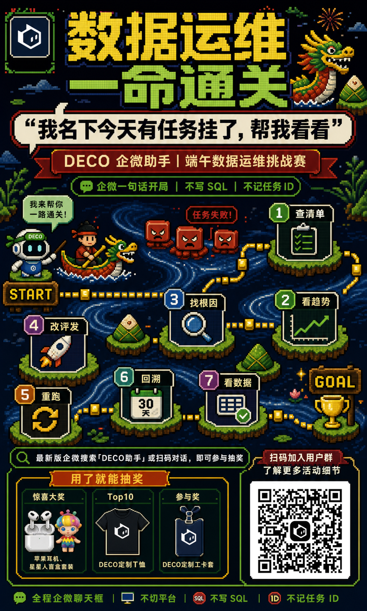
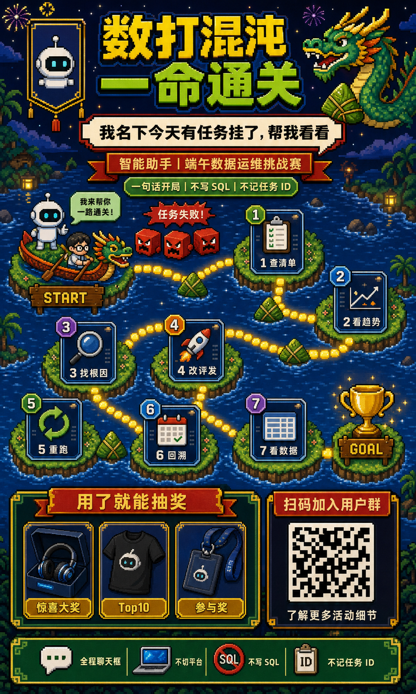
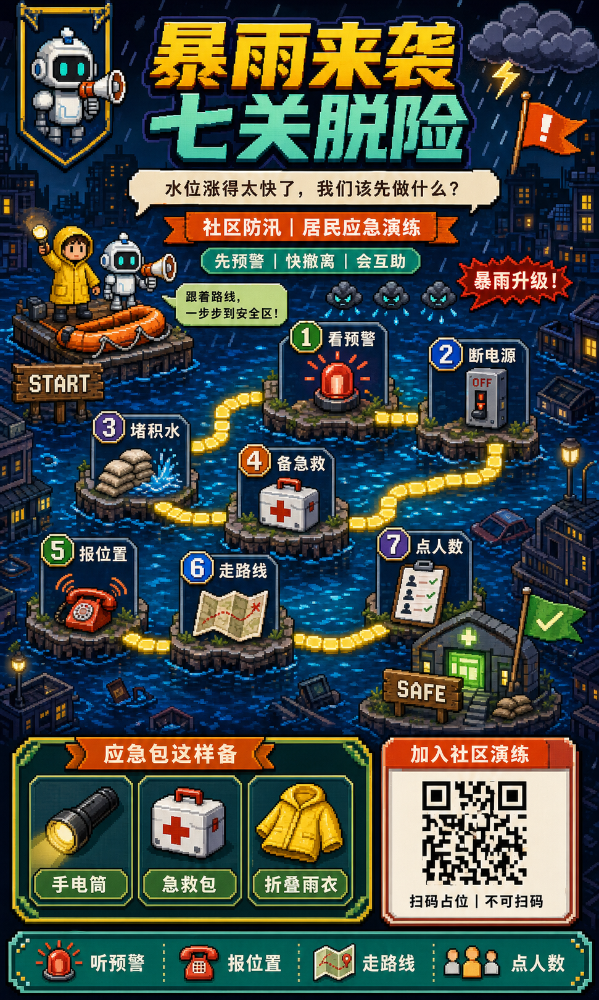
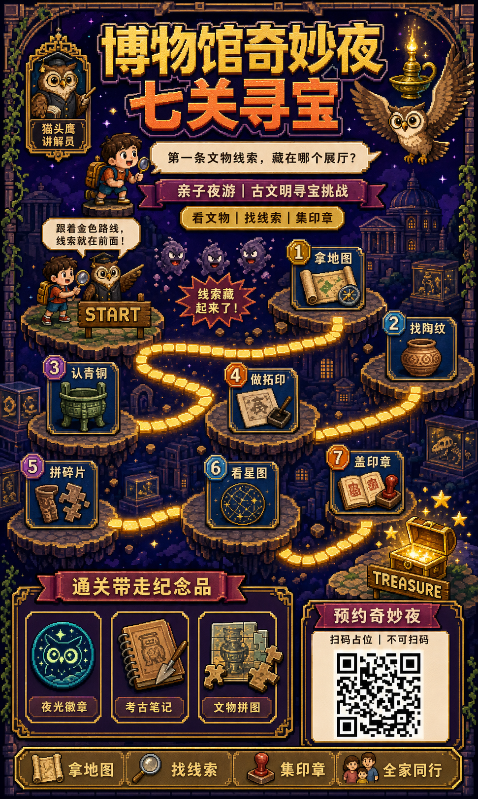

# 复古像素闯关地图式活动海报



## 核心要点

- **游戏化叙事代替信息堆叠**：把活动步骤转换为从 START 到 GOAL 的连续闯关路线，读者无需先读完说明就能理解参与路径。
- **三段式长图承载复杂信息**：标题宣传、任务地图、奖励报名依次占据上中下区域，既能维持强视觉冲击，又能完整容纳活动规则。
- **统一任务卡降低理解成本**：七个节点使用相同边框、编号和图标结构，仅改变标签与局部色彩，让密集步骤仍然容易扫描。
- **像素世界强化主题沉浸感**：深蓝海面、漂浮小岛、发光路径和街机 UI 共同构成完整世界观，装饰元素同时服务于路线引导。
- **高对比容器保障中文可读性**：亮黄、草绿、奶油白和暗红分别承担标题、口号、标签与警示功能，文字始终放在独立深浅对比容器中。

## Prompt

```plain text
目标：
生成一张竖向的中文企业活动招募海报，画布宽高比必须为 0.60（即宽:高=3:5，宽度必须等于高度的 60%），用于内部运维挑战赛宣传。不要做成 9:16 或更窄的超长海报，必须使用相对更宽的 3:5 竖版画布。采用深色复古像素游戏界面与海岛闯关地图的表现方式，达到商业成品级完成度、信息丰富但层级清晰、主要中文清晰可读。

主题：
画面表现一场“智能助手端午运维挑战赛”，把日常排障流程包装成从 START 到 GOAL 的七关像素冒险。
核心场景是深蓝夜色海面上的漂浮草地小岛，主要角色和物件包括可爱的机器人助手、划龙舟的工程师、端午龙、三个红色故障方块怪、七个任务卡、奖杯、粽子、奖品卡片和不可扫码的二维码占位块。
整体采用高质量 16-bit 街机 RPG 像素风、清晰方块像素、厚重游戏 UI 边框与少量发光描边，呈现热闹、有挑战感、怀旧而专业的活动气质。

画面：
- 整体布局：画布固定为宽高比 0.60 的 3:5 竖版，自上而下分为标题宣传区约 27%、闯关地图区约 47%、奖励与报名区约 26%；阅读顺序严格从顶部大标题向下进入七关路线，再到奖励与报名；四周保留深蓝像素夜景边框，用云、树、草、烟花和微小星点填充但不干扰文字。
- 顶部左侧：约占宽度 14% 的竖向像素徽章框，内部只放一个原创白色机器人头像图标，不使用任何真实品牌标志。
- 顶部中央：约占宽度 66%、高度 14% 的两行超大中文像素标题，第一行黄色、第二行亮绿色，深蓝立体阴影与黑色粗描边，是全图第一视觉焦点；标题右侧放一条昂首的绿色金角像素端午龙和一只粽子，龙头朝向标题。
- 标题下方：横跨约 90% 宽度的奶油白对话气泡，红黑双层像素边框，内部放一句大号黑色口号；其下叠放一条红色缎带副标题，再下方是一条绿色胶囊标签，三层容器居中对齐、彼此不遮挡。
- 中部起点：左上方小岛放机器人助手与工程师乘坐的迷你龙舟，机器人站在独立草地平台上，旁边有浅绿色对话气泡；下方木牌写 START。三只红色方块故障怪位于路线起点上方，形成“任务失败”障碍，但不能遮住角色。
- 中部闯关地图：深蓝海面上分布七座错落的圆角漂浮草地小岛，岛屿沿 S 形路径从左上向右下排列；黄色发光像素砖组成连续路线并用转弯明确连接 1 到 7，不能断裂、倒序或交叉。每座小岛放一个深蓝任务卡，卡片上方有彩色编号徽章，卡内分别放剪贴板、趋势图、放大镜、火箭、循环箭头、日历、数据表图标。节点 1 与 2 在右侧，3 与 4 在中左，5 与 6 在下方，7 在中下偏右；最右下终点小岛放木牌 GOAL 和金色奖杯。
- 中部视觉关系：河流纹理围绕小岛，端午粽子作为装饰散布在转弯处；所有任务卡保持同一尺寸和边框，编号醒目，路径位于卡片后方，人物、卡片、路线三层不互相遮挡。
- 底部奖励区：左侧约占 66% 宽度，外层是绿色与金色像素边框的深色面板，顶部红金缎带标题；内部横排三张同宽奖品卡，分别展示耳机礼盒、黑色纪念 T 恤、深蓝工牌套，奖品图像大于说明文字。
- 底部报名区：右侧约占 29% 宽度，是独立深色报名面板；顶部红色标题条，下方放白底黑色马赛克方块的“不可扫码二维码占位图”，只呈现随机装饰块，不含真实编码，不带任何 Logo。
- 最底部：横跨整幅的绿色像素状态栏，依次放聊天、电脑、禁止 SQL、任务编号四个小图标和四条短标签；栏内元素等距排列，距离画布底边保留安全边距。
- 叙事流向：顶部说明挑战主题，中部由机器人助手带领工程师从 START 遇到故障怪，依序通过七个运维任务，到达 GOAL 奖杯，底部再说明奖励与报名方式。
- 连接关系：唯一主连接是从 START 到 1、2、3、4、5、6、7、GOAL 的黄色像素砖 S 形路线；角色视线朝向下一关；所有装饰不得形成假路径。
- 视觉表现：背景以近黑深蓝和海军蓝为主，标题使用亮黄与草绿，关键横幅用暗红与金色，节点编号用绿、蓝、紫、橙区分；像素边缘清晰，无平滑矢量曲线；UI 卡片带一到两像素高光和硬边阴影；整体高对比但不使用大面积渐变。
- 遮挡关系：标题、口号、任务卡、奖品卡和报名面板必须完整独立；路径可从岛屿后方穿过，但不能压住编号或文字；角色与龙舟可局部前后叠放，手脚与桨必须结构完整。

文字：
- 主标题：“数打混沌 一命通关”
- 口号：“我名下今天有任务挂了，帮我看看”
- 红色副标题：“智能助手｜端午数据运维挑战赛”
- 绿色标签：“一句话开局｜不写 SQL｜不记任务 ID”
- 助手气泡：“我来帮你一路通关！”
- 障碍提示：“任务失败！”
- 节点标签：“1 查清单”“2 看趋势”“3 找根因”“4 改评发”“5 重跑”“6 回溯”“7 看数据”
- 奖励标题：“用了就能抽奖”
- 奖品标签：“惊喜大奖”“Top10”“参与奖”
- 报名标题：“扫码加入用户群”
- 报名说明：“了解更多活动细节”
- 终点木牌：“GOAL”
- 起点木牌：“START”
- 底部状态栏：“全程聊天框｜不切平台｜不写 SQL｜不记任务 ID”

所有文字必须逐字准确、清晰可读，并放在对应区域的独立容器中。没有指定的文字不要自行添加。

要求：
- 必须：输出宽高比严格接近 0.60 的 3:5 竖版，比例误差不超过 5%，不得输出 9:16 或更窄画布；三大区块顺序和占比明确；标题是第一焦点；七关路线连续且编号严格递增；START 和 GOAL 均可见；奖品区与报名区并排；字号随层级递减；重要文字采用高对比像素字；留白足够；所有容器对齐。
- 禁止：禁止写实照片、现代扁平矢量风、柔和水彩、3D 塑料质感；禁止真实品牌 Logo、网址、联系人、真实可扫码二维码；禁止路径倒序、断裂或交叉；禁止节点缺失或重复；禁止文字压住图标、角色或边框；禁止模糊像素、过度渐变、肢体异常和大段细小文字。
```

## Prompt 自检

- 状态：通过
- 轮次：2/3
- 复现充分度：95/100
- 构图得分：97/100
- 有意排除：真实品牌 Logo、联系人、网址和可扫码二维码



## 类似图片：

### 社区防汛七关演练



#### Prompt

```plain text
目标：
生成一张竖向中文公共服务活动海报，画布宽高比严格接近 0.60（宽:高=3:5），用于社区防汛应急演练招募。采用深色复古像素游戏界面与城市水道闯关地图的表现方式，达到商业宣传成品级完成度、信息层级清晰、主要中文清晰可读。

主题：
画面表现“社区防汛七关演练”，把居民应急准备流程包装成从 START 到 SAFE 的七关像素冒险。
核心场景是暴雨后的深蓝城市水道与漂浮街区平台，主要角色和物件包括穿黄色雨衣的社区志愿者、带扩音器的救援机器人、一艘橙色救生艇、乌云与雨滴小怪、七个应急任务卡、沙袋、急救包、手电筒、避难所与安全旗。
整体采用高质量 16-bit 街机 RPG 像素风、清晰方块像素、厚重游戏 UI 边框和发光路线，呈现紧张但不恐怖、可靠、有行动号召力的公共安全气质；主色由深蓝、警示橙、雨衣黄和安全青绿组成。

画面：
- 整体布局：固定 3:5 竖版，自上而下分为标题宣传区约 26%、应急闯关地图区约 49%、物资与报名区约 25%；阅读顺序从顶部大标题进入七个节点，最终到避难所，再阅读底部物资与参与信息；四周用像素建筑剪影、路灯、雨云和水花做深色边框。
- 顶部左侧：约占宽度 14% 的竖向徽章框，内部放原创白色救援机器人头像和小扩音器，不使用任何机构 Logo。
- 顶部中央：两行超大中文像素标题，第一行亮黄、第二行青绿色，深蓝立体阴影与黑色粗描边，是全图第一焦点；标题右侧放暴雨云、闪电和一面橙色安全旗。
- 标题下方：横跨 90% 宽度的奶油白对话气泡，内部放居民求助口号；下方叠一条警示橙缎带副标题，再下方放青绿色胶囊标签，三层容器居中且不重叠。
- 地图起点：中部左上漂浮街区平台放志愿者与救援机器人并肩站在橙色救生艇旁，志愿者举手电筒，机器人举扩音器，旁边浅绿色气泡；木牌写 START。三只乌云雨滴小怪位于路径上方，红色爆炸框提示“暴雨升级！”。
- 中部地图：深蓝积水街区上分布七座错落的圆角漂浮平台，沿 S 形从左上向右下排列；黄色发光像素砖形成唯一连续路线，严格连接 1 至 7，不断裂、不交叉。七张深蓝任务卡上分别放预警铃、断电开关、沙袋、急救包、求救电话、路线地图、人员清单图标；编号徽章用绿、蓝、紫、橙区分。
- 节点位置：1 和 2 位于右上，3 和 4 位于中左，5 和 6 位于下方，7 位于中下偏右；最右下平台是有绿色灯光的避难所入口，木牌写 SAFE，旁边插安全旗。
- 连接关系：黄色路径从 START 经过“看预警、断电源、堵积水、备急救、报位置、走路线、点人数”到 SAFE；角色视线朝向下一关；水波、雨滴和路灯不能形成假路径。
- 底部左侧：约占 66% 宽度的深色物资面板，绿色与金色像素边框，顶部橙色缎带标题；内部三张同宽卡片分别展示手电筒、急救包、折叠雨衣，图像大于标签。
- 底部右侧：约占 29% 宽度的报名面板，顶部橙红标题条，下方是白底黑色随机马赛克二维码占位，只作为装饰且不可扫码，不放 Logo。
- 最底部：横跨全图的青绿色状态栏，依次放警报、电话、地图、人数四个图标和短标签，等距排列并保留底部安全边距。
- 视觉表现：背景近黑深蓝，积水用蓝青色硬边波纹；标题亮黄和青绿，警告使用橙红，路线金黄发光；所有元素保持清晰像素网格、硬边阴影与一至两像素高光，不用柔滑矢量或大面积渐变。
- 遮挡关系：标题、节点卡、物资卡和报名面板必须完整独立；路径从平台后方穿过，不压住编号；人物与救生艇可前后叠放，但手脚、桨和扩音器完整；雨云不得遮住文字。

文字：
- 主标题：“暴雨来袭 七关脱险”
- 口号：“水位涨得太快了，我们该先做什么？”
- 副标题：“社区防汛｜居民应急演练”
- 标签：“先预警｜快撤离｜会互助”
- 助手气泡：“跟着路线，一步步到安全区！”
- 障碍提示：“暴雨升级！”
- 节点标签：“1 看预警”“2 断电源”“3 堵积水”“4 备急救”“5 报位置”“6 走路线”“7 点人数”
- 物资标题：“应急包这样备”
- 物资标签：“手电筒”“急救包”“折叠雨衣”
- 报名标题：“加入社区演练”
- 报名说明：“扫码占位｜不可扫码”
- 起点木牌：“START”
- 终点木牌：“SAFE”
- 底部状态栏：“听预警｜报位置｜走路线｜点人数”

所有文字必须逐字准确、清晰可读，并放在对应区域的独立容器中。没有指定的文字不要自行添加。

要求：
- 必须：宽高比接近 0.60，比例误差不超过 5%；三大区块顺序清楚；七关路线连续且编号递增；START 与 SAFE 均可见；居民、机器人和救生艇动作完整；底部物资区和报名区并排；重要字号足够大；文本容器不拥挤。
- 禁止：禁止真实灾难照片、血腥恐怖、现代扁平矢量、3D 塑料玩具风；禁止真实政府或机构 Logo、联系人、网址、真实二维码；禁止路线倒序、断裂、交叉；禁止节点缺失或重复；禁止文字压住角色、图标或边框；禁止肢体异常、模糊像素和大段小字。
```

### 博物馆奇妙夜七关寻宝



#### Prompt

```plain text
目标：
生成一张竖向中文文化活动海报，画布宽高比严格接近 0.60（宽:高=3:5），用于亲子博物馆夜游寻宝活动招募。采用复古像素游戏界面与古文明遗迹闯关地图的表现方式，达到高完成度文化活动海报质感、信息丰富但层级清楚、主要中文清晰可读。

主题：
画面表现“博物馆奇妙夜七关寻宝”，把参观学习流程包装成从 START 到 TREASURE 的七关像素探险。
核心场景是深紫夜色中的博物馆展厅与漂浮遗迹平台，主要角色和物件包括背小书包的孩子、戴圆眼镜的猫头鹰讲解员、会发光的古代铜灯、三只调皮的尘埃小怪、七个展厅任务卡、陶罐、青铜器、拓印纸、拼图、星图和最终宝箱。
整体采用高质量 16-bit 街机 RPG 像素风、清晰方块像素、厚重游戏 UI 边框与温暖金色发光路线，呈现神秘、好奇、适合家庭参与的文化探险气质；主色为深紫、靛蓝、古铜金与珊瑚橙。

画面：
- 整体布局：固定 3:5 竖版，自上而下分为标题宣传区约 27%、七关寻宝地图区约 47%、纪念品与报名区约 26%；阅读从顶部大标题向下沿 S 形路线到宝箱，再到活动权益和报名；外框用像素拱券、星点、展柜轮廓和藤蔓装饰。
- 顶部左侧：约占宽度 14% 的竖向徽章框，内部放原创猫头鹰讲解员头像，戴圆眼镜但不使用任何博物馆 Logo。
- 顶部中央：两行超大中文像素标题，第一行古铜金、第二行珊瑚橙，深紫立体阴影和黑色粗描边，是全图第一焦点；标题右侧放一盏发光铜灯和一只展开翅膀的像素猫头鹰。
- 标题下方：横跨约 90% 宽度的奶油白对话气泡，内部放孩子的提问；下方叠一条紫红缎带副标题，再下方放金色胶囊标签，三层居中且互不遮挡。
- 地图起点：中部左上平台放孩子和猫头鹰讲解员，孩子举放大镜，猫头鹰指向第一展厅；木牌写 START。三只紫灰尘埃小怪飘在路径上方，红紫爆炸框写“线索藏起来了！”。
- 中部地图：深紫博物馆夜景中分布七座错落的圆角漂浮遗迹平台，沿 S 形从左上向右下排列；金色发光像素砖组成唯一连续路线，严格连接 1 至 7，不能断裂、倒序或交叉。七张靛蓝任务卡分别放地图、陶纹、青铜鼎、文字拓印、碎片拼图、星象盘、印章册图标，卡片边框统一，编号徽章使用金、蓝、紫、橙区分。
- 节点位置：1 和 2 位于右上，3 和 4 位于中左，5 和 6 位于下方，7 位于中下偏右；最右下平台放打开的发光宝箱、金色星星和木牌 TREASURE。
- 连接关系：路线从 START 经过“拿地图、找陶纹、认青铜、做拓印、拼碎片、看星图、盖印章”到 TREASURE；孩子视线沿下一节点移动；星点和展柜光线不能形成假路线。
- 底部左侧：约占 66% 宽度的深紫权益面板，古铜金与珊瑚橙像素边框，顶部缎带标题；内部横排三张同宽卡片，分别展示夜光徽章、考古笔记本、迷你文物拼图，图像大于标签。
- 底部右侧：约占 29% 宽度的报名面板，顶部紫红标题条，下方放白底深色随机马赛克二维码占位，只作装饰且不可扫码，不含 Logo。
- 最底部：横跨画面的古铜金状态栏，依次放地图、放大镜、印章、家庭四个图标与短标签，等距排列并留出底部安全边距。
- 视觉表现：背景近黑深紫和靛蓝，平台边缘有古铜金硬边高光，路径暖金发光，警示框珊瑚橙，重要标签奶油白；所有元素保持清晰像素网格、硬边阴影、有限色阶，不使用柔滑矢量或写实材质。
- 遮挡关系：标题、节点卡、纪念品卡和报名面板必须完整独立；路线从平台后方穿过，不压住编号；孩子、猫头鹰和道具可以前后叠放，但手脚、翅膀和放大镜完整；宝箱光芒不能遮住 TREASURE 木牌。

文字：
- 主标题：“博物馆奇妙夜 七关寻宝”
- 口号：“第一条文物线索，藏在哪个展厅？”
- 副标题：“亲子夜游｜古文明寻宝挑战”
- 标签：“看文物｜找线索｜集印章”
- 讲解员气泡：“跟着金色路线，线索就在前面！”
- 障碍提示：“线索藏起来了！”
- 节点标签：“1 拿地图”“2 找陶纹”“3 认青铜”“4 做拓印”“5 拼碎片”“6 看星图”“7 盖印章”
- 权益标题：“通关带走纪念品”
- 权益标签：“夜光徽章”“考古笔记”“文物拼图”
- 报名标题：“预约奇妙夜”
- 报名说明：“扫码占位｜不可扫码”
- 起点木牌：“START”
- 终点木牌：“TREASURE”
- 底部状态栏：“拿地图｜找线索｜集印章｜全家同行”

所有文字必须逐字准确、清晰可读，并放在对应区域的独立容器中。没有指定的文字不要自行添加。

要求：
- 必须：宽高比接近 0.60，比例误差不超过 5%；三大区块顺序清楚；标题是第一焦点；七关路线连续且编号递增；START 和 TREASURE 均可见；亲子角色与猫头鹰动作自然；底部权益区和报名区并排；重要字号足够大；留白与容器边距充足。
- 禁止：禁止写实摄影、真实文物复制品广告感、现代扁平矢量、3D 塑料玩具风；禁止真实博物馆 Logo、网址、联系人、真实二维码；禁止路线倒序、断裂或交叉；禁止节点缺失或重复；禁止文字压住人物、图标或边框；禁止肢体异常、模糊像素和大段小字。
```
