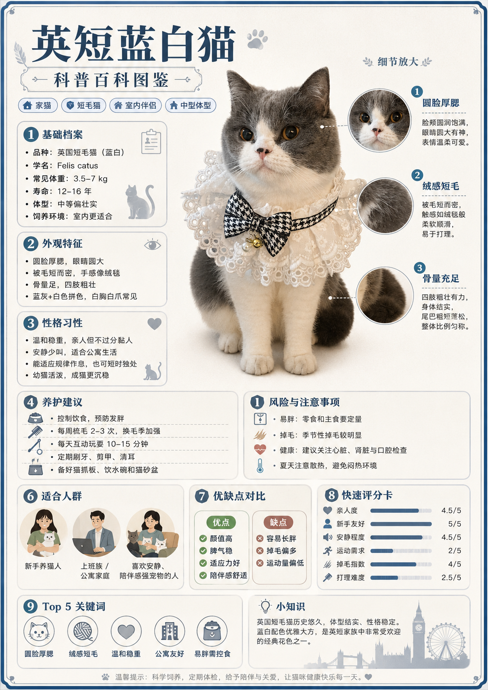
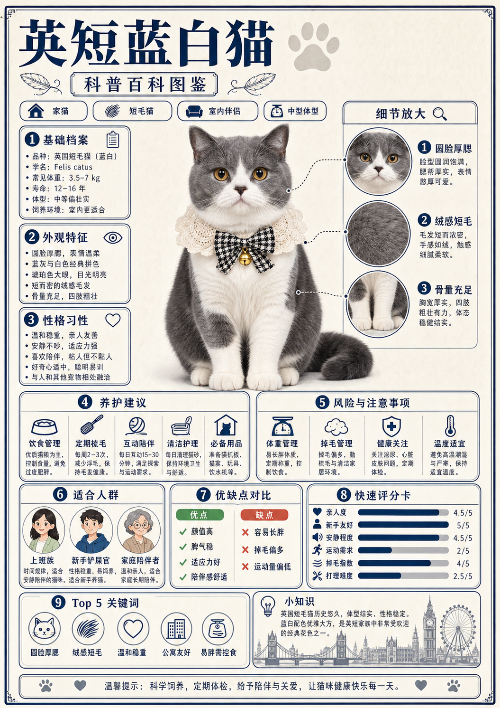
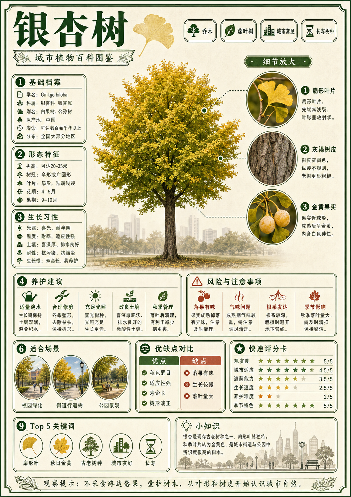
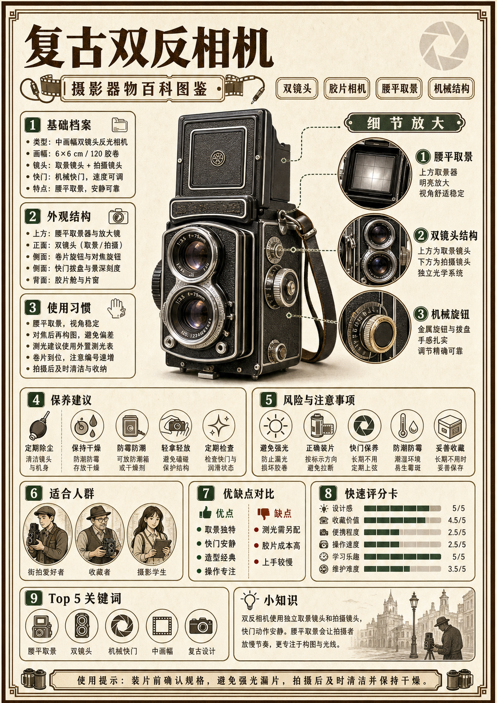

# 宠物百科图鉴式信息海报



## 核心要点

- **中央单主体建立第一焦点**：用一只高质感全身宠物占据视觉中心，读者先识别对象，再进入周边信息。
- **左档案右细节形成阅读分工**：左侧承载类别与习性，右侧用圆形放大镜解释局部特征，减少信息混杂。
- **统一卡片网格承载高密度信息**：中下部采用两卡、三卡与底部双卡的稳定网格，让大量科普信息仍可快速扫描。
- **图标与评分条辅助理解**：线性图标、编号、优缺点色块和量化条把长文本转为可视化线索。
- **复古纸张与单色边框增强可信度**：暖象牙纸、深蓝细线和克制辅助色共同营造自然史图鉴式的专业感。

## Prompt

```plain text
目标：
生成一张严格 A4 竖向比例的中文宠物百科图鉴海报，输出画布宽高比必须为 1:1.414（例如 1414×2000、1055×1491 或其他等比例尺寸），禁止使用 2:3 画布，用于科普展示。采用暖象牙纸背景、深海军蓝细线框、中央半写实宠物摄影与周围结构化信息卡片，达到专业图鉴级完成度、信息密集但可扫描、主要中文清晰可读。

主题：
画面表现“英短蓝白猫科普百科图鉴”。
核心场景是中央一只端坐的英短蓝白猫，四周按档案、外观、性格、细节放大、养护、风险、适合人群、优缺点、评分、关键词与小知识组织信息；主要角色和物件包括蓝白猫、蕾丝领饰、三个圆形局部放大镜、剪贴板与心形线性图标、人物小插画、评分条和伦敦剪影。
整体采用英伦复古自然史图鉴、暖白纸张、深蓝细边框、克制的米灰与雾蓝辅助色，中央猫使用高质感半写实摄影，信息卡使用简洁扁平线性图标，呈现优雅、可信、温和的科普气质。

画面：
- 整体布局：固定 A4 竖版比例，严禁拉长为 2:3；四周为双层深蓝细线装饰边框；顶部约 14% 是标题与分类标签，中上至中部约 43% 为中央猫与左右档案/细节，中下约 23% 为养护、风险和三张评估卡，底部约 20% 为关键词、小知识与提示条。所有区块以统一圆角细线框对齐。
- 顶部左侧：超大深海军蓝中文标题“英短蓝白猫”，下方白底蓝边窄横幅写“科普百科图鉴”，两侧有羽毛和细线装饰；标题右侧留一个浅灰爪印。
- 顶部标签：标题下方横排四个小型蓝边胶囊标签，每个带单色图标，依次说明类别、毛长、生活方式和体型。
- 中央主体：画布中上部偏中央放一只全身可见、正面端坐的英短蓝白猫，占画布宽度约 36%、高度约 42%；圆脸、灰蓝与白色拼色、琥珀眼、短密绒毛、四肢粗壮，胸前穿奶油白蕾丝领饰与黑白千鸟格蝴蝶结，小金铃位于正中。猫的耳朵、四爪与尾部完整，不被文字遮挡。
- 左侧信息列：约占宽度 32%，纵向堆叠三张白底蓝边圆角卡，标题分别为“1 基础档案”“2 外观特征”“3 性格习性”；每张卡左上有蓝色编号圆点，右上有剪贴板、眼睛、爱心线性图标，内部使用 4 至 6 行短项目符号。
- 右侧细节列：约占宽度 25%，顶部标题“细节放大”，向下竖排三个圆形放大图，分别显示猫脸、绒毛、前腿与胸毛局部；每个圆图通过白色点线连接到中央猫对应位置，右侧放蓝色编号、粗体短标题和两至三行说明。
- 中部横排卡：中央猫下方先放两张横向白底蓝边圆角卡，左侧约 48% 为“4 养护建议”，用饮食、梳毛、互动、清洁、用品五个小图标与短行；右侧约 48% 为“5 风险与注意事项”，用体重、掉毛、健康、温度四个小图标与短行。
- 下方三卡：横排三张等高卡，左为“6 适合人群”，放三个人物圆形插画与短标签；中为“7 优缺点对比”，内部再分绿色优点列与暖红缺点列；右为“8 快速评分卡”，六行深蓝横向评分条，右侧标数字。
- 底部左侧：约占宽度 49% 的“9 Top 5 关键词”卡，横排五个圆形线性图标及短词。
- 底部右侧：约占宽度 49% 的“小知识”卡，左上灯泡图标，右侧两至三行短文，底部用浅灰伦敦塔桥、钟楼和摩天轮剪影装饰。
- 最底部：跨全宽的浅灰提示条，居中放一行温馨提示，两端小爪印与心形。
- 阅读路径：先看标题和中央猫，再读左侧档案与右侧细节，然后依次向下看养护、风险、适合人群、优缺点、评分和关键词。
- 视觉表现：暖象牙白为底，深海军蓝承担标题、线框与信息层级，雾蓝和浅灰用于图标与评分条，绿色只用于优点，暖红只用于缺点；纸面有极轻微纹理，但不影响文字。
- 遮挡关系：中央猫与左右卡片保持至少一条边距；点线只连接细节圆图和猫体，不穿过文字；底部卡片彼此不重叠；猫的眼睛、脸、蕾丝领、四爪完整可见。

文字：
- 主标题：“英短蓝白猫”
- 副标题：“科普百科图鉴”
- 标签：“家猫”“短毛猫”“室内伴侣”“中型体型”
- 左侧标题：“1 基础档案”“2 外观特征”“3 性格习性”
- 基础档案：“品种：英国短毛猫（蓝白）”“学名：Felis catus”“常见体重：3.5–7 kg”“寿命：12–16 年”“体型：中等偏壮实”“饲养环境：室内更适合”
- 细节标题：“1 圆脸厚腮”“2 绒感短毛”“3 骨量充足”
- 中部标题：“4 养护建议”“5 风险与注意事项”
- 下方标题：“6 适合人群”“7 优缺点对比”“8 快速评分卡”
- 优点：“颜值高”“脾气稳”“适应力好”“陪伴感舒适”
- 缺点：“容易长胖”“掉毛偏多”“运动量偏低”
- 评分：“亲人度 4.5/5”“新手友好 5/5”“安静程度 4.5/5”“运动需求 2/5”“掉毛指数 4/5”“打理难度 2.5/5”
- 关键词标题：“9 Top 5 关键词”
- 关键词：“圆脸厚腮”“绒感短毛”“温和稳重”“公寓友好”“易胖需控食”
- 小知识：“英国短毛猫历史悠久，体型结实、性格稳定。蓝白配色优雅大方，是英短家族中非常受欢迎的经典花色之一。”
- 底部提示：“温馨提示：科学饲养，定期体检，给予陪伴与关爱，让猫咪健康快乐每一天。”

所有文字必须逐字准确、清晰可读，并放在对应区域的独立容器中。没有指定的文字不要自行添加。

要求：
- 必须：输出画布宽高比严格为 1:1.414，比例误差不超过 3%，禁止 2:3；标题、中央全身猫、左三卡、右三圆形细节、中部两卡、下方三卡、底部两卡和提示条齐全；信息层级清楚；中心猫真实可爱但无品牌身份；图标风格统一。
- 禁止：禁止卡通扁平猫取代半写实主体、禁止背景杂乱、深色底、高饱和大色块、3D 塑料玩具感；禁止卡片缺失、细节连线错位、文字压住猫、四肢异常、密集小字溢出；禁止真实品牌 Logo、网址、二维码和水印。
```

## Prompt 自检

- 状态：通过
- 轮次：2/3
- 复现充分度：97/100
- 构图得分：98/100
- 有意排除：真实品牌 Logo、网址、二维码



## 类似图片：

### 银杏树科普百科图鉴



#### Prompt

```plain text
目标：
生成一张严格 A4 竖向比例的中文植物百科图鉴海报，输出画布宽高比必须为 1:1.414（例如 1414×2000、1055×1491 或其他等比例尺寸），禁止使用 2:3 画布，用于城市自然教育。采用暖象牙纸背景、深森林绿细线框、中央半写实植物摄影与周围结构化信息卡片，达到专业图鉴级完成度、信息密集但易扫描、主要中文清晰可读。

主题：
画面表现“银杏树科普百科图鉴”。
核心场景是中央一株完整的小型银杏树与金黄色树冠，四周按基础档案、形态特征、生长习性、细节放大、养护、风险、适合场景、优缺点、评分、关键词和小知识组织信息；主要物件包括银杏树、扇形叶片、树皮、果实、三个圆形局部放大镜、线性图标、人物场景插画、评分条和城市天际线。
整体采用复古自然史图鉴、暖白纸张、深森林绿边框、橄榄绿与金黄色辅助色，中央植物使用高质感半写实摄影，信息卡使用统一线性图标，呈现宁静、可信、适合科普展览的气质。

画面：
- 整体布局：固定 A4 竖版比例，严禁拉长为 2:3；四周双层深绿细线装饰边框；顶部约 14% 是标题与标签，中上至中部约 43% 为中央树与左右档案/细节，中下约 23% 为养护、风险和三张评估卡，底部约 20% 为关键词、小知识与提示条。
- 顶部左侧：超大深森林绿标题“银杏树”，下方白底绿边窄横幅写“城市植物百科图鉴”，两侧用羽毛状叶脉装饰；标题右侧留一个浅金色银杏叶印记。
- 顶部标签：横排四个绿边胶囊标签，带图标，依次为“乔木”“落叶树”“城市常见”“长寿树种”。
- 中央主体：画布中上部偏中央放一株全貌清楚的小型银杏树，占宽度约 36%、高度约 42%；树干直立、树冠呈自然伞形，叶片由绿到金黄渐变但不夸张，树根与树梢完整。
- 左侧信息列：三张白底绿边圆角卡，标题“1 基础档案”“2 形态特征”“3 生长习性”，各有编号、图标和 4 至 6 行短项目。
- 右侧细节列：标题“细节放大”，竖排三个圆形放大图，分别显示扇形叶片、灰褐树皮和银杏果；白色点线连接中央树对应位置，右侧有编号、粗体短标题和两至三行说明。
- 中部横排卡：中央树下方放“4 养护建议”和“5 风险与注意事项”两张宽卡，用浇水、修剪、光照、土壤、落果、气味、根系、季节四至五个图标与短行。
- 下方三卡：横排“6 适合场景”“7 优缺点对比”“8 快速评分卡”；适合场景放校园、街道、公园三个人景圆形插画；优缺点分绿与暖红两列；评分卡放六行横向评分条。
- 底部左：“9 Top 5 关键词”卡，横排五个圆形图标和短词。
- 底部右：“小知识”卡，左上灯泡，右侧短文，底部浅灰城市公园与街道树剪影。
- 最底部：跨全宽浅灰提示条，放一行自然观察提示，两端叶片图标。
- 视觉表现：暖象牙白底，深森林绿承担标题和线框，橄榄绿与金黄用于叶片，浅灰用于辅助图标，优点绿、风险暖红；纸纹极轻。
- 遮挡关系：中央树与两侧卡保持边距；细节点线不穿文字；树冠、树干和根部完整；所有卡片不重叠。

文字：
- 主标题：“银杏树”
- 副标题：“城市植物百科图鉴”
- 标签：“乔木”“落叶树”“城市常见”“长寿树种”
- 左侧标题：“1 基础档案”“2 形态特征”“3 生长习性”
- 细节标题：“1 扇形叶片”“2 灰褐树皮”“3 金黄果实”
- 中部标题：“4 养护建议”“5 风险与注意事项”
- 下方标题：“6 适合场景”“7 优缺点对比”“8 快速评分卡”
- 优点：“秋色醒目”“适应性强”“寿命长”“树形端正”
- 缺点：“落果有味”“生长较慢”“落叶量大”
- 评分：“观赏度 5/5”“城市适应 4.5/5”“遮荫能力 3.5/5”“生长速度 2.5/5”“养护难度 2/5”“季节特色 5/5”
- 关键词标题：“9 Top 5 关键词”
- 关键词：“扇形叶”“秋日金黄”“古老树种”“城市友好”“长寿”
- 小知识：“银杏是现存古老树种之一，扇形叶脉独特。秋季叶片转为金黄色，是城市街道与公园中辨识度很高的树木。”
- 底部提示：“观察提示：不采食路边落果，爱护树木，从叶形和树皮开始认识城市自然。”

所有文字必须逐字准确、清晰可读，并放在对应区域的独立容器中。没有指定的文字不要自行添加。

要求：
- 必须：输出画布宽高比严格为 1:1.414，比例误差不超过 3%，禁止 2:3；标题、中央完整树、左三卡、右三圆形细节、中部两卡、下方三卡、底部两卡和提示条齐全；信息层级清楚、图标统一。
- 禁止：禁止卡通树取代半写实主体、深色背景、高饱和大色块、3D 塑料感；禁止树冠被裁切、细节连线错位、卡片缺失、文字溢出；禁止品牌 Logo、网址、二维码和水印。
```

### 复古双反相机科普百科图鉴



#### Prompt

```plain text
目标：
生成一张严格 A4 竖向比例的中文器物百科图鉴海报，输出画布宽高比必须为 1:1.414（例如 1414×2000、1055×1491 或其他等比例尺寸），禁止使用 2:3 画布，用于摄影入门展板。采用暖象牙纸背景、深棕与墨绿色细线框、中央半写实复古相机产品摄影与周围结构化信息卡片，达到专业图鉴级完成度、信息密集但易扫描、主要中文清晰可读。

主题：
画面表现“复古双反相机科普百科图鉴”。
核心场景是中央一台完整的黑银双镜头反光相机，四周按基础档案、外观结构、使用习惯、细节放大、保养、风险、适合人群、优缺点、评分、关键词和小知识组织信息；主要物件包括双反相机、取景屏、镜头、旋钮、皮套、三个圆形细节图、线性图标、人物小插画、评分条和老城街景剪影。
整体采用复古工业设计图鉴、暖白纸张、深棕与墨绿边框、黄铜金和雾灰辅助色，中央相机使用高质感半写实产品摄影，信息卡使用统一线性图标，呈现怀旧、精密、可信的器物科普气质。

画面：
- 整体布局：固定 A4 竖版比例，严禁拉长为 2:3；四周双层深棕细线装饰边框；顶部约 14% 为标题与标签，中上至中部约 43% 为中央相机与左右档案/细节，中下约 23% 为保养、风险和三张评估卡，底部约 20% 为关键词、小知识与提示条。
- 顶部左侧：超大深棕标题“复古双反相机”，下方白底棕边窄横幅写“摄影器物百科图鉴”，两侧用胶片与快门线装饰；标题右侧放浅灰快门叶片印记。
- 顶部标签：横排四个棕边胶囊标签，依次为“双镜头”“胶片相机”“腰平取景”“机械结构”。
- 中央主体：画布中上部偏中央放一台正面略带三分之二角度的完整黑银双反相机，占宽度约 36%、高度约 42%；上方取景镜与下方拍摄镜清楚，皮革纹理、金属边角、腰平取景盖、卷片旋钮和背带完整，底部有柔和阴影。
- 左侧信息列：三张白底棕边圆角卡，标题“1 基础档案”“2 外观结构”“3 使用习惯”，各有编号、图标和 4 至 6 行短项目。
- 右侧细节列：标题“细节放大”，竖排三个圆形放大图，分别显示腰平取景屏、双镜头与黄铜旋钮；点线连接中央相机对应位置，右侧放编号、粗体短标题和两至三行说明。
- 中部横排卡：主体下方放“4 保养建议”和“5 风险与注意事项”两张宽卡，用除尘、干燥、防霉、轻拿、测光、装片、快门、收藏图标和短行。
- 下方三卡：横排“6 适合人群”“7 优缺点对比”“8 快速评分卡”；适合人群放街拍爱好者、收藏者、摄影学生三个人物圆形插画；优缺点分绿色优点与暖红缺点；评分放六行横向条。
- 底部左：“9 Top 5 关键词”卡，横排五个圆形图标和短词。
- 底部右：“小知识”卡，左上灯泡，右侧短文，底部浅灰老城街道、路灯与摄影者剪影。
- 最底部：跨全宽浅灰提示条，放一行使用提醒，两端胶片卷图标。
- 视觉表现：暖象牙白底，深棕与墨绿承担标题和线框，黄铜金用于金属细节，雾灰用于图标与评分条；纸纹极轻，相机表面真实但不过分写实商业化。
- 遮挡关系：中央相机与左右卡保持边距；点线不穿文字；镜头、旋钮、取景盖和背带完整；卡片不重叠。

文字：
- 主标题：“复古双反相机”
- 副标题：“摄影器物百科图鉴”
- 标签：“双镜头”“胶片相机”“腰平取景”“机械结构”
- 左侧标题：“1 基础档案”“2 外观结构”“3 使用习惯”
- 细节标题：“1 腰平取景”“2 双镜头结构”“3 机械旋钮”
- 中部标题：“4 保养建议”“5 风险与注意事项”
- 下方标题：“6 适合人群”“7 优缺点对比”“8 快速评分卡”
- 优点：“取景独特”“快门安静”“造型经典”“操作专注”
- 缺点：“测光需另配”“胶片成本高”“上手较慢”
- 评分：“设计感 5/5”“收藏价值 4.5/5”“便携程度 2.5/5”“操作速度 2.5/5”“学习乐趣 5/5”“维护难度 3.5/5”
- 关键词标题：“9 Top 5 关键词”
- 关键词：“腰平取景”“双镜头”“机械快门”“中画幅”“复古设计”
- 小知识：“双反相机使用独立取景镜头和拍摄镜头，快门动作安静。腰平取景会让拍摄者放慢节奏，更专注于构图与光线。”
- 底部提示：“使用提示：装片前确认规格，避免强光漏片，拍摄后及时清洁并保持干燥。”

所有文字必须逐字准确、清晰可读，并放在对应区域的独立容器中。没有指定的文字不要自行添加。

要求：
- 必须：输出画布宽高比严格为 1:1.414，比例误差不超过 3%，禁止 2:3；标题、中央完整相机、左三卡、右三圆形细节、中部两卡、下方三卡、底部两卡和提示条齐全；信息层级清楚、图标统一。
- 禁止：禁止现代数码相机替代双反、禁止卡通玩具相机取代半写实主体、深色背景、高饱和大色块、3D 塑料感；禁止相机被裁切、细节连线错位、卡片缺失、文字溢出；禁止品牌 Logo、网址、二维码和水印。
```
