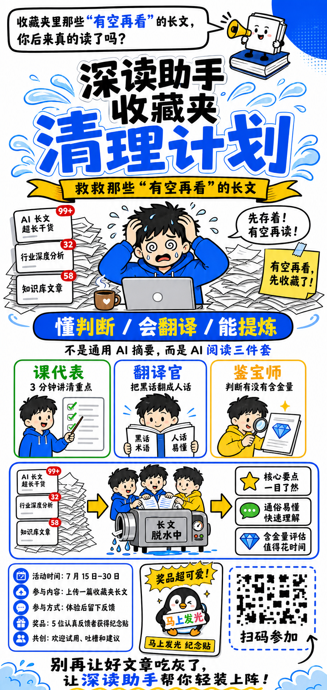
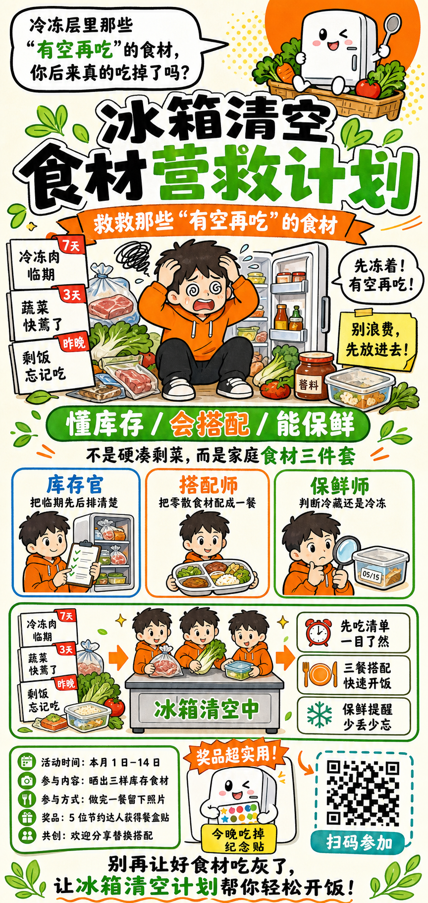
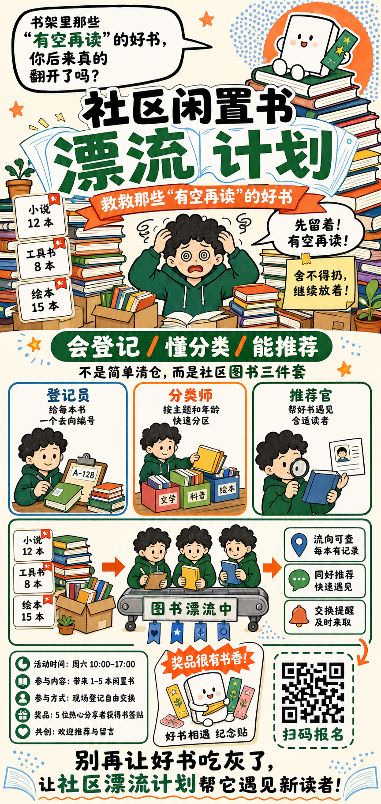

# 手绘卡通三件套式活动长图


## 核心要点

- **超长单列完成从痛点到报名的完整漏斗**：顶部提出收藏痛点，中部解释能力与处理流程，底部集中活动信息、奖品和入口，顺着纵向阅读自然完成转化。
- **黑蓝黄超大标题建立活动第一焦点**：白底配粗黑线，宝蓝承担核心识别，亮黄色强调行动信息，远距离也能快速抓住主题。
- **三角色卡把抽象能力人格化**：课代表、翻译官和鉴宝师分别对应提炼、翻译与判断，三张横排卡降低理解成本。
- **左输入—中处理—右结果解释产品价值**：纸山、压缩机和结果卡形成清晰因果链，把“长文脱水”转化为直观的视觉机制。
- **活动信息、奖品、入口与口号形成转化收口**：底部把参与条件、激励和行动入口集中呈现，避免长图读完后缺少下一步。

## Prompt

```plain text
目标：
生成一张超长竖向手绘卡通活动介绍海报，输出画布尺寸必须为 1728×3648 像素或同等 9:19 比例，禁止生成 2:3、3:4 或 A4 画布，用于发起“深读助手收藏夹清理计划”。采用白色背景、粗黑描边、鲜明宝蓝与亮黄色强调色、少量浅蓝网点和清晰中文排版，达到故事感强、活动机制完整、长图阅读顺畅、主要文字大而可读的商业海报完成度。

主题：
画面表现“拯救收藏夹里一直有空再看的长文”的互动体验活动。
核心场景是顶部一位黑发蓝衣青年被文章和通知淹没，中部用“课代表、翻译官、鉴宝师”三张卡解释深读助手的阅读三件套，再通过脱水压缩机式流程把长文变成重点、白话和含金量评估，底部给出活动时间、参与方式、奖品和不可扫码的二维码占位；主要角色和物件包括青年、书本吉祥物、笔记本电脑、纸山、通知卡、三张能力卡、压缩机、水滴、结果卡、活动信息卡、奖品展示卡和二维码占位框。
整体采用手绘白板漫画、圆润二维卡通人物、粗黑马克笔线、宝蓝标题与边框、亮黄重点、红色未读角标和绿色完成勾，呈现幽默、直白、实用、适合内部活动传播的气质。

画面：
- 整体布局：固定 1728×3648、严格 9:19 超长竖版。顶部约 43% 为问题引入、超大活动标题和痛点人物；中部约 34% 为三项能力卡与输入到输出流程；底部约 23% 为活动信息、奖品、二维码占位和口号。所有内容沿单列向下阅读，左右边距约占画布宽度 4%，区块间用浅蓝弧形水花和粗蓝边框衔接。
- 顶部引问区：最上方左侧放黑边白色圆角思考气泡，内文“收藏夹里那些‘有空再看’的长文，你后来真的读了吗？”，其中“有空再看”用宝蓝；气泡尾巴指向右上方坐在厚书上的黑白小书本吉祥物，吉祥物拿一只小喇叭。右上角用一个大蓝色圆形和浅蓝网点装饰留白。
- 超大标题区：画布上部中央用三行粗黑与宝蓝混排大字“深读助手”“收藏夹 清理计划”，其中“清理计划”使用超大宝蓝字并带白色描边和浅蓝水花；标题下方放亮黄色缎带，黑字写“救救那些‘有空再看’的长文”。标题是全图第一视觉焦点，占画布宽度约 88%。
- 顶部痛点场景：标题下方中央画黑发青年穿蓝色卫衣坐在灰色笔记本电脑前，双手抓头、眼睛转圈、满头汗滴。左右堆起高高的白色纸山，纸张边缘凌乱但不遮挡脸。左侧叠放三张白色通知卡，分别为“AI 长文 超长干货”“行业深度分析”“知识库文章”，右上带红色未读角标“99+”“32”“58”；右侧白色气泡写“先存着！有空再读！”，黄色便利贴写“有空再看，先收藏了！”。桌上放棕色咖啡杯。
- 中部价值标题：痛点场景下方放横跨约 76% 宽度的宝蓝圆角胶囊条，白字与黄字混排“懂判断 / 会翻译 / 能提炼”；其下居中写“不是通用 AI 摘要，而是 AI 阅读三件套”，其中“阅读三件套”用宝蓝。
- 三张能力卡：横排三张等宽白底圆角卡，统一粗边框但颜色分别绿色、宝蓝、亮黄。左卡标题“课代表”，说明“3 分钟讲清重点”，画青年穿蓝衣拿指示棒指向绿色勾选清单；中卡标题“翻译官”，说明“把黑话翻成人话”，画青年读一本蓝色打开的书，左右页写“黑话术语”“人话易懂”；右卡标题“鉴宝师”，说明“判断有没有含金量”，画青年穿黄色上衣拿放大镜检查纸上的蓝色钻石。三个人物发型与圆脸特征统一，动作完整。
- 输入到输出流程：三卡下方放一个横向粗蓝边圆角大框。左侧约 28% 是三张未读通知卡与纸山，中间偏左用黄色箭头指向三位卡通角色合力把纸张送进银灰色“长文脱水中”压缩机，压缩机下方落下蓝色水滴；再用黄色箭头指向右侧约 30% 的三张白色结果卡。结果卡从上到下为“核心要点 一目了然”配黄色星星、“通俗易懂 快速理解”配绿色对话气泡、“含金量评估 值得花时间”配蓝色钻石。流程从左向右，箭头方向不能反转。
- 底部活动信息区：左下约 42% 放白底蓝边圆角信息卡，五行蓝色圆图标加黑字，依次为“活动时间：7 月 15 日–30 日”“参与内容：上传一篇收藏夹长文”“参与方式：体验后留下反馈”“奖品：5 位认真反馈者获得纪念贴”“共创：欢迎试用、吐槽和建议”。行距宽、字号大。
- 底部奖品区：中下约 26% 放一张倾斜的白色奖品展示卡，顶部黄色爆炸气泡写“奖品超可爱！”，卡内展示一只无品牌黑白小企鹅抱着彩色字牌的冰箱贴，底部只放“马上发光 纪念贴”短标签，不出现真实社交平台界面。
- 底部二维码区：右下约 27% 放一个蓝色虚线圆角框，内部是明确不可扫码、随机几何点阵的黑白二维码样式占位图，旁边画黑色弯曲箭头，框下写“扫码参加”。点阵必须失真且不可识别，不携带真实链接。
- 最底部口号：跨全宽放粗黑大字“别再让好文章吃灰了，让深读助手帮你轻装上阵！”，其中“深读助手”用宝蓝；下方一条亮黄色手绘波浪线，左右下角用浅蓝云朵收边。
- 叙事流向：从顶部提问进入超大活动标题，向下看到收藏痛点，再阅读三种能力和脱水流程，最后进入活动规则、奖品与参加入口。
- 连接关系：标题下水花指向痛点场景；中部流程只用两枚黄色右箭头连接输入、压缩机和结果；底部弯曲箭头只指向二维码占位框。
- 视觉表现：白底、粗黑手绘线、宝蓝承担标题与边框，亮黄用于缎带、关键词和箭头，绿色用于课代表与完成结果，红色只用于未读角标；浅蓝网点和水花作轻装饰，人物是二维圆润卡通，不使用复杂阴影。
- 遮挡关系：超大标题与吉祥物分离；纸山只包围青年，不遮脸和双手；三张能力卡互不重叠；流程箭头不穿文字；奖品卡与二维码框保持清晰间隙；底部口号不压活动信息。

文字：
- 顶部提问：“收藏夹里那些‘有空再看’的长文，你后来真的读了吗？”
- 主标题：“深读助手 收藏夹清理计划”
- 黄色缎带：“救救那些‘有空再看’的长文”
- 痛点气泡：“先存着！有空再读！”
- 痛点便签：“有空再看，先收藏了！”
- 价值标题：“懂判断 / 会翻译 / 能提炼”
- 价值说明：“不是通用 AI 摘要，而是 AI 阅读三件套”
- 能力卡：“课代表”“3 分钟讲清重点”“翻译官”“把黑话翻成人话”“鉴宝师”“判断有没有含金量”
- 压缩机：“长文脱水中”
- 结果卡：“核心要点 一目了然”“通俗易懂 快速理解”“含金量评估 值得花时间”
- 活动信息：“活动时间：7 月 15 日–30 日”“参与内容：上传一篇收藏夹长文”“参与方式：体验后留下反馈”“奖品：5 位认真反馈者获得纪念贴”“共创：欢迎试用、吐槽和建议”
- 奖品标题：“奖品超可爱！”
- 奖品标签：“马上发光 纪念贴”
- 二维码说明：“扫码参加”
- 底部口号：“别再让好文章吃灰了，让深读助手帮你轻装上阵！”

所有文字必须逐字准确、清晰可读，并放在对应区域的独立容器中。没有指定的文字不要自行添加。

要求：
- 必须：输出 1728×3648 或同等严格 9:19 超长画布，比例误差不超过 3%；顶部提问、超大标题、痛点人物、中部三卡、输入到输出流程、底部活动信息、奖品、二维码占位和口号全部齐全；三张能力卡横排，流程从左到右；主要中文字号大、留白足。
- 禁止：禁止写实照片、3D 渲染、深色背景、企业图库风；禁止真实品牌 Logo、真实软件图标、真实网址、可扫码二维码、联系人和水印；禁止画布变短、区块缺失、三卡改为竖排、流程反向、人物多手多指、纸山遮脸、文字溢出或底部被裁切。
```

## Prompt 自检

- 状态：通过
- 轮次：1/3
- 复现充分度：98/100
- 构图得分：99/100
- 有意排除：真实品牌 Logo、软件图标、真实网址、可扫码二维码、联系人



## 类似图片：

### 冰箱清空食材营救计划



#### Prompt

```plain text
目标：
生成一张超长竖向手绘卡通生活活动海报，输出画布尺寸必须为 1728×3648 像素或同等 9:19 比例，禁止生成 2:3、3:4 或 A4 画布，用于发起“冰箱清空食材营救计划”。采用暖白背景、粗黑描边、鲜明草绿与亮橙强调色、少量浅黄网点和清晰中文排版，达到故事感强、活动机制完整、长图阅读顺畅、主要文字大而可读的商业海报完成度。

主题：
画面表现“拯救冰箱里一直等着有空再吃的食材”的家庭共创活动。
核心场景是顶部一位短发橙衣青年被冷冻袋、蔬菜和过期提醒包围，中部用“库存官、搭配师、保鲜师”三张卡解释食材清空三件套，再通过厨房料理台式流程把杂乱库存变成先吃清单、三餐搭配和保鲜提醒，底部给出活动时间、参与方式、奖品和不可扫码二维码占位；主要角色和物件包括青年、冰箱吉祥物、打开的冰箱、食材袋、三张能力卡、料理台、餐盘、结果卡、活动信息卡、奖品展示卡和二维码占位框。
整体采用手绘白板漫画、圆润二维卡通人物、粗黑马克笔线、草绿标题与边框、亮橙重点、红色临期角标和黄色完成星，呈现幽默、清爽、节约又有生活气的活动氛围。

画面：
- 整体布局：固定 1728×3648、严格 9:19 超长竖版。顶部约 43% 为问题引入、超大活动标题和冰箱痛点人物；中部约 34% 为三项能力卡与库存到餐桌流程；底部约 23% 为活动信息、奖品、二维码占位和口号。所有内容沿单列向下阅读，区块间用浅绿叶片与橙色手绘线衔接。
- 顶部引问区：左侧黑边白色圆角思考气泡写“冷冻层里那些‘有空再吃’的食材，你后来真的吃掉了吗？”，其中“有空再吃”用草绿；气泡尾巴指向右上方坐在蔬菜筐上的白色小冰箱吉祥物，吉祥物拿一把小勺。右上用大橙色圆形和浅黄网点装饰。
- 超大标题区：中央用三行粗黑与草绿混排大字“冰箱清空”“食材 营救计划”，其中“营救计划”使用超大草绿字并带白色描边和浅绿叶片；标题下方亮橙缎带写“救救那些‘有空再吃’的食材”。
- 顶部痛点场景：标题下方中央画短发青年穿橙色卫衣蹲在敞开的冰箱前，双手抱头、眼睛转圈。左右堆满贴着日期的冷冻袋、蔫掉的蔬菜、半盒酱料和剩饭盒。左侧叠放三张白色提醒卡“冷冻肉 临期”“蔬菜 快蔫了”“剩饭 忘记吃”，右上带红色角标“7 天”“3 天”“昨晚”；右侧气泡写“先冻着！有空再吃！”，黄色便利贴写“别浪费，先放进去！”。
- 中部价值标题：痛点下方草绿圆角胶囊条，白字与橙字混排“懂库存 / 会搭配 / 能保鲜”；其下写“不是硬凑剩菜，而是家庭食材三件套”，其中“食材三件套”用草绿。
- 三张能力卡：横排三张白底圆角卡，边框分别蓝绿、亮橙、草绿。左卡标题“库存官”，说明“把临期先后排清楚”，画青年拿清单核对冰箱；中卡标题“搭配师”，说明“把零散食材配成一餐”，画青年端着三格餐盘；右卡标题“保鲜师”，说明“判断冷藏还是冷冻”，画青年拿放大镜查看保鲜盒日期。三个人物发型与圆脸特征统一。
- 库存到餐桌流程：三卡下方粗绿边大框。左侧约 28% 是三张提醒卡与食材堆，中间偏左用橙色箭头指向三位角色合力把食材送上银灰色“冰箱清空中”料理台，料理台下方落下绿色叶片；再用橙色箭头指向右侧三张白色结果卡。结果卡从上到下为“先吃清单 一目了然”配红色时钟、“三餐搭配 快速开饭”配橙色餐盘、“保鲜提醒 少丢少忘”配绿色雪花。流程从左向右。
- 底部活动信息区：左下白底绿边圆角信息卡，五行圆图标加黑字：“活动时间：本月 1 日–14 日”“参与内容：晒出三样库存食材”“参与方式：做完一餐留下照片”“奖品：5 位节约达人获得餐盒贴”“共创：欢迎分享替换搭配”。
- 底部奖品区：中下放倾斜白色奖品卡，顶部橙色爆炸气泡写“奖品超实用！”，卡内展示无品牌小冰箱抱着彩色餐盒贴，底部写“今晚吃掉 纪念贴”。
- 底部二维码区：右下蓝绿色虚线圆角框，内部为明确不可扫码的随机黑白几何点阵，占位框下写“扫码参加”，点阵不携带链接。
- 最底部口号：跨全宽粗黑大字“别再让好食材吃灰了，让冰箱清空计划帮你轻松开饭！”，其中“冰箱清空计划”用草绿；下方亮橙手绘波浪线，左右用浅绿叶片收边。
- 叙事流向：顶部提问进入超大标题，向下看到食材堆积痛点，再阅读三种能力和清空流程，最后进入活动规则、奖品与参加入口。
- 连接关系：中部流程只用两枚橙色右箭头连接库存、料理台和结果；底部弯曲箭头只指向二维码占位框。
- 视觉表现：暖白底、粗黑线、草绿承担标题与边框，亮橙用于缎带、箭头和强调，红色用于临期，黄色用于提示；浅绿叶片与浅黄网点作装饰，人物二维卡通、无复杂阴影。
- 遮挡关系：超大标题与吉祥物分离；食材只围绕人物与冰箱，不遮脸；三张能力卡互不重叠；箭头不穿文字；奖品卡与二维码框保持间隙；底部口号不压活动信息。

文字：
- 顶部提问：“冷冻层里那些‘有空再吃’的食材，你后来真的吃掉了吗？”
- 主标题：“冰箱清空 食材营救计划”
- 黄色缎带：“救救那些‘有空再吃’的食材”
- 痛点气泡：“先冻着！有空再吃！”
- 痛点便签：“别浪费，先放进去！”
- 价值标题：“懂库存 / 会搭配 / 能保鲜”
- 价值说明：“不是硬凑剩菜，而是家庭食材三件套”
- 能力卡：“库存官”“把临期先后排清楚”“搭配师”“把零散食材配成一餐”“保鲜师”“判断冷藏还是冷冻”
- 料理台：“冰箱清空中”
- 结果卡：“先吃清单 一目了然”“三餐搭配 快速开饭”“保鲜提醒 少丢少忘”
- 活动信息：“活动时间：本月 1 日–14 日”“参与内容：晒出三样库存食材”“参与方式：做完一餐留下照片”“奖品：5 位节约达人获得餐盒贴”“共创：欢迎分享替换搭配”
- 奖品标题：“奖品超实用！”
- 奖品标签：“今晚吃掉 纪念贴”
- 二维码说明：“扫码参加”
- 底部口号：“别再让好食材吃灰了，让冰箱清空计划帮你轻松开饭！”

所有文字必须逐字准确、清晰可读，并放在对应区域的独立容器中。没有指定的文字不要自行添加。

要求：
- 必须：输出 1728×3648 或同等严格 9:19 超长画布，比例误差不超过 3%；顶部提问、超大标题、痛点人物、中部三卡、库存到餐桌流程、底部活动信息、奖品、二维码占位和口号齐全；三卡横排，流程从左到右；主要文字字号大。
- 禁止：禁止写实照片、3D 渲染、深色背景、企业图库风；禁止食品或零售品牌 Logo、真实软件图标、真实网址、可扫码二维码、联系人和水印；禁止画布变短、区块缺失、三卡竖排、流程反向、人物多手多指、食材遮脸、文字溢出或底部裁切。
```

### 社区闲置书漂流计划



#### Prompt

```plain text
目标：
生成一张超长竖向手绘卡通社区活动海报，输出画布尺寸必须为 1728×3648 像素或同等 9:19 比例，禁止生成 2:3、3:4 或 A4 画布，用于发起“社区闲置书漂流计划”。采用暖米白背景、粗黑描边、鲜明墨绿与珊瑚橙强调色、少量浅蓝网点和清晰中文排版，达到故事感强、活动机制完整、长图阅读顺畅、主要文字大而可读的商业海报完成度。

主题：
画面表现“拯救书架里一直等着有空再读的闲置书”的社区交换活动。
核心场景是顶部一位卷发绿衣居民被纸箱和书堆包围，中部用“登记员、分类师、推荐官”三张卡解释图书漂流三件套，再通过社区分拣台式流程把杂乱闲书变成流向记录、同好推荐和交换提醒，底部给出活动时间、参与方式、奖品和不可扫码二维码占位；主要角色和物件包括居民、会走路的小书吉祥物、书架、纸箱、图书、三张能力卡、分拣台、结果卡、活动信息卡、奖品展示卡和二维码占位框。
整体采用手绘白板漫画、圆润二维卡通人物、粗黑马克笔线、墨绿标题与边框、珊瑚橙重点、红色积压角标和蓝色推荐标记，呈现友好、环保、有人情味的社区共读气质。

画面：
- 整体布局：固定 1728×3648、严格 9:19 超长竖版。顶部约 43% 为问题引入、超大活动标题和书堆痛点人物；中部约 34% 为三项能力卡与书堆到新读者流程；底部约 23% 为活动信息、奖品、二维码占位和口号。所有内容沿单列向下阅读，区块间用浅蓝书页弧线和橙色手绘星点衔接。
- 顶部引问区：左侧黑边白色圆角气泡写“书架里那些‘有空再读’的好书，你后来真的翻开了吗？”，其中“有空再读”用墨绿；气泡尾巴指向右上方坐在厚书上的白色小书吉祥物，吉祥物拿一枚书签。右上用珊瑚橙圆形和浅蓝网点装饰。
- 超大标题区：中央三行粗黑与墨绿混排大字“社区闲置书”“漂流 计划”，其中“漂流计划”使用超大墨绿字并带白色描边与浅蓝翻页线；标题下方珊瑚橙缎带写“救救那些‘有空再读’的好书”。
- 顶部痛点场景：标题下方中央画卷发居民穿墨绿卫衣坐在书架和纸箱中间，双手抓头、眼睛转圈。左右堆起高高书山，书脊颜色丰富但不遮脸。左侧叠放三张白色提醒卡“小说 12 本”“工具书 8 本”“绘本 15 本”，右上带红色角标；右侧气泡写“先留着！有空再读！”，黄色便利贴写“舍不得扔，继续放着！”。
- 中部价值标题：痛点下方墨绿圆角胶囊条，白字与橙字混排“会登记 / 懂分类 / 能推荐”；其下写“不是简单清仓，而是社区图书三件套”，其中“图书三件套”用墨绿。
- 三张能力卡：横排三张白底圆角卡，边框分别浅蓝、珊瑚橙、墨绿。左卡标题“登记员”，说明“给每本书一个去向编号”，画居民拿夹板贴编号；中卡标题“分类师”，说明“按主题和年龄快速分区”，画居民把书放进彩色书箱；右卡标题“推荐官”，说明“帮好书遇见合适读者”，画居民拿放大镜看书与读者卡。三个人物发型和圆脸特征统一。
- 书堆到新读者流程：三卡下方粗绿边大框。左侧约 28% 是三张数量卡与书堆，中间偏左用珊瑚橙箭头指向三位角色合力把书送上银灰色“图书漂流中”分拣台，台下落下蓝色书签；再用橙色箭头指向右侧三张白色结果卡。结果卡从上到下为“流向可查 每本有记录”配蓝色地图针、“同好推荐 快速遇见”配绿色对话气泡、“交换提醒 及时来取”配珊瑚橙铃铛。流程从左向右。
- 底部活动信息区：左下白底绿边圆角信息卡，五行圆图标加黑字：“活动时间：周六 10:00–17:00”“参与内容：带来 1–5 本闲置书”“参与方式：现场登记自由交换”“奖品：5 位热心分享者获得书签贴”“共创：欢迎推荐与留言”。
- 底部奖品区：中下倾斜白色奖品卡，顶部珊瑚橙爆炸气泡写“奖品很有书香！”，卡内展示无品牌小书吉祥物抱着彩色书签贴，底部写“好书相遇 纪念贴”。
- 底部二维码区：右下墨绿虚线圆角框，内部为明确不可扫码的随机黑白几何点阵，框下写“扫码报名”，点阵不携带链接。
- 最底部口号：跨全宽粗黑大字“别再让好书吃灰了，让社区漂流计划帮它遇见新读者！”，其中“社区漂流计划”用墨绿；下方珊瑚橙手绘波浪线，左右用浅蓝翻页形状收边。
- 叙事流向：顶部提问进入活动标题，向下看到书堆痛点，再阅读三种能力和分拣流程，最后进入活动规则、奖品与报名入口。
- 连接关系：中部流程只用两枚珊瑚橙右箭头连接书堆、分拣台和结果；底部弯曲箭头只指向二维码占位框。
- 视觉表现：暖米白底、粗黑线、墨绿承担标题与边框，珊瑚橙用于缎带、箭头和强调，红色用于数量角标，浅蓝用于书页和推荐；人物二维卡通、无复杂阴影。
- 遮挡关系：超大标题与吉祥物分离；书堆只围绕人物，不遮脸与双手；三张能力卡互不重叠；流程箭头不穿文字；奖品卡与二维码框保持间隙；底部口号不压活动信息。

文字：
- 顶部提问：“书架里那些‘有空再读’的好书，你后来真的翻开了吗？”
- 主标题：“社区闲置书 漂流计划”
- 黄色缎带：“救救那些‘有空再读’的好书”
- 痛点气泡：“先留着！有空再读！”
- 痛点便签：“舍不得扔，继续放着！”
- 价值标题：“会登记 / 懂分类 / 能推荐”
- 价值说明：“不是简单清仓，而是社区图书三件套”
- 能力卡：“登记员”“给每本书一个去向编号”“分类师”“按主题和年龄快速分区”“推荐官”“帮好书遇见合适读者”
- 分拣台：“图书漂流中”
- 结果卡：“流向可查 每本有记录”“同好推荐 快速遇见”“交换提醒 及时来取”
- 活动信息：“活动时间：周六 10:00–17:00”“参与内容：带来 1–5 本闲置书”“参与方式：现场登记自由交换”“奖品：5 位热心分享者获得书签贴”“共创：欢迎推荐与留言”
- 奖品标题：“奖品很有书香！”
- 奖品标签：“好书相遇 纪念贴”
- 二维码说明：“扫码报名”
- 底部口号：“别再让好书吃灰了，让社区漂流计划帮它遇见新读者！”

所有文字必须逐字准确、清晰可读，并放在对应区域的独立容器中。没有指定的文字不要自行添加。

要求：
- 必须：输出 1728×3648 或同等严格 9:19 超长画布，比例误差不超过 3%；顶部提问、超大标题、痛点人物、中部三卡、书堆到新读者流程、底部活动信息、奖品、二维码占位和口号齐全；三卡横排，流程从左到右；主要文字字号大。
- 禁止：禁止写实照片、3D 渲染、深色背景、企业图库风；禁止出版社或社区品牌 Logo、真实软件图标、真实网址、可扫码二维码、联系人和水印；禁止画布变短、区块缺失、三卡竖排、流程反向、人物多手多指、书堆遮脸、文字溢出或底部裁切。
```
