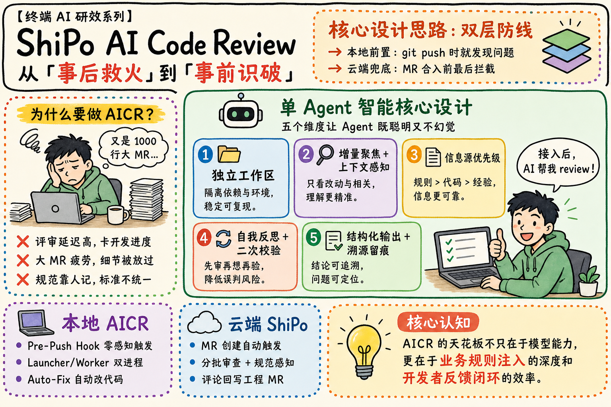
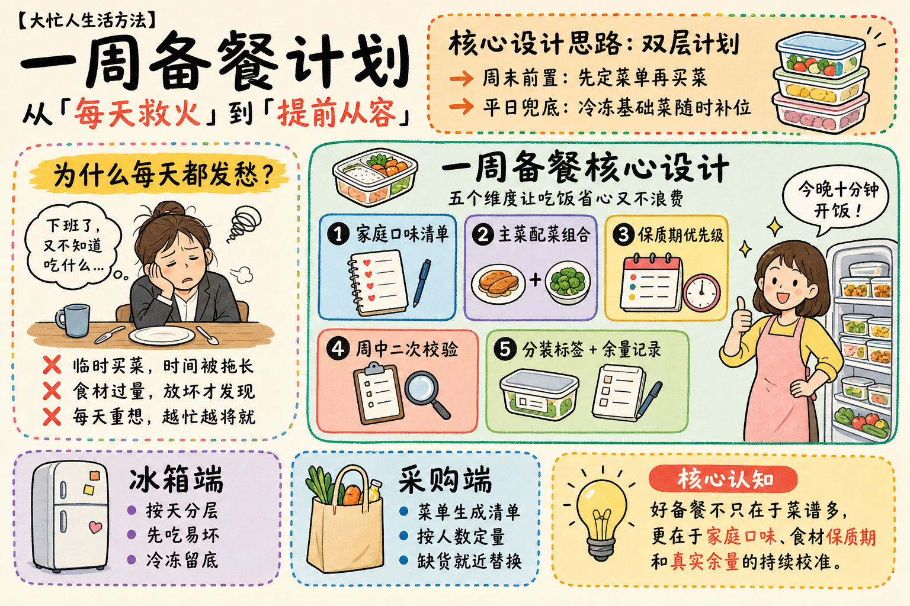
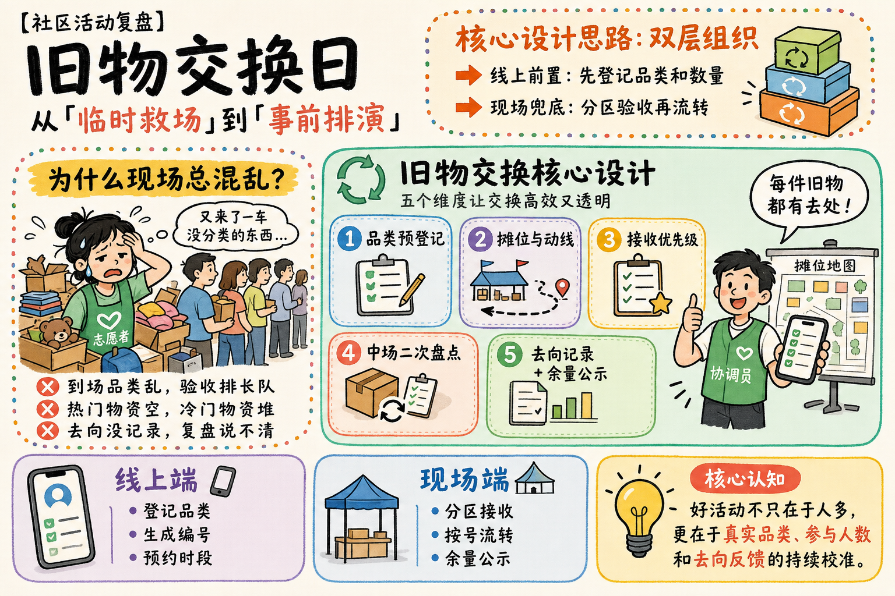

# 手绘技术方案信息图


## 核心要点

- **先用一句转变定义价值**：标题直接把“事后救火”切换为“事前识破”，让读者先获得方案结论。
- **痛点与方案左右对应**：左侧解释为什么做，右侧解释如何做，阅读无需在多个区块之间来回跳转。
- **五维卡片拆解复杂核心**：把 Agent 设计拆成 3+2 的五张粉彩卡，兼顾信息密度和扫描效率。
- **双层防线补全系统边界**：顶部说明本地前置与云端兜底，底部再分别展开两端职责。
- **核心认知完成方法论收口**：右下大卡把具体方案提升为规则注入与反馈闭环，增强迁移价值。

## Prompt

```plain text
目标：
生成一张横向手绘技术方案信息图，比例严格为 3:2，用于内部工程技术分享。采用暖米白背景、粗黑马克笔线条、柔和彩色卡片和多彩虚线边框，达到模块清楚、阅读路径自然、中文清晰可读、不是密集 PPT 的完成度。

主题：
画面表现“AI Code Review 从事后救火到事前识破”的双层防线方案。
核心场景是左侧疲惫开发者面对大代码评审，右侧用单 Agent 五维设计解决问题，底部再说明本地前置、云端兜底和核心认知；主要角色和物件包括疲惫开发者、开心开发者、机器人图标、五张彩色能力卡、电脑、云朵、灯泡和检查清单。
整体采用手绘白板插画、轻松但专业的工程图解、粗黑马克笔、柔和薄荷绿/浅蓝/淡紫/珊瑚橙/浅黄模块，呈现友好、实用、可用于技术总结的气质。

画面：
- 整体布局：固定 3:2 横版，顶部约 24% 分为左侧主标题区和右侧橙色设计思路框；中部约 48% 分为左侧痛点面板和右侧大主面板；底部约 28% 横排本地方案、云端方案、核心认知三块。所有面板之间保留均匀暖米白间隙。
- 顶部左侧：约占宽度 55%，先放一行小号黑体系列名，再放超大英文标题“ShiPo AI Code Review”，下方一行中文副标题，其中“事后救火”和“事前识破”用珊瑚红加粗，其余黑色。
- 顶部右侧：约占宽度 42% 的浅橙圆角说明框，多彩点状虚线边框；标题“核心设计思路：双层防线”最大，下面两行用右箭头说明本地前置和云端兜底，右上角放层叠图标。
- 中部左侧：约占宽度 31% 的白底圆角痛点面板，多彩点状虚线边框；顶部黄色笔刷底标题“为什么要做 AICR？”；中间放疲惫开发者托腮坐在桌前，气泡写“大 MR 又来了”；底部三行红叉痛点，行距宽、字号大。
- 中部右侧：约占宽度 66% 的薄荷绿大圆角主面板，深绿细边；顶部居中放机器人图标和标题“单 Agent 智能核心设计”，下方短副标题。
- 五维卡片：主面板内上排三张、下排两张同宽彩色圆角卡，颜色依次浅蓝、淡紫、浅黄、珊瑚橙、嫩绿。每张左上放编号和小图标，标题粗体，下面仅两至三行短说明。上排卡为“独立工作区”“增量聚焦 + 上下文感知”“信息源优先级”；下排为“自我反思 + 二次校验”“结构化输出 + 溯源留痕”。
- 主面板右下：一位开心开发者坐在电脑前竖起大拇指，屏幕显示绿色勾选清单；旁边气泡写“接入后，AI 帮我 review！”，角色不遮挡卡片。
- 底部左：浅紫圆角面板，紫色点状虚线边框，标题“本地 AICR”配笔记本图标，下面三行短要点。
- 底部中：浅蓝圆角面板，蓝色点状虚线边框，标题“云端 ShiPo”配云朵图标，下面三行短要点。
- 底部右：约占底部宽度 49% 的浅黄色圆角核心认知卡，橙色点状虚线边框；左侧放大灯泡，顶部珊瑚色胶囊标签“核心认知”，右侧为三至四行结论，关键词“业务规则注入”和“开发者反馈闭环”用珊瑚红。
- 叙事流向：先读顶部价值转变与双层防线，再读左侧痛点，进入右侧五维 Agent 设计，最后读底部本地、云端与方法论总结。
- 连接关系：不画复杂架构箭头，仅用顶部两条右箭头和面板的空间顺序引导；卡片编号按 1 至 5 阅读。
- 视觉表现：暖米白纸面、粗黑手绘线、轻微不规则边缘；面板用低饱和粉彩，虚线边框使用橙、绿、蓝、紫小圆点；角色为简单二维卡通，不使用 3D 与写实光影。
- 遮挡关系：标题、痛点、五张能力卡、角色、底部三块彼此分离；卡片文字不被图标遮挡；角色只占主面板右下空位。

文字：
- 系列名：“【终端 AI 研效系列】”
- 主标题：“ShiPo AI Code Review”
- 副标题：“从「事后救火」到「事前识破」”
- 顶部框标题：“核心设计思路：双层防线”
- 顶部要点：“本地前置：git push 时就发现问题”“云端兜底：MR 合入前最后拦截”
- 痛点标题：“为什么要做 AICR？”
- 气泡：“又是 1000 行大 MR...”
- 痛点：“评审延迟高，卡开发进度”“大 MR 疲劳，细节被放过”“规范靠人记，标准不统一”
- 主面板标题：“单 Agent 智能核心设计”
- 主面板副标题：“五个维度让 Agent 既聪明又不幻觉”
- 卡片标题：“1 独立工作区”“2 增量聚焦 + 上下文感知”“3 信息源优先级”“4 自我反思 + 二次校验”“5 结构化输出 + 溯源留痕”
- 角色气泡：“接入后，AI 帮我 review！”
- 底部左：“本地 AICR”“Pre-Push Hook 零感知触发”“Launcher/Worker 双进程”“Auto-Fix 自动改代码”
- 底部中：“云端 ShiPo”“MR 创建自动触发”“分批审查 + 规范感知”“评论回写工程 MR”
- 底部右标题：“核心认知”
- 底部右正文：“AICR 的天花板不只在于模型能力，更在于业务规则注入的深度和开发者反馈闭环的效率。”

所有文字必须逐字准确、清晰可读，并放在对应区域的独立容器中。没有指定的文字不要自行添加。

要求：
- 必须：严格 3:2 横版；顶部双栏、中部左痛点右主设计、底部三块结构齐全；五张能力卡按 3+2 排布且编号连续；主要文字可读，面板留白充足；整体像手绘技术总结图。
- 禁止：禁止写实照片、3D 渲染、深色背景、企业图库风、复杂架构图、细小难读段落；禁止面板重叠、卡片缺失、编号重复、文字溢出、箭头混乱、品牌 Logo、网址和水印。
```

## Prompt 自检

- 状态：通过
- 轮次：1/3
- 复现充分度：97/100
- 构图得分：98/100
- 有意排除：真实品牌 Logo



## 类似图片：

### 家庭一周备餐计划



#### Prompt

```plain text
目标：
生成一张严格 3:2 的横向手绘生活方案信息图，用于家庭备餐方法分享。采用暖米白背景、粗黑马克笔线条、柔和彩色卡片和多彩点状虚线边框，达到模块清楚、中文易读、像完成度高的方法总结图而不是密集 PPT。

主题：
画面表现“家庭一周备餐从每天救火到提前从容”的双层计划方法。
核心场景是左侧疲惫上班族面对晚饭难题，右侧用五张卡拆解备餐核心设计，底部说明冰箱端、采购端和核心认知；主要角色和物件包括疲惫上班族、开心家庭主理人、冰箱图标、五张能力卡、购物袋、餐盒、灯泡与检查清单。
整体采用手绘白板插画、轻松实用的生活图解、粗黑马克笔和浅蓝/淡紫/浅黄/珊瑚橙/嫩绿粉彩模块，呈现温暖、聪明、可立即执行的家庭气质。

画面：
- 整体布局：3:2 横版，顶部约 24% 分为左侧主标题区和右侧橙色计划框；中部约 48% 分为左侧痛点面板和右侧薄荷绿大主面板；底部约 28% 横排冰箱端、采购端、核心认知三块。
- 顶部左侧：小号系列名“大忙人生活方法”，下面超大主标题“一周备餐计划”，再下一行副标题，其中“每天救火”和“提前从容”用珊瑚红。
- 顶部右侧：浅橙圆角说明框，多彩点状边框；标题“核心设计思路：双层计划”，两行右箭头说明“周末前置：先定菜单再买菜”“平日兜底：冷冻基础菜随时补位”，右上放层叠餐盒图标。
- 中部左侧：白底圆角痛点面板，多彩点状边框；顶部黄色笔刷标题“为什么每天都发愁？”；中间画疲惫上班族托腮坐在空餐桌前，气泡“下班了，又不知道吃什么”；底部三行红叉痛点。
- 中部右侧：薄荷绿大圆角主面板，顶部餐盒图标和标题“一周备餐核心设计”，下方短副标题。
- 五张卡片：上排三张、下排两张，颜色浅蓝、淡紫、浅黄、珊瑚橙、嫩绿；编号 1 至 5，图标与粗体标题清楚。标题依次为“家庭口味清单”“主菜配菜组合”“保质期优先级”“周中二次校验”“分装标签 + 余量记录”。
- 主面板右下：开心的家庭主理人站在装满餐盒的冰箱旁竖起大拇指，气泡“今晚十分钟开饭！”，不能遮住卡片。
- 底部左：浅紫面板，标题“冰箱端”配冰箱图标，三行短要点“按天分层”“先吃易坏”“冷冻留底”。
- 底部中：浅蓝面板，标题“采购端”配购物袋图标，三行短要点“菜单生成清单”“按人数定量”“缺货就近替换”。
- 底部右：浅黄色大核心认知卡，左侧灯泡，顶部珊瑚色胶囊“核心认知”，正文强调“家庭口味”“保质期”“真实余量”。
- 阅读路径：先读顶部价值转变与双层计划，再读左侧痛点，进入右侧五张设计卡，最后读底部两端协同和方法论。
- 视觉表现：暖米白纸面、粗黑不规则线条、低饱和粉彩、多彩点状虚线；二维卡通人物，不使用写实与 3D。
- 遮挡关系：所有标题、卡片、角色与底部面板分离；角色只占主面板右下留白。

文字：
- 系列名：“【大忙人生活方法】”
- 主标题：“一周备餐计划”
- 副标题：“从「每天救火」到「提前从容」”
- 顶部框：“核心设计思路：双层计划”“周末前置：先定菜单再买菜”“平日兜底：冷冻基础菜随时补位”
- 痛点标题：“为什么每天都发愁？”
- 气泡：“下班了，又不知道吃什么...”
- 痛点：“临时买菜，时间被拖长”“食材过量，放坏才发现”“每天重想，越忙越将就”
- 主面板标题：“一周备餐核心设计”
- 主面板副标题：“五个维度让吃饭省心又不浪费”
- 卡片：“1 家庭口味清单”“2 主菜配菜组合”“3 保质期优先级”“4 周中二次校验”“5 分装标签 + 余量记录”
- 角色气泡：“今晚十分钟开饭！”
- 底部左：“冰箱端”“按天分层”“先吃易坏”“冷冻留底”
- 底部中：“采购端”“菜单生成清单”“按人数定量”“缺货就近替换”
- 核心认知：“好备餐不只在于菜谱多，更在于家庭口味、食材保质期和真实余量的持续校准。”

所有文字必须逐字准确、清晰可读，并放在对应区域的独立容器中。没有指定的文字不要自行添加。

要求：
- 必须：严格 3:2；顶部双栏、中部左痛点右五卡、底部三块齐全；五卡 3+2 排布且编号连续；主要文字可读、留白充足。
- 禁止：禁止写实照片、3D 渲染、深色背景、企业图库风、复杂流程箭头、密集小字；禁止卡片缺失、文字溢出、角色遮挡、品牌 Logo、网址和水印。
```

### 社区旧物交换活动



#### Prompt

```plain text
目标：
生成一张严格 3:2 的横向手绘公共活动方案信息图，用于社区志愿活动复盘分享。采用暖米白背景、粗黑马克笔线条、柔和彩色卡片和多彩点状虚线边框，达到模块清楚、中文易读、像方法总结图而不是密集 PPT。

主题：
画面表现“社区旧物交换从临时救场到事前排演”的双层组织方法。
核心场景是左侧疲惫志愿者面对现场混乱，右侧用五张卡拆解活动核心设计，底部说明线上预登记、线下执行和核心认知；主要角色和物件包括疲惫志愿者、开心活动协调员、交换箱图标、五张能力卡、手机、摊位地图、灯泡与检查清单。
整体采用手绘白板插画、轻松专业的社区运营图解、粗黑马克笔和浅蓝/淡紫/浅黄/珊瑚橙/嫩绿粉彩模块，呈现友好、可信、可复制的组织气质。

画面：
- 整体布局：3:2 横版，顶部约 24% 分为左侧主标题区和右侧橙色双层组织框；中部约 48% 分为左侧痛点面板和右侧薄荷绿大主面板；底部约 28% 横排线上端、现场端、核心认知三块。
- 顶部左侧：小号系列名“社区活动复盘”，下面超大标题“旧物交换日”，下一行副标题，其中“临时救场”和“事前排演”用珊瑚红。
- 顶部右侧：浅橙圆角说明框，多彩点状边框；标题“核心设计思路：双层组织”，两行右箭头说明“线上前置：先登记品类和数量”“现场兜底：分区验收再流转”，右上放层叠交换箱图标。
- 中部左侧：白底圆角痛点面板，多彩点状边框；黄色笔刷标题“为什么现场总混乱？”；中间画疲惫志愿者被纸箱和排队人群包围，气泡“又来了一车没分类的东西”；底部三行红叉痛点。
- 中部右侧：薄荷绿大圆角主面板，顶部循环箭头图标和标题“旧物交换核心设计”，下方短副标题。
- 五张卡片：上排三张、下排两张，颜色依次浅蓝、淡紫、浅黄、珊瑚橙、嫩绿；编号 1 至 5，标题依次为“品类预登记”“摊位与动线”“接收优先级”“中场二次盘点”“去向记录 + 余量公示”。
- 主面板右下：开心协调员站在整齐摊位地图旁竖起大拇指，手机屏幕显示绿色勾选清单，气泡“每件旧物都有去处！”，不能遮住卡片。
- 底部左：浅紫面板，标题“线上端”配手机图标，三行短要点“登记品类”“生成编号”“预约时段”。
- 底部中：浅蓝面板，标题“现场端”配帐篷图标，三行短要点“分区接收”“按号流转”“余量公示”。
- 底部右：浅黄色核心认知卡，左侧灯泡，顶部珊瑚色胶囊“核心认知”，正文强调“真实品类”“参与人数”“去向反馈”。
- 阅读路径：先读顶部价值转变与双层组织，再读左侧痛点，进入右侧五张设计卡，最后读底部线上、现场与方法论。
- 视觉表现：暖米白纸面、粗黑手绘线、低饱和粉彩、多彩点状虚线；二维卡通人物，不使用写实和 3D。
- 遮挡关系：标题、痛点、五张卡、角色与底部面板分离；纸箱不能压住文字；角色只占主面板右下留白。

文字：
- 系列名：“【社区活动复盘】”
- 主标题：“旧物交换日”
- 副标题：“从「临时救场」到「事前排演」”
- 顶部框：“核心设计思路：双层组织”“线上前置：先登记品类和数量”“现场兜底：分区验收再流转”
- 痛点标题：“为什么现场总混乱？”
- 气泡：“又来了一车没分类的东西...”
- 痛点：“到场品类乱，验收排长队”“热门物资空，冷门物资堆”“去向没记录，复盘说不清”
- 主面板标题：“旧物交换核心设计”
- 主面板副标题：“五个维度让交换高效又透明”
- 卡片：“1 品类预登记”“2 摊位与动线”“3 接收优先级”“4 中场二次盘点”“5 去向记录 + 余量公示”
- 角色气泡：“每件旧物都有去处！”
- 底部左：“线上端”“登记品类”“生成编号”“预约时段”
- 底部中：“现场端”“分区接收”“按号流转”“余量公示”
- 核心认知：“好活动不只在于人多，更在于真实品类、参与人数和去向反馈的持续校准。”

所有文字必须逐字准确、清晰可读，并放在对应区域的独立容器中。没有指定的文字不要自行添加。

要求：
- 必须：严格 3:2；顶部双栏、中部左痛点右五卡、底部三块齐全；五卡 3+2 排布且编号连续；主要文字可读、留白充足。
- 禁止：禁止写实照片、3D 渲染、深色背景、企业图库风、复杂流程箭头和密集小字；禁止卡片缺失、文字溢出、纸箱遮挡、品牌 Logo、网址、二维码和水印。
```
