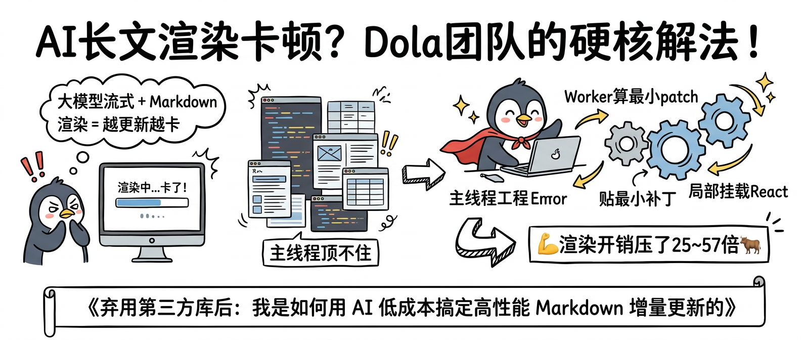
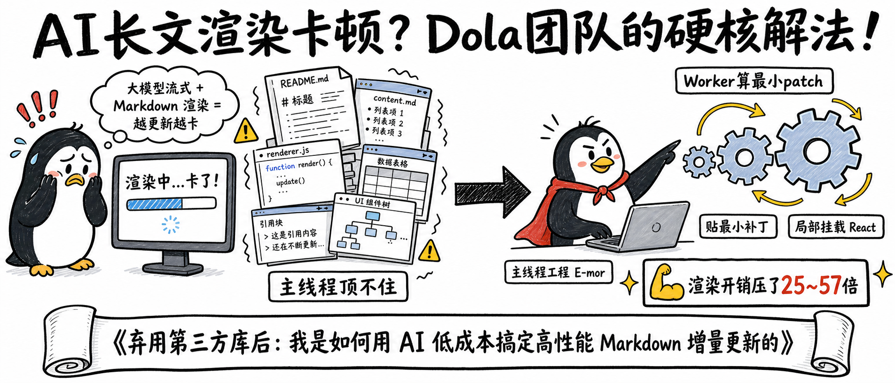
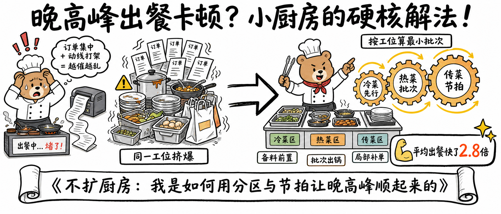
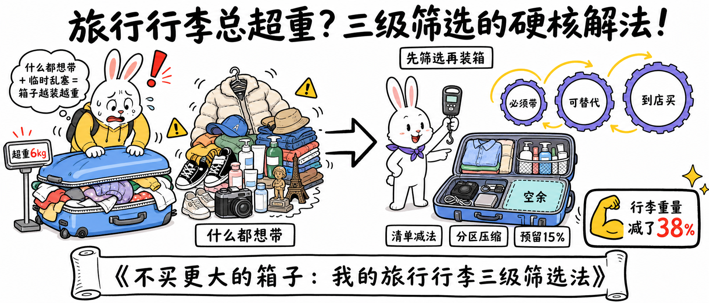

# 手绘技术解法长图



## 核心要点

- **横向因果链适合解释方案**：痛点、压力、转折、解法和结果沿单一方向展开，读者几秒内就能建立完整心智模型。
- **角色表情承担情绪对比**：焦虑与自信的两个卡通角色分别代表问题前后状态，让抽象技术变化具有直觉反馈。
- **窗口堆叠可视化系统压力**：代码、文档、表格和组件窗口前后错落，比单纯写“负载高”更具体。
- **箭头与手势统一阅读方向**：主箭头、角色视线和内部齿轮循环分工明确，不产生反向因果。
- **结果数字负责记忆收尾**：右下高对比徽章用量化成果结束叙事，再由底部长卷轴承接文章标题。

## Prompt

```plain text
目标：
生成一张横向手绘技术解释封面图，比例严格为 21:9，用于技术博客文章头图。采用白色背景、黑色马克笔线条和少量强调色，达到完成度高、因果链清楚、横向阅读顺畅、中文清晰可读。

主题：
画面表现“AI 长文渲染卡顿的硬核解法”。
核心场景是左侧出现流式 Markdown 渲染压力，右侧由企鹅工程师把最小补丁计算移到 Worker 并局部挂载组件；主要角色和物件包括焦虑企鹅、卡顿显示器、堆叠的 Markdown 文档与代码窗口、粗箭头、自信企鹅工程师、笔记本电脑、三个齿轮和结果徽章。
整体采用手绘白板插画、技术博客封面、干净涂鸦风、粗黑描边与简单扁平配色，呈现轻松但有工程解释力的气质。

画面：
- 整体布局：固定 21:9 超宽画布，上方约 22% 为横跨全图的大标题；主体约 58% 分为左侧痛点区、中部压力堆叠与转折区、右侧解决方案区；底部约 20% 为文章标题长卷轴。白色背景保留大面积留白，阅读严格从左向右。
- 顶部：大号黑色手写中文标题从左上延伸至右上，单行或紧凑两段但不得断成多层小标题，是第一视觉焦点。
- 左侧痛点区：约占宽度 24%，一只焦虑的卡通企鹅站在显示器旁，企鹅双手捂脸、眉头紧皱，头顶有红色惊叹号；显示器中有蓝色加载条和“渲染中...卡了！”，上方白色思考气泡用黑边写出卡顿原因。
- 中左压力区：约占宽度 25%，堆叠五至七个 Markdown 文档、代码窗口、表格和 UI 区块，窗口前后错落但边缘清晰；周围用颤动线和黄色惊叹号表现主线程压力，底部独立白底黑框标签写“主线程顶不住”。
- 中部转折：约占宽度 9%，一支粗黑手绘箭头从压力区水平指向右侧解决方案，箭头不能反向；箭头前后保持留白，避免与窗口或角色接触。
- 右侧解决方案区：约占宽度 34%，一只自信的企鹅工程师披红色小披风、坐在笔记本电脑前，面朝右侧齿轮；企鹅一手操作键盘、一手指向三个由小到大的蓝灰齿轮。齿轮之间用黄色弧形箭头形成顺时针处理环，但主因果仍从左向右。
- 右侧标签：在企鹅下方依次放三个短标签“主线程工程 E-mor”“贴最小补丁”“局部挂载 React”；在齿轮上方放“Worker 算最小 patch”。各标签分散在对应对象附近，不能挤成一行。
- 结果区：右下放一个白底黑框的长条徽章，左侧有黄色手臂图标，文字“渲染开销压了 25~57 倍”，周围有两颗黄色星光，是右侧第二视觉焦点。
- 底部：横跨约 90% 宽度的白色手绘长卷轴或横幅，黑色粗边，内部居中放文章标题；卷轴与主体之间保留空隙，不遮住人物和箭头。
- 叙事流向：左侧“大模型流式 + Markdown 导致越更新越卡”，中左“主线程压力堆叠”，中部箭头转折，右侧“Worker 算最小补丁并局部挂载”，最终落到性能数字。
- 连接关系：唯一主流程箭头必须从左向右；齿轮之间的循环箭头只表示内部处理；角色视线和手势都指向下一步。
- 视觉表现：白底、粗黑手绘线、轻微不规则笔触；焦虑警示用珊瑚红，技术窗口用浅蓝和灰，工程师披风用红色，齿轮用浅蓝，结果星光用亮黄；颜色只占少量面积，不使用渐变和纹理背景。
- 遮挡关系：标题、气泡、显示器、窗口堆、主箭头、企鹅工程师、齿轮、结果徽章和底部卷轴必须彼此分离；窗口可前后叠放但文字容器不可被遮住；企鹅手脚、翅膀和笔记本结构完整。

文字：
- 主标题：“AI长文渲染卡顿？Dola团队的硬核解法！”
- 思考气泡：“大模型流式 + Markdown 渲染 = 越更新越卡”
- 显示器：“渲染中...卡了！”
- 中部标签：“主线程顶不住”
- 右侧标签：“Worker算最小patch”“贴最小补丁”“局部挂载React”
- 结果徽章：“渲染开销压了25~57倍”
- 底部标题：“《弃用第三方库后：我是如何用 AI 低成本搞定高性能 Markdown 增量更新的》”

所有文字必须逐字准确、清晰可读，并放在对应区域的独立容器中。没有指定的文字不要自行添加。

要求：
- 必须：严格 21:9 横向比例；标题、左侧痛点、中部压力、右侧解法、结果徽章和底部卷轴齐全；阅读路径从左到右；主箭头方向唯一且正确；标签短、字号大、留白足；整体像技术文章头图而不是普通 PPT。
- 禁止：禁止写实照片、3D 渲染、企业图库插画、深色背景、复杂纹理和高饱和大色块；禁止大段说明、细小代码、密集表格；禁止箭头矛盾、因果链断裂或流程反转；禁止文字压住人物、箭头、图标、显示器或卷轴；禁止把企鹅画成真实动物、其他动物或无关吉祥物。
```

## Prompt 自检

- 状态：通过
- 轮次：1/3
- 复现充分度：97/100
- 构图得分：98/100
- 有意排除：无



## 类似图片：

### 晚高峰厨房出餐卡顿



#### Prompt

```plain text
目标：
生成一张严格 21:9 的横向手绘解释型封面图，用于餐饮运营文章头图。采用白色背景、粗黑马克笔线条与少量暖色，达到因果链清楚、阅读顺畅、中文清晰可读。

主题：
画面表现“晚高峰厨房出餐卡顿的硬核解法”。
核心场景是左侧订单堆积与厨师忙乱，右侧通过工位分区、批次备料和传菜节拍解决拥堵；主要角色和物件包括焦虑小熊厨师、订单打印机、拥挤锅具与餐盘、粗箭头、自信小熊主厨、分区工作台、三个齿轮式流程圆环和结果徽章。
整体采用手绘白板插画、运营方法文章封面、干净涂鸦风、粗黑描边和简单扁平配色，呈现轻松但实用的现场改善感。

画面：
- 整体布局：21:9 超宽画布，上方约 22% 为大标题；主体约 58% 分为左侧痛点区、中左堆积区、中部转折箭头和右侧解法区；底部约 20% 为文章标题长卷轴，白底保留充足留白。
- 顶部：横跨画面的大号黑色手写中文标题，是第一焦点。
- 左侧痛点区：焦虑小熊厨师戴白帽、双手抱头，旁边订单打印机不断吐出长纸条，灶台显示“出餐中...堵了！”，头顶红色惊叹号；白色思考气泡说明订单集中与动线冲突。
- 中左堆积区：五至七张订单、锅具、餐盘、备料盒和外卖袋前后错落堆叠，用颤动线与黄色警告图标表现拥堵；底部独立标签写“同一工位挤爆”。
- 中部：一支粗黑手绘箭头从左向右，连接痛点和解法，箭头周围留白。
- 右侧解法区：自信小熊主厨系红围巾，站在整洁分区工作台前，一手指向三个由小到大的浅橙齿轮圆环，一手拿出餐夹；三个圆环分别表示“冷菜先行、热菜批次、传菜节拍”，黄色弧形箭头顺时针连接。
- 右侧短标签：在圆环上方放“按工位算最小批次”，下方分散放“备料前置”“批次出锅”“局部补单”，不能挤成一行。
- 结果区：右下白底黑框长徽章，左侧黄色手臂图标，文字“平均出餐快了 2.8 倍”，周围两颗黄色星光。
- 底部：横跨约 90% 宽度的白色手绘卷轴，放文章标题，不能遮挡主体。
- 叙事流向：左侧“订单集中 + 动线冲突”，中左“工位挤爆”，箭头转折，右侧“分区与批次节拍”，最终落到效率数字。
- 视觉表现：白底、粗黑不规则笔触；警示用珊瑚红，订单与器皿用浅灰和浅橙，主厨围巾用红色，流程圆环用橙黄，少量青绿表示完成；无渐变和复杂背景。
- 遮挡关系：标题、气泡、打印机、堆积物、主箭头、主厨、圆环、结果徽章和底部卷轴彼此分离；小熊手脚、厨具和工作台结构完整。

文字：
- 主标题：“晚高峰出餐卡顿？小厨房的硬核解法！”
- 思考气泡：“订单集中 + 动线打架 = 越催越乱”
- 灶台：“出餐中...堵了！”
- 中部标签：“同一工位挤爆”
- 右侧标签：“按工位算最小批次”“备料前置”“批次出锅”“局部补单”
- 结果徽章：“平均出餐快了2.8倍”
- 底部标题：“《不扩厨房：我是如何用分区与节拍让晚高峰顺起来的》”

所有文字必须逐字准确、清晰可读，并放在对应区域的独立容器中。没有指定的文字不要自行添加。

要求：
- 必须：严格 21:9；从左到右的痛点—转折—解法—结果完整；主箭头方向唯一；标题、标签字号大，留白足；整体像文章封面，不像 PPT。
- 禁止：禁止写实照片、3D 渲染、深色背景、复杂纹理、高饱和大色块、密集菜单小字；禁止箭头矛盾、因果链断裂、文字遮挡和角色肢体异常；禁止品牌 Logo、网址和水印。
```

### 旅行行李三级筛选



#### Prompt

```plain text
目标：
生成一张严格 21:9 的横向手绘解释型封面图，用于旅行生活方式文章头图。采用白色背景、粗黑马克笔线条与少量蓝紫强调色，达到因果链清楚、阅读顺畅、中文清晰可读。

主题：
画面表现“旅行行李总超重的硬核打包解法”。
核心场景是左侧衣物和物品堆积导致箱子关不上，右侧通过三级筛选、分区收纳和重量预留解决超重；主要角色和物件包括焦虑兔子旅客、爆开的行李箱、衣物鞋帽与瓶罐堆、粗箭头、自信兔子整理师、整齐分区箱、三个筛选圆环和结果徽章。
整体采用手绘白板插画、生活攻略文章封面、干净涂鸦风、粗黑描边和简单扁平配色，呈现轻松、聪明、可立即照做的气质。

画面：
- 整体布局：21:9 超宽画布，上方约 22% 为横跨全图的大标题；主体约 58% 分为左侧痛点区、中左物品堆、中部转折箭头和右侧解法区；底部约 20% 为文章标题卷轴，白底留白充足。
- 顶部：大号黑色手写中文标题，是第一视觉焦点。
- 左侧痛点区：焦虑兔子旅客双手压着无法合拢的蓝色行李箱，头顶红色惊叹号；箱子侧边小秤显示“超重 6kg”，白色气泡写出问题原因。
- 中左堆积区：外套、鞋、洗护瓶、相机、书和纪念品前后错落堆叠，周围有颤动线与黄色警告图标；底部独立标签写“什么都想带”。
- 中部：粗黑手绘箭头从左向右，周围保持空白。
- 右侧解法区：自信兔子整理师系紫色小领巾，站在打开的整齐行李箱旁，一手指向三个由小到大的蓝紫齿轮式筛选圆环，一手拿电子行李秤；行李箱内部清楚分为衣物、洗护、电子、空余四个区域。
- 三个圆环用淡黄色弧形箭头顺时针连接，分别表示“必须带、可替代、到店买”；上方独立标签写“先筛选再装箱”。
- 右侧短标签：行李箱下方分散放“清单减法”“分区压缩”“预留 15%”，每个放在白底黑框小标签中。
- 结果区：右下白底黑框长徽章，左侧黄色手臂图标，文字“行李重量减了 38%”，周围两颗黄色星光。
- 底部：横跨约 90% 宽度的白色手绘卷轴，放文章标题，与主体分离。
- 叙事流向：左侧“物品堆积 + 什么都想带”，中左“行李箱关不上”，箭头转折，右侧“三级筛选与分区预留”，最终落到减重数字。
- 视觉表现：白底与粗黑不规则线条；警示用珊瑚红，行李箱用浅蓝，筛选圆环用蓝紫，空余空间用淡青，结果星光用亮黄；颜色克制，无渐变和复杂背景。
- 遮挡关系：标题、气泡、超重箱、物品堆、主箭头、整理师、筛选圆环、结果徽章和底部卷轴彼此分离；兔子耳朵、手脚、箱子拉链和秤完整。

文字：
- 主标题：“旅行行李总超重？三级筛选的硬核解法！”
- 思考气泡：“什么都想带 + 临时乱塞 = 箱子越装越重”
- 行李秤：“超重6kg”
- 中部标签：“什么都想带”
- 右侧标签：“先筛选再装箱”“必须带”“可替代”“到店买”“清单减法”“分区压缩”“预留15%”
- 结果徽章：“行李重量减了38%”
- 底部标题：“《不买更大的箱子：我的旅行行李三级筛选法》”

所有文字必须逐字准确、清晰可读，并放在对应区域的独立容器中。没有指定的文字不要自行添加。

要求：
- 必须：严格 21:9；痛点—转折—解法—结果从左到右完整；主箭头唯一且方向正确；行李箱分区清楚；标签短、字号大、留白足；整体像文章头图。
- 禁止：禁止写实照片、3D 渲染、深色背景、复杂纹理、高饱和大色块和密集小字；禁止箭头矛盾、因果链断裂、文字遮挡和角色肢体异常；禁止品牌 Logo、网址和水印。
```
