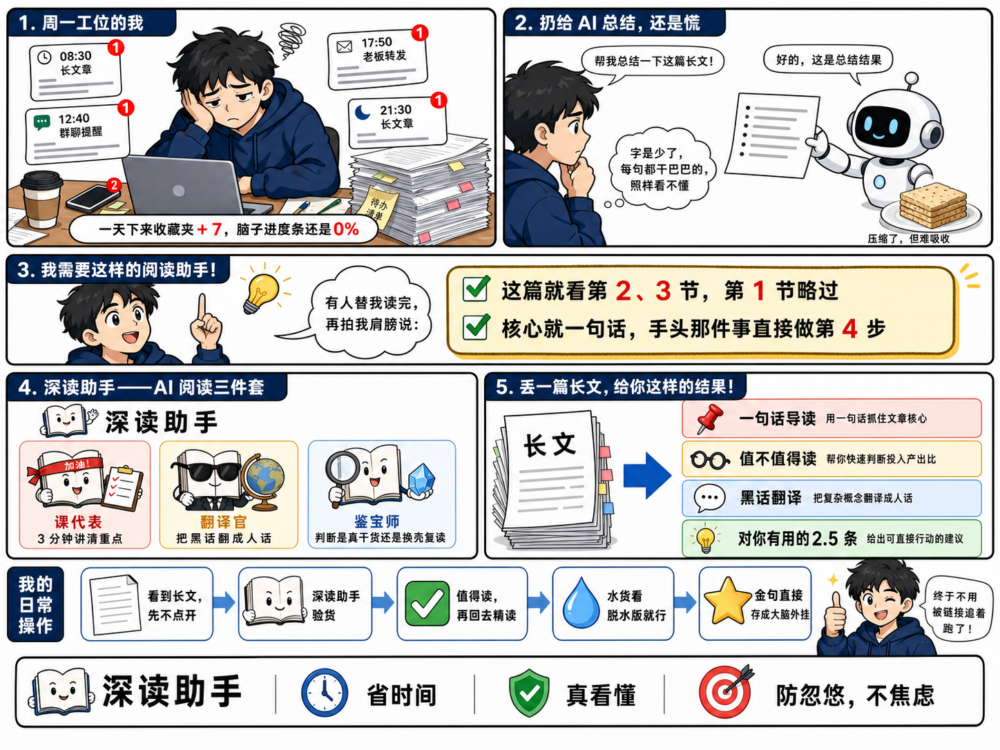
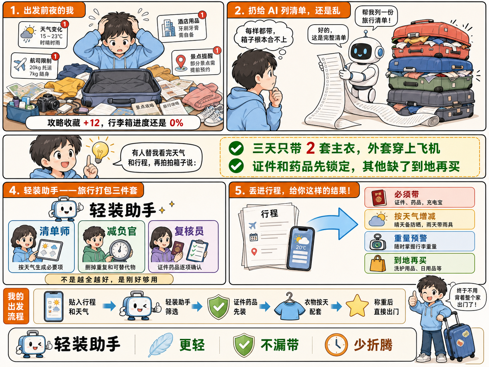
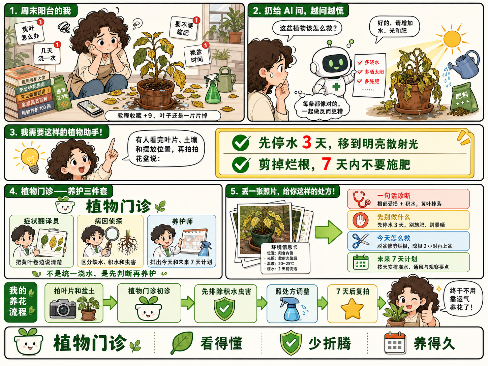

# 痛点转折分镜漫画式产品功能介绍图


## 核心要点

- **编号分镜建立完整因果链**：痛点、失败尝试、需求顿悟、能力拆解和结果展示按 1 至 5 顺序推进，复杂产品也能顺着故事理解。
- **同一主角承载情绪转折**：角色从疲惫、困惑到兴奋、轻松，用表情和动作替代抽象的用户旅程描述。
- **人格化卡片解释核心能力**：把产品能力变成三种有明确职责的角色，让“会什么”比技术名词更容易记住。
- **结构化结果卡连接功能与价值**：长文通过单一粗箭头转成四色结果卡，清楚表现输入、处理和可行动输出。
- **底部流程完成使用闭环**：把产品放回用户日常操作中，再用利益点收口，避免页面只停留在功能罗列。

## Prompt

```plain text
目标：
生成一张横向五段分镜漫画式产品功能介绍信息图，输出画布尺寸必须为 2048×1536 像素或同等 4:3 比例，禁止生成 1536×1024 或其他 3:2 画布，用于介绍一款帮助知识工作者阅读超长文章的 AI 助手。采用白色背景、深蓝标题条、黑色漫画描边、少量蓝绿橙红强调色和清晰中文排版，达到叙事完整、功能一眼看懂、信息丰富但可扫描的商业插画完成度。

主题：
画面表现“从长文信息过载，到 AI 深度阅读助手给出可行动结果”的转变。
核心场景是同一位黑发蓝色连帽衫青年先被文章和通知压垮，再发现普通 AI 总结仍然空泛，随后找到拥有三种阅读能力的“深读助手”，最后获得结构化长文解读；主要角色和物件包括青年、笔记本电脑、手机、纸张与通知卡、白色 AI 机器人、灯泡、三张角色卡、长文纸叠、彩色结论卡和底部流程箭头。
整体采用日系卡通分镜、白底产品说明漫画、圆角黑边面板、深蓝章节标题条、清爽扁平阴影，呈现先焦虑后轻松、亲切但专业的产品教育感。

画面：
- 整体布局：固定 2048×1536 像素、严格 4:3 横版，严禁拉宽为 3:2；画面由五个编号故事面板加一个底部操作流程构成。顶部约 35% 左右两栏，第二层约 14% 为横跨全宽的转折条，第三层约 31% 左右两栏，底部约 20% 为流程与结果口号。所有面板用黑色细圆角边框分开，面板间留均匀白缝。
- 顶部左侧面板：占宽度约 50%，深蓝圆角标题条写“1. 周一工位的我”。黑发青年穿深蓝连帽衫，坐在堆满纸张的办公桌前，一手托脸、神情疲惫；桌上有笔记本电脑、手机、咖啡、便签和一摞高文件。角色四周漂浮四张白色通知卡，分别显示早中晚时间、长文章、群聊提醒、老板转发和红色未读角标。底部白色胶囊文字条总结“一天下来收藏夹 +7，脑子进度条还是 0%”。
- 顶部右侧面板：占宽度约 50%，深蓝标题条写“2. 扔给 AI 总结，还是慌”。左侧是青年侧身看向右侧，右侧白色小机器人双手递出一张稀疏的项目符号总结纸；机器人旁放一盘压缩饼干作为“压缩但难吸收”的视觉隐喻。青年思考气泡写“字是少了，每句都干巴巴的，照样看不懂”，上方对话气泡写“帮我总结一下这篇长文！”和“好的，这是总结结果”。
- 中部横向转折条：横跨全宽，左侧约 36% 是青年突然抬头、举起食指，身旁亮起黄色灯泡；白色云朵气泡写“有人替我读完，再拍我肩膀说：”。右侧约 64% 是淡黄色粗边圆角框，放两行绿色勾选结论，红色强调关键数字：“这篇就看第 2、3 节，第 1 节略过”“核心就一句话，手头那件事直接做第 4 步”。
- 第三层左侧面板：占宽度约 43%，深蓝标题条写“4. 深读助手——AI 阅读三件套”。顶部放一个无品牌的黑白小书本吉祥物与大标题“深读助手”，下方横排三张浅色圆角角色卡。第一张角色戴红色头带、举清单，标题“课代表”，说明“3 分钟讲清重点”；第二张戴墨镜、抱地球仪，标题“翻译官”，说明“把黑话翻成人话”；第三张拿放大镜和蓝色晶体，标题“鉴宝师”，说明“判断是真干货还是换壳复读”。面板底部放星形图标和口号“不是无脑缩句器，是 AI 阅读三件套”。
- 第三层右侧面板：占宽度约 57%，深蓝标题条写“5. 丢一篇长文，给你这样的结果！”。左侧是一叠标注“长文”的白纸，通过粗蓝箭头指向右侧四条等宽浅色结果卡；四条依次使用浅红、浅黄、浅蓝、浅绿底色，左侧分别放图钉、眼镜、对话气泡、灯泡图标，标题为“一句话导读”“值不值得读”“黑话翻译”“对你有用的 2.5 条”，每条仅放一至两行短说明。
- 底部操作流程：左侧竖向深蓝标签写“我的日常操作”；随后用浅蓝箭头串联“看到长文，先不点开”纸张图标、“深读助手验货”书本吉祥物、“值得读，再回去精读”绿色勾、“水货看脱水版就行”蓝色水滴、“金句直接存成大脑外挂”黄色星星。最右侧是青年眨眼竖起大拇指，气泡写“终于不用被链接追着跑了！”。
- 最底部品牌结果条：左侧放通用小书本图标与文字“深读助手”，右侧用时钟、盾牌、靶心三个图标分隔三个利益点“省时间”“真看懂”“防忽悠，不焦虑”。
- 叙事流向：按编号从左上痛点到右上失败尝试，再横向进入中部顿悟，向下读取三种核心能力和四类结构化结果，最后沿底部箭头看日常使用闭环。
- 连接关系：只有底部流程使用连续右箭头；顶部通知卡围绕青年但不遮挡脸；机器人、总结纸和饼干形成从请求到低质量结果的横向关系；第三层长文纸叠用单个粗蓝箭头连接四条结果卡。
- 视觉表现：纯白底、深海军蓝标题条、黑色粗细结合描边，人物肤色与桌面用温暖浅色；绿色只用于成功勾，红色用于未读、风险和数字强调，黄色用于灯泡与转折，浅蓝用于流程箭头；阴影轻、无复杂纹理。
- 遮挡关系：人物脸、双手、机器人双手、三张角色卡和四条结果卡全部完整；通知卡可局部叠在空白处但不能盖住人物；所有文字放在独立白色或浅色容器内，不压住插画与箭头。

文字：
- 面板标题：“1. 周一工位的我”“2. 扔给 AI 总结，还是慌”“3. 我需要这样的阅读助手！”“4. 深读助手——AI 阅读三件套”“5. 丢一篇长文，给你这样的结果！”
- 痛点条：“一天下来收藏夹 +7，脑子进度条还是 0%”
- 请求气泡：“帮我总结一下这篇长文！”
- 回复气泡：“好的，这是总结结果”
- 思考气泡：“字是少了，每句都干巴巴的，照样看不懂”
- 转折气泡：“有人替我读完，再拍我肩膀说：”
- 转折结论：“这篇就看第 2、3 节，第 1 节略过”“核心就一句话，手头那件事直接做第 4 步”
- 产品名：“深读助手”
- 三件套：“课代表”“3 分钟讲清重点”“翻译官”“把黑话翻成人话”“鉴宝师”“判断是真干货还是换壳复读”
- 产品口号：“不是无脑缩句器，是 AI 阅读三件套”
- 结果卡标题：“一句话导读”“值不值得读”“黑话翻译”“对你有用的 2.5 条”
- 流程标签：“我的日常操作”
- 流程节点：“看到长文，先不点开”“深读助手验货”“值得读，再回去精读”“水货看脱水版就行”“金句直接存成大脑外挂”
- 角色气泡：“终于不用被链接追着跑了！”
- 利益点：“省时间”“真看懂”“防忽悠，不焦虑”

所有文字必须逐字准确、清晰可读，并放在对应区域的独立容器中。没有指定的文字不要自行添加。

要求：
- 必须：输出 2048×1536 或同等严格 4:3 画布，比例误差不超过 3%，禁止 3:2；顶部双栏、中部横向转折、第三层双栏、底部流程和最底部利益条齐全；同一青年在各面板的发型、深蓝连帽衫和脸部特征始终统一；编号 1 至 5 连续；三张角色卡和四条结果卡数量准确；阅读因果从焦虑到解决不能反转。
- 禁止：禁止写实照片、3D 渲染、深色背景、企业图库风；禁止真实品牌 Logo、真实软件图标、网址、二维码、联系人和水印；禁止面板缺失、标题条错位、箭头反向、角色多手多指、机器人肢体异常、通知卡或文字遮住人物、密集小字溢出。
```

## Prompt 自检

- 状态：通过
- 轮次：3/3
- 复现充分度：97/100
- 构图得分：98/100
- 有意排除：真实品牌 Logo、软件图标、网址、联系人



## 类似图片：

### 旅行打包轻装助手



#### Prompt

```plain text
目标：
生成一张横向五段分镜漫画式生活服务功能介绍信息图，输出画布尺寸必须为 2048×1536 像素或同等 4:3 比例，禁止生成 3:2 画布，用于介绍一款帮助普通游客轻松打包的旅行助手。采用暖白背景、橙色章节标题条、黑色漫画描边、少量天蓝绿红强调色和清晰中文排版，达到叙事完整、功能一眼看懂、信息丰富但可扫描的商业插画完成度。

主题：
画面表现“从行李清单信息过载，到旅行打包助手给出轻量可执行方案”的转变。
核心场景是同一位短发年轻旅行者先被攻略、天气与物品堆压垮，再发现普通 AI 清单仍然又长又泛，随后找到拥有三种打包能力的“轻装助手”，最后获得结构化行李方案；主要角色和物件包括旅行者、打开的行李箱、手机、攻略纸张、衣物与通知卡、白色 AI 机器人、灯泡、三张角色卡、长清单纸叠、彩色结果卡和底部流程箭头。
整体采用日系卡通分镜、白底产品说明漫画、圆角黑边面板、暖橙章节标题条、清爽扁平阴影，呈现先焦虑后轻松、明快实用的旅行服务感。

画面：
- 整体布局：固定 2048×1536、严格 4:3 横版，五个编号故事面板加底部操作流程。顶部约 35% 左右两栏，第二层约 14% 为横跨全宽的转折条，第三层约 31% 左右两栏，底部约 20% 为流程与利益点。所有面板用黑色细圆角边框分开，面板间留均匀白缝。
- 顶部左侧面板：占宽度约 50%，橙色圆角标题条写“1. 出发前夜的我”。旅行者穿浅蓝卫衣，坐在打开的行李箱前双手抱头；四周散落衣服、洗漱包、相机、充电线、鞋子和攻略纸。角色周围漂浮四张白色信息卡，显示天气变化、航司限制、酒店用品和景点提醒，配红色未读角标。底部白色胶囊条写“攻略收藏 +12，行李箱进度还是 0%”。
- 顶部右侧面板：占宽度约 50%，橙色标题条写“2. 扔给 AI 列清单，还是乱”。左侧旅行者侧身看向右侧，右侧白色小机器人递出一张长到拖地的密集清单，旁边堆着四只鼓胀行李箱；思考气泡写“每样都带，箱子根本合不上”，上方气泡写“帮我列一份旅行清单！”和“好的，这是完整清单”。
- 中部横向转折条：横跨全宽，左侧约 36% 是旅行者突然抬头、举起食指，身旁亮起黄色灯泡；气泡写“有人替我看完天气和行程，再拍拍箱子说：”。右侧约 64% 淡黄色粗边框内放两行绿色勾选结论，红色强调数字：“三天只带 2 套主衣，外套穿上飞机”“证件和药品先锁定，其他缺了到地再买”。
- 第三层左侧面板：占宽度约 43%，橙色标题条写“4. 轻装助手——旅行打包三件套”。顶部放无品牌的小行李箱吉祥物和大标题“轻装助手”，下方横排三张浅色角色卡。第一张角色拿天气板，标题“清单师”，说明“按天气生成必要项”；第二张抱着小秤，标题“减负官”，说明“删掉重复和可替代物”；第三张举护照和勾选板，标题“复核员”，说明“证件药品逐项确认”。底部口号“不是越全越好，是刚好够用”。
- 第三层右侧面板：占宽度约 57%，橙色标题条写“5. 丢进行程，给你这样的结果！”。左侧是一叠标注“行程”的纸和手机，通过粗天蓝箭头指向右侧四条等宽浅色结果卡；四条依次浅红、浅黄、浅蓝、浅绿，图标依次护照、云朵、行李秤、购物袋，标题为“必须带”“按天气增减”“重量预警”“到地再买”，每条只放一至两行短说明。
- 底部操作流程：左侧竖向橙色标签写“我的出发流程”；浅蓝箭头串联“贴入行程和天气”手机图标、“轻装助手筛选”行李箱吉祥物、“证件药品先装”绿色勾、“衣物按天配套”蓝色衣架、“称重后直接出门”黄色星星。最右侧旅行者单手轻松提起小行李箱、眨眼竖拇指，气泡写“终于不用背着整个家出门了！”。
- 最底部结果条：左侧放通用行李箱图标与文字“轻装助手”，右侧用羽毛、盾牌、时钟三个图标分隔“更轻”“不漏带”“少折腾”。
- 叙事流向：左上打包焦虑到右上失败清单，中部顿悟后向下读取三种能力和四类结果，最后沿底部箭头完成出发闭环。
- 连接关系：只有底部流程使用连续右箭头；顶部信息卡围绕旅行者但不遮挡脸；机器人、长清单与鼓胀行李箱形成失败结果；行程纸叠用单个粗天蓝箭头连接四条结果卡。
- 视觉表现：暖白底、橙色标题条、黑色漫画描边；天蓝用于箭头，绿色用于成功，红色用于警示数字，黄色用于灯泡，人物和衣物用清爽低饱和色；轻阴影、无复杂纹理。
- 遮挡关系：人物脸和双手、打开行李箱、机器人、三张角色卡和四条结果卡完整；衣物不能盖住文字；所有文案放独立容器，不压住箭头和插画。

文字：
- 面板标题：“1. 出发前夜的我”“2. 扔给 AI 列清单，还是乱”“3. 我需要这样的打包助手！”“4. 轻装助手——旅行打包三件套”“5. 丢进行程，给你这样的结果！”
- 痛点条：“攻略收藏 +12，行李箱进度还是 0%”
- 请求气泡：“帮我列一份旅行清单！”
- 回复气泡：“好的，这是完整清单”
- 思考气泡：“每样都带，箱子根本合不上”
- 转折气泡：“有人替我看完天气和行程，再拍拍箱子说：”
- 转折结论：“三天只带 2 套主衣，外套穿上飞机”“证件和药品先锁定，其他缺了到地再买”
- 产品名：“轻装助手”
- 三件套：“清单师”“按天气生成必要项”“减负官”“删掉重复和可替代物”“复核员”“证件药品逐项确认”
- 产品口号：“不是越全越好，是刚好够用”
- 结果卡标题：“必须带”“按天气增减”“重量预警”“到地再买”
- 流程标签：“我的出发流程”
- 流程节点：“贴入行程和天气”“轻装助手筛选”“证件药品先装”“衣物按天配套”“称重后直接出门”
- 角色气泡：“终于不用背着整个家出门了！”
- 利益点：“更轻”“不漏带”“少折腾”

所有文字必须逐字准确、清晰可读，并放在对应区域的独立容器中。没有指定的文字不要自行添加。

要求：
- 必须：输出 2048×1536 或同等严格 4:3 画布，比例误差不超过 3%；顶部双栏、中部转折、第三层双栏、底部流程和利益条齐全；同一旅行者服装一致；编号 1 至 5 连续；三张角色卡和四条结果卡数量准确；因果从焦虑到轻装不能反转。
- 禁止：禁止写实照片、3D 渲染、深色背景、企业图库风；禁止航空公司或旅行品牌 Logo、真实软件图标、网址、二维码、联系人和水印；禁止面板缺失、箭头反向、多手多指、行李遮字、密集小字溢出。
```

### 植物门诊养护助手



#### Prompt

```plain text
目标：
生成一张横向五段分镜漫画式植物服务功能介绍信息图，输出画布尺寸必须为 2048×1536 像素或同等 4:3 比例，禁止生成 3:2 画布，用于介绍一款帮助养花新手诊断植物问题的智能助手。采用暖白背景、森林绿章节标题条、黑色漫画描边、少量嫩绿黄橙红强调色和清晰中文排版，达到叙事完整、功能一眼看懂、信息丰富但可扫描的商业插画完成度。

主题：
画面表现“从看攻略仍不会救植物，到植物门诊助手给出可执行养护方案”的转变。
核心场景是同一位卷发养花新手先被掉叶、黄叶和教程压垮，再发现普通 AI 的泛泛建议反而让问题更乱，随后找到拥有三种诊断能力的“植物门诊”，最后获得结构化救治计划；主要角色和物件包括养花新手、书桌、手机、枯黄盆栽、喷壶、肥料与攻略卡、白色 AI 机器人、灯泡、三张角色卡、植物照片纸叠、彩色处方卡和底部流程箭头。
整体采用日系卡通分镜、白底产品说明漫画、圆角黑边面板、森林绿章节标题条、清爽扁平阴影，呈现先焦虑后安心、自然可信的园艺服务感。

画面：
- 整体布局：固定 2048×1536、严格 4:3 横版，五个编号故事面板加底部操作流程。顶部约 35% 左右两栏，第二层约 14% 为横跨全宽的转折条，第三层约 31% 左右两栏，底部约 20% 为流程与利益点。所有面板用黑色细圆角边框分开，面板间留均匀白缝。
- 顶部左侧面板：占宽度约 50%，森林绿圆角标题条写“1. 周末阳台的我”。卷发新手穿米色围裙，蹲在掉叶的绿植前双手托脸、神情焦虑；周围有黄叶、积水花盆、喷壶、肥料、手机和一摞园艺书。角色四周漂浮四张白色攻略卡，显示“黄叶怎么办”“几天浇一次”“要不要施肥”“换盆时间”，配红色未读角标。底部白色胶囊条写“教程收藏 +9，叶子还是一片片掉”。
- 顶部右侧面板：占宽度约 50%，森林绿标题条写“2. 扔给 AI 问，越问越慌”。左侧新手侧身看向右侧，右侧白色小机器人递出一张写满“多浇水、多晒太阳、多施肥”的建议纸；旁边一盆植物同时被强光、水壶和肥料包围，叶片更加萎蔫。思考气泡写“每条都像对的，一起做反而更糟”，上方气泡写“这盆植物该怎么救？”和“好的，请增加水、光和肥”。
- 中部横向转折条：横跨全宽，左侧约 36% 是新手突然抬头、举起食指，身旁亮起黄色灯泡；气泡写“有人看完叶片、土壤和摆放位置，再拍拍花盆说：”。右侧约 64% 淡黄色粗边框内放两行绿色勾选结论，红色强调数字：“先停水 3 天，移到明亮散射光”“剪掉烂根，7 天内不要施肥”。
- 第三层左侧面板：占宽度约 43%，森林绿标题条写“4. 植物门诊——养护三件套”。顶部放无品牌的小花盆吉祥物和大标题“植物门诊”，下方横排三张浅色角色卡。第一张角色拿叶片图谱，标题“症状翻译员”，说明“把黄叶卷边说清楚”；第二张拿放大镜检查根系，标题“病因侦探”，说明“区分缺水、积水和虫害”；第三张拿日历与喷壶，标题“养护师”，说明“排出今天和未来 7 天计划”。底部口号“不是统一浇水，是先判断再养护”。
- 第三层右侧面板：占宽度约 57%，森林绿标题条写“5. 丢一张照片，给你这样的处方！”。左侧是一叠植物照片与环境信息卡，通过粗嫩绿箭头指向右侧四条等宽浅色结果卡；四条依次浅红、浅黄、浅蓝、浅绿，图标依次听诊器、停止手势、剪刀、日历，标题为“一句话诊断”“先别做什么”“今天怎么救”“未来 7 天计划”，每条只放一至两行短说明。
- 底部操作流程：左侧竖向森林绿标签写“我的养花流程”；浅绿箭头串联“拍叶片和盆土”相机图标、“植物门诊初诊”花盆吉祥物、“先排除积水虫害”绿色盾牌、“照处方调整”蓝色喷壶、“7 天后复拍”黄色星星。最右侧新手抱着恢复精神的新叶盆栽、眨眼竖拇指，气泡写“终于不用靠运气养花了！”。
- 最底部结果条：左侧放通用花盆图标与文字“植物门诊”，右侧用叶片、盾牌、日历三个图标分隔“看得懂”“少折腾”“养得久”。
- 叙事流向：左上养护焦虑到右上失败建议，中部顿悟后向下读取三种诊断能力和四类处方，最后沿底部箭头形成复拍反馈闭环。
- 连接关系：只有底部流程使用连续右箭头；顶部攻略卡围绕新手但不遮挡脸；机器人、泛泛建议纸与萎蔫植物形成错误方案；植物照片纸叠用单个粗嫩绿箭头连接四条处方卡。
- 视觉表现：暖白底、森林绿标题条、黑色漫画描边；嫩绿用于流程与恢复，红色用于警告，黄色用于灯泡，浅蓝用于工具卡；植物有明确叶形但仍为卡通扁平插画，阴影轻、无复杂纹理。
- 遮挡关系：人物脸和双手、盆栽叶片、机器人、三张角色卡和四条处方卡完整；水壶和攻略卡不能盖住文字；所有文案放独立容器，不压住插画和箭头。

文字：
- 面板标题：“1. 周末阳台的我”“2. 扔给 AI 问，越问越慌”“3. 我需要这样的植物助手！”“4. 植物门诊——养护三件套”“5. 丢一张照片，给你这样的处方！”
- 痛点条：“教程收藏 +9，叶子还是一片片掉”
- 请求气泡：“这盆植物该怎么救？”
- 回复气泡：“好的，请增加水、光和肥”
- 思考气泡：“每条都像对的，一起做反而更糟”
- 转折气泡：“有人看完叶片、土壤和摆放位置，再拍拍花盆说：”
- 转折结论：“先停水 3 天，移到明亮散射光”“剪掉烂根，7 天内不要施肥”
- 产品名：“植物门诊”
- 三件套：“症状翻译员”“把黄叶卷边说清楚”“病因侦探”“区分缺水、积水和虫害”“养护师”“排出今天和未来 7 天计划”
- 产品口号：“不是统一浇水，是先判断再养护”
- 结果卡标题：“一句话诊断”“先别做什么”“今天怎么救”“未来 7 天计划”
- 流程标签：“我的养花流程”
- 流程节点：“拍叶片和盆土”“植物门诊初诊”“先排除积水虫害”“照处方调整”“7 天后复拍”
- 角色气泡：“终于不用靠运气养花了！”
- 利益点：“看得懂”“少折腾”“养得久”

所有文字必须逐字准确、清晰可读，并放在对应区域的独立容器中。没有指定的文字不要自行添加。

要求：
- 必须：输出 2048×1536 或同等严格 4:3 画布，比例误差不超过 3%；顶部双栏、中部转折、第三层双栏、底部流程和利益条齐全；同一养花新手服装一致；编号 1 至 5 连续；三张角色卡和四条处方卡数量准确；因果从误操作到科学养护不能反转。
- 禁止：禁止写实照片、3D 渲染、深色背景、企业图库风；禁止花店或园艺品牌 Logo、真实软件图标、网址、二维码、联系人和水印；禁止面板缺失、箭头反向、人物多手多指、植物盖字、密集小字溢出。
```
