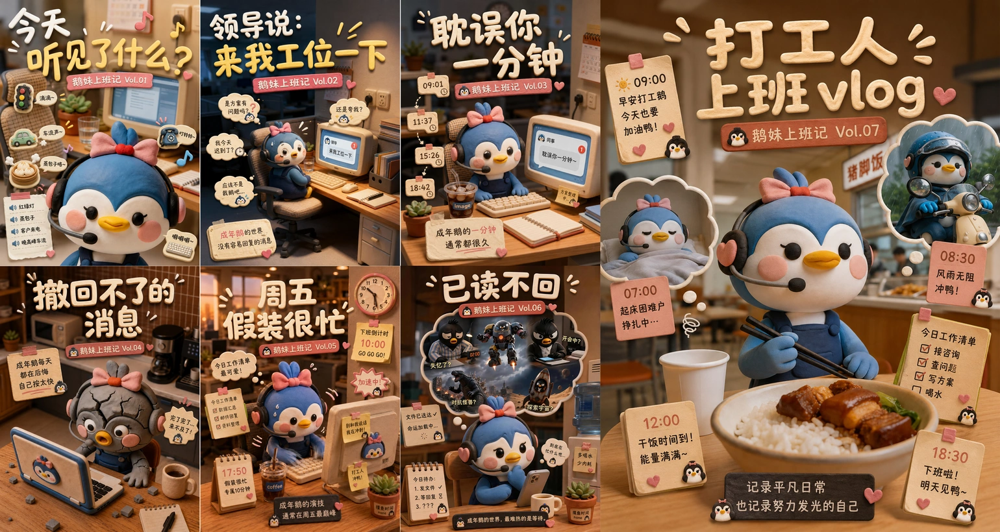
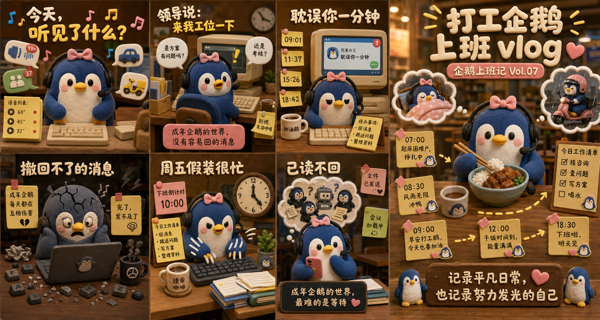
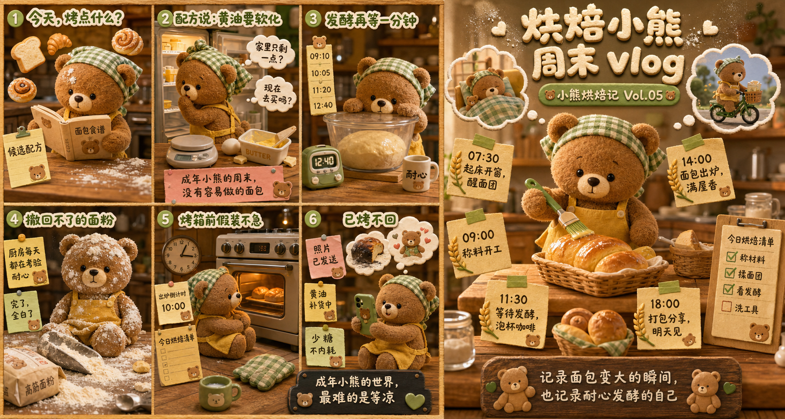
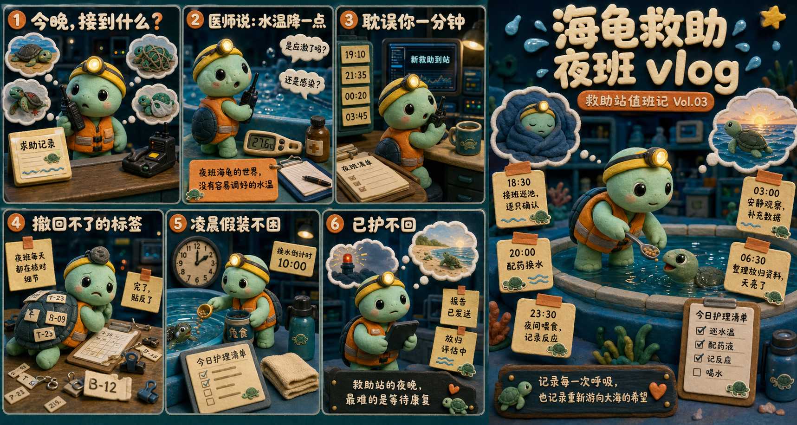

# 黏土玩偶日常分镜式叙事海报



## 核心要点

- **六小格加一大格兼顾事件与全景**：左侧用六个瞬间制造节奏，右侧用完整日常场景收口，既像漫画又像主题海报。
- **稳定角色识别串联碎片叙事**：统一的颜色、饰品和材质让同一玩偶跨多个场景仍然容易识别。
- **便利贴承担时间与旁白**：时间、任务和自嘲短句都落在可触摸的纸张上，与黏土世界自然融合。
- **微距材质强化治愈感**：软陶、短绒、木桌和暖灯共同制造手工定格动画的亲密感，缓和职场压力主题。
- **情绪起伏形成日常戏剧性**：消息轰炸、崩溃、装忙、等待与吃饭收尾，让普通一天拥有清晰的情绪弧线。

## Prompt

```plain text
目标：
生成一张超宽横向黏土玩偶日常分镜叙事海报，输出画布尺寸必须为 1920×1024 像素或同等 15:8 比例，禁止生成 16:9、3:2 或 2:1 画布，用于社交媒体分享“打工企鹅的一天”。采用暖棕色室内光、微距定格动画质感、奶油色手捏立体字和大量便利贴信息，达到电影级黏土摄影、分镜丰富、角色统一、中文主标题清晰可读的完成度。

主题：
画面表现“一只蓝白黏土企鹅打工人的普通上班日”。
核心场景是同一只圆滚滚蓝白企鹅戴粉色蝴蝶结和黑色客服耳机，在左侧六个小分镜里经历消息轰炸、临时换工位、被打断、误发消息、周五装忙和已读不回，右侧大场景则展现它从起床、通勤到午饭、工作清单和下班的完整一天；主要角色和物件包括企鹅、复古电脑、键盘、手机、咖啡杯、文件夹、办公椅、便利贴、时钟、耳机、午餐碗和小企鹅贴纸。
整体采用手工软陶与毛毡玩偶混合的定格动画风格、浅景深微距摄影、暖色办公室与食堂场景、奶油白和珊瑚粉黏土字，呈现疲惫但可爱、自嘲又治愈的职场日常气质。

画面：
- 整体布局：固定 1920×1024、严格 15:8 超宽横版。左侧约 61% 宽度为 3 列 × 2 行的六个独立小分镜，右侧约 39% 为贯穿上下的单个主视觉大场景。所有分镜边缘紧密衔接，仅用场景边界区分，不使用白色粗框；文字主要位于每格顶部和便利贴内。
- 左上第 1 格：标题“今天，听见了什么？”使用奶油白与黄色手捏黏土大字，周围有彩色音符。企鹅戴耳机占下半部正中，背后是暖色工位和显示器；两侧漂浮语音通知、群聊、车辆和外卖等圆角小图标，左下放短语音列表便利贴。
- 左上第 2 格：标题“领导说：来我工位一下”，第二行黄色强调。企鹅坐在复古米色电脑前惊讶回头，左侧气泡写“是方案有问题吗？”，右侧气泡写“还是考核？”，桌面有键盘、文件架和便签，底部粉色卡片写“成年企鹅的世界，没有容易回的消息”。
- 左上第 3 格：标题“耽误你一分钟”。企鹅正面坐在电脑前，神情从容但眼下略疲惫；左侧竖排四张时间便签“09:01”“11:37”“15:26”“18:42”，显示被不断打断；显示器里是聊天通知“耽误你一分钟”，桌面放咖啡杯和待办便签。
- 左下第 4 格：标题“撤回不了的消息”。企鹅变成灰黑色、头顶出现夸张裂纹，呆坐在笔记本电脑前，周围散落键帽与碎屑；左右便利贴写“成年企鹅每天都在互相伤害”和“完了，发不及了”，用黑色咖啡杯和昏暗桌面加强崩溃感。
- 左下第 5 格：标题“周五假装很忙”。企鹅戴耳机坐在键盘前快速敲击，旁边大钟指向傍晚，便利贴写“下班倒计时 10:00”和“今日工作清单”；桌面有咖啡、文件和小盆栽，角色旁用动作线表现忙碌。
- 左下第 6 格：标题“已读不回”。企鹅一手拿手机，身后云朵形思考泡泡里出现多个穿黑衣的小同事、机器人、问号和工作任务；周围放“文件已发送”“会议加载中”“喝水少内耗”等便签，底部黑色小牌写“成年企鹅的世界，最难的是等待”。
- 右侧主场景：顶部大号奶油色手捏立体字“打工企鹅 上班 vlog”，字周围有短放射线和一颗粉色爱心，下方珊瑚粉圆角黏土条写“企鹅上班记 Vol.07”。中央是一只与左侧相同的蓝白企鹅，戴粉色蝴蝶结和黑色耳机，坐在食堂木桌前用筷子吃卤肉饭，占右侧高度约 45%；表情平静治愈。
- 右侧时间便签：企鹅周围按时间顺序摆放五张牛皮纸便利贴。“07:00 起床困难户，挣扎中”“08:30 风雨无阻冲鸭”“09:00 早安打工鹅，今天也要加油”“12:00 干饭时间到，能量满满”“18:30 下班啦，明天见”。每张便签带粉色胶带、小爱心或迷你企鹅贴纸。
- 右侧思考泡泡：企鹅左上泡泡表现裹被子睡觉，右上泡泡表现戴头盔骑小摩托通勤；泡泡为白色棉花轮廓，不遮挡大标题。
- 右侧工作清单：午饭碗右侧放一张竖向牛皮纸卡，标题“今日工作清单”，下面四个复选框“接咨询”“查问题”“写方案”“喝水”，前三项打勾，最后一项留空。
- 右侧底部：桌面中央放一块深棕木牌，奶油色字写“记录平凡日常，也记录努力发光的自己”，旁边有两只迷你企鹅和粉色爱心。
- 叙事流向：先从左上到右读完三格工作打断，再向下读三格情绪反应，最后进入右侧大场景，用时间便签完成从早到晚的日常收口。
- 连接关系：六个小分镜依靠 3×2 排列推进，不使用箭头；右侧五张时间便签围绕主体形成顺时针阅读；思考泡泡分别连接睡觉和通勤记忆。
- 视觉表现：手捏软陶和短绒毛毡质感清晰，人物边缘圆润，办公室木质与米色设备采用暖棕、深咖啡、奶油白；企鹅主体为海军蓝、白色、浅粉腮红和黄色嘴脚，粉色蝴蝶结是稳定识别点；顶部标题像真实黏土贴在画面上，微距浅景深但文字区域保持清晰。
- 遮挡关系：每格企鹅的脸、蝴蝶结、耳机和手部完整；标题不压住角色眼睛；便利贴可叠在桌面或空白墙面，不盖住电脑屏幕核心信息；右侧午餐碗与工作清单分离，时间便签不挡大标题。

文字：
- 分镜标题：“今天，听见了什么？”“领导说：来我工位一下”“耽误你一分钟”“撤回不了的消息”“周五假装很忙”“已读不回”
- 右侧主标题：“打工企鹅 上班 vlog”
- 系列条：“企鹅上班记 Vol.07”
- 时间便签：“07:00 起床困难户，挣扎中”“08:30 风雨无阻冲鸭”“09:00 早安打工鹅，今天也要加油”“12:00 干饭时间到，能量满满”“18:30 下班啦，明天见”
- 工作清单：“今日工作清单”“接咨询”“查问题”“写方案”“喝水”
- 底部木牌：“记录平凡日常，也记录努力发光的自己”
- 其他短句：“成年企鹅的世界，没有容易回的消息”“成年企鹅每天都在互相伤害”“成年企鹅的世界，最难的是等待”

所有文字必须逐字准确、清晰可读，并放在对应区域的独立容器中。没有指定的文字不要自行添加。

要求：
- 必须：输出 1920×1024 或同等严格 15:8 画布，比例误差不超过 3%；左侧 3×2 六分镜和右侧单一大场景齐全；同一企鹅始终保留海军蓝头身、白肚皮、粉色腮红、黄色嘴、粉色蝴蝶结和黑色耳机；六个分镜标题、右侧主标题、时间便签和工作清单可读；黏土摄影质感明确。
- 禁止：禁止二维扁平插画、写实动物照片、塑料玩具商业渲染、深色纯色背景；禁止真实品牌 Logo、真实软件图标、网址、二维码、联系人和水印；禁止分镜缺失、排列变成单列、企鹅造型漂移、角色多肢、标题压脸、便签遮挡、密集小字溢出。
```

## Prompt 自检

- 状态：通过
- 轮次：1/3
- 复现充分度：98/100
- 构图得分：99/100
- 有意排除：真实品牌 Logo、软件图标、网址、联系人



## 类似图片：

### 烘焙小熊的周末



#### Prompt

```plain text
目标：
生成一张超宽横向黏土玩偶周末分镜叙事海报，输出画布尺寸必须为 1920×1024 像素或同等 15:8 比例，禁止生成 16:9、3:2 或 2:1 画布，用于社交媒体分享“烘焙小熊的周末”。采用暖杏色厨房光、微距定格动画质感、奶油色手捏立体字和大量食谱便利贴，达到电影级黏土摄影、分镜丰富、角色统一、中文主标题清晰可读的完成度。

主题：
画面表现“一只焦糖色黏土小熊在家做面包的周末日常”。
核心场景是同一只圆滚滚焦糖色小熊戴绿色格纹头巾和黄色围裙，在左侧六个小分镜里经历选配方、发现缺黄油、等待发酵、面粉洒满桌、守着烤箱和清理厨房，右侧大场景则展现它从清晨备料到午后出炉和傍晚分享的完整一天；主要角色和物件包括小熊、木质厨房、搅拌盆、面粉袋、黄油、酵母、烤箱、厨房秤、计时器、面包、便利贴和迷你小熊贴纸。
整体采用手工软陶与毛毡玩偶混合的定格动画风格、浅景深微距摄影、暖色家庭厨房场景、奶油白和抹茶绿黏土字，呈现忙乱但香甜、治愈又有烟火气的周末气质。

画面：
- 整体布局：固定 1920×1024、严格 15:8 超宽横版。左侧约 61% 为 3 列 × 2 行六个独立小分镜，右侧约 39% 为贯穿上下的单个主视觉大场景。所有分镜紧密衔接，以厨房光线与桌面边界区分，文字位于每格顶部和食谱便签中。
- 左上第 1 格：标题“今天，烤点什么？”使用奶油白与抹茶绿手捏大字。小熊戴头巾和围裙，站在料理台前翻食谱，周围漂浮吐司、可颂、贝果和肉桂卷黏土图标，左下放“候选配方”便签。
- 左上第 2 格：标题“配方说：黄油要软化”。小熊打开冰箱惊讶回头，气泡写“家里只剩一点？”“现在去买吗？”，桌面有电子秤、鸡蛋和空黄油盒；底部粉色卡片写“成年小熊的周末，没有容易做的面包”。
- 左上第 3 格：标题“发酵再等一分钟”。小熊趴在透明发酵盆旁，左侧竖排时间便签“09:10”“10:05”“11:20”“12:40”，烤箱计时器亮着，杯子写“耐心”。
- 左下第 4 格：标题“撤回不了的面粉”。小熊全身和脸上沾满白面粉，呆坐在翻倒的面粉袋与搅拌盆前，桌面散落面团和量勺；便利贴写“厨房每天都在考验耐心”“完了，全白了”。
- 左下第 5 格：标题“烤箱前假装不急”。小熊抱膝坐在烤箱前盯着膨胀的面包，旁边大钟指向午后，便签写“出炉倒计时 10:00”和“今日烘焙清单”，咖啡杯与隔热手套在旁。
- 左下第 6 格：标题“已烤不回”。小熊一手拿手机拍照，身后云朵形思考泡泡里出现烤焦边缘、朋友点赞和第二炉面包；周围便签写“照片已发送”“黄油补货中”“少糖不内耗”，底部黑色小牌写“成年小熊的世界，最难的是等凉”。
- 右侧主场景：顶部大号奶油色手捏立体字“烘焙小熊 周末 vlog”，字周围有面粉点与爱心，下方抹茶绿圆角黏土条写“小熊烘焙记 Vol.05”。中央小熊与左侧造型统一，站在木桌前为金黄面包刷黄油，占右侧高度约 45%，表情满足。
- 右侧时间便签：围绕小熊摆放五张牛皮纸便签。“07:30 起床开窗，醒面团”“09:00 称料开工”“11:30 等待发酵，泡杯咖啡”“14:00 面包出炉，满屋香”“18:00 打包分享，明天见”。每张带绿色胶带、麦穗或迷你小熊贴纸。
- 右侧思考泡泡：左上泡泡表现小熊裹被子睡觉，右上泡泡表现骑自行车去买黄油；白色棉花轮廓，不遮挡标题。
- 右侧任务清单：面包篮右侧竖放牛皮纸卡，标题“今日烘焙清单”，复选框“称材料”“揉面团”“看发酵”“洗工具”，前三项打勾，最后一项留空。
- 右侧底部：深棕木牌写“记录面包变大的瞬间，也记录耐心发酵的自己”，两侧迷你小熊和绿色爱心。
- 叙事流向：左上到右读三格准备与等待，再向下读三格事故、守候与分享，最后进入右侧大场景按时间便签完成一天。
- 连接关系：六分镜依靠 3×2 排列推进，不画箭头；右侧五张时间便签围绕主体形成顺时针阅读；两个思考泡泡连接睡觉和补货回忆。
- 视觉表现：手捏软陶、短绒毛毡、木纹和面粉颗粒清楚；焦糖棕小熊、黄色围裙、绿色头巾是稳定识别点；标题像真实黏土贴在画面上，暖杏色烘焙灯光配浅景深。
- 遮挡关系：每格小熊的脸、圆耳、头巾和前爪完整；面粉可落在围裙但不能盖住眼睛；便签不挡烤箱和面包；右侧面包篮、清单和时间卡互不遮挡。

文字：
- 分镜标题：“今天，烤点什么？”“配方说：黄油要软化”“发酵再等一分钟”“撤回不了的面粉”“烤箱前假装不急”“已烤不回”
- 右侧主标题：“烘焙小熊 周末 vlog”
- 系列条：“小熊烘焙记 Vol.05”
- 时间便签：“07:30 起床开窗，醒面团”“09:00 称料开工”“11:30 等待发酵，泡杯咖啡”“14:00 面包出炉，满屋香”“18:00 打包分享，明天见”
- 任务清单：“今日烘焙清单”“称材料”“揉面团”“看发酵”“洗工具”
- 底部木牌：“记录面包变大的瞬间，也记录耐心发酵的自己”
- 其他短句：“成年小熊的周末，没有容易做的面包”“厨房每天都在考验耐心”“成年小熊的世界，最难的是等凉”

所有文字必须逐字准确、清晰可读，并放在对应区域的独立容器中。没有指定的文字不要自行添加。

要求：
- 必须：输出 1920×1024 或同等严格 15:8 画布，比例误差不超过 3%；左侧 3×2 六分镜和右侧单一大场景齐全；同一小熊始终保留焦糖色短绒、圆耳、黄色围裙和绿色格纹头巾；六个标题、主标题、时间便签和清单可读；黏土摄影质感明确。
- 禁止：禁止二维扁平插画、写实动物照片、塑料玩具商业渲染、深色纯色背景；禁止烘焙品牌 Logo、网址、二维码、联系人和水印；禁止分镜缺失、单列布局、角色多肢、标题压脸、面粉遮眼、密集小字溢出。
```

### 海龟救助站的夜班



#### Prompt

```plain text
目标：
生成一张超宽横向黏土玩偶夜班分镜叙事海报，输出画布尺寸必须为 1920×1024 像素或同等 15:8 比例，禁止生成 16:9、3:2 或 2:1 画布，用于公益科普分享“海龟救助站的夜班”。采用深海青与暖黄色工作灯、微距定格动画质感、奶油色手捏立体字和大量值班便签，达到电影级黏土摄影、分镜丰富、角色统一、中文主标题清晰可读的完成度。

主题：
画面表现“一只薄荷绿黏土小海龟在海洋救助站值夜班的日常”。
核心场景是同一只圆滚滚薄荷绿小海龟戴橙色安全背心和黄色头灯，在左侧六个小分镜里经历接收求助、调整水温、临时来电、放错标签、深夜喂食和等待康复，右侧大场景则展现它从傍晚巡池、夜间护理到清晨放归准备的完整班次；主要角色和物件包括小海龟、救助水池、温度计、记录板、对讲机、药箱、鱼食桶、毛巾、头灯、救助便签和迷你海龟贴纸。
整体采用手工软陶与短绒毛毡混合的定格动画风格、浅景深微距摄影、海青色救助站与暖黄工作灯、奶油白和珊瑚橙黏土字，呈现忙碌但有希望、专业又温柔的公益夜班气质。

画面：
- 整体布局：固定 1920×1024、严格 15:8 超宽横版。左侧约 61% 为 3 列 × 2 行六个独立小分镜，右侧约 39% 为贯穿上下的单个主视觉大场景。分镜紧密衔接，以水池、工作台和墙面边界区分，文字位于每格顶部和防水便签内。
- 左上第 1 格：标题“今晚，接到什么？”使用奶油白与橙色手捏大字。小海龟戴头灯和背心站在对讲机前，周围漂浮搁浅、渔线缠绕、受伤鳍和误食塑料的黏土图标，左下放“求助记录”防水便签。
- 左上第 2 格：标题“医师说：水温降一点”。小海龟站在蓝色救助池边惊讶回头，气泡写“是应激了吗？”“还是感染？”，桌面有温度计、药瓶和记录夹；底部橙色卡片写“夜班海龟的世界，没有容易调好的水温”。
- 左上第 3 格：标题“耽误你一分钟”。小海龟坐在监护屏前，左侧竖排时间便签“19:10”“21:35”“00:20”“03:45”，对讲机显示“新救助到站”，桌上放热水杯和夜班清单。
- 左下第 4 格：标题“撤回不了的标签”。小海龟头灯歪斜、壳上贴满错位标签，呆坐在记录板前，周围散落号码牌和夹子；便利贴写“夜班每天都在核对细节”“完了，贴反了”。
- 左下第 5 格：标题“凌晨假装不困”。小海龟抱着鱼食桶在池边喂食，旁边大钟指向凌晨两点，便签写“换水倒计时 10:00”和“今日护理清单”，保温杯与毛巾在旁。
- 左下第 6 格：标题“已护不回”。小海龟一手拿记录终端，身后云朵形思考泡泡里出现康复海龟、放归海滩和新的求助灯；周围便签写“报告已发送”“放归评估中”“少熬夜多喝水”，底部黑色小牌写“救助站的夜晚，最难的是等待康复”。
- 右侧主场景：顶部大号奶油色手捏立体字“海龟救助 夜班 vlog”，字周围有水滴和星光，下方珊瑚橙圆角黏土条写“救助站值班记 Vol.03”。中央小海龟与左侧造型统一，站在浅蓝救助池边用小勺给康复海龟喂食，占右侧高度约 45%，表情专注温柔。
- 右侧时间便签：围绕主体摆放五张防水牛皮纸便签。“18:30 接班巡池，逐只确认”“20:00 配药换水”“23:30 夜间喂食，记录反应”“03:00 安静观察，补充数据”“06:30 整理放归资料，天亮了”。每张带橙色胶带、海浪或迷你海龟贴纸。
- 右侧思考泡泡：左上泡泡表现小海龟抱着毯子短暂打盹，右上泡泡表现康复海龟游向晨光海面；白色泡沫轮廓，不遮挡标题。
- 右侧任务清单：池边右侧竖放防水记录卡，标题“今日护理清单”，复选框“巡水温”“配药液”“记反应”“喝水”，前三项打勾，最后一项留空。
- 右侧底部：深青木牌写“记录每一次呼吸，也记录重新游向大海的希望”，两侧迷你海龟和橙色爱心。
- 叙事流向：左上到右读三格接收、判断和来电，再向下读三格失误、护理和等待，最后进入右侧主场景按时间便签完成整夜班次。
- 连接关系：六分镜依靠 3×2 排列推进，不画箭头；右侧五张时间便签围绕主体形成顺时针阅读；思考泡泡连接休息与放归愿景。
- 视觉表现：软陶与短绒毛毡质感清楚，水池表面有克制反光；薄荷绿小海龟、深青色龟壳、橙色安全背心和黄色头灯是稳定识别点；海青背景配暖黄工作灯，标题像真实黏土贴在墙面上。
- 遮挡关系：每格小海龟的脸、头灯、龟壳和前肢完整；救助池可占前景但不盖住主体；便签不挡温度计、对讲机和护理清单；右侧时间卡、记录卡与海龟分离。

文字：
- 分镜标题：“今晚，接到什么？”“医师说：水温降一点”“耽误你一分钟”“撤回不了的标签”“凌晨假装不困”“已护不回”
- 右侧主标题：“海龟救助 夜班 vlog”
- 系列条：“救助站值班记 Vol.03”
- 时间便签：“18:30 接班巡池，逐只确认”“20:00 配药换水”“23:30 夜间喂食，记录反应”“03:00 安静观察，补充数据”“06:30 整理放归资料，天亮了”
- 任务清单：“今日护理清单”“巡水温”“配药液”“记反应”“喝水”
- 底部木牌：“记录每一次呼吸，也记录重新游向大海的希望”
- 其他短句：“夜班海龟的世界，没有容易调好的水温”“夜班每天都在核对细节”“救助站的夜晚，最难的是等待康复”

所有文字必须逐字准确、清晰可读，并放在对应区域的独立容器中。没有指定的文字不要自行添加。

要求：
- 必须：输出 1920×1024 或同等严格 15:8 画布，比例误差不超过 3%；左侧 3×2 六分镜和右侧单一大场景齐全；同一小海龟始终保留薄荷绿头身、深青色龟壳、橙色安全背心和黄色头灯；六个标题、主标题、时间便签和清单可读；黏土摄影质感明确。
- 禁止：禁止二维扁平插画、写实动物照片、塑料玩具商业渲染、纯黑背景；禁止真实救助机构 Logo、网址、二维码、联系人和水印；禁止分镜缺失、单列布局、角色多肢、头灯遮眼、文字盖住水池主体、密集小字溢出。
```
