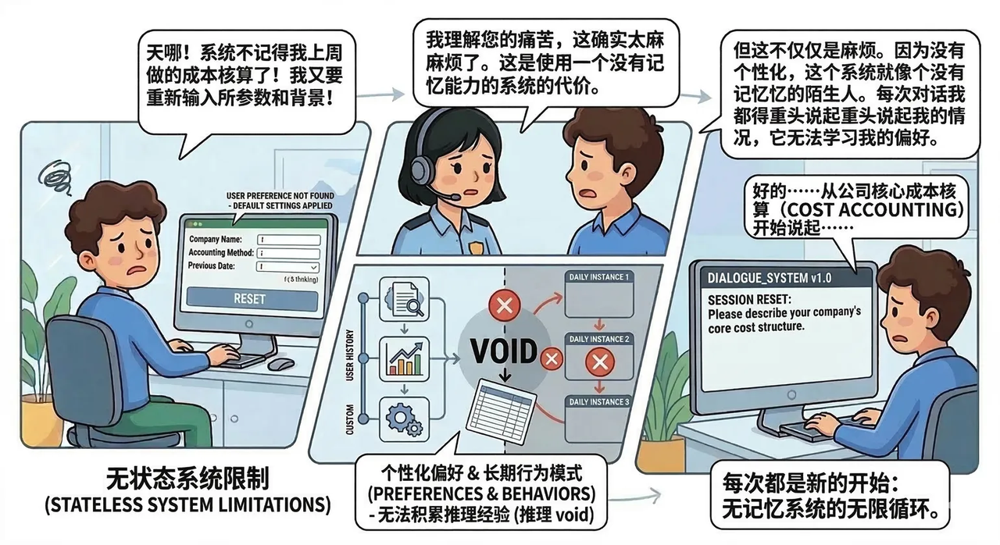
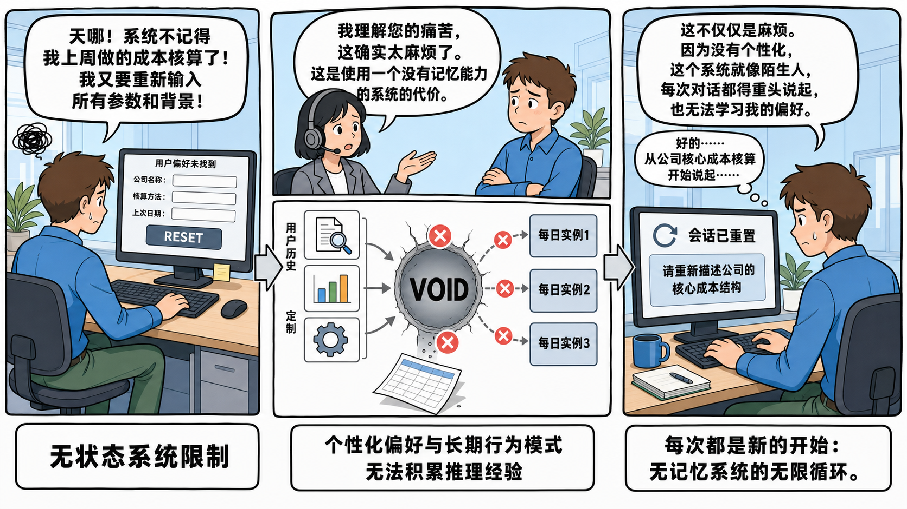
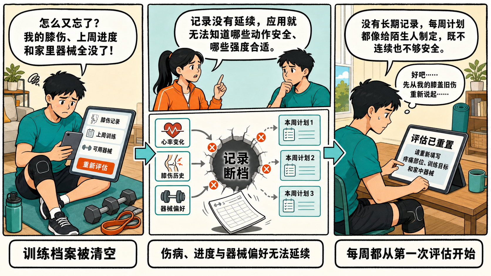
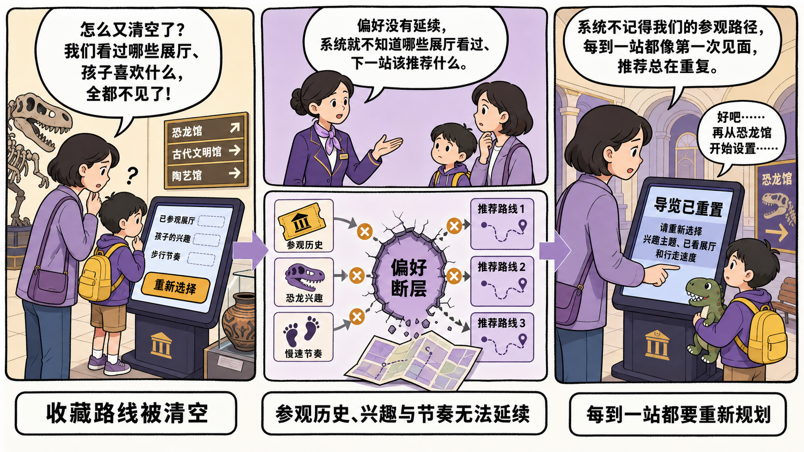

# 问题递进式概念解释图

> 一级风格分类：漫画风

## 原始图片



### Prompt

```plain text
目标：
生成一张横向三联分镜式概念解释漫画，比例严格为 16:9，用于解释“无状态系统无法记住用户历史与偏好”的产品或技术文章。采用白色背景、浅蓝办公场景、粗黑漫画描边和扁平柔和配色，达到叙事递进清楚、信息密度较高、中文气泡清晰可读的效果。

主题：
画面表现一个用户反复向没有记忆能力的对话系统重新说明公司成本核算背景的痛苦循环。
核心场景是左侧用户发现历史参数被重置，中部客服解释无记忆系统的代价并用流程图呈现历史与偏好落入空洞，右侧用户再次从头输入；主要角色和物件包括棕发男性用户、戴耳麦的女性客服、台式电脑、办公桌椅、绿植、对话气泡、红色叉号、流程箭头、历史文档图标、图表图标、齿轮图标和三张每日实例卡。
整体采用现代教育型漫画信息图、轻微手绘不规则边框、二维扁平人物插画，呈现无奈、同理和系统性解释并存的气质。

画面：
- 整体布局：16:9 横向白色画布，主体由左、中、右三个大型不规则漫画分区组成，三段从左到右递进，区块之间用浅灰蓝箭头连接；上方布置三组大号白底黑框对话气泡，下方布置三组总结标签，边缘留出窄白边。
- 左侧约 34%：浅蓝办公隔间内，棕发男性穿蓝色衬衫和绿色长裤，背对画面略侧身坐在深灰办公椅上，神情沮丧，一手放在键盘旁。桌面有键盘、鼠标和大显示器，显示器是一张被重置的表单，含公司名称、核算方法、上次日期三个空输入框和一个醒目的灰蓝色“RESET”按钮；显示器上方有小字提示用户偏好未找到。左上角有纠结涂鸦，后方放一盆绿植。人物上方的大气泡占左侧上部约三分之一。
- 中部约 36%：上半区是一块略倾斜的浅蓝漫画框，戴灰色耳麦、黑色齐耳短发的女性客服在左，棕发男性在右，两人半身相对，表情担忧，客服上方放大气泡。下半区是一块更大的系统流程图：左侧竖排写用户历史与定制，旁边从上到下排列文档放大镜、柱状图、齿轮三个方形图标，箭头汇入中央浅灰圆形空洞，圆心用粗黑大字“VOID”，空洞周围有三个珊瑚红圆形叉号；右侧竖排三张浅灰蓝卡片，分别代表每日实例 1、2、3，用弧形箭头连接但都被红叉阻断；空洞下方落下一张倾斜的表格纸。
- 右侧约 30%：同一男性坐在另一张办公桌前再次敲键盘，侧脸焦虑。大显示器显示“SESSION RESET”提示和重新描述公司核心成本结构的输入要求；显示器与人物上方安排一大一小两个白底黑框气泡，大气泡解释系统没有个性化和记忆，小气泡表现用户无奈地从公司核心成本核算重新说起。背景保持浅蓝办公墙面和少量绿植。
- 底部标签：左下用两行粗黑字总结“无状态系统限制”，中下用白底黑框圆角标签总结“个性化偏好与长期行为模式无法积累”，右下用白底黑框圆角标签总结“每次都是新的开始：无记忆系统的无限循环”。
- 叙事流向：左侧“历史被清空”，中上“客服解释原因”，中下“历史与偏好进入空洞且每日实例彼此断开”，右侧“用户被迫从头再说”，形成从左到右又暗示循环的因果链。
- 连接关系：三个大分区之间只使用从左向右的浅灰蓝箭头；中部流程图内部使用细灰箭头汇入 VOID，并用珊瑚红叉号表示记忆断裂；人物视线和气泡尾巴准确指向说话者。
- 视觉表现：白底、2D 扁平漫画、粗黑轮廓、轻微不规则手绘边框；主色为浅蓝、灰蓝和人物蓝色衬衫，少量绿色用于裤子与植物，珊瑚红只用于错误叉号；无渐变、无写实光影，第一视觉焦点是三个大气泡和中央“VOID”流程图。
- 遮挡关系：气泡不压住人物脸部和显示器；三块分镜边界清楚但可轻微倾斜拼接；流程图图标、VOID、红叉、每日实例卡和底部标签彼此分离；人物手臂、手指、耳麦、椅子与电脑结构完整。

文字：
- 左侧气泡：“天哪！系统不记得我上周做的成本核算了！我又要重新输入所有参数和背景！”
- 左侧显示器提示：“用户偏好未找到”“RESET”
- 左下总结：“无状态系统限制”
- 中部客服气泡：“我理解您的痛苦，这确实太麻烦了。这是使用一个没有记忆能力的系统的代价。”
- 中部流程图：“用户历史”“定制”“VOID”“每日实例1”“每日实例2”“每日实例3”
- 中下总结：“个性化偏好与长期行为模式”“无法积累推理经验”
- 右上大气泡：“这不仅仅是麻烦。因为没有个性化，这个系统就像陌生人，每次对话都得重头说起，也无法学习我的偏好。”
- 右侧小气泡：“好的……从公司核心成本核算开始说起……”
- 右侧显示器：“会话已重置”“请重新描述公司的核心成本结构”
- 右下总结：“每次都是新的开始：无记忆系统的无限循环。”

所有指定文字必须使用清晰、粗黑、可读的简体中文，放在对应的独立气泡、标签或界面容器中；“VOID”和“RESET”保留英文大写。没有指定的文字不要自行添加。

要求：
- 必须：严格 16:9 横向比例；三个主要分区及其从左到右的顺序完整；左侧重置表单、中部客服对话与 VOID 流程图、右侧重新输入场景全部出现；气泡尾巴指向正确角色；中心红叉清楚表达记忆断裂；底部三组总结与上方叙事一一对应；整体像完成度高的教育漫画信息图。
- 禁止：禁止照片写实、3D 渲染、黏土材质、日漫网点、深色背景、复杂纹理、高饱和大色块；禁止分镜顺序反转、箭头指向矛盾、把 VOID 画成普通按钮、遗漏每日实例卡；禁止文字压脸、气泡互相遮挡、角色肢体异常、电脑结构畸形；禁止品牌 Logo、网址、二维码、联系人、水印和无关英文乱码。
```

### Prompt 自检

- 状态：通过
- 轮次：1/3
- 复现充分度：96/100
- 构图得分：93/100
- 有意排除：品牌 Logo、网址、二维码、联系人和无关品牌身份



## 衍生图片｜健身训练记录断档



### Prompt

```plain text
目标：
生成一张横向三联分镜式概念解释漫画，比例严格为 16:9，用于家庭健身服务文章中解释“训练应用忘记个人记录会带来什么问题”。采用米白背景、浅青与暖橙配色、粗黑漫画描边和扁平二维人物插画，达到叙事递进清楚、信息密度较高、中文气泡清晰可读的效果。

主题：
画面表现一位居家锻炼者发现健身应用忘记了他的膝伤、训练记录和器械条件，被迫重新做评估并从头建立计划。
核心场景是左侧用户发现训练档案被清空，中部教练解释记录断档并用流程图呈现身体数据、伤病史和训练偏好无法进入下一周计划，右侧用户再次填写评估；主要角色和物件包括戴护膝的年轻男性、穿运动服的女性教练、平板电脑、瑜伽垫、哑铃、水壶、对话气泡、橙红色叉号、流程箭头、心率图标、膝盖图标、哑铃图标和三张周训练计划卡。
整体采用现代健康教育漫画信息图、轻微不规则分镜边框、二维扁平插画，呈现沮丧、同理和问题解释并存的气质。

画面：
- 整体布局：16:9 横向米白画布，主体由左、中、右三个大型漫画分区组成，三段从左到右递进，区块之间用浅青箭头连接；上方布置三组白底黑框对话气泡，下方布置三组总结标签，保持窄白边和清楚分隔。
- 左侧约 34%：明亮客厅健身角，戴黑色护膝的年轻男性穿青绿色运动上衣，坐在瑜伽垫旁，神情沮丧，手持平板电脑。平板显示空白个人档案，包含“膝伤记录”“上周训练”“可用器械”三个空字段和醒目的橙色“重新评估”按钮；旁边散放一对哑铃、水壶和弹力带。人物上方的大气泡占左侧上部约三分之一。
- 中部约 36%：上半区是一块略倾斜的浅青漫画框，扎马尾、穿橙色运动外套的女性教练在左，戴护膝的男性在右，两人半身相对，表情担忧，教练上方放大气泡。下半区是一块更大的训练记录流程图：左侧从上到下排列心率折线、膝盖伤情、哑铃偏好三个方形图标，箭头汇入中央浅灰色断层圆洞，圆心用粗黑大字“记录断档”，周围有三个橙红色圆形叉号；右侧竖排三张浅青卡片，分别写“本周计划1”“本周计划2”“本周计划3”，用弧形箭头连接但都被叉号阻断；断层下方落下一张倾斜的训练表。
- 右侧约 30%：同一男性坐在小桌前再次填写平板问卷，护膝清楚可见，侧脸无奈。平板大字显示“评估已重置”，下方要求重新填写疼痛部位、训练目标和家中器械；人物上方安排一大一小两个气泡，大气泡解释应用不记得伤病和动作偏好，小气泡表现用户从膝盖旧伤重新说起。背景放置窗户、绿植与收好的瑜伽垫。
- 底部标签：左下用两行粗黑字总结“训练档案被清空”，中下用白底黑框圆角标签总结“伤病、进度与器械偏好无法延续”，右下用白底黑框圆角标签总结“每周都从第一次评估开始”。
- 叙事流向：左侧“记录消失”，中上“教练解释”，中下“数据进入断层且周计划彼此断开”，右侧“用户被迫重新评估”，形成清楚的左到右因果链。
- 连接关系：三个大分区之间只使用从左向右的浅青箭头；中部流程图内部使用细灰箭头汇入“记录断档”，橙红叉号表示信息没有传递；人物视线和气泡尾巴准确指向说话者。
- 视觉表现：米白底、2D 扁平漫画、粗黑轮廓、轻微不规则手绘边框；主色为浅青、青绿和暖橙，少量深灰用于器械，橙红只用于错误叉号；无渐变、无写实光影，第一视觉焦点是三个大气泡和中央记录断层图。
- 遮挡关系：气泡不压住人物脸部和平板；三块分镜边界清楚；流程图图标、断层、叉号、周计划卡和底部标签彼此分离；人物手臂、手指、腿、护膝和健身器械结构完整。

文字：
- 左侧气泡：“怎么又忘了？我的膝伤、上周进度和家里器械全没了！”
- 左侧平板：“膝伤记录”“上周训练”“可用器械”“重新评估”
- 左下总结：“训练档案被清空”
- 中部教练气泡：“记录没有延续，应用就无法知道哪些动作安全、哪些强度合适。”
- 中部流程图：“心率变化”“膝伤历史”“器械偏好”“记录断档”“本周计划1”“本周计划2”“本周计划3”
- 中下总结：“伤病、进度与器械偏好无法延续”
- 右上大气泡：“没有长期记录，每周计划都像给陌生人制定，既不连续也不够安全。”
- 右侧小气泡：“好吧……先从我的膝盖旧伤重新说起……”
- 右侧平板：“评估已重置”“请重新填写疼痛部位、训练目标和家中器械”
- 右下总结：“每周都从第一次评估开始”

所有指定文字必须使用清晰、粗黑、可读的简体中文，放在对应的独立气泡、标签或界面容器中。没有指定的文字不要自行添加。

要求：
- 必须：严格 16:9 横向比例；三个主要分区及其从左到右的顺序完整；左侧空档案、中部教练对话与记录断层流程图、右侧重新评估场景全部出现；护膝贯穿左右人物以保持角色一致；气泡尾巴指向正确角色；底部三组总结与上方叙事一一对应；整体像完成度高的健康教育漫画信息图。
- 禁止：禁止复用成本核算、客服系统、VOID、公司参数等主题和文案；禁止照片写实、3D 渲染、黏土材质、深色背景、复杂纹理；禁止分镜顺序反转、箭头矛盾、遗漏周训练计划卡；禁止文字压脸、气泡遮挡、角色肢体异常、器械结构畸形；禁止品牌 Logo、网址、二维码、联系人、水印和无关英文乱码。
```

## 衍生图片｜博物馆导览偏好断层



### Prompt

```plain text
目标：
生成一张横向三联分镜式概念解释漫画，比例严格为 16:9，用于公共文化服务文章中解释“博物馆导览系统忘记游客兴趣与参观记录”的问题。采用浅奶油背景、薰衣草紫与博物馆金配色、粗黑漫画描边和扁平二维人物插画，达到叙事递进清楚、信息密度较高、中文气泡清晰可读的效果。

主题：
画面表现一位带孩子参观博物馆的母亲发现智能导览系统忘记了已经看过的展厅、孩子喜欢的恐龙主题和需要慢速路线，被迫重新设置导览。
核心场景是左侧游客发现收藏路线被清空，中部讲解员解释偏好断层并用流程图呈现参观历史、兴趣标签和步行节奏无法进入后续路线，右侧游客再次从头选择展厅；主要角色和物件包括短发母亲、背小书包的孩子、穿紫色制服的女性讲解员、导览触摸屏、展厅地图、恐龙化石小图标、古陶器、对话气泡、金橙色叉号、流程箭头和三张推荐路线卡。
整体采用现代公共服务教育漫画信息图、轻微不规则分镜边框、二维扁平插画，呈现困惑、同理和流程解释并存的气质。

画面：
- 整体布局：16:9 横向浅奶油画布，主体由左、中、右三个大型漫画分区组成，三段从左到右递进，区块之间用淡紫箭头连接；上方布置三组白底黑框对话气泡，下方布置三组总结标签，边缘保留窄白边。
- 左侧约 34%：博物馆入口服务区，短发母亲穿紫灰外套，牵着背黄色小书包的孩子，站在大型导览触摸屏前，两人表情困惑。屏幕显示空白收藏路线，包含“已参观展厅”“孩子的兴趣”“步行节奏”三个空字段和醒目的金橙色“重新选择”按钮；旁边有恐龙化石剪影、方向指示牌和一件玻璃柜中的陶器。母亲上方的大气泡占左侧上部约三分之一。
- 中部约 36%：上半区是一块略倾斜的淡紫漫画框，盘发、穿紫色制服的女性讲解员在左，母亲与孩子在右，三人半身相对，表情担忧，讲解员上方放大气泡。下半区是一块更大的导览偏好流程图：左侧从上到下排列展厅门票、恐龙骨架、慢速脚印三个方形图标，箭头汇入中央浅灰紫色断层圆洞，圆心用粗黑大字“偏好断层”，周围有三个金橙色圆形叉号；右侧竖排三张浅紫卡片，分别写“推荐路线1”“推荐路线2”“推荐路线3”，用弧形箭头连接但都被叉号阻断；断层下方落下一张倾斜折叠地图。
- 右侧约 30%：同一母亲和孩子站在另一台触摸屏前重新选择展厅，母亲手指屏幕，孩子抱着恐龙玩偶，神情无奈。屏幕大字显示“导览已重置”，下方要求重新选择兴趣主题、已看展厅和行走速度；人物上方安排一大一小两个气泡，大气泡解释系统不记得参观路径和孩子兴趣，小气泡表现母亲再次从恐龙馆开始设置。背景放置拱形展厅门、展品海报和长椅。
- 底部标签：左下用两行粗黑字总结“收藏路线被清空”，中下用白底黑框圆角标签总结“参观历史、兴趣与节奏无法延续”，右下用白底黑框圆角标签总结“每到一站都要重新规划”。
- 叙事流向：左侧“收藏路线消失”，中上“讲解员解释”，中下“偏好进入断层且推荐路线彼此断开”，右侧“游客被迫重新选择”，形成清楚的左到右因果链。
- 连接关系：三个大分区之间只使用从左向右的淡紫箭头；中部流程图内部使用细灰箭头汇入“偏好断层”，金橙叉号表示信息没有传递；人物视线和气泡尾巴准确指向说话者。
- 视觉表现：浅奶油底、2D 扁平漫画、粗黑轮廓、轻微不规则手绘边框；主色为薰衣草紫、灰紫和博物馆金，少量蓝灰用于展柜，金橙只用于错误叉号与按钮；无渐变、无写实光影，第一视觉焦点是三个大气泡和中央偏好断层图。
- 遮挡关系：气泡不压住人物脸部和触摸屏；左右两侧的母亲与孩子使用完全统一的服装、发型和书包造型；流程图图标、断层、叉号、路线卡和底部标签彼此分离；人物手臂、手指、孩子双腿、书包、玩偶和展品结构完整。

文字：
- 左侧气泡：“怎么又清空了？我们看过哪些展厅、孩子喜欢什么，全都不见了！”
- 左侧触摸屏：“已参观展厅”“孩子的兴趣”“步行节奏”“重新选择”
- 左下总结：“收藏路线被清空”
- 中部讲解员气泡：“偏好没有延续，系统就不知道哪些展厅看过、下一站该推荐什么。”
- 中部流程图：“参观历史”“恐龙兴趣”“慢速节奏”“偏好断层”“推荐路线1”“推荐路线2”“推荐路线3”
- 中下总结：“参观历史、兴趣与节奏无法延续”
- 右上大气泡：“系统不记得我们的参观路径，每到一站都像第一次见面，推荐总在重复。”
- 右侧小气泡：“好吧……再从恐龙馆开始设置……”
- 右侧触摸屏：“导览已重置”“请重新选择兴趣主题、已看展厅和行走速度”
- 右下总结：“每到一站都要重新规划”

所有指定文字必须使用清晰、粗黑、可读的简体中文，放在对应的独立气泡、标签或界面容器中。没有指定的文字不要自行添加。

要求：
- 必须：严格 16:9 横向比例；三个主要分区及其从左到右的顺序完整；左侧空收藏路线、中部讲解员对话与偏好断层流程图、右侧重新设置导览场景全部出现；母亲、孩子和恐龙玩偶在左右两侧使用统一造型；气泡尾巴指向正确角色；底部三组总结与上方叙事一一对应；整体像完成度高的公共文化教育漫画信息图。
- 禁止：禁止复用公司成本核算、健身训练、客服系统、VOID 等主题和文案；禁止照片写实、3D 渲染、黏土材质、深色背景、复杂纹理；禁止分镜顺序反转、箭头矛盾、遗漏推荐路线卡；禁止文字压脸、气泡遮挡、角色肢体异常、触摸屏或展品结构畸形；禁止品牌 Logo、网址、二维码、联系人、水印和无关英文乱码。
```
