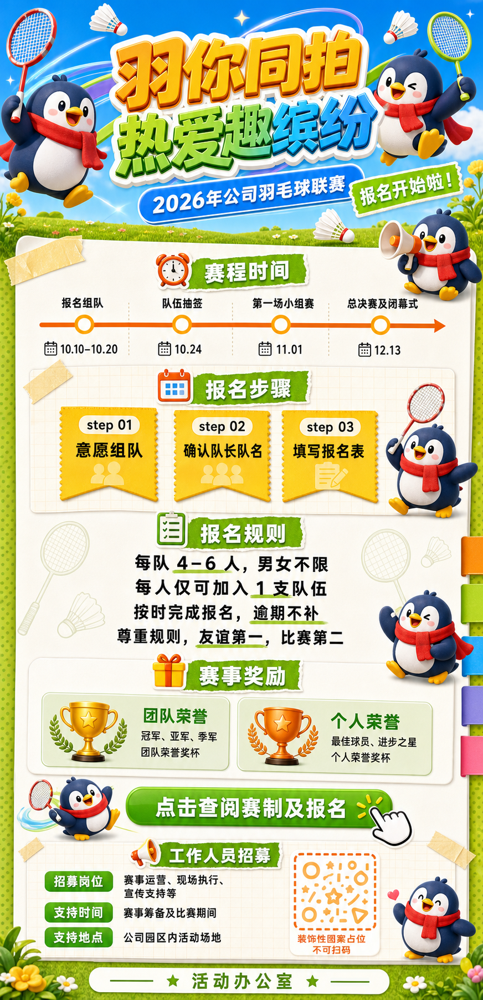
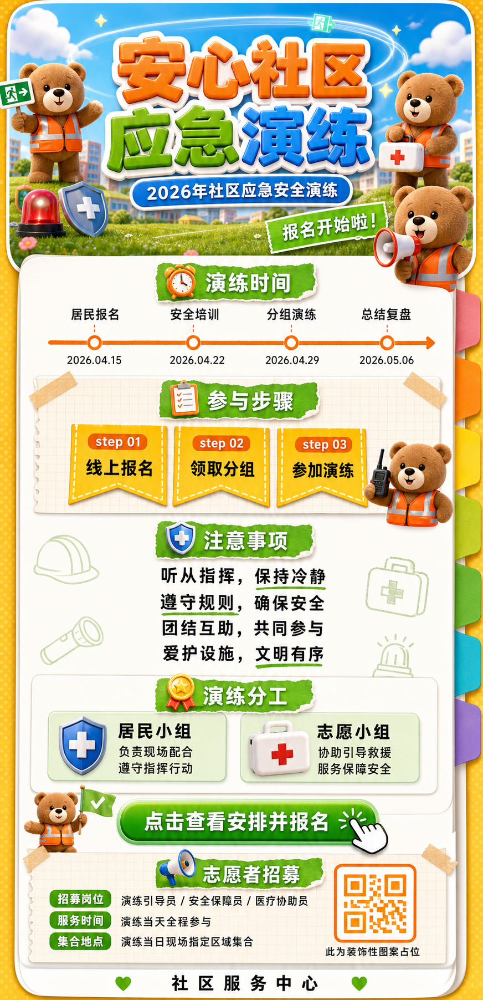
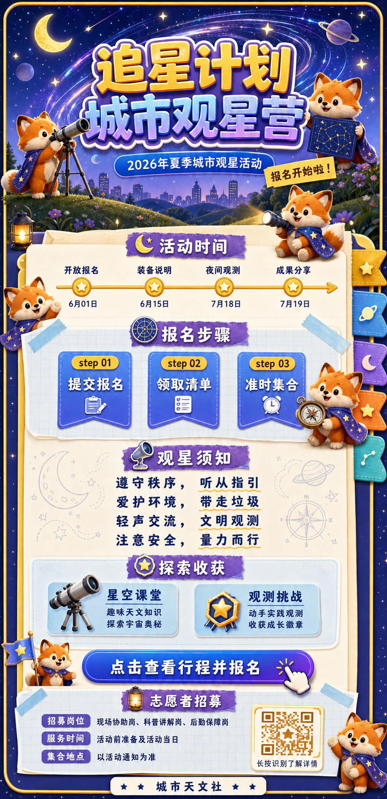

# 高饱和3D吉祥物分区式活动招募长图


## 核心要点

- **用首屏“角色 + 大标题”建立活动情绪**：顶部约四分之一画布集中放置立体中文标题、吉祥物和主题道具，让读者在进入细节前先感知活动类型、活力和参与氛围，适合需要快速招募的内部活动、公共服务和亲子项目。
- **按“时间—步骤—规则—回报—行动”组织长图**：正文从时间线进入报名步骤，再解释参与规则、奖励和行动入口，阅读路径与用户决策顺序一致；即使信息很多，也能沿单一纵向动线完成理解。
- **让吉祥物承担跨区块导览功能**：同一角色以挥拍、指引、宣布、示范等动作重复出现，既缓解大段文字的压力，也把分散模块串成一套叙事；生成时必须锁定角色比例、服装和肢体结构。
- **用高饱和外框承托低干扰信息底板**：蓝绿橙黄负责标题、标签和行动按钮，正文区则使用白色纸张、浅网格和柔和阴影，让强情绪与高可读性共存，适合“上半部吸睛、下半部承载规则”的长图任务。
- **把复杂信息压缩为可扫描的容器**：时间节点、三步流程、双卡奖励和底部入口都各自拥有固定容器，短标签优先、长说明集中，避免段落漂浮；二维码或联系入口应放在末端且与核心内容分离。

## Prompt

```plain text
目标：
生成一张竖向中文活动招募长图，比例约为 1:2.07，用于公司内部羽毛球联赛报名和赛程说明。画面明亮、活泼、完成度高，适合手机纵向阅读；上半部快速吸引注意，下半部清楚承载时间、步骤、规则、奖励和工作人员招募信息。

主题：
画面表现一场欢乐、有参与感的公司羽毛球联赛，核心口号是“羽你同拍 热爱趣缤纷”。主要场景由蓝天、草地、羽毛球运动轨迹和一张大型白色活动信息纸张组成。主要角色是多只原创圆润企鹅吉祥物：深蓝色身体、白色腹部、黄色嘴和脚、红色围巾，分别挥拍、跳跃、拿扩音器和指引报名。主要物件包括羽毛球拍、羽毛球、闹钟、日历、清单、礼物、奖杯、喇叭和装饰性二维码占位。整体采用高饱和、亲和、玩具质感的 3D 吉祥物活动海报风格，兼具运动感、节庆感和清晰的信息设计。

画面：
- 整体布局：画布为约 1:2.07 的超长竖版，自上而下分为七个连续区域。顶部是强视觉英雄区；中下部是一张占画布约 70% 的白色纸张信息卡；最外层使用黄绿色圆点背景、黄色边框和右侧彩色书签状装饰。所有区域沿单一纵向阅读路径排列，左右对称与居中对齐结合，留白均匀。
- 顶部英雄区，约占画布 25%：背景是明亮蓝天和一条低矮绿色草地，中央放超大两行立体中文标题“羽你同拍 / 热爱趣缤纷”，文字使用橙黄、翠绿、青蓝渐变塑料材质，白色粗描边和明显投影。标题后方有半透明蓝绿紫运动丝带和弧形轨迹。左右边缘各有一只挥拍或跳跃的企鹅，右下还有一只拿扩音器的小企鹅；周围散落两到三只羽毛球、球拍和星形高光。标题下方是一条蓝色圆角赛事副标题，右下叠一条倾斜绿色报名贴纸，但不能遮挡标题。
- 赛程时间区，约占画布 14%：白色纸张卡从此处开始，顶部中央是带橙色闹钟图标的绿色撕纸标签“赛程时间”。下方是一条从左向右的橙色水平时间线，包含四个等距节点，每个节点上方是阶段名称，下方是短日期；左右吉祥物只出现在边缘，不遮挡节点。
- 报名步骤区，约占画布 16%：使用浅米色网格纸底板和两块半透明胶带装饰，中央标题由橙色日历图标、绿色撕纸标签“报名步骤”组成。下方横向并排三张橙黄色步骤旗帜，分别标记 step 01、step 02、step 03，并写“意愿组队”“确认队长队名”“填写报名表”。三张卡尺寸一致、间距一致，右下角安排一只挥拍企鹅，但不能进入文字区域。
- 报名规则区，约占画布 18%：中央使用清单图标和绿色撕纸标签“报名规则”。下方以四行居中的大号黑色中文短句承载规则，重点词下方有少量绿色手绘下划线。左右使用低透明度羽毛球和球拍线稿作装饰，右侧企鹅位于区块边缘，正文保持完整留白。
- 赛事奖励区，约占画布 13%：中央标题由礼物图标和绿色标签“赛事奖励”组成。下方左右并排两张浅绿色圆角奖励卡，左卡为“团队荣誉”并配金色奖杯，右卡为“个人荣誉”并配橙色奖杯；每张卡内部只有两行简短说明，尺寸、边距和基线严格对齐。
- 行动区，约占画布 7%：中央是一条醒目的绿色渐变圆角按钮，文字为“点击查阅赛制及报名”，右侧配点击手势。左侧有一只旋转挥拍的企鹅，按钮与角色不能互相遮挡。
- 工作人员招募区，约占画布 14%：使用浅米色网格纸卡，中央标题由喇叭图标和绿色撕纸标签“工作人员招募”组成。左侧纵向排列三条字段：“招募岗位”“支持时间”“支持地点”，每条用绿色圆角标签加黑色内容；右侧放橙色边框、不可扫码的装饰性方块图案，并配一行通用提示，不出现真实联系人。最底部另有一条窄白色页脚，画布外缘以黄绿色圆点背景和“活动办公室”收束。
- 叙事流向：读者先被顶部运动口号和企鹅吸引，随后依次了解赛程、报名步骤、规则、奖励、报名入口和工作人员招募，形成“产生兴趣—确认时间—理解参与方式—确认限制—看到回报—立即行动”的闭环。
- 连接关系：顶部用运动丝带和球拍轨迹制造动势；时间区使用单向水平时间线；步骤区使用三个等距旗帜形成顺序；其他模块依靠统一绿色撕纸标题和图标建立连续性。所有箭头、时间线和阅读方向必须一致。
- 视觉表现：主色为天空蓝、草绿色、柠檬黄、活力橙和暖白，辅以少量青色和紫色高光。角色和图标采用圆润 3D 塑料与毛绒玩具质感；正文卡使用细腻纸张纹理、浅网格、胶带、圆角和柔和投影。第一视觉焦点必须是顶部超大立体标题，第二视觉焦点是企鹅，正文文字保持黑色高对比。
- 遮挡关系：标题、赛事副标题、时间节点、三张步骤卡、规则正文、两张奖励卡、行动按钮和底部字段必须完全可读。企鹅、球拍、羽毛球和装饰丝带只能进入留白或边缘，不得压住文字、时间线、图标或二维码占位。

文字：
- 主标题：“羽你同拍”“热爱趣缤纷”
- 赛事副标题：“2026年公司羽毛球联赛”
- 报名贴纸：“报名开始啦！”
- 模块标题：“赛程时间”“报名步骤”“报名规则”“赛事奖励”“工作人员招募”
- 时间节点：“报名组队”“队伍抽签”“第一场小组赛”“总决赛及闭幕式”
- 步骤标签：“step 01”“意愿组队”“step 02”“确认队长队名”“step 03”“填写报名表”
- 奖励标签：“团队荣誉”“个人荣誉”
- 行动按钮：“点击查阅赛制及报名”
- 底部字段：“招募岗位”“支持时间”“支持地点”

所有文字必须逐字准确、清晰可读，并放在对应区域的独立容器中。没有指定的文字不要自行添加。正文规则与日期可使用简短占位内容，不出现真实部门、真实地址、真实联系人或可识别账号。

要求：
- 必须：保持约 1:2.07 的竖向比例、七段式纵向结构、顶部标题约四分之一画布、白色纸张正文卡、四节点时间线、三张等宽步骤卡、两张并列奖励卡、统一企鹅造型和明确的报名行动入口；字号足够大，留白充足，中文层级清晰。
- 禁止：出现真实品牌 Logo、真实公司名称、真实网址、真实联系人、可扫码二维码或水印；禁止写实照片、扁平企业图库风、暗色背景、低对比正文、大段密集小字、区块顺序错误、时间线反向、卡片错位、角色重复粘贴、企鹅变成其他动物、肢体或球拍握持异常，以及任何文字、角色、箭头、图标相互遮挡。
```

## Prompt 自检

- 状态：通过
- 轮次：1/3
- 复现充分度：94/100
- 构图得分：93/100
- 有意排除：真实品牌 Logo、真实公司名称、真实二维码、真实日期、真实联系人与联系方式



## 类似图片：

### 安心社区应急演练



#### Prompt

```plain text
目标：
生成一张竖向中文社区应急演练招募长图，比例约为 1:2.07，用于社区居民了解演练安排并报名参加。画面明亮、亲和、完成度高，适合手机纵向阅读；上半部吸引注意，下半部清楚承载时间、步骤、规则、分工、行动入口和志愿者招募。

主题：
画面表现一场“安心社区应急演练”，核心口号是“学会应对，安心同行”。主要场景由晴朗天空、社区草坪、楼房剪影、安全指引轨迹和一张大型白色活动信息纸张组成。主要角色是多只原创圆润小熊吉祥物：棕色绒毛、奶白色口鼻、橙色安全背心，分别拿扩音器、急救箱、对讲机和指示牌。主要物件包括警报器、急救箱、消防头盔、手电筒、盾牌、清单、奖章和装饰性二维码占位。整体采用高饱和、亲和、玩具质感的 3D 吉祥物活动海报风格，兼具安全感、行动感和清晰的信息设计。

画面：
- 整体布局：画布为约 1:2.07 的超长竖版，自上而下分为七个连续区域。顶部是强视觉英雄区；中下部是一张占画布约 70% 的白色纸张信息卡；最外层使用浅橙与薄荷绿圆点背景、黄色边框和右侧彩色书签装饰。所有区域沿单一纵向阅读路径排列，左右对称与居中对齐结合，留白均匀。
- 顶部英雄区，约占画布 25%：背景是蓝天、白云、低矮社区楼房和绿色草坪，中央放超大两行立体中文标题“安心社区 / 应急演练”，文字使用活力橙、草绿、天蓝渐变塑料材质，白色粗描边和明显投影。标题后方有半透明安全带状轨迹和弧形光带。左右边缘各有一只挥动指示牌或拿急救箱的小熊，右下还有一只拿扩音器的小熊；周围散落警报器、盾牌和星形高光。标题下方是一条蓝色圆角副标题，右下叠一条倾斜绿色报名贴纸，不能遮挡标题。
- 演练时间区，约占画布 14%：白色纸张卡从此处开始，顶部中央是带橙色闹钟图标的绿色撕纸标签“演练时间”。下方是一条从左向右的橙色水平时间线，包含四个等距节点，每个节点上方是阶段名称，下方是短日期；吉祥物只出现在边缘，不遮挡节点。
- 参与步骤区，约占画布 16%：使用浅米色网格纸底板和两块半透明胶带，中央标题由清单图标、绿色撕纸标签“参与步骤”组成。下方横向并排三张橙黄色步骤旗帜，分别标记 step 01、step 02、step 03，并写“线上报名”“领取分组”“参加演练”。三张卡尺寸一致、间距一致，右下角安排一只拿对讲机的小熊，但不能进入文字区域。
- 注意事项区，约占画布 18%：中央使用盾牌图标和绿色撕纸标签“注意事项”。下方以四行居中的大号黑色中文短句承载规则，重点词下方有少量绿色手绘下划线。左右用低透明度头盔、手电筒、急救标志线稿装饰，正文保持完整留白。
- 分工与奖励区，约占画布 13%：中央标题由奖章图标和绿色标签“演练分工”组成。下方左右并排两张浅绿色圆角卡，左卡为“居民小组”并配盾牌，右卡为“志愿小组”并配急救箱；每张卡内部只有两行简短说明，尺寸、边距和基线严格对齐。
- 行动区，约占画布 7%：中央是一条醒目的绿色渐变圆角按钮，文字为“点击查看安排并报名”，右侧配点击手势。左侧有一只小熊举起安全旗，按钮与角色不能互相遮挡。
- 志愿者招募区，约占画布 14%：使用浅米色网格纸卡，中央标题由扩音器图标和绿色撕纸标签“志愿者招募”组成。左侧纵向排列三条字段：“招募岗位”“服务时间”“集合地点”，每条用绿色圆角标签加黑色内容；右侧放橙色边框、不可扫码的装饰性方块图案，并配一行通用提示，不出现真实联系人。最底部另有一条窄白色页脚，以“社区服务中心”收束。
- 叙事流向：读者先被顶部安全主题和小熊吸引，随后依次了解时间、参与步骤、注意事项、演练分工、报名入口和志愿者招募，形成“产生兴趣—确认时间—理解参与方式—确认规则—明确分工—立即行动”的闭环。
- 连接关系：顶部用安全带状轨迹制造动势；时间区使用单向水平时间线；步骤区使用三个等距旗帜形成顺序；其他模块依靠统一绿色撕纸标题和图标建立连续性。所有箭头、时间线和阅读方向必须一致。
- 视觉表现：主色为天空蓝、草绿色、柠檬黄、活力橙和暖白，辅以少量红色安全提示。角色和图标采用圆润 3D 塑料与毛绒玩具质感；正文卡使用纸张纹理、浅网格、胶带、圆角和柔和投影。第一视觉焦点必须是顶部超大立体标题，第二视觉焦点是小熊，正文文字保持黑色高对比。
- 遮挡关系：标题、副标题、时间节点、三张步骤卡、注意事项、两张分工卡、行动按钮和底部字段必须完全可读。小熊、图标和光带只能进入留白或边缘，不得压住文字、时间线或二维码占位。

文字：
- 主标题：“安心社区”“应急演练”
- 副标题：“2026年社区应急安全演练”
- 报名贴纸：“报名开始啦！”
- 模块标题：“演练时间”“参与步骤”“注意事项”“演练分工”“志愿者招募”
- 时间节点：“居民报名”“安全培训”“分组演练”“总结复盘”
- 步骤标签：“step 01”“线上报名”“step 02”“领取分组”“step 03”“参加演练”
- 分工标签：“居民小组”“志愿小组”
- 行动按钮：“点击查看安排并报名”
- 底部字段：“招募岗位”“服务时间”“集合地点”

所有文字必须逐字准确、清晰可读，并放在对应区域的独立容器中。没有指定的文字不要自行添加。正文规则与日期可使用简短占位内容，不出现真实社区、真实地址、真实联系人或可识别账号。

要求：
- 必须：保持约 1:2.07 的竖向比例、七段式纵向结构、顶部标题约四分之一画布、白色纸张正文卡、四节点时间线、三张等宽步骤卡、两张并列分工卡、统一小熊造型和明确的报名入口；字号足够大，留白充足，中文层级清晰。
- 禁止：出现真实品牌 Logo、真实机构名称、真实网址、真实联系人、可扫码二维码或水印；禁止写实照片、扁平企业图库风、暗色背景、低对比正文、大段密集小字、区块顺序错误、时间线反向、卡片错位、角色重复粘贴、小熊变成其他动物、肢体或道具握持异常，以及任何文字、角色、箭头、图标相互遮挡。
```

### 追星计划城市观星营



#### Prompt

```plain text
目标：
生成一张竖向中文城市观星营招募长图，比例约为 1:2.07，用于家庭和青少年了解观星活动并报名参加。画面梦幻、明亮、完成度高，适合手机纵向阅读；上半部营造星空吸引力，下半部清楚承载时间、步骤、须知、收获、行动入口和志愿者招募。

主题：
画面表现一场“追星计划城市观星营”，核心口号是“抬头看宇宙，一起追星光”。主要场景由深蓝到紫色的晴朗夜空、城市远景、山丘草地、星轨和一张大型暖白活动信息纸张组成。主要角色是多只原创圆润小狐狸吉祥物：橙色绒毛、奶白色脸颊和尾尖、蓝紫色星空披风，分别使用望远镜、举星图、拿手电和指引报名。主要物件包括望远镜、月亮、星球、流星、星图、罗盘、徽章、灯笼和装饰性二维码占位。整体采用高饱和、亲和、玩具质感的 3D 吉祥物活动海报风格，兼具探索感、童话感和清晰的信息设计。

画面：
- 整体布局：画布为约 1:2.07 的超长竖版，自上而下分为七个连续区域。顶部是强视觉英雄区；中下部是一张占画布约 70% 的暖白纸张信息卡；最外层使用深蓝紫星点背景、亮黄色边框和右侧彩色书签状装饰。所有区域沿单一纵向阅读路径排列，左右对称与居中对齐结合，留白均匀。
- 顶部英雄区，约占画布 25%：背景是蓝紫渐变夜空、城市剪影、低矮山丘和一条明亮银河，中央放超大两行立体中文标题“追星计划 / 城市观星营”，文字使用金黄、天蓝、紫罗兰渐变塑料材质，白色粗描边和明显投影。标题后方有半透明星轨和弧形光带。左右边缘各有一只使用望远镜或举星图的小狐狸，右下还有一只拿手电的小狐狸；周围散落月牙、行星、流星和星形高光。标题下方是一条蓝色圆角副标题，右下叠一条倾斜黄色报名贴纸，但不能遮挡标题。
- 活动时间区，约占画布 14%：纸张卡从此处开始，顶部中央是带金色月亮图标的紫色撕纸标签“活动时间”。下方是一条从左向右的金黄色水平时间线，包含四个等距节点，每个节点上方是阶段名称，下方是短日期；吉祥物只出现在边缘，不遮挡节点。
- 报名步骤区，约占画布 16%：使用浅蓝色星点网格纸底板和两块半透明胶带，中央标题由星图图标、紫色撕纸标签“报名步骤”组成。下方横向并排三张蓝紫渐变步骤旗帜，分别标记 step 01、step 02、step 03，并写“提交报名”“领取清单”“准时集合”。三张卡尺寸一致、间距一致，右下角安排一只拿罗盘的小狐狸，但不能进入文字区域。
- 观星须知区，约占画布 18%：中央使用望远镜图标和紫色撕纸标签“观星须知”。下方以四行居中的大号深蓝中文短句承载规则，重点词下方有少量金黄色手绘下划线。左右用低透明度月亮、星球、罗盘线稿作装饰，正文保持完整留白。
- 探索收获区，约占画布 13%：中央标题由徽章图标和紫色标签“探索收获”组成。下方左右并排两张浅蓝圆角卡，左卡为“星空课堂”并配望远镜，右卡为“观测挑战”并配星星徽章；每张卡内部只有两行简短说明，尺寸、边距和基线严格对齐。
- 行动区，约占画布 7%：中央是一条醒目的蓝紫渐变圆角按钮，文字为“点击查看行程并报名”，右侧配点击手势。左侧有一只小狐狸挥动星星旗，按钮与角色不能互相遮挡。
- 志愿者招募区，约占画布 14%：使用浅蓝色星点网格纸卡，中央标题由灯笼图标和紫色撕纸标签“志愿者招募”组成。左侧纵向排列三条字段：“招募岗位”“服务时间”“集合地点”，每条用紫色圆角标签加深蓝内容；右侧放金黄色边框、不可扫码的装饰性方块图案，并配一行通用提示，不出现真实联系人。最底部另有一条窄白色页脚，以“城市天文社”收束。
- 叙事流向：读者先被顶部银河、立体标题和小狐狸吸引，随后依次了解时间、报名步骤、观星须知、活动收获、报名入口和志愿者招募，形成“产生向往—确认时间—理解参与方式—准备装备—看到收获—立即行动”的闭环。
- 连接关系：顶部用星轨和银河制造由左向右的动势；时间区使用单向水平时间线；步骤区使用三个等距旗帜形成顺序；其他模块依靠统一紫色撕纸标题和天文图标建立连续性。所有箭头、时间线和阅读方向必须一致。
- 视觉表现：主色为深空蓝、紫罗兰、星光黄、天蓝和暖白，辅以少量橙色角色色。角色和图标采用圆润 3D 塑料与毛绒玩具质感；正文卡使用细腻纸张纹理、浅星点网格、胶带、圆角和柔和投影。第一视觉焦点必须是顶部超大立体标题，第二视觉焦点是小狐狸，正文文字保持深蓝高对比。
- 遮挡关系：标题、副标题、时间节点、三张步骤卡、观星须知、两张收获卡、行动按钮和底部字段必须完全可读。小狐狸、望远镜、星球和星轨只能进入留白或边缘，不得压住文字、时间线或二维码占位。

文字：
- 主标题：“追星计划”“城市观星营”
- 副标题：“2026年夏季城市观星活动”
- 报名贴纸：“报名开始啦！”
- 模块标题：“活动时间”“报名步骤”“观星须知”“探索收获”“志愿者招募”
- 时间节点：“开放报名”“装备说明”“夜间观测”“成果分享”
- 步骤标签：“step 01”“提交报名”“step 02”“领取清单”“step 03”“准时集合”
- 收获标签：“星空课堂”“观测挑战”
- 行动按钮：“点击查看行程并报名”
- 底部字段：“招募岗位”“服务时间”“集合地点”

所有文字必须逐字准确、清晰可读，并放在对应区域的独立容器中。没有指定的文字不要自行添加。正文须知与日期可使用简短占位内容，不出现真实机构、真实地址、真实联系人或可识别账号。

要求：
- 必须：保持约 1:2.07 的竖向比例、七段式纵向结构、顶部标题约四分之一画布、暖白纸张正文卡、四节点时间线、三张等宽步骤卡、两张并列收获卡、统一小狐狸造型和明确的报名入口；字号足够大，留白充足，中文层级清晰。
- 禁止：出现真实品牌 Logo、真实机构名称、真实网址、真实联系人、可扫码二维码或水印；禁止写实照片、扁平企业图库风、纯黑大面积背景、低对比正文、大段密集小字、区块顺序错误、时间线反向、卡片错位、角色重复粘贴、小狐狸变成其他动物、肢体或望远镜结构异常，以及任何文字、角色、箭头、图标相互遮挡。
```
