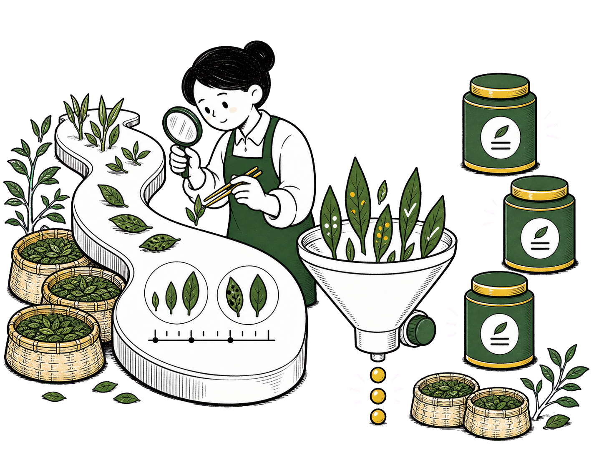
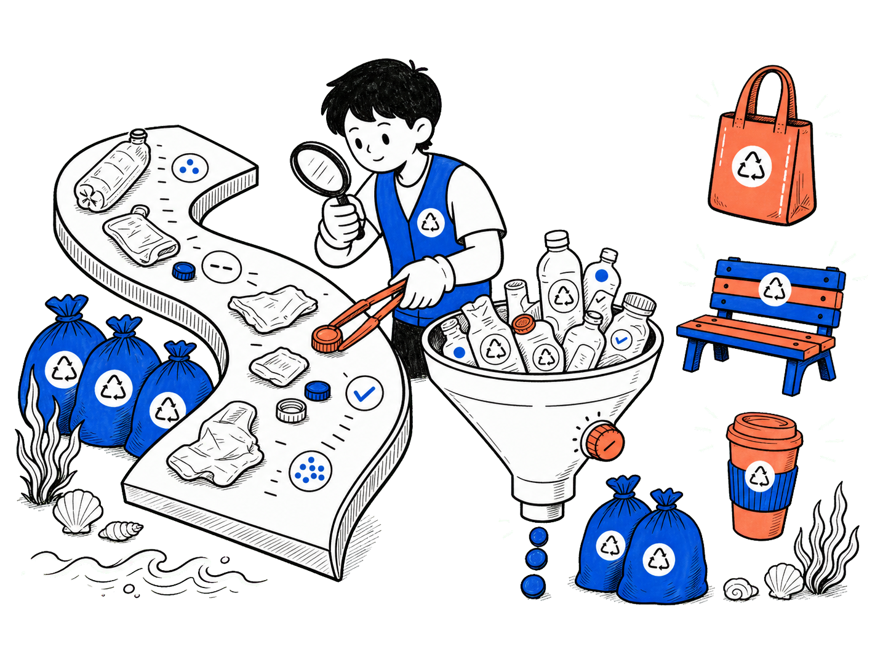

# 黑白橙手绘漏斗筛选式概念插画


## 核心要点

- **用实体隐喻讲抽象流程**：长清单、放大镜、漏斗和结果卡片依次对应“信息输入、人工核查、筛选过滤、重点输出”，不依赖文案也能解释知识整理、审核或线索筛选。
- **用左到右的因果链组织阅读**：左侧原始资料体量最大，中间人物承担判断，右侧高亮卡片代表结果，适合表达从复杂输入到精炼输出的过程。
- **限制强调色以建立层级**：黑白主体保持统一，橙色只落在笔、漏斗按钮和三张结果卡片上，让读者第一眼看见“被筛选出的重点”。
- **让主流程与辅助物件分层**：人物、长清单、漏斗和卡片形成主叙事；书堆、枝叶、便签和滴落颗粒只补足“知识工作”氛围，不抢核心焦点。
- **以透明留白提升复用性**：主体集中在画布中下部，四周保留大面积透明空间，既适合做文章题图，也方便叠放在深浅不同的页面背景上。

## Prompt

```plain text
目标：
生成一张横向的手绘概念插画，比例为4:3，用于知识管理、内容审核或信息筛选主题的文章题图。采用黑白主体与少量高饱和橙色强调的平面手绘方式，并置于完全均匀的纯色#00ff00抠图背景上，供生成后移除背景得到透明PNG；达到主体完整、流程清楚、留白充足且缩小后仍易识别的完成度。

主题：
画面表现把大量原始信息经过仔细核查与漏斗过滤，整理成少量重点结果的过程。
核心场景是一名审核者检查长清单，并把候选纸条送入漏斗，主要角色和物件包括卡通审核者、长卷纸、放大镜、铅笔、候选纸条、漏斗、三张橙色结果卡片、两组书堆、枝叶和少量便签。
整体采用粗黑线条的极简涂鸦插画风格，呈现专注、理性、轻松且富有知识工作气息的专业感。

画面：
- 整体布局：主体集中在画布中下方约70%的高度内，按“原始资料—人物核查—漏斗筛选—重点输出”从左向右阅读；顶部约15%与画布四周只保留完全均匀的纯色#00ff00抠图背景，整体视觉重心落在中央人物和右侧橙色卡片之间。
- 左侧约32%区域：一张白色长卷纸从左上偏中位置向下舒展成轻微S形，占据主要高度；纸面依次画图片占位框、方框、勾选圆圈、签名曲线和多组黑色短横线，只作为无意义版式纹理。长卷纸后方和底部放三本横向叠放的书、两簇黑白枝叶与几张小便签，表现原始资料很多。
- 中央约23%区域：一个黑发、白脸、黑衣的圆润卡通审核者位于长卷纸后方，身体朝右、脸朝左下方；左手举圆形放大镜靠近卷纸，右手握橙色铅笔在纸上做标记。双手各有清晰手腕与手指，放大镜、铅笔和卷纸互不穿插。
- 中右约27%区域：一个上宽下窄的白色大漏斗位于人物右下方，漏斗口中竖立多张大小不同的白色候选纸条，纸条上只有圆点、勾号和短线图形；漏斗边缘遮住纸条下半部，漏斗底端向下滴落三颗黑白小颗粒，右侧有一个橙色圆形按钮。
- 右侧约18%区域：三张橙色圆角结果卡片沿右上到右下轻微错位排列，每张卡片包含一个黑色圆点与两到三条黑色短横线；卡片之间保持明确间隔，周围配少量白色放射线。
- 底部辅助区域：漏斗右下方放两本白色叠书和一簇黑白枝叶，与左下书堆形成轻微平衡；辅助物件不能超过人物、漏斗或橙色卡片的视觉权重。
- 叙事流向：视线从左侧长卷纸中的大量记录开始，经中央人物用放大镜核查和铅笔标注，再进入中右漏斗过滤，最终抵达右侧三张橙色重点卡片。
- 连接关系：不使用显式流程箭头；通过卷纸朝人物弯曲的走势、人物的视线与工具朝向、漏斗口内的纸条以及右侧卡片的阶梯式位置建立连续因果关系。
- 视觉表现：使用略有颗粒感和手绘抖动的粗黑轮廓线，白色实心填充，局部以黑色排线表现纸张、书页和漏斗阴影；橙色仅用于铅笔、漏斗小按钮和三张结果卡片，主体中不得出现#00ff00或其他绿色。第一焦点是人物手中的放大镜与橙色铅笔，第二焦点是右侧橙色卡片。抠图背景必须是单一纯色，无阴影、渐变、纹理、反射、地面或光照变化。
- 遮挡关系：人物身体可以被长卷纸轻微遮挡，候选纸条下半部可以被漏斗口遮挡；人物的脸和双手、放大镜镜面、铅笔、漏斗轮廓、三张橙色卡片必须彼此分离，不能粘连或被书堆、枝叶遮住。

文字：
- 主标题：无。
- 纸张与卡片：不使用任何可读文字，只使用圆点、勾号、方框和两到三条抽象短横线作为排版纹理。

所有文字必须逐字准确、清晰可读，并放在对应区域的独立容器中。没有指定的文字不要自行添加。

要求：
- 必须：保持4:3横向画布与可干净移除的纯色#00ff00背景、左到右的四段式阅读顺序、中央单一角色的一致外观、长卷纸到核查再到筛选结果的因果关系；主体边缘清晰并与背景完全分离，不要投影、接触阴影、反射或水印；外轮廓粗而清晰，内部排线细而克制，四周留白充足，所有物件在小尺寸下仍可辨认。
- 禁止：写实摄影、3D渲染、渐变光影、复杂场景背景、大面积其他颜色、流程方向反转、重复人物、额外手臂或手指、工具穿过手掌、卷纸与漏斗粘连、卡片重叠成一块、可读长文、品牌Logo、网址、二维码、联系人或隐私信息。
```

## Prompt 自检

- 状态：通过
- 轮次：1/3
- 复现充分度：93/100
- 构图得分：93/100
- 有意排除：品牌 Logo、网址、二维码、联系人、真实可读文案，以及不影响黑白橙主色关系的极小绿色短线点缀


## 类似图片：

### 茶叶鲜叶品质分级



#### Prompt

```plain text
目标：
生成一张横向的手绘概念插画，比例为4:3，用于农业合作社、茶园科普或农产品品质管理主题的文章题图。采用黑白主体、深茶绿色与金黄色强调的平面手绘方式，并置于完全均匀的纯色#ff00ff抠图背景上，供生成后移除背景得到透明PNG；达到主体完整、分级流程清楚、留白充足且缩小后仍易识别的完成度。

主题：
画面表现采摘后的茶叶鲜叶经过人工观察、品质筛选和等级分流，最终形成少量精品茶包装的过程。
核心场景是一名茶叶质检员在弯曲的检验台上查看鲜叶，并把候选叶片送入分级漏斗，主要角色和物件包括戴围裙的质检员、S形白色检验台、放大镜、竹镊子、不同大小的茶叶、分级漏斗、三只精品茶罐、两组采茶竹篮、茶树枝和少量落叶。
整体采用粗黑线条的极简涂鸦插画风格，呈现清新、认真、自然且富有农业手作气息的专业感。

画面：
- 整体布局：主体集中在画布中下方约70%的高度内，按“鲜叶输入—人工检查—分级筛选—精品包装”从左向右阅读；顶部约15%与画布四周只保留完全均匀的纯色#ff00ff抠图背景，整体视觉重心落在中央质检员和右侧精品茶罐之间。
- 左侧约32%区域：一条白色S形检验台从左上偏中位置向下舒展，占据主要高度；台面依次摆放完整嫩芽、单片叶、带斑点叶、尺寸对比圆圈和简短刻度图形，只作为品质观察符号。检验台后方和底部放三只横向叠放的浅色竹篮、两簇茶树枝与几片落叶，表现待检鲜叶数量很多。
- 中央约23%区域：一个黑发、白脸、深茶绿色围裙的圆润卡通质检员位于检验台后方，身体朝右、脸朝左下方；左手举圆形放大镜靠近叶片，右手握金黄色竹镊子夹起一枚嫩芽。双手各有清晰手腕与手指，放大镜、镊子、叶片和检验台互不穿插。
- 中右约27%区域：一个上宽下窄的白色大分级漏斗位于人物右下方，漏斗口中竖立多枚大小、形态不同的茶叶样本，样本上只有叶脉、圆点和勾号图形；漏斗边缘遮住叶片下半部，漏斗底端向下落出三颗金黄色茶珠，右侧有一个深茶绿色圆形调节钮。
- 右侧约18%区域：三只深茶绿色与金黄色相间的圆角精品茶罐沿右上到右下轻微错位排列，每只茶罐包含一个白色圆形标签和两条黑色短横线；茶罐之间保持明确间隔，周围配少量白色放射线。
- 底部辅助区域：漏斗右下方放两只浅色竹篮和一簇茶树枝，与左下竹篮形成轻微平衡；辅助物件不能超过质检员、漏斗或精品茶罐的视觉权重。
- 叙事流向：视线从左侧检验台上的大量鲜叶开始，经中央质检员用放大镜观察和镊子挑选，再进入中右分级漏斗，最终抵达右侧三只精品茶罐。
- 连接关系：不使用显式流程箭头；通过S形检验台朝人物弯曲的走势、人物的视线与工具朝向、漏斗口内的叶片以及右侧茶罐的阶梯式位置建立连续因果关系。
- 视觉表现：使用略有颗粒感和手绘抖动的粗黑轮廓线，白色实心填充，局部以黑色排线表现竹篮、检验台和漏斗阴影；深茶绿色用于围裙、叶片与茶罐，金黄色仅用于竹镊子、茶珠和茶罐高光，主体中不得出现#ff00ff或其他品红色。第一焦点是质检员手中的放大镜与金黄色镊子，第二焦点是右侧精品茶罐。抠图背景必须是单一纯色，无阴影、渐变、纹理、反射、地面或光照变化。
- 遮挡关系：人物身体可以被S形检验台轻微遮挡，叶片下半部可以被漏斗口遮挡；人物的脸和双手、放大镜镜面、镊子、漏斗轮廓、三只茶罐必须彼此分离，不能粘连或被竹篮、茶树枝遮住。

文字：
- 主标题：无。
- 标签与刻度：不使用任何可读文字，只使用叶片图形、圆点、勾号、圆形标签和两条抽象短横线作为等级纹理。

所有文字必须逐字准确、清晰可读，并放在对应区域的独立容器中。没有指定的文字不要自行添加。

要求：
- 必须：保持4:3横向画布与可干净移除的纯色#ff00ff背景、左到右的四段式阅读顺序、中央单一质检员的一致外观、鲜叶检查到分级再到精品包装的因果关系；主体边缘清晰并与背景完全分离，不要投影、接触阴影、反射或水印；外轮廓粗而清晰，内部排线细而克制，四周留白充足，所有物件在小尺寸下仍可辨认。
- 禁止：信息审核、办公文件、电脑设备、写实摄影、3D渲染、渐变光影、复杂茶园背景、大面积其他颜色、流程方向反转、重复人物、额外手臂或手指、工具穿过手掌、检验台与漏斗粘连、茶罐重叠成一块、可读长文、品牌Logo、网址、二维码、联系人或隐私信息。
```

### 海滩塑料回收再造



#### Prompt

```plain text
目标：
生成一张横向的手绘概念插画，比例为4:3，用于海滩环保行动、社区回收教育或循环材料项目的文章题图。采用黑白主体、钴蓝色与珊瑚橙色强调的平面手绘方式，并置于完全均匀的纯色#00ff00抠图背景上，供生成后移除背景得到透明PNG；达到主体完整、回收流程清楚、留白充足且缩小后仍易识别的完成度。

主题：
画面表现海滩收集到的塑料废弃物经过人工检查、材质分拣和过滤处理，最终转化为少量可再次使用的环保产品。
核心场景是一名环保志愿者在弯曲的分拣台上检查海滩塑料，并把合格物件送入回收漏斗，主要角色和物件包括戴手套的志愿者、S形白色分拣台、观察镜、长柄夹钳、塑料瓶、瓶盖、包装片、回收漏斗、三件再生产品、两组收集袋、海浪、贝壳和少量海草。
整体采用粗黑线条的极简涂鸦插画风格，呈现清爽、积极、可信且富有社区环保行动感的专业气质。

画面：
- 整体布局：主体集中在画布中下方约70%的高度内，按“海滩收集—人工检查—材质过滤—再生利用”从左向右阅读；顶部约15%与画布四周只保留完全均匀的纯色#00ff00抠图背景，整体视觉重心落在中央志愿者和右侧三件再生产品之间。
- 左侧约32%区域：一条白色S形分拣台从左上偏中位置向下舒展，占据主要高度；台面依次摆放透明瓶、扁平瓶盖、圆角包装片、材质判断圆圈和简短刻度图形，只作为分类观察符号。分拣台后方和底部放三只钴蓝色收集袋、两簇黑白海草、几枚贝壳与一小段波浪线，表现回收物来自海滩清理。
- 中央约23%区域：一个短发、白脸、钴蓝色背心、白色手套的圆润卡同志愿者位于分拣台后方，身体朝右、脸朝左下方；左手举圆形观察镜靠近塑料片，右手握珊瑚橙色长柄夹钳夹起一个瓶盖。双手各有清晰手腕与手指，观察镜、夹钳、瓶盖和分拣台互不穿插。
- 中右约27%区域：一个上宽下窄的白色大回收漏斗位于人物右下方，漏斗口中竖立多件大小、轮廓不同的塑料瓶、瓶盖和包装片，物件上只有回收三角形、圆点和勾号图形；漏斗边缘遮住物件下半部，漏斗底端向下落出三颗钴蓝色再生颗粒，右侧有一个珊瑚橙色圆形调节钮。
- 右侧约18%区域：一只珊瑚橙色手提袋、一块钴蓝与珊瑚橙相间的公园座板、一只珊瑚橙色可重复使用水杯沿右上到右下轻微错位排列；三件产品之间保持明确间隔，每件只带一个白色圆形材料徽记，周围配少量白色放射线。
- 底部辅助区域：漏斗右下方放两只钴蓝色收集袋、一簇黑白海草和两枚贝壳，与左下收集袋形成轻微平衡；辅助物件不能超过志愿者、漏斗或三件再生产品的视觉权重。
- 叙事流向：视线从左侧分拣台上的海滩塑料开始，经中央志愿者用观察镜查看和夹钳挑选，再进入中右回收漏斗，最终抵达右侧三件再生产品。
- 连接关系：不使用显式流程箭头；通过S形分拣台朝人物弯曲的走势、人物的视线与工具朝向、漏斗口内的废弃物以及右侧产品的阶梯式位置建立连续因果关系。
- 视觉表现：使用略有颗粒感和手绘抖动的粗黑轮廓线，白色实心填充，局部以黑色排线表现收集袋、分拣台和漏斗阴影；钴蓝色用于背心、收集袋、回收颗粒和部分产品，珊瑚橙色仅用于夹钳、调节钮和产品高光，主体中不得出现#00ff00或其他绿色。第一焦点是志愿者手中的观察镜与珊瑚橙夹钳，第二焦点是右侧三件再生产品。抠图背景必须是单一纯色，无阴影、渐变、纹理、反射、地面或光照变化。
- 遮挡关系：人物身体可以被S形分拣台轻微遮挡，塑料物件下半部可以被漏斗口遮挡；人物的脸和双手、观察镜镜面、夹钳、漏斗轮廓、三件再生产品必须彼此分离，不能粘连或被收集袋、海草遮住。

文字：
- 主标题：无。
- 徽记与分类符号：不使用任何可读文字，只使用回收三角形、圆点、勾号、圆形徽记和两条抽象短横线作为分类纹理。

所有文字必须逐字准确、清晰可读，并放在对应区域的独立容器中。没有指定的文字不要自行添加。

要求：
- 必须：保持4:3横向画布与可干净移除的纯色#00ff00背景、左到右的四段式阅读顺序、中央单一志愿者的一致外观、海滩塑料检查到材质过滤再到再生产品的因果关系；主体边缘清晰并与背景完全分离，不要投影、接触阴影、反射或水印；外轮廓粗而清晰，内部排线细而克制，四周留白充足，所有物件在小尺寸下仍可辨认。
- 禁止：信息审核、办公文件、农业茶园、写实摄影、3D渲染、渐变光影、复杂海滩背景、大面积其他颜色、流程方向反转、重复人物、额外手臂或手指、工具穿过手掌、分拣台与漏斗粘连、三件产品重叠成一块、可读长文、品牌Logo、网址、二维码、联系人或隐私信息。
```
